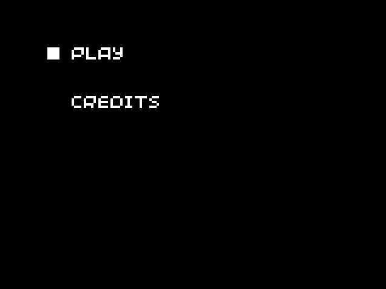

# Creating menus

* [Introduction](#introduction)
* [Creating a switch-based menu](#creating-a-switch-based-menu)
* [Creating a menu with the state pattern](#creating-a-menu-with-the-state-pattern)
* [Summary](#summary)
* [Taking it further](#taking-it-further)

## Introduction

Most video games require some sort of menu, whether it's a simple "Press X to start", or a complex web of interlinked pages. A menu system is a great way to add customisability to your game (via a settings page), or to display information which isn't part of the main gameplay (for example, a highscore table or a credits screen).

Menu systems allow games to be broken down into "scenes", and each of these scenes can have its own update and render code. This actually allows us to use it for more than just menus: even the main game itself can be treated as a single scene which needs to be updated and rendered. For example, a simple game might have four scenes:

* Title screen
* Credits
* Main game
* Game over message

The are a variety of ways that a menu system can be designed, and in this tutorial we will look at two common approaches. The first method uses switch statements to select the code for the current scene. It is can be good for games with only a few scenes, but becomes unwieldy for larger numbers of scenes. The second method uses an object-oriented approach following the [state pattern](https://en.wikipedia.org/wiki/State_pattern), using runtime polymorphism to call the correct update and render functions. This approach makes the code more maintainable, as the scene-specific data is kept encapsulated in the classes (avoiding the need for global variables).

## Creating a switch-based menu

A common method of handling menus in a game is with a [state machine](https://en.wikipedia.org/wiki/Finite-state_machine). For simple games requiring just a few menu screens, the easiest way to implement this is to use an `switch` statement to select the correct rendering and updating code. We can use an `enum` to store the current state, and this can be updated whenever the scene needs to change.

It's a good idea to separate the code for each scene into separate functions, to avoid the main `update` and `render`[^render-vs-draw] functions becoming too large and unwieldy. With this in mind, we will have a pair of functions for each scene (for example, called `update_title` and `render_title`).

### Creating an example menu

To demonstrate this style of menu system, we will create a (very!) basic game with a menu comprised of a title screen and a credits screen. The actual "game" will consist of counting how many times the player has pressed the A button - it won't be the next bestseller, but it helps give some context to how a menu might work in a real game.

We'll start off by creating our `enum` to keep track of the current state (in Python, we will use class instead). At the same time, we'll create some empty functions for each of our game states, and switch between them in the main `update` and `render` functions:


```cpp
#include "main.hpp"

using namespace blit;

// Possible menu states
enum class Scene {
    TITLE,
    CREDITS,
    GAME
};

// Start the game at the title screen
Scene current_scene = Scene::TITLE;

// Update and render functions for each state

// Title screen
void update_title() { }
void render_title() { }

// Credits screen
void update_credits() { }
void render_credits() { }

// Main game screen
void update_game() { }
void render_game() { }

// Setup your game here
void init() {
    set_screen_mode(ScreenMode::hires);
}

// Update your game here
void update(uint32_t time) {
    // Select the correct update function
    switch (current_scene) {
    case Scene::TITLE:
        update_title();
        break;

    case Scene::CREDITS:
        update_credits();
        break;

    case Scene::GAME:
        update_game();
        break;

    default:
        break;
    }
}

// Render your game here
void render(uint32_t time) {
    // Select the correct render function
    switch (current_scene) {
    case Scene::TITLE:
        render_title();
        break;

    case Scene::CREDITS:
        render_credits();
        break;

    case Scene::GAME:
        render_game();
        break;

    default:
        break;
    }
}
```


```cpp
#include "main.hpp"

using namespace picosystem;

// Possible menu states
enum class Scene {
    TITLE,
    CREDITS,
    GAME
};

// Start the game at the title screen
Scene current_scene = Scene::TITLE;

// Update and render functions for each state

// Title screen
void update_title() { }
void render_title() { }

// Credits screen
void update_credits() { }
void render_credits() { }

// Main game screen
void update_game() { }
void render_game() { }

// Setup your game here
void init() {
}

// Update your game here
void update(uint32_t tick) {
	// Select the correct update function
    switch (current_scene) {
    case Scene::TITLE:
        update_title();
        break;

    case Scene::CREDITS:
        update_credits();
        break;

    case Scene::GAME:
        update_game();
        break;

    default:
        break;
    }
}

// Render your game here
void draw(uint32_t tick) {
	// Select the correct render function
    switch (current_scene) {
    case Scene::TITLE:
        render_title();
        break;

    case Scene::CREDITS:
        render_credits();
        break;

    case Scene::GAME:
        render_game();
        break;

    default:
        break;
    }
}
```


```python
# Possible menu states
class Scene:
    TITLE = 0
    CREDITS = 1
    GAME = 2

# Start the game at the title screen
current_scene = Scene.TITLE

# Update and render functions for each state

# Title screen
def update_title():
    pass
def render_title():
    pass

# Credits screen
def update_credits():
    pass
def render_credits():
    pass

# Main game screen
def update_game():
    pass
def render_game():
    pass

# Setup your game here


# Update your game here
def update(tick):
	# Select the correct update function
    if current_scene == Scene.TITLE:
        update_title()
    elif current_scene == Scene.CREDITS:
        update_credits()
    elif current_scene == Scene.GAME:
        update_game()

# Render your game here
def draw(tick):
	# Select the correct render function
    if current_scene == Scene.TITLE:
        render_title()
    elif current_scene == Scene.CREDITS:
        render_credits()
    elif current_scene == Scene.GAME:
        render_game()

# Start the game
start()
```



Our title screen has two options which the user can select: "Play" or "Credits". We will use an integer to track the currently selected option, which we can increment or decrement by one as the user moves up and down through the menu. This variable will need to be stored in the global scope, since it can't be recalculated each frame (this is one of the downsides of not using object-oriented programming, which allows the data associated with a specific scene to be encapsulated within a class).


```cpp
// In main.cpp

const std::vector<std::string> TITLE_MENU_OPTIONS {
    "Play",
    "Credits"
};

uint8_t option_selected = 0;

// Title screen
void update_title() {
    if (buttons.pressed & Button::DPAD_UP) {
        if (option_selected > 0) {
            option_selected--;
        }
    }
    else if (buttons.pressed & Button::DPAD_DOWN) {
        if (option_selected < TITLE_MENU_OPTIONS.size() - 1) {
            option_selected++;
        }
    }

    if (buttons.pressed & Button::A) {
        if (option_selected == 0) {
            // Player chose "Play"
            current_scene = Scene::GAME;
        }
        else if (option_selected == 1) {
            // Player chose "Credits"
            current_scene = Scene::CREDITS;
        }
    }
}
void render_title() {
    // Fill screen black
    screen.pen = Pen(0, 0, 0);
    screen.clear();

    screen.pen = Pen(255, 255, 255);

    // Draw the options
    for (uint8_t i = 0; i < TITLE_MENU_OPTIONS.size(); i++) {
        screen.text(TITLE_MENU_OPTIONS[i], minimal_font, Point(30, 19 + 20 * i));
    }

    // Indicate currently selected option
    screen.rectangle(Rect(20, 20 + 20 * option_selected, 5, 5));
}

```


```cpp
// In main.cpp

const std::vector<std::string> TITLE_MENU_OPTIONS {
    "Play",
    "Credits"
};

uint8_t option_selected = 0;

void update_title() {
    if (pressed(UP)) {
        if (option_selected > 0) {
            option_selected--;
        }
    }
    else if (pressed(DOWN)) {
        if (option_selected < TITLE_MENU_OPTIONS.size() - 1) {
            option_selected++;
        }
    }

    if (pressed(A)) {
        if (option_selected == 0) {
            // Player chose "Play"
            current_scene = Scene::GAME;
        }
        else if (option_selected == 1) {
            // Player chose "Credits"
            current_scene = Scene::CREDITS;
        }
    }
}
void render_title() {
    // Fill screen black
    pen(0, 0, 0);
    clear();

    pen(255, 255, 255);

    // Draw the options
    for (uint8_t i = 0; i < TITLE_MENU_OPTIONS.size(); i++) {
        text(TITLE_MENU_OPTIONS[i], 30, 19 + 20 * i);
    }

    // Indicate currently selected option
    rect(20, 20 + 20 * option_selected, 5, 5);
}
```


```python
# In main.py

TITLE_MENU_OPTIONS = [
    "Play",
    "Credits"
]

option_selected = 0

# Title screen
def update_title():
    global current_scene, option_selected

    if pressed(UP):
        if option_selected > 0:
            option_selected -= 1
    
    elif pressed(DOWN):
        if option_selected < len(TITLE_MENU_OPTIONS) - 1:
            option_selected += 1
            

    if pressed(A):
        if option_selected == 0:
            # Player chose "Play"
            current_scene = Scene.GAME
            
        elif option_selected == 1:
            # Player chose "Credits"
            current_scene = Scene.CREDITS
            
def render_title():
    # Fill screen black
    pen(0, 0, 0)
    clear()

    pen(15, 15, 15)

    # Draw the options
    for i in range(len(TITLE_MENU_OPTIONS)):
        text(TITLE_MENU_OPTIONS[i], 30, 19 + 20 * i)

    # Indicate currently selected option
    rect(20, 20 + 20 * option_selected, 5, 5)
```



If you're using C++, you'll also need to include the headers which provide access to the `string` and `vector` data types:

```cpp
// In main.hpp

#include <string>
#include <vector>
```

We can define the functions for the credits screen in a similar manner:


```cpp
// In main.cpp

const std::vector<std::string> CREDITS_OPTIONS {
    "Here",
    "are",
    "some",
    "credits!",
    "", // Blank line for spacing
    "Back"
};

// Credits screen
void update_credits() {
    if (buttons.pressed & Button::A) {
        // Go back to title screen
        current_scene = Scene::TITLE;
        option_selected = 0;
    }
}
void render_credits() {
    // Fill screen black
    screen.pen = Pen(0, 0, 0);
    screen.clear();

    screen.pen = Pen(255, 255, 255);

    // Draw the credits
    for (uint8_t i = 0; i < CREDITS_OPTIONS.size(); i++) {
        screen.text(CREDITS_OPTIONS[i], minimal_font, Point(30, 19 + 10 * i));
    }

    // Indicate the back option
    screen.rectangle(Rect(20, 20 + 10 * (CREDITS_OPTIONS.size() - 1), 5, 5));
}
```


```cpp
// In main.cpp

const std::vector<std::string> CREDITS_OPTIONS {
    "Here",
    "are",
    "some",
    "credits!",
    "", // Blank line for spacing
    "Back"
};

// Credits screen
void update_credits() {
    if (pressed(A)) {
        // Go back to title screen
        current_scene = Scene::TITLE;
        option_selected = 0;
    }
}
void render_credits() {
    // Fill screen black
    pen(0, 0, 0);
    clear();

    pen(15, 15, 15);

    // Draw the credits
    for (uint8_t i = 0; i < CREDITS_OPTIONS.size(); i++) {
        text(CREDITS_OPTIONS[i], 30, 19 + 10 * i);
    }

    // Indicate the back option
    rect(20, 20 + 10 * (CREDITS_OPTIONS.size() - 1), 5, 5);
}
```


```python
# In main.py

CREDITS_OPTIONS = [
    "Here",
    "are",
    "some",
    "credits!",
    "", # Blank line for spacing
    "Back"
]

# Credits screen
def update_credits():
    global current_scene, option_selected

    if pressed(A):
        # Go back to title screen
        current_scene = Scene.TITLE
        option_selected = 0
    
def render_credits():
    # Fill screen black
    pen(0, 0, 0)
    clear()

    pen(15, 15, 15)

    # Draw the credits
    for i in range(len(CREDITS_OPTIONS)):
        text(CREDITS_OPTIONS[i], 30, 19 + 10 * i)

    # Indicate the back option
    rect(20, 20 + 10 * (len(CREDITS_OPTIONS) - 1), 5, 5)
```



Finally, we can add the actual game code. Every time the player presses the A button, we will increment a variable called `total_presses`, and if the user presses B, we will return to the main menu. We also need to reset `total_presses` when the game is restarted from the title screen.


```cpp
// In main.cpp

// We need to declare total_presses in the global scope:
uint8_t total_presses = 0;

// Title screen
void update_title() {
    // ...

    if (buttons.pressed & Button::A) {
        if (option_selected == 0) {
            // ...

            // We need to reset total_presses when starting the game:
            total_presses = 0;
        }
        // ...
    }
}

// Main game screen
void update_game() {
    if (buttons.pressed & Button::A) {
        total_presses++;
    }
    if (buttons.pressed & Button::B) {
        current_scene = Scene::TITLE;
        option_selected = 0;
    }
}
void render_game() {
    // Fill screen with a colour depending on how many times we've pressed the button
    screen.pen = Pen(255 - total_presses, total_presses, 255);
    screen.clear();

    screen.pen = Pen(255, 255, 255);
    screen.text("Cookies: " + std::to_string(total_presses), minimal_font, Point(30, 19));
}
```


```cpp
// In main.cpp

// We need to declare total_presses in the global scope:
uint8_t total_presses = 0;

// Title screen
void update_title() {
    // ...

    if (pressed(A)) {
        if (option_selected == 0) {
            // ...

            // We need to reset total_presses when starting the game:
            total_presses = 0;
        }
        // ...
    }
}

// Main game screen
void update_game() {
    if (pressed(A)) {
        total_presses++;
    }
    if (pressed(B)) {
        current_scene = Scene::TITLE;
        option_selected = 0;
    }
}
void render_game() {
    // Fill screen with a colour depending on how many times we've pressed the button
    pen((255 - total_presses) >> 4, total_presses >> 4, 15);
    clear();

    pen(15, 15, 15);
    text("Cookies: " + std::to_string(total_presses), 30, 19);
}
```


```python
# In main.py

# We need to declare total_presses in the global scope:
total_presses = 0

# Title screen
def update_title():
    # Add total_presses as a global variable used in this function:
    global current_scene, option_selected, total_presses

    # ...

    if pressed(A):
        if option_selected == 0:
            # ...

            # We need to reset total_presses when starting the game:
            total_presses = 0
            
        # ...

# Main game screen
def update_game():
    global current_scene, option_selected, total_presses

    if pressed(A):
        total_presses += 1
    
    if pressed(B):
        current_scene = Scene.TITLE
        option_selected = 0
    
def render_game():
    # Fill screen with a colour depending on how many times we've pressed the button
    pen((255 - total_presses) >> 4, total_presses >> 4, 15)
    clear()

    pen(15, 15, 15)
    text("Cookies: " + str(total_presses), 30, 19)
```



The result should look something like this:



The graphics aren't anything fancy - just rows of text with a white square next to the currently selected option. The player can use the D-pad to navigate the menu options, and press A to confirm their selection. Despite the simplicity of this example, the techniques used can be applied to pretty much any menu situation. For example, you could create a settings page where the user can turn the sound on and off, and modify game-specific settings (such as toggling checkpoints).

### Possible improvements

The credits and main game scenes require data to be initialised or reset before you can change to that scene, which gets complicated if there are multiple ways of entering that scene. This can be solved by adding an initialisation function for each scene, which gets called when the code wants to change to a new scene. For example, the initialisation function for the main game scene might look like this:


```cpp
void init_game() {
    current_scene = Scene::GAME;
    total_presses = 0;
}
```


```cpp
void init_game() {
    current_scene = Scene::GAME;
    total_presses = 0;
}
```


```python
def init_game():
    global current_scene, total_presses
    
    current_scene = Scene.GAME
    total_presses = 0
```



This means that instead of modifying the `current_scene` variable directly in order to change scenes, the corresponding initialisation function can be called, which handles everything needed by that scene.

## Creating a menu with the state pattern

When creating a switch-based menu system, we encountered a big problem: each scene often needs to store its own data (for example, storing the total number of button presses, or the current menu option selected). We had to create all these variables in the global scope, which starts getting messy very quickly. Using an object-oriented approach allows us to keep all the scene-specific data encapsulated within a class. It also allows us to create private utility functions, which can be used to reduce the size of the `update` and `render` functions.

### Using polymorphism

Using classes also allows us to remove the switch statements in the `update` and `render` functions. If we create a base class called `Scene`, with the `virtual` methods `update` and `render`, we can override these methods in a child class. We can store a `current_scene` pointer and call the `update` and `render` methods as needed, and [dynamic dispatch](https://en.wikipedia.org/wiki/Dynamic_dispatch) will call the correct overriding method, depending on the true type that `current_scene` is pointing to.

Polymorphism can be a tricky thing to get your head around, so it's best understood with an example:


```cpp
#include <iostream>

class BaseClass {
public:
    // Without the virtual keyword, overriding methods are not found (when using a BaseClass pointer)
    virtual void something() {
        std::cout << "BaseClass::something" << std::endl;
    }
};

class ChildClass : public BaseClass {
public:
    void something() {
        std::cout << "ChildClass::something" << std::endl;
    }
};

int main() {
    BaseClass* item = new BaseClass();
    item->something(); // outputs: "BaseClass::something"

    // Note that we assign to a BaseClass pointer, but it is a ChildClass object
    item = new ChildClass();
    item->something(); // outputs: "ChildClass::something"
    // Without the virtual keyword, the above line outputs "BaseClass::something"

    return 0;
}
```


```python
class BaseClass:
    def something(self):
        print("BaseClass.something")

class ChildClass(BaseClass):
    def something(self):
        print("ChildClass.something")

item = BaseClass()
item.something() # outputs: "BaseClass.something"

item = ChildClass()
item.something() # outputs: "ChildClass.something"
```



> In Python, reassignment of a variable will also change its type (if needed), which means that we don't need to use a `BaseClass` pointer to store `ChildClass` instances. This results in the output being slightly more intuitive than with C++, since in Python, the overriding method is *always* called.

### Creating the interface

We will start off by creating the `Scene` class, which will provide the interface, including the `update` and `render` methods. We will also include `enter` and `leave` methods, which can be overidden to handle any setup or cleanup which is needed.

In order to keep our code neat and tidy, we'll put this class inside a new pair of files called `scene.hpp` and `scene.cpp` (in Python, we only need one new file, called `scene.py`):


```cpp
// In scene.hpp

#pragma once

class Scene {
public:
    Scene();
    virtual ~Scene();

    virtual void enter();
    virtual void leave();

    virtual void update();
    virtual void render();

    Scene* next();
    bool finished();

protected:
    void finish(Scene* next_scene);

private:
    Scene* _next = nullptr;
    bool _finished = false;
};

// In scene.cpp

#include "scene.hpp"

Scene::Scene() { }
Scene::~Scene() { }

void Scene::enter() { }
void Scene::leave() { }

void Scene::update(){ }
void Scene::render(){ }

Scene* Scene::next() {
	return _next;
}

bool Scene::finished() {
	return _finished;
}

void Scene::finish(Scene* next_scene) {
	_next = next_scene;
	_finished = true;
}
```


```cpp
// In scene.hpp

#pragma once

class Scene {
public:
    Scene();
    virtual ~Scene();

    virtual void enter();
    virtual void leave();

    virtual void update();
    virtual void render();

    Scene* next();
    bool finished();

protected:
    void finish(Scene* next_scene);

private:
    Scene* _next = nullptr;
    bool _finished = false;
};

// In scene.cpp

#include "scene.hpp"

Scene::Scene() { }
Scene::~Scene() { }

void Scene::enter() { }
void Scene::leave() { }

void Scene::update(){ }
void Scene::render(){ }

Scene* Scene::next() {
	return _next;
}

bool Scene::finished() {
	return _finished;
}

void Scene::finish(Scene* next_scene) {
	_next = next_scene;
	_finished = true;
}
```


```python
# In scene.py

class Scene:
    def __init__(self):
        self._next = None
        self._finished = False

    def enter(self):
        pass

    def leave(self):
        pass

    def update(self):
        pass

    def render(self):
        pass

    def next(self):
        return self._next

    def finished(self):
        return self._finished

    def finish(self, next_scene):
        self._next = next_scene
        self._finished = True
```



We can now store a pointer to the current scene and call the `update` and `render` methods on it, without needing a switch statement:


```cpp
// In main.hpp

#include "scene.hpp"

// In main.cpp

// We still need to declare this in the global scope, but it's the only variable which we need to do this for
Scene* current_scene = nullptr;

void update(uint32_t time) {
	current_scene->update();
}

void render(uint32_t time) {
    current_scene->render();
}
```


```cpp
// In main.hpp

#include "scene.hpp"

// In main.cpp

// We still need to declare this in the global scope, but it's the only variable which we need to do this for
Scene* current_scene = nullptr;

void update(uint32_t tick) {
	current_scene->update();
}

void draw(uint32_t tick) {
    current_scene->render();
}
```


```python
# In main.py

from scene import Scene

# We still need to declare this in the global scope, but it's the only variable which we need to do this for
current_scene = None

def update(tick):
    current_scene.update()

def draw(tick):
    current_scene.render()

# Start the game
start()
```



Our `update` and `render` functions are now much simpler and tidier, and they perform the same job as before! However, we need to add some extra code to allow the current scene to be changed.

When a child of the `Scene` class is updated, it can call the `finish` method, and provide a pointer to the next scene. In our main `update` method, we can then check if `current_scene.finished()` returns true, and if so, reassign the `current_scene` variable with the value of `current_scene.next()`. For C++, we'll need to `delete` the old scene, to avoid leaking memory (in Python, we can leave it to the garbage manager).

At this point, we also want to call the `enter` and `leave` functions on the correct objects.

Our `update` method should now look like this:


```cpp
// In main.cpp

void update(uint32_t time) {
	current_scene->update();

    // Check if we need to change scenes
    if (current_scene->finished()) {
        Scene* next_scene = current_scene->next();
        
        // Clean up the old scene
        current_scene->leave();
        delete current_scene;

        // Change the scene
        current_scene = next_scene;
        current_scene->enter();
    }
}
```


```cpp
// In main.cpp

void update(uint32_t tick) {
	current_scene->update();

    // Check if we need to change scenes
    if (current_scene->finished()) {
        Scene* next_scene = current_scene->next();
        
        // Clean up the old scene
        current_scene->leave();
        delete current_scene;

        // Change the scene
        current_scene = next_scene;
        current_scene->enter();
    }
}
```


```python
# In main.py

def update(tick):
    global current_scene

    current_scene.update()

    # Check if we need to change scenes
    if current_scene.finished():
        next_scene = current_scene.next()

        # Clean up the old scene
        current_scene.leave()

        # Change the scene
        current_scene = next_scene
        current_scene.enter()
```



We've finished all the framework code, so we can move on to implementing the example. Before we do, notice that the code we've written so far has absolutely no knowledge of any child classes of `Scene`, or any game-specific information. This code can therefore be used for pretty much any game which requires a menu system!

### Creating an example menu

Each scene we create will need to inherit from the `Scene` class. For larger projects, it's best to put each class in a separate file, but our scenes will be very basic, so we'll define them all in one file called `game_scenes.cpp` (or `game_scenes.py`). The code within the classes will be very similar to the switch-based example, with the primary difference being that the `finish` function is used to change between scenes. We'll also be using the `enter` function to perform the initialisation of any class-specific variables.


```cpp
// In game_scenes.hpp

#pragma once

#include "32blit.hpp"

#include "scene.hpp"

class TitleScene : public Scene {
public:
    void enter();
    // We don't need the leave function, so we don't implement it

    void update();
    void render();

private:
    uint8_t option_selected;

    // There are several places you could put constants like these. Best practice is probably to put them in a separate constants.hpp file.
    const std::vector<std::string> TITLE_MENU_OPTIONS{
        "Play",
        "Credits"
    };
};

class CreditsScene : public Scene {
public:
    // We don't need the enter or leave functions, so we don't implement them

    void update();
    void render();

private:
    // There are several places you could put constants like these. Best practice is probably to put them in a separate constants.hpp file.
    const std::vector<std::string> CREDITS_OPTIONS{
        "Here",
        "are",
        "some",
        "credits!",
        "", // Blank line for spacing
        "Back"
    };
};

class GameScene : public Scene {
public:
    void enter();
    // We don't need the leave function, so we don't implement it

    void update();
    void render();

private:
    uint8_t total_presses;
};

// In game_scenes.cpp

#include "game_scenes.hpp"

using namespace blit;

void TitleScene::enter() {
	option_selected = 0;
}

void TitleScene::update() {
    if (buttons.pressed & Button::DPAD_UP) {
        if (option_selected > 0) {
            option_selected--;
        }
    }
    else if (buttons.pressed & Button::DPAD_DOWN) {
        if (option_selected < TITLE_MENU_OPTIONS.size() - 1) {
            option_selected++;
        }
    }

    if (buttons.pressed & Button::A) {
        if (option_selected == 0) {
            // Player chose "Play"
            finish(new GameScene());
        }
        else if (option_selected == 1) {
            // Player chose "Credits"
            finish(new CreditsScene());
        }
    }
}

void TitleScene::render() {
    // Fill screen black
    screen.pen = Pen(0, 0, 0);
    screen.clear();

    screen.pen = Pen(255, 255, 255);

    // Draw the options
    for (uint8_t i = 0; i < TITLE_MENU_OPTIONS.size(); i++) {
        screen.text(TITLE_MENU_OPTIONS[i], minimal_font, Point(30, 19 + 20 * i));
    }

    // Indicate currently selected option
    screen.rectangle(Rect(20, 20 + 20 * option_selected, 5, 5));
}

void CreditsScene::update() {
    if (buttons.pressed & Button::A) {
        // Go back to title screen
        finish(new TitleScene());
    }
}

void CreditsScene::render() {
    // Fill screen black
    screen.pen = Pen(0, 0, 0);
    screen.clear();

    screen.pen = Pen(255, 255, 255);

    // Draw the credits
    for (uint8_t i = 0; i < CREDITS_OPTIONS.size(); i++) {
        screen.text(CREDITS_OPTIONS[i], minimal_font, Point(30, 19 + 10 * i));
    }

    // Indicate the back option
    screen.rectangle(Rect(20, 20 + 10 * (CREDITS_OPTIONS.size() - 1), 5, 5));
}

void GameScene::enter() {
    total_presses = 0;
}

void GameScene::update() {
    if (buttons.pressed & Button::A) {
        total_presses++;
    }
    if (buttons.pressed & Button::B) {
        finish(new TitleScene());
    }
}

void GameScene::render() {
    // Fill screen with a colour depending on how many times we've pressed the button
    screen.pen = Pen(255 - total_presses, total_presses, 255);
    screen.clear();

    screen.pen = Pen(255, 255, 255);
    screen.text("Cookies: " + std::to_string(total_presses), minimal_font, Point(30, 19));
}
```


```cpp
// In game_scenes.hpp

#pragma once

#include "picosystem.hpp"

#include "scene.hpp"

class TitleScene : public Scene {
public:
    void enter();
    // We don't need the leave function, so we don't implement it

    void update();
    void render();

private:
    uint8_t option_selected;

    // There are several places you could put constants like these. Best practice is probably to put them in a separate constants.hpp file.
    const std::vector<std::string> TITLE_MENU_OPTIONS{
        "Play",
        "Credits"
    };
};

class CreditsScene : public Scene {
public:
    // We don't need the enter or leave functions, so we don't implement them

    void update();
    void render();

private:
    // There are several places you could put constants like these. Best practice is probably to put them in a separate constants.hpp file.
    const std::vector<std::string> CREDITS_OPTIONS{
        "Here",
        "are",
        "some",
        "credits!",
        "", // Blank line for spacing
        "Back"
    };
};

class GameScene : public Scene {
public:
    void enter();
    // We don't need the leave function, so we don't implement it

    void update();
    void render();

private:
    uint8_t total_presses;
};

// In game_scenes.cpp

#include "game_scenes.hpp"

using namespace picosystem;

void TitleScene::enter() {
	option_selected = 0;
}

void TitleScene::update() {
    if (pressed(UP)) {
        if (option_selected > 0) {
            option_selected--;
        }
    }
    else if (pressed(DOWN)) {
        if (option_selected < TITLE_MENU_OPTIONS.size() - 1) {
            option_selected++;
        }
    }

    if (pressed(A)) {
        if (option_selected == 0) {
            // Player chose "Play"
            finish(new GameScene());
        }
        else if (option_selected == 1) {
            // Player chose "Credits"
            finish(new CreditsScene());
        }
    }
}

void TitleScene::render() {
    // Fill screen black
    pen(0, 0, 0);
    clear();

    pen(15, 15, 15);

    // Draw the options
    for (uint8_t i = 0; i < TITLE_MENU_OPTIONS.size(); i++) {
        text(TITLE_MENU_OPTIONS[i], 30, 19 + 20 * i);
    }

    // Indicate currently selected option
    rect(20, 20 + 20 * option_selected, 5, 5);
}

void CreditsScene::update() {
    if (pressed(A)) {
        // Go back to title screen
        finish(new TitleScene());
    }
}

void CreditsScene::render() {
    // Fill screen black
    pen(0, 0, 0);
    clear();

    pen(15, 15, 15);

    // Draw the credits
    for (uint8_t i = 0; i < CREDITS_OPTIONS.size(); i++) {
        text(CREDITS_OPTIONS[i], 30, 19 + 10 * i);
    }

    // Indicate the back option
    rect(20, 20 + 10 * (CREDITS_OPTIONS.size() - 1), 5, 5);
}

void GameScene::enter() {
    total_presses = 0;
}

void GameScene::update() {
    if (pressed(A)) {
        total_presses++;
    }
    if (pressed(B)) {
        finish(new TitleScene());
    }
}

void GameScene::render() {
    // Fill screen with a colour depending on how many times we've pressed the button
    pen((255 - total_presses) >> 4, total_presses >> 4, 15);
    clear();

    pen(15, 15, 15);
    text("Cookies: " + std::to_string(total_presses), 30, 19);
}
```


```python
# In game_scenes.py

from scene import Scene

# There are several places you could put constants like these. Best practice is probably to put them in a separate constants.py file.
TITLE_MENU_OPTIONS = [
    "Play",
    "Credits"
]

CREDITS_OPTIONS = [
    "Here",
    "are",
    "some",
    "credits!",
    "", # Blank line for spacing
    "Back"
]

class TitleScene(Scene):
    def enter(self):
        self.option_selected = 0

    # We don't need the leave function, so we don't implement it

    def update(self):
        if pressed(UP):
            if self.option_selected > 0:
                self.option_selected -= 1
        
        elif pressed(DOWN):
            if self.option_selected < len(TITLE_MENU_OPTIONS) - 1:
                self.option_selected += 1
                

        if pressed(A):
            if self.option_selected == 0:
                # Player chose "Play"
                self.finish(GameScene())
                
            elif self.option_selected == 1:
                # Player chose "Credits"
                self.finish(CreditsScene())

    def render(self):
        # Fill screen black
        pen(0, 0, 0)
        clear()

        pen(15, 15, 15)

        # Draw the options
        for i in range(len(TITLE_MENU_OPTIONS)):
            text(TITLE_MENU_OPTIONS[i], 30, 19 + 20 * i)

        # Indicate currently selected option
        rect(20, 20 + 20 * self.option_selected, 5, 5)

class CreditsScene(Scene):
    # We don't need the enter or leave functions, so we don't implement them

    def update(self):
        if pressed(A):
            # Go back to title screen
            self.finish(TitleScene())

    def render(self):
        # Fill screen black
        pen(0, 0, 0)
        clear()

        pen(15, 15, 15)

        # Draw the credits
        for i in range(len(CREDITS_OPTIONS)):
            text(CREDITS_OPTIONS[i], 30, 19 + 10 * i)

        # Indicate the back option
        rect(20, 20 + 10 * (len(CREDITS_OPTIONS) - 1), 5, 5)

class GameScene(Scene):
    def enter(self):
        self.total_presses = 0

    # We don't need the leave function, so we don't implement it

    def update(self):
        if pressed(A):
            self.total_presses += 1
        
        if pressed(B):
            self.finish(TitleScene())

    def render(self):
        # Fill screen with a colour depending on how many times we've pressed the button
        pen((255 - self.total_presses) >> 4, self.total_presses >> 4, 15)
        clear()

        pen(15, 15, 15)
        text("Cookies: " + str(self.total_presses), 30, 19)
```



Finally, when the game is run we need to start our menu by creating an instance of the `TitleScene` class and assigning it to `current_scene` in the `init` function[^python-init]:


```cpp
// In main.hpp

#include "game_scenes.hpp"

// In main.cpp

void init() {
    set_screen_mode(ScreenMode::lores);

    current_scene = new TitleScene();
    current_scene->enter();
}
```


```cpp
// In main.hpp

#include "game_scenes.hpp"

// In main.cpp

void init() {
    current_scene = new TitleScene();
    current_scene->enter();
}
```


```python
# In main.py

from game_scenes import TitleScene

# ...

current_scene = TitleScene()
current_scene.enter()
```



Running our code results in exactly the same behaviour as the switch-based example, but the code structure is significantly different. Using the state pattern means that each scene is much more self-contained, and it is much easier to add new scenes (you don't need to add yet another case to each `switch` statement).

### Possible improvements

Currently, our menu system doesn't "remember" any previous scenes which have been created. This means that it is extremely difficult to handle situations where you need to return to the previous screen (e.g. using a back button), but there are multiple screens which the player could have come from (in our example, you can access the title screen from both the credits and main game screens).

To solve this, we could use a [stack](https://en.wikipedia.org/wiki/Stack_(abstract_data_type)) instead of storing only the `current_scene`. When the menu moves to a new scene, it gets pushed to the top of the stack, and if it needs to return to the previous scene, it can pop the top scene off the stack (remembering to `delete` it to free resources), leaving the previous scene now at the top of the stack.

This system can also be adapted to support transparent or semi-transparent scenes displayed on top of each other (such as a pause menu), by rendering all the scenes in the stack, starting at the bottom of the stack and working up to the top.

## Summary

In this tutorial, we've looked at two quite different approaches to creating a menu system. Both approaches have their benefits and drawbacks, but the state pattern design is particularly useful by allowing you to reuse the `Scene` class and the main `update` and `render` functions, as well as keeping your scenes encapsulated into classes.

You can view the source code for this tutorial (including both examples) here:

### Switch-based example

* [32blit (C++)](https://github.com/32blit/32blit-tutorials-contrib/tree/main/source-code/individual-tutorials/creating-menus/switch-based-menu/32blit-cpp/)
* [PicoSystem (C++)](https://github.com/32blit/32blit-tutorials-contrib/tree/main/source-code/individual-tutorials/creating-menus/switch-based-menu/picosystem-cpp/)
* [PicoSystem (MicroPython)](https://github.com/32blit/32blit-tutorials-contrib/tree/main/source-code/individual-tutorials/creating-menus/switch-based-menu/picosystem-micropython/)

### State pattern example

* [32blit (C++)](https://github.com/32blit/32blit-tutorials-contrib/tree/main/source-code/individual-tutorials/creating-menus/state-pattern-menu/32blit-cpp/)
* [PicoSystem (C++)](https://github.com/32blit/32blit-tutorials-contrib/tree/main/source-code/individual-tutorials/creating-menus/state-pattern-menu/picosystem-cpp/)
* [PicoSystem (MicroPython)](https://github.com/32blit/32blit-tutorials-contrib/tree/main/source-code/individual-tutorials/creating-menus/state-pattern-menu/picosystem-micropython/)

## Taking it further

To add some more interest to your menus, you could consider adding transition effects, such as fading to and from black between scenes, or using a "fizzlefade" from the old scene pixels to the new scene pixels.

Transitions which display pixels from both the old scene and new scene at the same time are more complex to program, since it requires storing the old scene and new scene at the same time. Alternatively, you could render the old scene to a new surface (essentially taking a screenshot), and then use this surface (along with the new scene) for the transition effect.

These transitions can help make the game feel smoother and more polished, rather than each scene instantly changing to the next. <!-- TODO: maybe add a little more to wrap up a bit better? -->

[^render-vs-draw]: Note that the PicoSystem SDK requires the function to be named `draw` instead of `render`

[^python-init]: In Python, the `init` function isn't needed, because we can write the initialisation code at the start of our main game file instead.