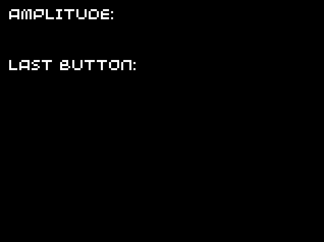

# Haptic feedback

* [Introduction](#introduction)
* [The basics](#the-basics)
* [Creating more complex effects](#creating-more-complex-effects)
* [Tidying it up into a class](#tidying-it-up-into-a-class)
* [Summary](#summary)
* [Taking it further](#taking-it-further)

>  Note that this tutorial is currently only available in C++

## Introduction

In this tutorial, we'll look at the basics of adding haptic feedback to our games. Haptic feedback is a great way to add another level of immersion to your games, by providing physical feedback to the user, via rumbles and buzzes. Many games consoles use haptic feedback in their controllers, and it's even used in many mobile phones (for example, when you type on the virtual keyboard).

Towards the end of the tutorial, we will also create a system to allow more complex rumbles, where the amplitude of vibration varies over time. However, before we can add any of this to our games, it's useful to know how it actually works!

The 32blit produces these buzzes and rumbles using a linear resonant actuator (LRA), which works in a similar way to a speaker. A movable magnet is attached to a spring, and a fixed coil of wire sits within the magnetic field. The magnet is oscillated by running an alternating current through the coil at the resonant frequency of the mass, which produces a noticable force on the frame of the LRA, causing a vibration within the 32blit.

Fortunately for us, the 32blit SDK means that we don't need to worry about how the LRA actually works. Instead, we can just specify the amount of rumble we need each frame.

## The basics

The amplitude of the alternating current supplied to the LRA can be varied, allowing the strength of the vibration to be modified. Each frame, the 32blit API allows us to set the `blit::vibration` variable to a number between 0 and 1, where 0 is no vibration, and 1 is maximum vibration.

To start off with, we'll look at an example program which you may have already run on your 32blit: "Hardware Test".

### Case Study: "Hardware Test"

In the "Hardware Test" example in the 32blit SDK, the magnitude of the vibration is determined by which buttons are currently pressed (out of A, B, X, or Y). Pressing different combinations of buttons results in different amounts of rumble, with the maximum amplitude when all buttons are pressed.

Only a few lines are needed to produce this behaviour:

```cpp
vibration = 0.0f;
if (button_a) { vibration += 0.1f; }
if (button_b) { vibration += 0.2f; }
if (button_x) { vibration += 0.3f; }
if (button_y) { vibration += 0.4f; }
```

> The above code is located in the 32blit SDK repository, and can be viewed [here](https://github.com/32blit/32blit-sdk/blob/master/examples/hardware-test/hardware-test.cpp). In this case, the code is located within the `render` function for simplicity, but for your own games, it's good practice to keep update and render logic separated into the `update` and `render` functions.

In this example, the amplitude of vibration is set to 0 by default, and only increased if specific buttons are pressed. Since four individual if-statements are used, the amplitude can be increased by pressing multiple buttons down.

This shows just how simple it is to add haptic feedback to a game, although we can improve on this example in many ways. In the rest of this tutorial, we will create more complex rumbles and buzzes by fading them out over time, and even specifying the amplitude on a frame-by-frame basis, for truly custom effects.

### Fading out the vibration over time

In order to create smoother effects, we can fade the vibration out over time by reducing the amplitude at the start of each frame. You can then use different starting amplitudes to create longer or shorter effects.

For example, you could subtract a fixed amount from `blit::vibration` each frame:

```cpp
void update(uint32_t time) {
    vibration = std::max(vibration - 0.02f, 0.0f);

    // Rest of update code...
    // For example:

    if (buttons.pressed & Button::A) {
        vibration = 0.3f;
    }
}
```

A slightly more developed version of this can be found in the [example code](../../../source-code/individual-tutorials/haptic-feedback/fading-amplitude/), which uses different starting amplitudes for different buttons, along with a visualisation of the current value of the `blit::vibration` variable:



You could also experiment with alternative ways to reduce the amplitude over time, maybe by multiplying it with a fixed value:

```cpp
vibration *= 0.9;
```

> If you reduce the amplitude by a fixed percentage each frame, it will never truly reach zero, so you'll need to check if it's less than a set value, such as 0.01, and if so, set it to zero.

## Creating more complex effects

By varying the amplitude of vibration over multiple frames, we can create much more complex effects to accompany anything from a heavy object landing on the ground, to a large explosion as the boss is finally defeated.

We can store the amplitude for each frame of the effect in a `vector` instance, for example:

```cpp
// Start with a large amplitude and fade out
// 10 frames = 100ms duration
std::vector<float> effect {
    1.0f, 1.0f, 1.0f, 1.0f, 0.9f, 0.8f, 0.6f, 0.4f, 0.2f, 0.1f
};
```

We'll also need a new variable called `current_position` to track the current location in the array, which we will increment each frame. In this example, we will signify that no effect is currently playing if `current_position` is outside of the array bounds (so we will set `blit::vibration` to 0).

```cpp
uint32_t current_position = effect.size(); // Don't play effect when position is after the end of the array

void update(uint32_t time) {
    if (current_position < effect.size()) {
        // Set current vibration and move on to next position in the array
        vibration = effect[current_position];
        current_position++;
    }
    else {
        // When the position is outside the array bounds, we don't play the effect
        vibration = 0.0f;
    }

    // If the player pressed A, then reset the position, causing the effect to be played.
    if (buttons.pressed & Button::A) {
        current_position = 0;
    }
}
```

> When initialising `current_position`, we set it to the size of `effect` so that the effect won't play as soon as the demo starts.

The [example code for this section](../../../source-code/individual-tutorials/haptic-feedback/complex-effects/) has a much longer `effect` array, in order to demonstrate several of the effects which are made possible by you specifing the haptic effects on a frame-by-frame basis. Feel free to edit it in order to create your own effects!

## Tidying it up into a class

### Creating the `HapticManager` class

In order to make it simpler to use custom haptic effects with our games, we can develop the code we created in the previous section into a class which will play any provided effect. At a minimum, our interface will need to provide three functions:

* `play(effect, loops)`, which plays the provided effect (and repeats it the number of times specified by `loops`).
* `playing()`, which returns true if an effect is currently being played.
* `update()`, which should be called each frame and steps through each frame of the effect.

The `update` method will be very similar to the `update` function in the previous section, and will require the following class attributes:

* `current_effect`, which stores the current effect being played (it will be `nullptr` when no effect is being played).
* `loops_remaining`, which stores the number of times the effect still needs to be repeated.
* `current_position`, which stores the current frame index within the effect array.

With this information, we can create a simple interface in a new file called `haptic_manager.hpp`:

```cpp
#pragma once

#include "32blit.hpp"

#include <vector>

typedef std::vector<float> HapticEffect;

class HapticManager {
public:
	void update();
	void play(HapticEffect* effect, uint8_t loops = 0);
	bool playing();

private:
	HapticEffect* current_effect = nullptr;
	uint8_t loops_remaining = 0;
	uint32_t current_position = 0;
};
```

> In order to simplify our code a little, we've created an alias for a vector of floats, called `HapticEffect`. This helps add a layer of abstraction, means the code is more understandable, and also makes it easy if we ever need to create a custom `HapticEffect` class, instead of using `vector<float>`.

We can now add the function definitions: `play` and `playing` are trivial, and `update` is very similar to the code we've written before, although we've also added the ability to repeat an effect. When we get to the end of an effect, we will need to check if there are any loops remaining, and if so, set `current_position` to point to the start of the effect array.

All our implementation code will go in a new file called `haptic_manager.cpp`:

```cpp
#include "haptic_manager.hpp"

void HapticManager::update() {
	if (playing()) {
		blit::vibration = current_effect->at(current_position);
		current_position++;

		if (current_position >= current_effect->size()) {
			if (loops_remaining == 0) {
				current_effect = nullptr;
			}
			else {
				loops_remaining--;
				current_position = 0;
			}
		}
	}
	else {
		blit::vibration = 0.0f;
	}
}

void HapticManager::play(HapticEffect* effect, uint8_t loops) {
	current_effect = effect;
	loops_remaining = loops;
	current_position = 0;
}

bool HapticManager::playing() {
	return current_effect != nullptr;
}
```

> Often, you can use square brackets to access an item in a `vector` (if you don't need range checking), but in this case we use the `at` method. This is because we are using a pointer to a vector, which would need to be dereferenced before we could use the square bracket notation.

### Using the class

Now that we've created a class to manage our haptic effects, we can test it using multiple different effects, each of which is triggered by a different button. You can store all the effects in a single 2D array, at the start of `main.cpp`, for example:

```cpp
std::vector<HapticEffect> effects {
    {
        0.3f, 0.6f, 0.9f, 1.0f, 1.0f, 1.0f, 1.0f, 1.0f, 1.0f, 1.0f,
        1.0f, 1.0f, 1.0f, 1.0f, 1.0f, 1.0f, 1.0f, 1.0f, 1.0f, 0.9f,
        0.8f, 0.7f, 0.6f, 0.5f, 0.5f, 0.4f, 0.4f, 0.4f, 0.3f, 0.3f,
        0.3f, 0.2f, 0.2f, 0.2f, 0.2f, 0.1f, 0.1f, 0.1f, 0.1f, 0.1f
    },
    {
        0.8f, 0.7f, 0.6f, 0.4f, 0.2f, 0.0f, 0.0f, 0.0f, 0.0f, 0.0f
    },
    {
        0.3f, 0.5f, 0.6f, 0.5f, 0.3f
    },
    {
        1.0f, 0.8f, 0.4f, 0.0f, 0.0f
    }
};
```

At the start of `main.cpp`, we'll also need to create an instance of the `HapticManager` class. Once we've done this, the effects can then each be triggered using the `play` function whenever their corresponding button is pressed:

```cpp
HapticManager manager;

// ...

void update(uint32_t time) {
    if (buttons.pressed & Button::A) {
        manager.play(&effects[0]);
    }
    else if (buttons.pressed & Button::B) {
        manager.play(&effects[1]);
    }
    else if (buttons.pressed & Button::X) {
        manager.play(&effects[2]);
    }
    else if (buttons.pressed & Button::Y) {
        manager.play(&effects[3]);
    }

    manager.update();
}
```

Don't forget to add the `#include` statement for our new class at the start of `main.hpp`:

```cpp
#include "haptic_manager.hpp"
```

In the [example code for this section](../../../source-code/individual-tutorials/haptic-feedback/haptic-manager/), there are some extra effects mapped to the D-pad buttons, along with the same visualisation code used in the other sections. As always, make sure to experiment by changing values and creating your own effects. You could always try improving the `HapticManager` interface, for example to add the ability to pause an effect which is currently playing.

## Summary

In this tutorial, we've looked at how to add haptic feedback to our games, before improving our code so that it can play increasingly complex effects. We then encapsulated this code in a class, making it simple to use with any game.

<!-- TODO: Could maybe talk a bit more? -->

You can view the source code for this tutorial here:

* [Fading amplitude example](../../../source-code/individual-tutorials/haptic-feedback/fading-amplitude/)
* [Complex effects example](../../../source-code/individual-tutorials/haptic-feedback/complex-effects/)
* [Haptic manager example](../../../source-code/individual-tutorials/haptic-feedback/haptic-manager/)

## Taking it further

Now that you're able to add complex haptic effects to your games, you can start to add extra depth and immersion using them. For example, you could create custom effects for:

* Explosions
* When a button is pressed
* When something heavy lands on the ground
* When the player is hit (e.g. when they take damage)
* Accompanying special moves/events

To improve the `HapticManager` class, you could add the ability to play multiple effects at once. Since there is only one LRA in the 32blit, the amplitude of the current frame of each effect would need to be combined into a single amplitude before assigning it to `blit::vibration`. A naive approach to combining the amplitudes would be to sum up all the values and cap the sum at 1. Unfortunately, this would cause the amplitude to frequently be the maximum possible. An alternative approach would be to set the amplitude to the largest of all the individual amplitudes. Whichever approach you choose, or if you choose a completely different approach, make sure to test it out to ensure that the result are intuitive and reliable for varying numbers of effects playing at the same time.

<!-- TODO: Could maybe improve this section a bit? -->