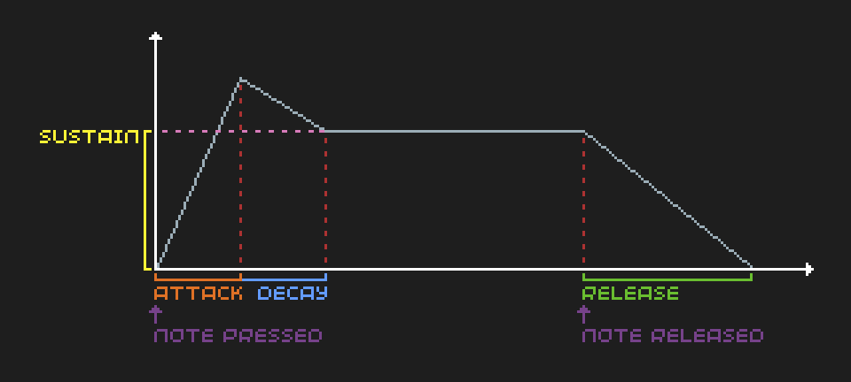

# Making noise

<!-- TODO: Contents -->

NOTE: TODO: This is 32blit only. Also do a PicoSystem version for `voice` stuff? or just PicoSystem section in "Using channels" - since ADSR is the same, just with extra bend, reverb, distort, noise + voices rather than channels.

## Introduction

Whether it is music or sound effects, sound is a great way to add depth to your games. Background music sets the mood of the game, and sound effects help anchor game events within the real world. All of this requires the ability to play sounds, which in our case is provided to us as part of the 32blit API.

Even though sound effects and music are often kept logically distinct, there is no difference in the way these files are stored and played (although music often has a much longer duration than a sound effect). One problem with using sound files (such as a `.wav` file) to store and play music and sound effects is that they can take up a large amount of space for even a few seconds of audio. For many computer games, this is never an issue, but the 32blit has a much more limited amount of memory. Most 32blit games which use just a few sound effects won't have any troubles with storage, but if you need lots of long music files, you may encounter some issues.

<!-- TODO: Maybe mention that MP3 allows more audio to be stored in the same space, but it is much more complex to decode and play that audio. -->

Fortunately, there is another option! It is possible to significantly reduce the storage space used if you generate the waveforms using the 32blit API. This allows us to play simple notes at a specified frequency, meaning that to play a simple tune, we only need to store the pitch and duration of each note. However, this approach comes with the downside of our music being limited to beeps and boops, and at most 8 notes can be playing at any one time.

In this tutorial, we'll look at all the possible ways of playing sounds and music on 32blit - using `.wav` and `.mp3` files, as well as generating waveforms directly using the API.

## RENAME: Channels, waveforms and envelopes

LINKS FOR ME WHILE WRITING THIS:

https://github.com/32blit/32blit-sdk/wiki/Audio

Implementation:

https://github.com/pimoroni/picosystem/blob/main/libraries/audio.cpp

Demo (bad):

https://github.com/32blit/32blit-sdk/blob/master/examples/waveform-demo/waveform-demo.cpp

=========================================================

### Channels and waveforms

The 32blit SDK provides 8 audio channels, which can each play one sound at a time, meaning up to 8 sounds can play simultaneously. Often games will use both music and sound effects, so it is common for the first channel to be dedicated to music, and the rest to sound effects.

Each of these channels can be configured to play any combination of waveforms from the following possible shapes:

* Sine
* Triangle
* Saw
* Square
* Noise

Each of these waveforms correspond to a different pattern of oscillation, and each has a unique sound. The shape produced by graphing the varying amplitude over time makes it clear how each waveform gets its name:


The noise waveform is the odd one out, because it does not repeat itself, but instead the amplitude is repeatedly assigned a new random value. This can be good for mixing with other waveforms to create sound effects such as explosions, or to be used as percussion in music.

### Envelopes

Each audio channel has an ADSR (Attack, Decay, Sustain, Release) envelope, which determines how the volume of the waveform varies over time. When the note is first triggered, the volume increases from zero to a maximum, before decaying to the sustain volume, and finally decreasing to zero when the note is released. The attack, decay, and release values determine the duration of each section of the envelope, and the sustain value determines the volume which the sound is held at until the note is released.



The ADSR envelope for each channel can be specified using the following attributes:

* `attack_ms` - the number of milliseconds it takes to ramp up to full volume.
* `decay_ms` - the number of milliseconds it takes to die away to `sustain` volume.
* `sustain` - the volume which the note is held at until the release is triggered (0 - 65535).
* `release_ms` - the number of milliseconds it takes to die away (from `sustain` volume) to silence (after the release is triggered).

### RENAME: actually playing a note REMOVE HEADING TITLE?

Before we can play a note, we also need to specify the `frequency` parameter, which determines the pitch of the note, measured in Hertz (Hz).

TODO: [volume - global, not channel] attr?

TODO: REORDER STUFF

There are four functions provided by the SDK to skip to a particular ADSR state:

* `trigger_attack`
* `trigger_decay`
* `trigger_sustain`
* `trigger_release`

The `off` can also be used to immediately stop all audio being played on the channel.

Normally, the only two functions you will need are `trigger_attack` to start the note, and `trigger_release` to end it (the audio engine handles the transition between the other states automatically).

Also, another option is to set the sustain to zero, to immediately end note (no need to call trigger_release)
If the sustain level is set to zero, then the note ends immediately after the attack and decay phases have occurred (meaning the call to `trigger_release` is not needed). (TODO: maybe move into previous section, but it mentions trigger_release?)
TODO: with what we've learnt: example setup of a channel, playing a sound

TODO: REWORD: Need to set up each channel you want to use with the initial parameters. Often done in the `init` function. Frequency is commonly modified in the `update` function so that differernt notes can be played by the same channel.

TODO: In this example, a note is triggered when the A button is pressed down, and only ended when the button is released:

```cpp
void init() {
    channels[0].waveforms = Waveform::TRIANGLE;
    channels[0].frequency = 440;
    channels[0].attack_ms = 100;
    channels[0].decay_ms = 100;
    channels[0].sustain = 0xffff * 0.7;
    channels[0].release_ms = 100;
}

void update(uint32_t time) {
    if (buttons.pressed & Button::A) {
        channels[0].trigger_attack();
    }
    else if (buttons.released & Button::A) {
        channels[0].trigger_release();
    }
}
```

TODO talky? or not

TODO The [example code for this section](../../../source-code/individual-tutorials/making-noise/playing-notes/) blah blah


## RENAME: Playing MP3s

LINKS FOR ME WHILE WRITING THIS:

Daft Freak made the MP3Stream class:

https://github.com/32blit/32blit-sdk/blob/master/32blit/audio/mp3-stream.hpp
https://github.com/32blit/32blit-sdk/blob/master/32blit/audio/mp3-stream.cpp

Example (bad) usage:

https://github.com/ThePythonator/Super-Square-Bros/blob/main/Audio.cpp

=========================================================

Using audio files can often be preferable to generating music note-by-note using the 32blit's waveform generator, because they are simpler to work with, and allow more complex sounds and effects (such as reverb, instruments, and vocals TODO REDO/REWORD?). Both `.wav` and `.mp3` files are supported, although they have to be handled in different ways. MP3 files are simpler to work with, but can sometimes experience more limitations than using WAV files (which require you to define a callback function which fills an audio buffer with the raw data).

One important benefit of using MP3 files is the significantly smaller file size (compared to WAV files), which is particularly useful if your game needs a large amount of music. The 32blit API allows us to either play an MP3 file stored on the SD card, or play MP3 data which has been packaged using the 32blit asset manager. The second approach is often preferable because all the assets are bundled into the `.blit` file, rather than needing to be copied across separately.

### RENAME: The MP3Stream class

To play MP3 files, we will use the `MP3Stream` class, which provides a simple API to load, play, pause, and restart the audio. TODO: TALK MORE?

The `load` function requires a path to an MP3 file, so if we are using MP3 data packed in `assets.cpp`, then we need to create a temporary file containing this data. The `File::add_buffer_file` function can be used to create a read-only temporary file which can then be read and loaded by the `MP3Stream` class.

Once the audio is loaded, the `play` function can be used to start playback of the MP3 file. If the audio has been paused, then it will continue from where it left off (otherwise, it will start from the beginning). This function takes two parameters: the channel number to play the audio on (from 0 - 7), and optionally the playback flags. The following flags are available, and can be combined using a bitwise OR:

* `from_start` - play file from start instead of continuing from where the audio was last paused.
* `loop` - instead of stopping at the end of the file, repeat indefinitely.

### RENAME: Using the API/Playing some music

TODO: here is an example. Creates temporary MP3 file from data generated from assets.yml:

```yml
assets.cpp:
  assets/mp3-demo.mp3:
    name: mp3_demo
```

TODO

```cpp
MP3Stream mp3_channel;

void init() {
    File::add_buffer_file("temporary-file.mp3", mp3_demo, mp3_demo_length);
    mp3_channel.load("temporary-file.mp3");
}

void update(uint32_t time) {
    if (buttons.pressed & Button::A) {
        // Toggle between play/pause
        if (mp3_channel.get_playing()) {
            mp3_channel.pause();
        }
        else {
            // Loop forever on channel 0
            mp3_channel.play(0, MP3Stream::loop);
        }
    }
    else if (buttons.pressed & Button::B) {
        mp3_channel.restart();
    }

    mp3_channel.update();
}
```

TODO: The [example code for this section](../../../source-code/individual-tutorials/making-noise/playing-mp3s/) blah blah

## RENAME: Playing WAVs

LINKS FOR ME WHILE WRITING THIS:

Might need to look at this/use something like this:

https://github.com/ahnlak-blit32/32blox/blob/main/daft_freak_wav.cpp

=========================================================

The 32blit SDK allows us to play `.wav` files if we set the `waveforms` attribute to `Waveform::WAVE`. TODO

TODO: packaging .wavs using asset manager

TODO

## Summary

## Taking it further

REDO THIS: TODO: Could take it further by creating an audio manager to "schedule" sound effects - i.e. find a free channel, then set callback for wav etc. Also could add priorities if you can have more than 7 sfx playing at once - to decide which sfx to end

> TODO SHORTEN/MOVE: often you can have multiple sound effects playing at once - scheduling problem arises, to check which of 7 channels are free for a new incoming sound effect to be played, and if all are full, need to determine the lowest priority sound effect to cancel? or skip sound effect. different solutions (skipping vs prioritising vs not possible for 7 sfx at once) can favour differnt styles of game. If you have less that 7 different sfx, can allocate channel to each one.
>
> When allocating one channel to each sfx, one common problem if you have sound effects which need to be replayed often (like collecting coins), can sometimes need to trigger same sfx while it's already playing. Seems odd if it doesn't work, so one method is sfx needs to be shorter in length than the time it takes between collecting two coins (difficult since often multiple coins are put next to each other and player can pick all up in one jump). Alternatively, can allocate multiple channels for one sfx, and pick whichever is free (or alternate between them).
