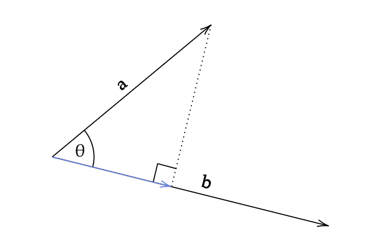
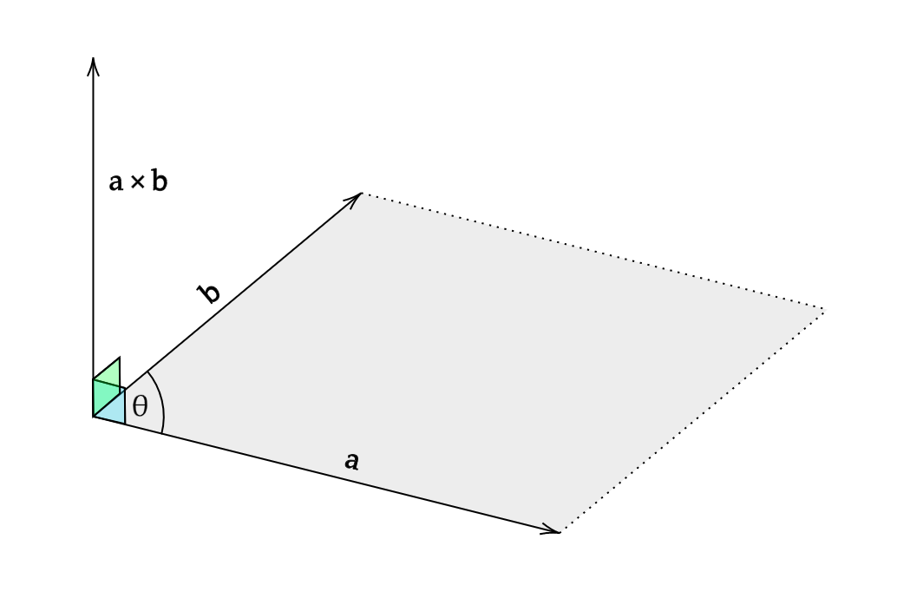

# Using vectors

* [Introduction](#introduction)
* [Operator overloads](#operator-overloads)
* [Magnitude and normalisation](#magnitude-and-normalisation)
* [Dot product](#dot-product)
* [Cross product](#cross-product)
* [Matrices](#matrices)
* [Summary](#summary)
* [Taking it further](#taking-it-further)

>  Note that this tutorial is currently only available in C++

## Introduction

Vectors are a crucial component of game programming. Just like in mathematics, a vector stores both a magnitude and direction, which can also be interpreted as a set of coordinates. A vector can have any number of dimensions, but for games programming we typically use 2D or 3D vectors (and sometimes 4D for several more advanced calculations). For the 32blit and PicoSystem, most of your games will only need 2D vectors.

A 2D vector has an x and y component, and can be used to represent a position on the screen, a velocity, or even an acceleration (such as gravity). In fact, we can use 2D vectors whenever we have a pair of numbers which correspond to two dimensions (e.g. the width and height of an object).

The 32blit SDK provides a `Vec2` data type, with lots of useful features which we will cover in this tutorial. The `Vec3` data type is also provided for 3D vectors, which is very similar in many respects to `Vec2`.

The `Vec2` type has two attributes: `x` and `y`, which are the horizontal and vertical components of the vector respectively (the `Vec3` type has an additional attribute, `z`, for the third dimension).

In this tutorial, as well as looking at the different methods provided by the `Vec2` type, we'll also look at the geometrical interpretation of several operations such as the dot and cross product.

## Operator overloads

Operator overloading is a technique which allows you to redefine what the standard operators (such as `+`, `-`, `*`, `/` and `%`) do to a custom data type. The `Vec2` data type has several operator overloads, designed to make our job easier when programming a game.

For vectors, the most common operation is probably addition. To add two vectors, you need to add the corresponding components together:

```cpp
Vec2 a { 3, 2 };
Vec2 b { -1, 1 };
Vec2 c;

c.x = a.x + b.x;
c.y = a.y + b.y;

// Result:
// c = { 2, 3 }
```

This is a bit awkward to do every time we need to add two vectors together. Fortunately, operator overloading comes to the rescue! Because the addition operator has been redefined for the `Vec2` class, we can add two instances of `Vec2` directly, rather than manually adding each component:

```cpp
Vec2 a { 3, 2 };
Vec2 b { -1, 1 };

Vec2 c = a + b;

// Result:
// c = { 2, 3 }
```

This produces the same result, but is easier for us to read and type. Behind the scenes, the components are still being added together individually, but this becomes an implementation detail which we don't need to worry about.

Similar overloads are provided for subtraction, multiplication, and division. Like the overload for addition, they perform the operation on each pair of components, producing one new vector. These all require both sides of the operator to be an instance of `Vec2`.

Often, it is useful to scale a vector by a certain value, so overloads which take a `float` on the right hand side are also provided for multiplication and division. This means we can use the multiplication or division operators to scale every component of a vector by the same amount:

```cpp
Vec2 a { 3, 2 };

Vec2 b = a * 2.5f;
Vec2 c = b / 5.0f;

// Result:
// b = { 7.5, 5 }
// c = { 1.5, 1 }
```

> Operator overloads do not exist for many combinations of `Vec2` and other types. This is because when writing operator overloads, it is important to ensure that they have a meaningful interpretation. For example, addition between a `Vec2` and a boolean doesn't (and shouldn't) exist, because it doesn't make sense.
<!-- TODO: maybe reword? -->

### Vectors in action

Game physics often requires the position and velocity of an object to be updated each frame. Each of these has an x and y component (and possibly a z component too), which are all updated in the same way. The benefit of the `Vec2` class is clear when comparing code with and without it:

```cpp
// Update velocity using acceleration, for each coordinate direction
velocity_x += acceleration_x * dt;
velocity_y += acceleration_y * dt;

// Update position using velocity, for each coordinate direction
position_x += velocity_x * dt;
position_y += velocity_y * dt;
```

Using vectors, this can be simplified to:

```cpp
// Update velocity using acceleration, all in one go
velocity += acceleration * dt;

// Update position using velocity, all in one go
position += velocity * dt;
```

<!-- The second version of the code is quicker to read and understand,  -->

## Magnitude and normalisation

When working with vectors, it's often useful to be able to calculate the length of the vector (the *magnitude*). To do this, we can use the Pythagorean Theorem:

$$a^2 + b^2 = c^2$$

Where $a$ and $b$ are the horizontal and vertical components of the vector, and $c$ is the length. We need to rearrange this equation for $c$, which results in:

$$c = \sqrt{a^2 + b^2}$$

This operation is so common that it has been provided for us as the `length` method:

```cpp
Vec2 a { 3, 4 };

float length = a.length();

// Result:
// length = 5
```

Sometimes, we are only concerned with the direction of a vector, and so we need its magnitude to be 1. This can be achieved using a technique called *normalisation*, which divides the original vector by its magnitude (length). The `Vec2` type provides us with a `normalize` method to keep things simple:

```cpp
Vec2 a { 3, 4 };

a.normalize();

// Result:
// a = { 0.6, 0.8 }
```

Alternatively, we can use the static version of this method to create a new normalised version of a vector without modifying the original:

```cpp
Vec2 a { 3, 4 };

Vec2 b = Vec2::normalize(a);

// Result:
// b = { 0.6, 0.8 }
```

Normalisation is useful because if we have a vector with magnitude 1, we can then scale it up or down as needed by multiplying it with a scalar value. This is commonly used in games to keep a character moving at a constant speed, no matter which direction they are facing.

## Dot product

There are two methods for multiplying vectors together: the dot (or scalar) product, and the cross (or vector) product. The dot product produces a scalar value, wheras the cross product produces another vector.

Throughout these sections, $ \bold a $ and $ \bold b $ are three-dimensional vectors, where:

$$
\bold a = \begin{pmatrix} a_x \\ a_y \\ a_z \end{pmatrix} \ \ \ \
\bold b = \begin{pmatrix} b_x \\ b_y \\ b_z \end{pmatrix}
$$

The dot product can be used for vectors of any dimension, and is calculated by summing up the product of each pair of corresponding components. For example, the dot product of $ \bold a $ and $ \bold b $ is given by:

$$
\bold a \cdot \bold b = a_x b_x + a_y b_y + a_z b_z
$$

The `Vec2` type provides the `dot` method, which calculates the dot product of two vectors using the above formula:

```cpp
Vec2 a { 3, 4 };
Vec2 b { -1, 2 };

float dot_product = a.dot(b);

// Result:
// dot_product = 5
```

The dot product has several useful properties, which can be used to reduce the complexity of our calculations. These properties allow us to use it to determine:

* The projection of one vector onto a unit vector
* The angle between two vectors
* Whether two vectors are perpendicular to each other

> A unit vector is a vector with a magnitude of 1. Normalising a vector always produces a unit vector.

### Projecting one vector onto another

Geometrically, the dot product can be visualised as "projecting" one vector onto the other, and multiplying the resulting magnitudes:



Using trigonometry, the length of the blue arrow is given by $ |\bold a| \cos \theta $. We can use this to derive another formula for the dot product:

$$
\bold a \cdot \bold b = |\bold a| |\bold b| \cos \theta
$$

<!-- TODO: Maybe explain how it can be proven using the cosine rule? -->

If $ \bold a $ is a unit vector, then the formula simplifies to $ |\bold b| \cos \theta $, which is just the projection of vector $ \bold b $ onto vector $ \bold a $. Multiplication is commutative (meaning that the order doesn't matter), so this also works the other way around, with $ \bold b $ as the unit vector.

> This property is particularly useful in game physics, when you need to calculate how far a point extends into an object. You can calculate this intersection distance if you have the "face normal", which is a unit vector perpendicular to the plane being tested for intersection.

### Calculating the angle between two vectors

In the previous section, we derived a formula for the dot product which includes the angle between the two vectors. We can use this formula to calculate the angle between two vectors by rearranging it for $ \cos \theta $:

$$
\cos \theta = {\bold a \cdot \bold b \over |\bold a| |\bold b|}
$$

We could then use the inverse cosine function to calculate the actual angle, but the `Vec2` type provides an `angle` function to get the angle between two vectors, helping to keep our code simpler:

```cpp
Vec2 a{ 2, 1 };
Vec2 b{ 1, 2 };

float angle = a.angle(b);

// Result:
// angle = 0.643501
```

> The value returned by `angle` is in radians and is measured anticlockwise. This means that if you swap the vectors over, then the angle will have the opposite sign.

### Angle shortcuts

The `angle` function requires trigonometry, which means that it can be quite computationally expensive. If we need to determine if the two vectors are parallel or perpendicular, we can use some shortcuts to speed up our code.

Two vectors are parallel if the angle between them is 0 or 180 degrees (0 or $\pi$ radians). If we set $\theta$ equal to these two values in turn, we get the following results:

* $ \cos (0 \degree) = 1$
* $ \cos (180 \degree) = -1$

Returning to our previous equation, this means that if the value of the normalised dot product is 1 or -1, then the two vectors must be parallel.

<!-- TODO: "Normalised dot product" isn't actually defined anywhere - do I need to explain that it's the dot product of a and b divided by the product of the magnitudes of a and b? -->

This means that if two vectors are parallel, the following must be true:

$$
\text{If } \theta = 0 \degree \text{ or if } \theta = 180 \degree \text{:} \\ \ \\
{|\bold a \cdot \bold b| \over |\bold a| |\bold b|} = 1
$$

Similarly, two vectors are perpendicular if the angle between them is 90 or 270 degrees ($ \pi \over 4 $ or $ 3 \pi \over 4 $ radians). Setting $\theta$ equal to these two values in turn yields the same result:

* $ \cos (90 \degree) = 0$
* $ \cos (270 \degree) = 0$

This means that if two vectors are perpendicular, the following must be true:

$$
\text{If }\theta = 90 \degree  \text{ or if } \theta = 270 \degree \text{:} \\ \ \\
{\bold a \cdot \bold b \over |\bold a| |\bold b|} = 0
$$

Assuming that $ |\bold a| |\bold b| \ne 0$ (both $ \bold a $ and $ \bold b $ have non-zero magnitude), we can multiply both sides by $ |\bold a| |\bold b| $, which results in:

$$
\bold a \cdot \bold b = 0
$$

## Cross product

Geometrically, the cross product calculates a vector which is perpendicular to both the input vectors. The magnitude of this vector is equal to the signed area of the parallelogram formed by the two input vectors.



Using the diagram, we can see that the area of the grey parallelogram is given by:

$$
|\bold a| |\bold b| \sin \theta
$$

If we denote the unit vector perpendicular to both $ \bold a $ and $ \bold b $ as $ \hat { \bold n } $, then we can use this to write a formula for the cross product, since we now know both the magnitude and direction of the result:

$$
\bold a \times \bold b = |\bold a| |\bold b| \sin (\theta) \ \hat { \bold n }
$$

Alternatively, we can calculate the cross product without directly calculating the angle between the vectors $ \bold a $ and $ \bold b $ by using the components of the two vectors:

$$
\bold a \times \bold b = 
\begin{pmatrix}
a_yb_z - a_zb_y \\
a_zb_x - a_xb_z \\
a_xb_y - a_yb_x
\end{pmatrix}
$$

In 2D, the vector perpendicular to two vectors lies in 3D space, so instead of returning a vector, it returns the magnitude of this vector.

> Technically, the 2D cross product is calculated by assuming the z-coordinate of each input vector is zero. This produces a vector where the x and y-coordinates are always zero, so we can just return the z-coordinate (which is equal to the magnitude of the resultant vector).

To calculate the cross product, we can use the `cross` method provided by the `Vec2` class:

```cpp
Vec2 a { 3, 4 };
Vec2 b { -1, 2 };

float cross_product = a.cross(b);

// Result:
// cross_product = 10
```

### Angle shortcuts

In the same way as the dot product, we can produce some shortcuts for the cross product with certain angles. Interpreting these geometrically will give us an intuitive understanding of why these results have to be true.

If two vectors are parallel, then the area of the parallelogram formed must be zero. This means that the cross product will be zero, which gives us a way to check if two vectors are parallel or not:

$$
\text{If }\theta = 0 \degree \text{ or if } \theta = 180 \degree \text{:} \\ \ \\
\bold a \times \bold b = \bold 0
$$

> In 3D, the cross product of two parallel vectors produces the *null vector*, where every element is equal to zero.

This result is confirmed when we look at the trigonometric definition of the cross product: $ \sin (0 \degree) $ and $ \sin (180 \degree) $ are both equal to zero, so no matter what $ \bold a $ and $ \bold b $ are, the cross product will always be zero if the two vectors are parallel.

If two vectors are perpendicular, then the parallelogram they form will be a rectangle. This means that the magnitude of the cross product will be equal to the area of a rectangle with side lengths equal to the magnitudes of the two vectors:

$$
\text{If }\theta = 90 \degree \text{ or if } \theta = 270 \degree \text{:} \\ \ \\
|\bold a \times \bold b| = |\bold a||\bold b|
$$

The result can be seen to be true because $ \sin (90 \degree) $ and $ \sin (270 \degree) $ are equal to 1 and -1 respectively, simplifying the trigonometric cross product equation for parallel vectors.

## Matrices

Matrices can be used to define and apply vector transformations, and are most commonly used in games programming to handle rotations. In order to apply a transformation to a vector, you multiply the transformation matrix with the vector, which produces the new transformed vector. We won't go into much detail about matrices here, but if you would like to learn more, a good place to start is the [Wikipedia page](https://en.wikipedia.org/wiki/Matrix_(mathematics)).

### Rotations

The `rotate` method handles the creation of the rotation matrix, before performing the matrix multiplication which rotates the vector by the specified angle. The `angle` parameter must be in radians (measured anticlockwise).

```cpp
Vec2 a { 1, 1 };
float PI = 3.14159265f;

a.rotate(PI / 2.0f);

// Result:
// a = { -1, 1 }
```

It's important to remember that all rotations are anticlockwise around the point (0,0). If you need to rotate a vector around a specific point, you can shift ("translate") the vector before and after the rotation:

```cpp
Vec2 rotate_around_point(Vec2 vec, float angle, Vec2 point) {
    Vec2 shifted = vec - point;
    shifted.rotate(angle);
    return shifted + point;
}
```

If you need to apply a rotation repeatedly, you can generate a rotation matrix from an angle using the static `rotation` method of the `Mat3` type. You can then multiply any `Vec2` instances with the resulting matrix whenever you need to rotate it by that angle. The rotation matrix is different for each angle, so if the angle is changing lots, it's probably easier to use the `rotate` method of the `Vec2` type.

```cpp
Vec2 a { 1, 1 };
float PI = 3.14159265f;

Mat3 m = Mat3::rotation(PI / 2.0f);

a *= m;

// Result:
// a = { -1, 1 }
```

## Summary

In this tutorial, we've only looked at the classes supplied by the 32blit SDK, but the functions and operations provided by them will be very similar for other implementations. For example, [this all-in-one header file](https://github.com/sgorsten/linalg/blob/main/linalg.h) provides vector and matrix types, and is useful when you aren't using the 32blit SDK (for example, if you are developing for the PicoSystem).

<!-- If you're interested in learning more about vectors -->

<!-- TODO: Could maybe talk a bit more? -->

<!-- TODO: Maybe useful reading (but no proofs sadly): https://www.math.ucla.edu/~josephbreen/Understanding_the_Dot_Product_and_the_Cross_Product.pdf -->

## Taking it further

Vectors can be used in many different situations, and often make the code a lot easier to write. If you have already written a game which makes frequent use of coordinates, you could always adapt it to use a vector type instead (either using the 32blit SDK or another vector implementation).

If you want to see how the `Vec2` class can be used, you could look at some of the example projects in the 32blit SDK:

* [Flight](https://github.com/32blit/32blit-sdk/tree/master/examples/flight) (a mode-7 flight simulator)
* [Geometry](https://github.com/32blit/32blit-sdk/tree/master/examples/geometry) (a game about cutting up asteroids)
* [Matrix test](https://github.com/32blit/32blit-sdk/tree/master/examples/matrix-test) (a demo of matrix functionality)
* [Particle](https://github.com/32blit/32blit-sdk/tree/master/examples/particle) (a demo of particle effects)
* [Platformer](https://github.com/32blit/32blit-sdk/tree/master/examples/platformer) (a platformer demo with lighting effects)
* [Raycaster](https://github.com/32blit/32blit-sdk/tree/master/examples/raycaster) (a raycaster demo with bug spray)
* [Scrolly tile](https://github.com/32blit/32blit-sdk/tree/master/examples/scrolly-tile) (a procedurally generated jumping puzzle)
* [Tilemap test](https://github.com/32blit/32blit-sdk/tree/master/examples/tilemap-test) (a demo of tilemap transformation functions)
* [Tilt](https://github.com/32blit/32blit-sdk/tree/master/examples/tilt) (a demo using the accelerometer to move grains of sand)
* [Tunnel](https://github.com/32blit/32blit-sdk/tree/master/examples/tunnel) (a side-scrolling tunnel projection)
* [Voxel](https://github.com/32blit/32blit-sdk/tree/master/examples/voxel) (a voxel terrain renderer)

<!-- TODO: Maybe redo stuff in brackets? Remove "a"? Roughly taken from metadata.yml files. -->

<!-- If you're interested in the proofs for the dot and cross products...? -->

<!-- TODO: Reword the "Taking it further" section? -->