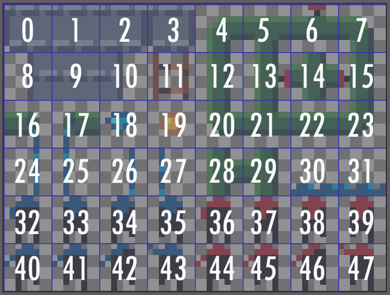

# Episode 1: Getting started

## What will we be making?

We'll be walking through the development of a simple 2D single-screen platformer, called "Ninja Thief". It will be similar to games like [Chuckie Egg](https://en.wikipedia.org/wiki/Chuckie_Egg), with platforms and ladders, items to collect, and enemies to avoid.

There are five tutorials in this series: each will focus on a different aspect of the game, and each will add to the code used in the tutorial before.

## Who is this for?

This mini-series is primarily aimed at people who have some experience coding in C++ or Python, but haven't made a game before. However, it will be equally useful to those just wanting to brush up on their knowledge of the 32blit/PicoSystem SDKs. If you're looking for a tutorial on a specific topic, you can always check out the [list of tutorials](../contents.md).

## What do I need?

These tutorials are designed for owners of a 32blit or PicoSystem, but if you don't have either, you can still follow along, as the 32blit SDK supports building executables for Linux, Windows and MacOS. Who knows, maybe you'll decide to get yourself a 32blit or PicoSystem, to try your creations out in real life!

All the code examples will have versions for the 32blit SDK (C++) and the PicoSystem SDK (C++ and MicroPython).

## Let's get started!

### ... or not

No matter what language or device you're using, you'll need to do some setup before you can start writing and playing your games. Both the 32blit and PicoSystem repositories have their own documentation for setting up and building a project, but at the risk of a little redundancy, here are quick-start guides for each available combination of language and device:

* [32blit (C++)](../quick-start/32blit-cpp.md)

* [PicoSystem (C++)](../quick-start/picosystem-cpp.md)

* [PicoSystem (MicroPython)](../quick-start/picosystem-micropython.md)

### Ok, can we finally start??

Almost! Now that we're all set up, and we've got code running on our device, it's time to look at how we need to structure our game.

A game is simply an application which handles input from the user (via a keyboard, mouse, controller or other input device), updates its internal state (such as some variables), and then renders the updated graphics to the screen. Updating the game is dependent on the input, so a common format of a game loop is:

```cpp
while (true) {
    // Handle input and update internal state
    update_game();

    // Draw the graphics to the screen
    render_game();
}
```

Both the 32blit and PicoSystem SDKs follow this format, although the devices have their own code that needs to be executed at certain points in the game loop (such as waiting for the data to be transferred to the display, or keeping the game running at a constant framerate). Because of this, we don't code the loop itself, but we do need to define the `update` and `render`[^render-vs-draw] functions. The SDK itself defines and handles the main game loop, and then calls our functions at the right points.

The C++ SDKs also require us to define an `init` function, which is called when the game starts. We will use this function to perform any setup needed, such as loading images or initialising the level, as well as defining the screen resolution mode[^defining-screen-resolution].

> MicroPython is slightly different, as the initialisation code can be written at the start of the file, outside of any functions. This code gets automatically executed when the file is run. In addition, the last line of the file must be a call to the `start` function, which is defined by the PicoSystem's MicroPython SDK. This tells the SDK to start the main game loop, where it will call your `update` and `draw` functions as needed.

Now we know the basic layout of a project for 32blit/PicoSystem, let's finally get started!

## Creating our project

The project setup is slightly different for MicroPython, as the boilerplate code can be written by hand in a few seconds. You may want to refer back to the [quick-start guides](../contents.md#quick-start-guides) if you get errors when trying to compile/run the code.

### C++ (with a new repository)

You can create a new repository from the template boilerplate repository which corresponds to the device you will be developing for:

* [32blit boilerplate](https://github.com/32blit/32blit-boilerplate)
* [PicoSystem boilerplate](https://github.com/pimoroni/picosystem-boilerplate)

On the boilerplate repository page, select the "Use this template" button to create a new repository called "Ninja-Thief".


You can now clone your new repository from the command line:

```
git clone <your-repository-url>
```

Make sure to follow the [final setup steps](#c-final-setup-after-preparing-the-repository).

### C++ (without a new repository)

If you only want to store your code locally, you can clone the boilerplate repository into a folder called "Ninja-Thief" by running:

```
git clone <boilerplate-url> Ninja-Thief
```

> The `<boilerplate-url>` will depend on which device you are developing for:
> * 32blit: https://github.com/32blit/32blit-boilerplate.git
> * PicoSystem: https://github.com/pimoroni/picosystem-boilerplate.git

Make sure to follow the [final setup steps](#c-final-setup-after-preparing-the-repository).

### C++ (final setup after preparing the repository)

You now need to rename the `game.cpp`[^main-vs-game] and `game.hpp` files to `ninja_thief.cpp` and `ninja_thief.hpp` respectively. If you're using the 32blit boilerplate, remove the code inside the `render` function in `ninja_thief.cpp`. Don't forget to change the `#include` statement at the top of `ninja_thief.cpp` to:

```cpp
#include "ninja_thief.hpp"
```

Move the **source** (`.cpp`) file into a new folder called `src`. This is where we'll put all new source files. Next, move the **header** (`.hpp`) file into a new folder called `include`. All our new header files should be created here.

In order to make sure that our code still compiles, we need to remove the line which sets `PROJECT_SOURCES`, and replace it with:

```cmake
# Add your source files here, each on a new line (without commas)
set(PROJECT_SOURCES
    "ninja_thief.cpp"
)

list(TRANSFORM PROJECT_SOURCES PREPEND src/)
```

The last line of the snippet adds `src/` to the start of each filename in `PROJECT_SOURCES`, because that's where all our source files will be from now on.

> Note that the 32blit boilerplate names this variable `PROJECT_SOURCE` instead. Whether you choose to pluralise it or not, make sure that it is consistent throughout the `CMakeLists.txt` file.

> Note that we don't put the `.hpp` files in `PROJECT_SOURCES`. This is because it's not needed by CMake, and also because we are adding `src/` to the start of each item, which is incorrect for header files (they're stored in `include/` instead).

We need to tell CMake where to find our headers by adding the following line to `CMakeLists.txt`, just before the `blit_executable(...)` or `picosystem_executable(...)` line:

```cmake
include_directories(${PROJECT_SOURCE_DIR}/include)
```

While editing `CMakeLists.txt`, we'll also change our project name from `game` (or `my_project` on PicoSystem) to `NinjaThief`:


```cmake
project(NinjaThief)
```


```cmake
set(PROJECT_NAME NinjaThief)
```




If you're using 32blit, you'll also need to edit the `metadata.yml` file. This file contains the metadata used by the 32blit game launcher, such as your game title, description, author name, game category, version number, and project url. We'll set these values now, so that we don't need to change them later. If you want, you can always start the version number at something like `0.1.0` and update it as you work your way through the tutorial.

```yml
# metadata.yml

title: Ninja Thief
description: A tutorial game for the 32blit and PicoSystem. Collect all the coins while avoiding the enemy ninjas!
author: You (change this)
splash:
  file: assets/logo.png
icon:
  file: assets/icon.png
version: v1.0.0
category: game
# If you don't have a repository for your project, leave this line out:
url: <your-github-repository-url-here>
```

> The 32blit launcher can display preview artwork for your game (the `logo.png` and `icon.png` images). You will need to [download these images](TODO: get url) and add them to the `assets/` folder. If you don't like the images, feel free to change them (but make sure they are the same resolution).

### MicroPython

MicroPython is a lot simpler to setup, as we only need our source code. To start off, create a folder for this project with an empty file inside it called `ninja_thief.py`. In this file, add the following boilerplate code:

```python
# ninja_thief.py

# Perform any initialisation here, at the start of the file

# Update the game
def update(tick):
    pass

# Render the game
def draw(tick):
    pass

# Enter the main game loop
start()
```

> Note that whenever you create a new file for this tutorial, you don't need to put it in a folder called `src/` or `include/` - those are only used for the C++ code. For Python, we don't have any files except the source code, so it can all be stored in the project directory.

When copying your game to the PicoSystem, make sure that you copy all the files containing code, along with the `assets` folder and its contents.

## Game constants

It's always a good idea to avoid having any "magic constants" in your code, and in games it's even more important. We'll have many values which we will be repeatedly referring to (such as the screen dimensions or the size of a sprite), and it will make our life a lot easier if we store these values in a separate file.

Create a new file in `include/` called `constants.hpp` (if you're using Python, don't put it in a folder, and name it `constants.py` instead), and add these constants to start off with:


```cpp
// constants.hpp

#pragma once

#include <cstdint>

namespace Constants {
    // Screen size in pixels
    const uint8_t SCREEN_WIDTH = 160;
    const uint8_t SCREEN_HEIGHT = 120;

    // Actual game area in pixels
    const uint8_t GAME_WIDTH = 120;
    const uint8_t GAME_HEIGHT = 120;

    // Each sprite on the spritesheet is 8x8 pixels
    const uint8_t SPRITE_SIZE = 8;
}
```


```cpp
// constants.hpp

#pragma once

#include <cstdint>

namespace Constants {
    // Screen size in pixels
    const uint8_t SCREEN_WIDTH = 120;
    const uint8_t SCREEN_HEIGHT = 120;

    // Actual game area in pixels
    const uint8_t GAME_WIDTH = 120;
    const uint8_t GAME_HEIGHT = 120;

    // Each sprite on the spritesheet is 8x8 pixels
    const uint8_t SPRITE_SIZE = 8;

    // Size of the spritesheet in pixels (only needed for PicoSystem)
    const uint8_t SPRITESHEET_WIDTH = SPRITE_SIZE * 8;
    const uint8_t SPRITESHEET_HEIGHT = SPRITE_SIZE * 6;
}
```


```python
# constants.py

# Screen size in pixels
SCREEN_WIDTH = 120
SCREEN_HEIGHT = 120

# Actual game area in pixels
GAME_WIDTH = 120
GAME_HEIGHT = 120

# Each sprite on the spritesheet is 8x8 pixels
SPRITE_SIZE = 8

# Size of the spritesheet in pixels (only needed for PicoSystem)
SPRITESHEET_WIDTH = SPRITE_SIZE * 8
SPRITESHEET_HEIGHT = SPRITE_SIZE * 6
```



> This game is designed to be as similar as possible for both 32blit and PicoSystem, so although the screen size is not the same, we will keep the actual game area the same, and use the `GAME_WIDTH` and `GAME_HEIGHT` constants to store the size of this area.

Now that we have declared some constants, we need to include them in `ninja_thief.hpp` (or `ninja_thief.py` if you're using Python). At the start of the file, add this line:


```cpp
#include "constants.hpp"
```


```cpp
#include "constants.hpp"
```


```python
import constants as Constants
```



> For the Python code, the `as` keyword is used because the code is designed to be as similar as possible between languages and SDKs, including with the capitalisation.

## Drawing to the screen

If we're going to make a game, we need to know how to draw things to the screen. The SDK supports a variety of graphics, such as:

* Text
* Shapes (such as lines, circles and polygons)
* Images
* Sprites (from a spritesheet image)

The SDK also allows us to set the colour of text and shapes. To achieve this, we can change the current "pen" colour before rendering the text or shape (or clearing the screen):


```cpp
// Replace r, g, b with the RGB (0-255) values you want to use
screen.pen = Pen(r, g, b);
// Render your text/shape here
```


```cpp
// Replace r, g, b with the RGB (0-15) values you want to use
pen(r, g, b);
// Render your text/shape here
```


```python
# Replace r, g, b with the RGB (0-15) values you want to use
pen(r, g, b)
# Render your text/shape here
```



> The PicoSystem SDK (for both C++ and MicroPython) is slightly different to the 32blit SDK, since it requires the RGB parameters to the `pen` function to each be in the range 0-15 (rather than the standard 0-255).

### Clearing the screen

Each time `render`[^render-vs-draw] is called, we need to redraw the game from scratch. This means the first thing we need to do each frame is clear the screen. We can use the `clear` function to fill the screen with a solid colour, which is determined by the current `pen` colour.

Add this code to your empty `render`[^render-vs-draw] function (feel free to experiment with different colours):


```cpp
// Replace with the RGB (0-255) values you want to use
screen.pen = Pen(150, 255, 50);
// Clear the screen
screen.clear();
```


```cpp
// Replace with the RGB (0-15) values you want to use
pen(9, 15, 3);
// Clear the screen
clear();
```


```python
# Replace with the RGB (0-15) values you want to use
pen(9, 15, 3)
# Clear the screen
clear()
```



### Text

In "Ninja Thief" we will be using text to display the current level number, along with the player's score. When rendering text, we need to provide the message to display, along with the position to display it at.

> In computer graphics, positions are measured in pixels from the top left corner. This means that as you move right, the x coordinate increases, and as you move down, the y coordinate increases (if you're familiar with mathematical graphs/plots, you'll be used to the y axis increasing as you go upwards, not downwards, so watch out!)

For now, we will display a placeholder message for the player's current score. Add this code to your `render`[^render-vs-draw] function, after the call to `clear` the screen:


```cpp
// Set the text colour to white
screen.pen = Pen(255, 255, 255);

// Render the placeholder score text
screen.text("Score: 0", minimal_font, Point(2, 2));
```


```cpp
// Set the text colour to white
pen(15, 15, 15);

// Render the placeholder score text
text("Score: 0", 2, 2);
```


```python
# Set the text colour to white
pen(15, 15, 15)

# Render the placeholder score text
text("Score: 0", 2, 2)
```



> You may have noticed that the parameters for the `text` function are slightly different between 32blit and PicoSystem. Both require you to specify the message and the position, but the 32blit SDK allows you to specify the font (and optionally the alignment of the text, and whether to use variable character widths). The PicoSystem SDK provides a `font` function which allows the current font to be set, along with whether to use variable width characters or not. For this project, we don't need anything fancy, so we'll stick with the default font for the PicoSystem SDK.

### Shapes

We won't be using any of the primitive shapes in "Ninja Thief", but they are a great way to quickly get something displayed on the screen. Some games are entirely made out of these, such as the ["Geometry" example game](https://github.com/32blit/32blit-sdk/tree/master/examples/geometry) in the 32blit SDK.

The SDKs support the following primitive shapes:

* Pixels
* Lines
* Filled rectangles
* Filled circles
* Filled polygons

> The PicoSystem SDK provides additional functions for unfilled versions of each of these shapes, along with extra functions for drawing filled and unfilled ellipses. For those who are interested, the [PicoSystem API Cheatsheet](https://learn.pimoroni.com/article/picosystem-api-cheatsheet) lists all the drawing methods provided by the PicoSystem SDK.

You can temporarily add the following code to the `render`[^render-vs-draw] function in order to experiment with the different functions that the SDKs provide.


```cpp
// Draw a red (filled) rectangle
screen.pen = Pen(255, 0, 0);
screen.rectangle(Rect(10, 10, 50, 20));

// Draw a blue (filled) circle
screen.pen = Pen(0, 0, 255);
screen.circle(Point(20, 40), 10);

// Draw a green diagonal line from top left to bottom right
screen.pen = Pen(0, 255, 0);
screen.line(Point(0, 0), Point(120, 120));
```


```cpp
// Draw a red (filled) rectangle
pen(15, 0, 0);
frect(10, 10, 50, 20);

// Draw a blue (filled) circle
pen(0, 0, 15);
fcircle(20, 40, 10);

// Draw a green diagonal line from top left to bottom right
pen(0, 15, 0);
line(0, 0, 120, 120);
```


```python
# Draw a red (filled) rectangle
pen(15, 0, 0)
frect(10, 10, 50, 20)

# Draw a blue (filled) circle
pen(0, 0, 15)
fcircle(20, 40, 10)

# Draw a green diagonal line from top left to bottom right
pen(0, 15, 0)
line(0, 0, 120, 120)
```



### Images

Most of the games you create will make significant use of images, but before you can render them, you need to convert the image into a format which can be used by the SDK. The method is substantially different for each language and platform, so there are separate pages detailing the steps required to prepare the images we need for "Ninja Thief":

* [32blit (C++)](handle-images-32blit-cpp.md)
* [PicoSystem (C++)](handle-images-picosystem-cpp.md)
* [PicoSystem (MicroPython)](handle-images-picosystem-micropython.md)

In order to render an image, we can use the `blit` function, which allows us to copy a portion of an image onto the screen. For the background of our game, we will copy the entire image onto the screen:


```cpp
// Draw the entire background image onto the screen at (0, 0)
screen.blit(background, Rect(0, 0, Constants::SCREEN_WIDTH, Constants::SCREEN_HEIGHT), Point(0, 0));
```


```cpp
// Draw the entire background image onto the screen at (0, 0)
blit(background, 0, 0, Constants::SCREEN_WIDTH, Constants::SCREEN_HEIGHT, 0, 0);
```


```python
# Draw the entire background image onto the screen at (0, 0)
blit(background, 0, 0, Constants.SCREEN_WIDTH, Constants.SCREEN_HEIGHT, 0, 0)
```



### Sprites

Often many small images are stored on a single spritesheet, making it simpler both to edit and to load into your game. The SDKs provide support for spritesheets containing sprites which are 8x8 pixels in size, along with the ability to set the current spritesheet image to use.

In the `init` function, we will load the spritesheet in as a normal image, and pass it to the SDK as the main spritesheet for our game. As we're only using a single spritesheet, we don't need to worry about swapping between spritesheet images. Our `init` function should now look like this:


```cpp
void init() {
    // Set the resolution to 160x120
    set_screen_mode(ScreenMode::lores);

    // Load the background from assets.cpp
    background = Surface::load(asset_background);

    // Load the spritesheet from assets.cpp
    Surface* spritesheet = Surface::load(asset_spritesheet);

    // Set the current spritesheet to the one we just loaded
    screen.sprites = spritesheet;
}
```


```cpp
void init() {
    // Load the spritesheet
    buffer_t* sprites = buffer(Constants::SPRITESHEET_WIDTH, Constants::SPRITESHEET_HEIGHT, asset_spritesheet);
    
    // Set the current spritesheet to the one we just loaded
    spritesheet(sprites);

    // Load the background
    background = buffer(Constants::SCREEN_WIDTH, Constants::SCREEN_HEIGHT, asset_background);
}
```


```python
# Note that we don't need an init function for MicroPython

# Load the spritesheet
sprites = Buffer(Constants.SPRITESHEET_WIDTH, Constants.SPRITESHEET_HEIGHT, "assets/spritesheet.16bpp")

# Set the current spritesheet to the one we just loaded
spritesheet(sprites)

# Load the background
background = Buffer(Constants.SCREEN_WIDTH, Constants.SCREEN_HEIGHT, "assets/background.16bpp")
```



> For 32blit, our game will use a 160x120 resolution, which is why we tell the SDK to use the `lores` screen mode:
>
> ```cpp
> set_screen_mode(ScreenMode::lores);
> ```

Now that we've loaded our spritesheet and set it as the main spritesheet for our game, we can draw some sprites from it. The simplest way to do that is by providing the index of the sprite: each 8x8 square is given a number, starting from 0 and working from left to right. As an example, the following image shows what the index of each sprite in the "Ninja Thief" spritesheet would be:



In order to render a sprite, we will provide the index of the sprite we need, along with the position to render it at:


```cpp
// Draw the first blue player sprite (index 32) at (50, 50)
screen.sprite(32, Point(50, 50));
```


```cpp
// Draw the first blue player sprite (index 32) at (50, 50)
sprite(32, 50, 50);
```


```python
# Draw the first blue player sprite (index 32) at (50, 50)
sprite(32, 50, 50)
```



TODO: SCREENSHOT??

## Wrapping up

We've now learnt everything we'll need to handle the rendering of our game. So far, our code draws the background and the player, and we know how to draw all of the other sprites we will need.

You can access the source code for the project so far here:

* [32blit (C++)](https://github.com/32blit/32blit-tutorials-contrib/tree/main/source-code/ninja-thief/episode-1/32blit-cpp/)
* [PicoSystem (C++)](https://github.com/32blit/32blit-tutorials-contrib/tree/main/source-code/ninja-thief/episode-1/picosystem-cpp/)
* [PicoSystem (MicroPython)](https://github.com/32blit/32blit-tutorials-contrib/tree/main/source-code/ninja-thief/episode-1/picosystem-micropython/)

Next episode, we will get the player moving and responding to input, as well as adding gravity.

<!-- TODO: Avoid repeating "Next episode"? -->

[Next episode: Making the player move](episode-2.md)


[^render-vs-draw]: Note that the PicoSystem SDK requires the function to be named `draw` instead of `render`.

[^defining-screen-resolution]: Only the 32blit SDK allows us to define the screen mode in the `init` function. For the PicoSystem SDK, we can define the screen mode in the `CMakeLists.txt` file.

[^main-vs-game]: Note that the PicoSystem boilerplate names these files `main.cpp` and `main.hpp` instead.