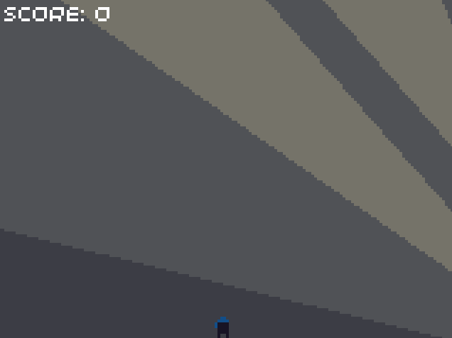
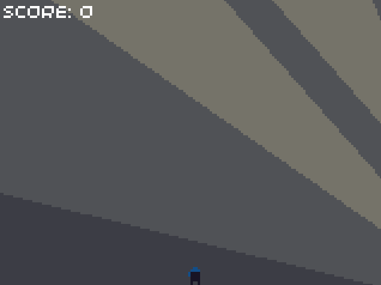

# Episode 2: Making the player move

## Summary

In this episode, we will look at how to detect input (checking which buttons have been pressed, and whether they have been pressed since the last frame). We will then write code which will be used for both the player and the enemies (which will be added later). This will be put into a `Ninja` class, which the `PlayerNinja` and `EnemyNinja` classes will eventually inherit from. Finally, we will write the code for the `PlayerNinja` class, which will allow the user to control the player using the buttons.

At the end of this episode, the player will be able to move left and right, using the D-pad. The player will be affected by gravity, and will be able to jump, using the A button.

## Handling input

The SDKs allow us to access the current state of the buttons, by calling the `button` function (or `pressed` for 32blit), and providing the button we want to check as a parameter:

```cpp 32blit (C++)
// Check if button A is pressed
if (pressed(Button::A)) {
    // Do something
}
```
```cpp PicoSystem (C++)
// Check if button A is pressed
if (button(A)) {
    // Do something
}
```
```python PicoSystem (MicroPython)
# Check if button A is pressed
if button(A):
    # Do something
```

> The PicoSystem SDK also allows us to check if a button has *just* been pressed (since the last frame). To do this, we can use the `pressed` function, in the same way as we used the `button` function.

> Watch out! The 32blit SDK function `pressed` behaves the same as the PicoSystem SDK function `button` (it is *not* the same as the PicoSystem SDK function `pressed`).

The different buttons you can access are:

```cpp 32blit
// D-pad buttons:
Button::DPAD_UP
Button::DPAD_DOWN
Button::DPAD_LEFT
Button::DPAD_RIGHT

// Other buttons:
Button::A
Button::B
Button::X
Button::Y

Button::MENU
Button::HOME
Button::JOYSTICK
```
```cpp PicoSystem
// D-pad buttons:
UP
DOWN
LEFT
RIGHT

// Other buttons:
A
B
X
Y
```

## The `Ninja` class

Before our code turns into spaghetti (with lots of variables scattered everywhere), we will start creating some classes to keep things tidy. This allows us to group data and functions together based on their combined purpose. We'll need a class for our player, but since we want to add enemies later, we're going to create a `Ninja` base class, which handles all of the logic which is common between the player and the enemies.

All of our classes in this game will have their own `update` and `render` member methods, which handle the update and render logic of the object, and will be called by the main game's `update` and `render`[^render-vs-draw] functions.

Some examples of attributes and behaviours which are common to both the player and the enemies are:

* Position of the ninja
* Velocity of the ninja
* Ability to move around
* Ability to be drawn to the screen
* Ability to climb ladders
* Ability to stand on/collide with platforms

We won't code all of these features at the moment, but by splitting concepts into classes, we can easily come back and add more features later. We will only focus on the position and velocity of the ninja for now.

In order to store the position and velocity of a ninja, we need to track both the x and y components of it, so we'll need four variables in total.

> A "vector" data type can be useful as it groups the x and y components together, as well as providing some helpful functions, such as operator overloading. This is beyond the scope of the project, but 32blit users may be interested in looking into the `Vec2` data type provided by the 32blit SDK. For more information, check out the [vector tutorial](../individual-tutorials/using-vectors/using-vectors.md).

To start off with, create a new file in `include/` called `ninja.hpp` (or `ninja.py` for Python):

```cpp 32blit (C++)
// ninja.hpp

#pragma once

#include "32blit.hpp"

#include "constants.hpp"

class Ninja {
public:
    Ninja();
    Ninja(float x, float y);

    void update(float dt);
    void render();

protected:
    float position_x = 0.0f;
    float position_y = 0.0f;
    float velocity_x = 0.0f;
    float velocity_y = 0.0f;
};
```
```cpp PicoSystem (C++)
// ninja.hpp

#pragma once

#include "picosystem.hpp"

#include "constants.hpp"

class Ninja {
public:
    Ninja();
    Ninja(float x, float y);

    void update(float dt);
    void render();

protected:
    float position_x = 0.0f;
    float position_y = 0.0f;
    float velocity_x = 0.0f;
    float velocity_y = 0.0f;
};
```
```python PicoSystem (MicroPython)
# ninja.py

import constants as Constants

class Ninja:

    def __init__(self, x, y):
        self.position_x = x
        self.position_y = y

        self.velocity_x = 0
        self.velocity_y = 0
    
    def update(self, dt):
        pass

    def render(self):
        pass
```

If you are using C++, you also need to create a new file in `src/` called `ninja.cpp`, where we will define our member functions (which are empty for now):

```cpp 32blit (C++)
// ninja.cpp

#include "ninja.hpp"

using namespace blit;

Ninja::Ninja() {

}

Ninja::Ninja(float x, float y) : position_x(x), position_y(y) {

}

void Ninja::update(float dt) {

}

void Ninja::render() {

}
```
```cpp PicoSystem (C++)
// ninja.cpp

#include "ninja.hpp"

using namespace picosystem;

Ninja::Ninja() {

}

Ninja::Ninja(float x, float y) : position_x(x), position_y(y) {

}

void Ninja::update(float dt) {

}

void Ninja::render() {

}
```

> Whenever you create a new **source** (`.cpp`) file in C++, don't forget to add it to the `PROJECT_SOURCES` variable in `CMakeLists.txt`!
<!-- TODO: Maybe explain how to add it if there is currently only a single file in the PROJECT_SOURCES variable. -->

### What's `dt`?

You may have noticed that the `update` function definitions contained a parameter called `dt`.

If we want to ensure that our sprites move exactly the same number of pixels per frame, no matter what the framerate is, we can use a concept called "delta-time" (often abbreviated to `dt`). The word "delta" is often used to represent a small change in a quantity (in this case time). If we know the time which has passed between the previous frame and this frame, we can calculate the distance (in pixels) to move, using the formula:

$$distance = speed \times time$$

> The concept of delta-time is particularly useful when developing games to be run on unknown hardware (for example, writing PC or mobile games). Different devices may run your game at different framerates, so using delta-time allows all the gameplay to be as similar as possible (if you only moved objects a fixed distance per frame, running the game at a higher framerate would mean you move faster!)
> 
> For 32blit and PicoSystem, the framerate is fixed, so we are only using delta-time because it allows us to specify speeds as pixels-per-second, rather than pixels-per-frame.

The exact method of calculating the change in time between frames is different for each combination of device and language, but the result is the same. We will calculate `dt` in the `update` function in `ninja_thief.cpp` (or `ninja_thief.py` for Python users), so that we can pass it into any function which needs it:

```cpp 32blit (C++)
// ninja_thief.cpp

// Outside of our functions, just after the includes
float last_time = 0.0f;

// Update the game
// The time parameter is the number of milliseconds since the device was last reset
void update(uint32_t time) {
    // Calculate change in time (in seconds) since last frame
    float dt = (time - last_time) / 1000.0f;
    last_time = time;
}
```
```cpp PicoSystem (C++)
// ninja_thief.cpp

// Outside of our functions, just after the includes
float last_time = 0.0f;

// Update the game
// The tick parameter is incremented by one each time the update method is called
void update(uint32_t tick) {
    // Calculate change in time (in seconds) since last frame
    // The time() function returns the time in milliseconds since the device started
    float dt = (time() - last_time) / 1000.0f;
    last_time = time();
}
```
```python PicoSystem (MicroPython)
# ninja_thief.py

# We need to import the functions we'll be using for time measurement:
from time import ticks_ms, ticks_diff

# We declare our global variables at the top of the file, after the import statements
last_time = 0

# Update the game
# The tick parameter is incremented by one each time the update method is called
def update(tick):
    global last_time

    # Calculate change in time (in seconds) since last frame
    # The ticks_diff() function calculates the number of milliseconds between the two times measured
    dt = ticks_diff(ticks_ms(), last_time) / 1000
    last_time = ticks_ms()
```

When the game first starts, the value calculated for `dt` may be very large. This is because we set `last_time` to zero, but the value for the current time is measured from when the device is turned on. In addition, while the system menu is open on the 32blit, the `update` function is not called. This may result in the time since the last frame being very large, and hence `dt` may be very large.

To solve both these issues, we can limit `dt` to a maximum value. We will use 0.05 as the maximum value, which corresponds to a minimum framerate of 20 fps. Add the following code after the calculation of `dt` (in the `update` function):

```cpp 32blit (C++)
// ninja_thief.cpp

// At the end of the update function

// Limit dt
if (dt > 0.05f) {
    dt = 0.05f;
}
```
```cpp PicoSystem (C++)
// ninja_thief.cpp

// At the end of the update function

// Limit dt
if (dt > 0.05f) {
    dt = 0.05f;
}
```
```python PicoSystem (MicroPython)
# ninja_thief.py

# At the end of the update function

# Limit dt
if dt > 0.05:
    dt = 0.05
```

### Updating the ninja

Now that we know the change in time between frames and the velocity of the ninja, each frame we can calculate the number of pixels to move the ninja by. We'll add the following code to the `update` method of the `Ninja` class:

```cpp 32blit (C++)
// ninja.cpp

void Ninja::update(float dt) {
    // Move the ninja
    position_x += velocity_x * dt;
    position_y += velocity_y * dt;
}
```
```cpp PicoSystem (C++)
// ninja.cpp

void Ninja::update(float dt) {
    // Move the ninja
    position_x += velocity_x * dt;
    position_y += velocity_y * dt;
}
```
```python PicoSystem (MicroPython)
# ninja.py

def update(self, dt):
    # Move the ninja
    self.position_x += self.velocity_x * dt
    self.position_y += self.velocity_y * dt
```

### Rendering the ninja

In order for us to see the results of our code, we need to draw the ninja to the screen, using the `sprite` function. To make our job easier later, we will offset the sprite when rendering, so that the top left corner of the game area corresponds to the sprite position (0, 0).

We will store all our spritesheet indices in our constants file, along with the offset we need to apply to any sprites. We'll start using namespaces (or classes for Python) to group some of our constants by their purpose:

```cpp 32blit (C++)
// constants.hpp, inside Constants namespace

// Offset of game area from top left corner
const float GAME_OFFSET_X = (SCREEN_WIDTH - GAME_WIDTH) / 2;
const float GAME_OFFSET_Y = (SCREEN_HEIGHT - GAME_HEIGHT) / 2;

// Sprite data, including indices to use for rendering
namespace Sprites {
    // Offset of the red ninja sprites from the blue ninja sprites
    const uint8_t RED_OFFSET = 4;

    // We'll only be using PLAYER_IDLE for now
    const uint8_t PLAYER_IDLE = 32;
    const uint8_t PLAYER_CLIMBING_IDLE = 33;
    const uint8_t PLAYER_CLIMBING_1 = 34;
    const uint8_t PLAYER_CLIMBING_2 = 35;
    const uint8_t PLAYER_WALKING_1 = 40;
    const uint8_t PLAYER_WALKING_2 = 41;
    const uint8_t PLAYER_JUMPING_UP = 42;
    const uint8_t PLAYER_JUMPING_DOWN = 43;

    const uint8_t LADDER = 11;

    const uint8_t COIN = 19;
    const uint8_t GEM = 18;

    // These will be used to draw a border either side of the screen, to make the game area 120x120
    const uint8_t BORDER_LEFT = 10;
    const uint8_t BORDER_FULL = 9;
    const uint8_t BORDER_RIGHT = 8;
}
```
```cpp PicoSystem (C++)
// constants.hpp, inside Constants namespace

// Offset of game area from top left corner
const float GAME_OFFSET_X = (SCREEN_WIDTH - GAME_WIDTH) / 2;
const float GAME_OFFSET_Y = (SCREEN_HEIGHT - GAME_HEIGHT) / 2;

// Sprite data, including indices to use for rendering
namespace Sprites {
    // Offset of the red ninja sprites from the blue ninja sprites
    const uint8_t RED_OFFSET = 4;

    // We'll only be using PLAYER_IDLE for now
    const uint8_t PLAYER_IDLE = 32;
    const uint8_t PLAYER_CLIMBING_IDLE = 33;
    const uint8_t PLAYER_CLIMBING_1 = 34;
    const uint8_t PLAYER_CLIMBING_2 = 35;
    const uint8_t PLAYER_WALKING_1 = 40;
    const uint8_t PLAYER_WALKING_2 = 41;
    const uint8_t PLAYER_JUMPING_UP = 42;
    const uint8_t PLAYER_JUMPING_DOWN = 43;

    const uint8_t LADDER = 11;

    const uint8_t COIN = 19;
    const uint8_t GEM = 18;
}
```
```python PicoSystem (MicroPython)
# constants.py

# Offset of game area from top left corner
GAME_OFFSET_X = (SCREEN_WIDTH - GAME_WIDTH) // 2
GAME_OFFSET_Y = (SCREEN_HEIGHT - GAME_HEIGHT) // 2

# Sprite data, including indices to use for rendering
class Sprites:
    # Offset of the red ninja sprites from the blue ninja sprites
    RED_OFFSET = 4

    # We'll only be using PLAYER_IDLE for now
    PLAYER_IDLE = 32
    PLAYER_CLIMBING_IDLE = 33
    PLAYER_CLIMBING_1 = 34
    PLAYER_CLIMBING_2 = 35
    PLAYER_WALKING_1 = 40
    PLAYER_WALKING_2 = 41
    PLAYER_JUMPING_UP = 42
    PLAYER_JUMPING_DOWN = 43

    LADDER = 11

    COIN = 19
    GEM = 18
```

We won't worry about animation for now, but we will make the ninja face the direction they are travelling. In order to change the direction our sprite is facing, we can use an additional parameter in the `sprite` function - the direction to flip the sprite:

```cpp 32blit (C++)
// Facing right
screen.sprite(Constants::Sprites::PLAYER_IDLE, Point(50, 50));

// Also facing right
screen.sprite(Constants::Sprites::PLAYER_IDLE, Point(50, 50), SpriteTransform::NONE);

// Facing left
screen.sprite(Constants::Sprites::PLAYER_IDLE, Point(50, 50), SpriteTransform::HORIZONTAL);
```
```cpp PicoSystem (C++)
// Facing right
sprite(Constants::Sprites::PLAYER_IDLE, 50, 50);

// Also facing right
sprite(Constants::Sprites::PLAYER_IDLE, 50, 50, 1, 1, Constants::SPRITE_SIZE, Constants::SPRITE_SIZE, 0);

// Facing left
sprite(Constants::Sprites::PLAYER_IDLE, 50, 50, 1, 1, Constants::SPRITE_SIZE, Constants::SPRITE_SIZE, HFLIP);
```
```python PicoSystem (MicroPython)
# Facing right
sprite(Constants.Sprites.PLAYER_IDLE, 50, 50)

# Also facing right
sprite(Constants.Sprites.PLAYER_IDLE, 50, 50, 1, 1, Constants.SPRITE_SIZE, Constants.SPRITE_SIZE, 0)

# Facing left
sprite(Constants.Sprites.PLAYER_IDLE, 50, 50, 1, 1, Constants.SPRITE_SIZE, Constants.SPRITE_SIZE, HFLIP)
```

> For the PicoSystem SDK, there isn't a predefined constant to specify no transformation - a zero is used for this instead. You may have also noticed that there are a lot more parameters in some of the calls to the PicoSystem SDK's `sprite` function. This is because the transformation flag is the last of several optional parameters (which specify the number of sprites across and down, along with the width and height to stretch the image to).

Now that we know how to flip our sprites, we can start writing the code to draw them. The rendering logic will be the same for both the player and enemy sprites, so putting it in the `Ninja` class allows us to avoid unnecessary duplication of our code.

The direction of movement can be found by checking if `velocity_x` is positive or negative. If the player is moving right, we can display the sprite normally - otherwise, we need to flip it horizontally. We can now add the following code to the `render` function in our `Ninja` class:

```cpp 32blit (C++)
// ninja.cpp

void Ninja::render() {
    // If ninja is travelling left, flip the image horizontally
    SpriteTransform transform = velocity_x > 0.0f ? SpriteTransform::NONE : SpriteTransform::HORIZONTAL;

    screen.sprite(Constants::Sprites::PLAYER_IDLE, Point(std::round(position_x) + Constants::GAME_OFFSET_X, std::round(position_y) + Constants::GAME_OFFSET_Y), transform);
}
```
```cpp PicoSystem (C++)
// ninja.cpp

void Ninja::render() {
    // If ninja is travelling left, flip the image horizontally (set the transform flags)
    uint32_t transform_flags = velocity_x > 0.0f ? 0 : HFLIP;

    // Since we are specifying the transform flags, we need to include all the extra parameters for sprite():
    //  - number of sprites across (1)
    //  - number of sprites down (1)
    //  - width to stretch to (SPRITE_SIZE - i.e. don't stretch)
    //  - height to stretch to (SPRITE_SIZE - i.e. don't stretch)
    sprite(Constants::Sprites::PLAYER_IDLE, std::round(position_x) + Constants::GAME_OFFSET_X, std::round(position_y) + Constants::GAME_OFFSET_Y, 1, 1, Constants::SPRITE_SIZE, Constants::SPRITE_SIZE, transform_flags);
}
```
```python PicoSystem (MicroPython)
# ninja.py

def render(self):
    # If ninja is travelling left, flip the image horizontally (set the transform flags)
    transform_flags = 0 if self.velocity_x > 0 else HFLIP

    # Since we are specifying the transform flags, we need to include all the extra parameters for sprite():
    #  - number of sprites across (1)
    #  - number of sprites down (1)
    #  - width to stretch to (SPRITE_SIZE - i.e. don't stretch)
    #  - height to stretch to (SPRITE_SIZE - i.e. don't stretch)
    sprite(Constants.Sprites.PLAYER_IDLE, round(self.position_x) + Constants.GAME_OFFSET_X, round(self.position_y) + Constants.GAME_OFFSET_Y, 1, 1, Constants.SPRITE_SIZE, Constants.SPRITE_SIZE, transform_flags)
```

> If you're wondering why we use the `round` function, it's because we're storing the position of the ninja as floating-point numbers, but we need to render the sprite location as an integer. If we didn't round the position, it would be implicity casted to an integer, causing it to be truncated, which will result in the player sometimes "floating" one pixel above the platforms.

## Controlling the player

In preparation for allowing the player sprite to move, we'll add some more values to our constants file:

```cpp 32blit (C++)
// constants.hpp, inside Constants namespace

// Player data such as speeds
namespace Player {
    // Speeds are measured in pixels per second
    const float MAX_SPEED = 50.0f;

    const float JUMP_SPEED = 125.0f;
}

// Environment data such as gravity strength
namespace Environment {
    const float GRAVITY_ACCELERATION = 375.0f;
}
```
```cpp PicoSystem (C++)
// constants.hpp, inside Constants namespace

// Player data such as speeds
namespace Player {
    // Speeds are measured in pixels per second
    const float MAX_SPEED = 50.0f;

    const float JUMP_SPEED = 125.0f;
}

// Environment data such as gravity strength
namespace Environment {
    const float GRAVITY_ACCELERATION = 375.0f;
}
```
```python PicoSystem (MicroPython)
# constants.py

# Player data such as speeds
class Player:
    # Speeds are measured in pixels per second
    MAX_SPEED = 50

    JUMP_SPEED = 125

# Environment data such as gravity strength
class Environment:
    GRAVITY_ACCELERATION = 375
```

### The `PlayerNinja` class

Now that we have a `Ninja` class, we can inherit from it to create the `PlayerNinja` class which we'll use for the player. To start off, create a new file in `include/` called `player_ninja.hpp` (or `player_ninja.py` if you're using Python):

```cpp 32blit (C++)
// player_ninja.hpp

#pragma once

#include "32blit.hpp"

#include "ninja.hpp"
#include "constants.hpp"

class PlayerNinja : public Ninja {
public:
    PlayerNinja();
    PlayerNinja(float x, float y);

    void update(float dt);
};
```
```cpp PicoSystem (C++)
// player_ninja.hpp

#pragma once

#include "picosystem.hpp"

#include "ninja.hpp"
#include "constants.hpp"

class PlayerNinja : public Ninja {
public:
    PlayerNinja();
    PlayerNinja(float x, float y);

    void update(float dt);
};
```
```python PicoSystem (MicroPython)
# player_ninja.py

from ninja import Ninja
import constants as Constants

class PlayerNinja(Ninja):

    def __init__(self, x, y):
        super().__init__(x, y)


    def update(self, dt):
        super().update(dt)
```

If you're using C++, you'll also need to create a new file in `src/` called `player_ninja.cpp`, with the empty methods:

```cpp 32blit (C++)
// player_ninja.cpp

#include "player_ninja.hpp"

using namespace blit;

PlayerNinja::PlayerNinja() {

}

PlayerNinja::PlayerNinja(float x, float y) : Ninja(x, y) {

}

void PlayerNinja::update(float dt) {
    Ninja::update(dt);
}
```
```cpp PicoSystem (C++)
// player_ninja.cpp

#include "player_ninja.hpp"

using namespace picosystem;

PlayerNinja::PlayerNinja() {

}

PlayerNinja::PlayerNinja(float x, float y) : Ninja(x, y) {

}

void PlayerNinja::update(float dt) {
    Ninja::update(dt);
}
```

> You may have noticed that the `update` function isn't entirely empty: `Ninja::update(dt)` (or in Python, `super().update(dt)`) calls the `update` method in the parent class (which is `Ninja`). We need this because we want to call the code which updates the position of the sprite.

Now we're all set to add movement! We need to set the player's horizontal velocity based on what keys the user is pressing down. In addition, we need to make sure that the player stops moving if no (or both) keys are pressed.

We've already learnt all the information we need to do this, so see if you can get this working **before** looking at the solution. Here's a clue: we'll be modifying the `update` function in the `PlayerNinja` class.

Our `update` function should now look like this:

```cpp 32blit (C++)
// player_ninja.cpp

void PlayerNinja::update(float dt) {
    // If nothing is pressed, the player shouldn't move
    velocity_x = 0.0f;

    // Note: "else if" isn't used, because otherwise the sprite will still move when both buttons are pressed
    // Instead, we add/subtract the velocity, so if both are pressed, nothing happens
    if (pressed(Button::DPAD_LEFT)) {
        velocity_x -= Constants::Player::MAX_SPEED;
    }
    if (pressed(Button::DPAD_RIGHT)) {
        velocity_x += Constants::Player::MAX_SPEED;
    }

    Ninja::update(dt);
}
```
```cpp PicoSystem (C++)
// player_ninja.cpp

void PlayerNinja::update(float dt) {
    // If nothing is pressed, the player shouldn't move
    velocity_x = 0.0f;

    // Note: "else if" isn't used, because otherwise the sprite will still move when both buttons are pressed
    // Instead, we add/subtract the velocity, so if both are pressed, nothing happens
    if (button(LEFT)) {
        velocity_x -= Constants::Player::MAX_SPEED;
    }
    if (button(RIGHT)) {
        velocity_x += Constants::Player::MAX_SPEED;
    }

    Ninja::update(dt);
}
```
```python PicoSystem (MicroPython)
# player_ninja.py

def update(self, dt):
    # If nothing is pressed, the player shouldn't move
    self.velocity_x = 0.0

    # Note: "else if" isn't used, because otherwise the sprite will still move when both buttons are pressed
    # Instead, we add/subtract the velocity, so if both are pressed, nothing happens
    if button(LEFT):
        self.velocity_x -= Constants.Player.MAX_SPEED
    
    if button(RIGHT):
        self.velocity_x += Constants.Player.MAX_SPEED

    super().update(dt)
```

### Creating an instance of the `PlayerNinja` class

Now that we've got the class for our player sprite, let's temporarily create an instance of it to test it out. First, we will need to include the `player_ninja.hpp` (or `player_ninja.py`) file (we will remove this code later):

```C++ 32blit (C++)
// ninja_thief.hpp

#include "player_ninja.hpp"
```
```C++ PicoSystem (C++)
// ninja_thief.hpp

#include "player_ninja.hpp"
```
```python PicoSystem (MicroPython)
# ninja_thief.py

from player_ninja import PlayerNinja
```

Now we can create an instance. In `ninja_thief.cpp` (or `ninja_thief.py`), add the following (temporary) lines:

```cpp 32blit (C++)
// ninja_thief.cpp

// Outside the functions, just after the include statements
PlayerNinja player = PlayerNinja(50, 50);

// In the render function
player.render();

// In the update function, after the calculation of dt
player.update(dt);
```
```cpp PicoSystem (C++)
// ninja_thief.cpp

// Outside the functions, just after the include statements
PlayerNinja player = PlayerNinja(50, 50);

// In the render function
player.render();

// In the update function, after the calculation of dt
player.update(dt);
```
```python PicoSystem (MicroPython)
# ninja_thief.py

# Outside the functions, just after the import statements
player = PlayerNinja(50, 50)

# In the draw function
player.render()

# In the update function, after the calculation of dt
player.update(dt)
```

> Now that we're drawing the player sprite via the `PlayerNinja` class, we don't need to draw the sprite directly in the main game's `render` function, so we can remove the call to the `sprite` function (otherwise we'll have two sprites).

If you compile and run the code, you will see the player sprite, and can move it left and right by pressing the D-pad buttons:


### Adding gravity

So far, our player floats in midair, which doesn't seem very realistic. However, at least we've now got something visible, so it will be easy to see the progress we make as we add new features. We want our player to be able to jump, but as part of that, we'll need to add gravity to pull them back down again.

Gravity accelerates objects downwards, causing a change in velocity. This change can be calculated using the formula:

$$velocity = acceleration \times time$$

Gravity will affect both the player and the enemies, so we can add the code into the `update` function in the `Ninja` class:

```cpp 32blit (C++)
// ninja.cpp

// Before we update the position, update the velocity
velocity_y += Constants::Environment::GRAVITY_ACCELERATION * dt;
```
```cpp PicoSystem (C++)
// ninja.cpp

// Before we update the position, update the velocity
velocity_y += Constants::Environment::GRAVITY_ACCELERATION * dt;
```
```python PicoSystem (MicroPython)
# ninja.py

# Before we update the position, update the velocity
self.velocity_y += Constants.Environment.GRAVITY_ACCELERATION * dt
```

When you run the code, you'll see that the player falls off the screen very quickly, and there's no way to get them back. In order to make our testing easier (particularly when we add jumping), we'll temporarily make the bottom of the screen solid. Add the following lines to the end of the `update` function in the `PlayerNinja` class:

```cpp 32blit (C++)
// player_ninja.cpp, at the end of the update function

// Temporary addition to stop player falling off bottom of screen
if (position_y > Constants::GAME_HEIGHT - Constants::SPRITE_SIZE) {
    position_y = Constants::GAME_HEIGHT - Constants::SPRITE_SIZE;
}
```
```cpp PicoSystem (C++)
// player_ninja.cpp, at the end of the update function

// Temporary addition to stop player falling off bottom of screen
if (position_y > Constants::GAME_HEIGHT - Constants::SPRITE_SIZE) {
    position_y = Constants::GAME_HEIGHT - Constants::SPRITE_SIZE;
}
```
```python PicoSystem (MicroPython)
# player_ninja.py, at the end of the update function

# Temporary addition to stop player falling off bottom of screen
if self.position_y > Constants.GAME_HEIGHT - Constants.SPRITE_SIZE:
    self.position_y = Constants.GAME_HEIGHT - Constants.SPRITE_SIZE
```

> Note that since `position_y` refers to the top of the ninja sprite, we need to subtract the sprite's height from the game height, in order to keep the lower edge of the sprite on the lower edge of the screen. It may be easier to think about the comparison as `position_y + SPRITE_SIZE > GAME_HEIGHT`, since `position_y + SPRITE_SIZE` is the y-coordinate of the lower edge of the sprite.

### Adding jumping

We're now all set to add the ability to jump. Since both the player and the enemies may need to jump, we'll create a new function called `jump` in the `Ninja` class. This function will take a single parameter, `jump_speed`, which we can use to jump with different maximum heights depending on the situation.

```cpp 32blit (C++)
// ninja.hpp

class Ninja {
public:
    // ...

protected:
    void jump(float jump_speed);

    // ...
};

// ninja.cpp

// After all other function definitions
void Ninja::jump(float jump_speed) {
    // Upwards is negative
    velocity_y = -jump_speed;
}
```
```cpp PicoSystem (C++)
// ninja.hpp

class Ninja {
public:
    // ...

protected:
    void jump(float jump_speed);

    // ...
};

// ninja.cpp

// After all other function definitions
void Ninja::jump(float jump_speed) {
    // Upwards is negative
    velocity_y = -jump_speed;
}
```
```python PicoSystem (MicroPython)
# ninja.py

# After all other function definitions (but still inside the Ninja class definition)
def jump(self, jump_speed):
    # Upwards is negative
    self.velocity_y = -jump_speed
```

Now we can check if the player has just pressed the `A` button, and if so, call the `jump` function with the value stored in our constants file. The `update` function of our `PlayerNinja` class should now look like this:

```cpp 32blit (C++)
// player_ninja.cpp

void PlayerNinja::update(float dt) {
    // If nothing is pressed, the player shouldn't move
    velocity_x = 0.0f;

    // Note: "else if" isn't used, because otherwise the sprite will still move when both buttons are pressed
    // Instead, we add/subtract the velocity, so if both are pressed, nothing happens
    if (pressed(Button::DPAD_LEFT)) {
        velocity_x -= Constants::Player::MAX_SPEED;
    }
    if (pressed(Button::DPAD_RIGHT)) {
        velocity_x += Constants::Player::MAX_SPEED;
    }

    // Handle jumping
    // Note that we use buttons.pressed, which only contains the buttons just pressed (since the last frame)
    if (buttons.pressed & Button::A) {
        jump(Constants::Player::JUMP_SPEED);
    }

    Ninja::update(dt);

    // Temporary addition to stop player falling off bottom of screen
    if (position_y > Constants::GAME_HEIGHT - Constants::SPRITE_SIZE) {
        position_y = Constants::GAME_HEIGHT - Constants::SPRITE_SIZE;
    }
}
```
```cpp PicoSystem (C++)
// player_ninja.cpp

void PlayerNinja::update(float dt) {
    // If nothing is pressed, the player shouldn't move
    velocity_x = 0.0f;

    // Note: "else if" isn't used, because otherwise the sprite will still move when both buttons are pressed
    // Instead, we add/subtract the velocity, so if both are pressed, nothing happens
    if (button(LEFT)) {
        velocity_x -= Constants::Player::MAX_SPEED;
    }
    if (button(RIGHT)) {
        velocity_x += Constants::Player::MAX_SPEED;
    }

    // Handle jumping
    // Note that we use the pressed function, which returns true if the button was just pressed (since the last frame)
    if (pressed(A)) {
        jump(Constants::Player::JUMP_SPEED);
    }

    Ninja::update(dt);

    // Temporary addition to stop player falling off bottom of screen
    if (position_y > Constants::GAME_HEIGHT - Constants::SPRITE_SIZE) {
        position_y = Constants::GAME_HEIGHT - Constants::SPRITE_SIZE;
    }
}
```
```python PicoSystem (MicroPython)
# player_ninja.py

def update(self, dt):
    # If nothing is pressed, the player shouldn't move
    self.velocity_x = 0.0

    # Note: "else if" isn't used, because otherwise the sprite will still move when both buttons are pressed
    # Instead, we add/subtract the velocity, so if both are pressed, nothing happens
    if button(LEFT):
        self.velocity_x -= Constants.Player.MAX_SPEED
    
    if button(RIGHT):
        self.velocity_x += Constants.Player.MAX_SPEED

    # Handle jumping
    # Note that we use the pressed function, which returns true if the button was just pressed (since the last frame)
    if pressed(A):
        self.jump(Constants.Player.JUMP_SPEED)

    super().update(dt)

    # Temporary addition to stop player falling off bottom of screen
    if self.position_y > Constants.GAME_HEIGHT - Constants.SPRITE_SIZE:
        self.position_y = Constants.GAME_HEIGHT - Constants.SPRITE_SIZE
```

> Note that for 32blit, we don't have a function to check if a specific button has just been pressed. Instead, we check if the `Button::A` bit has been set on the `buttons.pressed` bitfield. This is why we use the binary AND (`&`), not the logical AND (`&&`).

If you build and run your code, you should initially fall to the ground, but come to rest on the lower edge of the screen. You can press `A` to jump, although currently (as we don't have any platforms) it's possible to repeatedly jump despite being in mid-air. Your game should now look like this:



Once we've added platforms, along with the collision handling code, we'll be able to make sure the player can only jump when they're standing on a platform.

### Improving the rendering code

While testing the game so far, you may have noticed that when the player is stationary, they always face left. We unintentionally introduced this "feature" in the `render` function of the `Ninja` class, when we decide whether to flip the sprite horizontally. If the player is stationary, then `velocity_x > 0` is false, so the sprite is flipped (and hence always faces left).

In order to fix this, we need to store the last direction the player was travelling in, and avoid updating it when the player is stationary. To do this we will add a new `enum` type to our `Ninja` class (in Python, we will use a class instead of an `enum`). We will also add a new variable called `facing_direction` to track the direction that the player sprite should be facing.

```cpp 32blit (C++)
// ninja.hpp

// ...

class Ninja {
public:
    // ...

protected:
    // ...

    enum class HorizontalDirection {
        LEFT = -1,
        RIGHT = 1
    };

    enum class VerticalDirection {
        UP = -1,
        DOWN = 1
    };

    HorizontalDirection facing_direction = HorizontalDirection::RIGHT;
};
```
```cpp PicoSystem (C++)
// ninja.hpp

// ...

class Ninja {
public:
    // ...

protected:
    // ...

    enum class HorizontalDirection {
        LEFT = -1,
        RIGHT = 1
    };

    enum class VerticalDirection {
        UP = -1,
        DOWN = 1
    };

    HorizontalDirection facing_direction = HorizontalDirection::RIGHT;
};
```
```python PicoSystem (MicroPython)
# ninja.py

# ...

class Ninja:
    class HorizontalDirection:
        LEFT = -1
        RIGHT = 1

    class VerticalDirection:
        UP = -1
        DOWN = 1

    def __init__(self, colour, x, y):
        # ...

        self.facing_direction = Ninja.HorizontalDirection.RIGHT

    # ...
```

> We have also added the unused `VerticalDirection` type, which will be needed by the enemies later on.

We are now ready to update the value of `facing_direction` as long as `velocity_x` is not equal to zero. Add the following code to the end of the `update` method in the `Ninja` class:

```cpp 32blit (C++)
// ninja.hpp, in update

// Update direction the ninja is facing (only if the ninja is moving)
if (velocity_x < 0.0f) {
    facing_direction = HorizontalDirection::LEFT;
}
else if (velocity_x > 0.0f) {
    facing_direction = HorizontalDirection::RIGHT;
}
```
```cpp PicoSystem (C++)
// ninja.hpp, in update

// Update direction the ninja is facing (only if the ninja is moving)
if (velocity_x < 0.0f) {
    facing_direction = HorizontalDirection::LEFT;
}
else if (velocity_x > 0.0f) {
    facing_direction = HorizontalDirection::RIGHT;
}
```
```python PicoSystem (MicroPython)
# ninja.py

# Update direction the ninja is facing (only if the ninja is moving)
if self.velocity_x < 0:
    self.facing_direction = Ninja.HorizontalDirection.LEFT

elif self.velocity_x > 0:
    self.facing_direction = Ninja.HorizontalDirection.RIGHT
```

Finally, we can modify the code in the `render` method so that the `facing_direction` variable is used to determine whether to flip the sprite horizontally. Your `render` function should now look like this:


```cpp 32blit (C++)
// ninja.hpp

void Ninja::render() {
    // If ninja is travelling left, flip the image horizontally
    SpriteTransform transform = facing_direction == HorizontalDirection::RIGHT ? SpriteTransform::NONE : SpriteTransform::HORIZONTAL;

    screen.sprite(Constants::Sprites::PLAYER_IDLE, Point(std::round(position_x) + Constants::GAME_OFFSET_X, std::round(position_y) + Constants::GAME_OFFSET_Y), transform);
}
```
```cpp PicoSystem (C++)
// ninja.hpp

void Ninja::render() {
    // If ninja is travelling left, flip the image horizontally (set the transform flags)
    uint32_t transform_flags = facing_direction == HorizontalDirection::RIGHT ? 0 : HFLIP;

    sprite(Constants::Sprites::PLAYER_IDLE, std::round(position_x) + Constants::GAME_OFFSET_X, std::round(position_y) + Constants::GAME_OFFSET_Y, 1, 1, Constants::SPRITE_SIZE, Constants::SPRITE_SIZE, transform_flags);
}
```
```python PicoSystem (MicroPython)
# ninja.py

def render(self):
    # If ninja is travelling left, flip the image horizontally (set the transform flags)
    transform_flags = 0 if self.facing_direction == Ninja.HorizontalDirection.RIGHT else HFLIP

    sprite(Constants.Sprites.PLAYER_IDLE, round(self.position_x) + Constants.GAME_OFFSET_X, round(self.position_y) + Constants.GAME_OFFSET_Y, 1, 1, Constants.SPRITE_SIZE, Constants.SPRITE_SIZE, transform_flags)
```

When you run the code, you should notice that when the player stops moving, they remain facing in the direction they were just travelling:



## Wrapping up

We've covered how to detect when buttons have been pressed, or when they are held down. We have also taken our first steps into the world of physics by adding gravity to our game - we'll expand upon this in the next episode. Now that we've added movement and jumping, we won't need to touch the `PlayerNinja` code for a while - that's one of the benefits of splitting everything up into classes.

You can access the source code for the project so far here:

* [32blit (C++)](../../source-code/ninja-thief/episode-2/32blit-cpp/)
* [PicoSystem (C++)](../../source-code/ninja-thief/episode-2/picosystem-cpp/)
* [PicoSystem (MicroPython)](../../source-code/ninja-thief/episode-2/picosystem-micropython/)

Next episode, we will be looking at storing, loading, and rendering levels, along with the basics of collision detection and resolution.

[Next episode: Adding levels and platforms](episode-3.md)