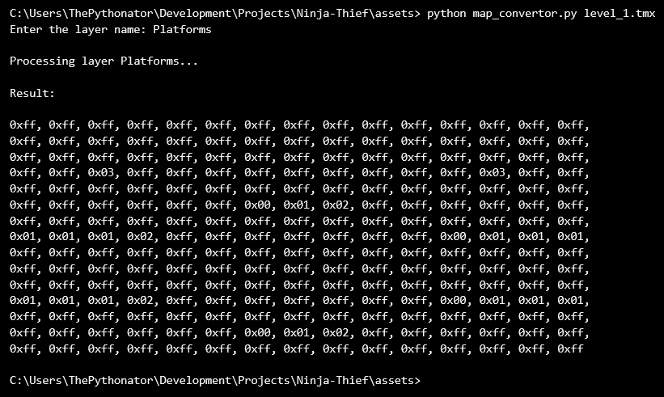
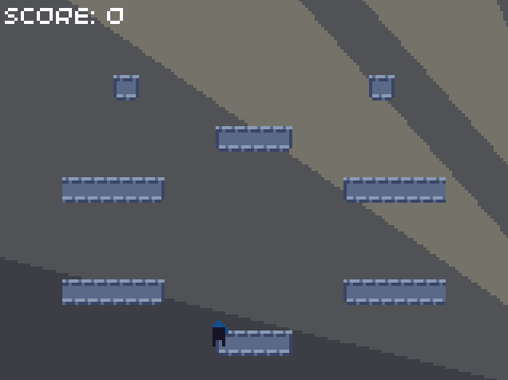
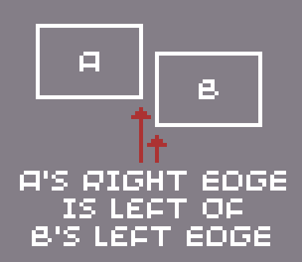
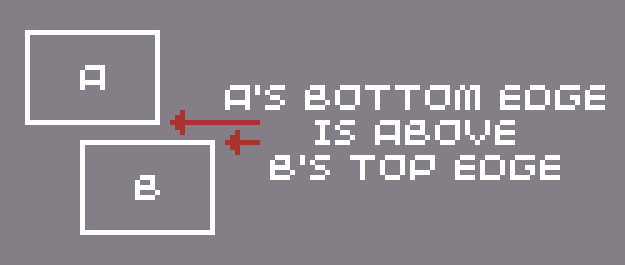
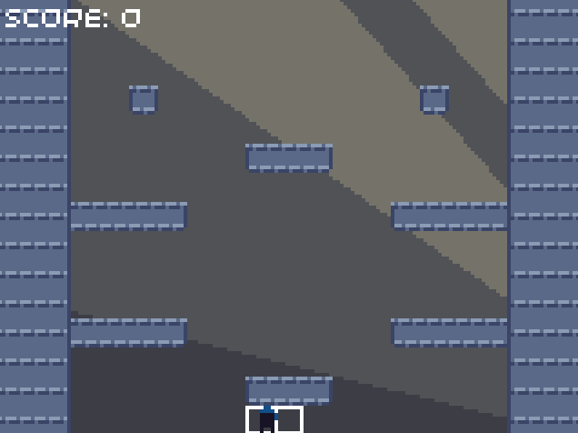
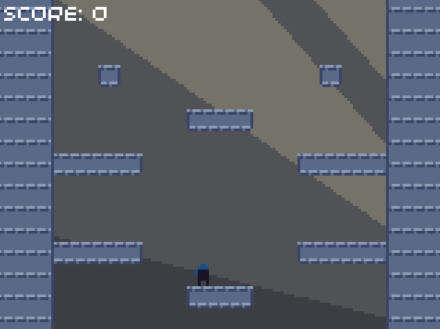

# Episode 3: Adding levels and platforms

## Summary

In this episode, we'll add the ability to load and render a level. After that, we will examine the steps involved in handling physics, and we will make our platforms collidable.

## Storing levels

Before we can draw a level to the screen, we need to store the layout of the level. For now, we only need to store the platform tiles, but we will create a data structure that we can add more fields to later (such as the ladder tile data). We'll call this structure `LevelData`, and add it to our constants file.


```cpp
// constants.hpp, inside Constants namespace

// Game area size in tiles
const uint8_t GAME_WIDTH_TILES = GAME_WIDTH / SPRITE_SIZE;
const uint8_t GAME_HEIGHT_TILES = GAME_HEIGHT / SPRITE_SIZE;

// Level data
struct LevelData {
    // Platform data
    uint8_t platforms[GAME_WIDTH_TILES * GAME_HEIGHT_TILES];
};
```


```cpp
// constants.hpp, inside Constants namespace

// Game area size in tiles
const uint8_t GAME_WIDTH_TILES = GAME_WIDTH / SPRITE_SIZE;
const uint8_t GAME_HEIGHT_TILES = GAME_HEIGHT / SPRITE_SIZE;

// Level data
struct LevelData {
    // Platform data
    uint8_t platforms[GAME_WIDTH_TILES * GAME_HEIGHT_TILES];
};
```


```python
# constants.py

# Game area size in tiles
GAME_WIDTH_TILES = GAME_WIDTH // SPRITE_SIZE
GAME_HEIGHT_TILES = GAME_HEIGHT // SPRITE_SIZE

# Level data
class LevelData:
    def __init__(self, platforms):
        # Platform data
        self.platforms = platforms

    def copy(self):
        return LevelData(self.platforms.copy())
```



> For the Python version, we've added a method to create a copy of this structure. This is because if we assign an existing list to a new variable, both variables will still refer to the same data, meaning that modifying one list will change the other list too. We'll need this method later, as we will eventually be editing copies of our level data during gameplay.

### Adding our level data

The data for our platforms will be stored as an array, with each index representing an 8x8 square on the screen. If a square consists of empty space, we'll use 255 (hex value `0xff`) to represent this. If the square does contain a tile, we'll store the spritesheet index of that tile instead.

> Although we've chosen to use a single-dimensional array, in your own projects, you could use a two-dimensional array instead.

We will store the data for all our levels in a single array, with each item in the array corresponding to a specific level in our game. Each of these items will be an instance of the `LevelData` data structure that we just defined. We'll also need to define the number of levels in our game (just one for now, although we'll add more levels later).


```cpp
// constants.hpp, inside Constants namespace

// Number of levels
const uint8_t LEVEL_COUNT = 1;

const LevelData LEVELS[LEVEL_COUNT] = {
    // Level 1
    {
        // Platform data
        {
            0xff, 0xff, 0xff, 0xff, 0xff, 0xff, 0xff, 0xff, 0xff, 0xff, 0xff, 0xff, 0xff, 0xff, 0xff,
            0xff, 0xff, 0xff, 0xff, 0xff, 0xff, 0xff, 0xff, 0xff, 0xff, 0xff, 0xff, 0xff, 0xff, 0xff,
            0xff, 0xff, 0xff, 0xff, 0xff, 0xff, 0xff, 0xff, 0xff, 0xff, 0xff, 0xff, 0xff, 0xff, 0xff,
            0xff, 0xff, 0x03, 0xff, 0xff, 0xff, 0xff, 0xff, 0xff, 0xff, 0xff, 0xff, 0x03, 0xff, 0xff,
            0xff, 0xff, 0xff, 0xff, 0xff, 0xff, 0xff, 0xff, 0xff, 0xff, 0xff, 0xff, 0xff, 0xff, 0xff,
            0xff, 0xff, 0xff, 0xff, 0xff, 0xff, 0x00, 0x01, 0x02, 0xff, 0xff, 0xff, 0xff, 0xff, 0xff,
            0xff, 0xff, 0xff, 0xff, 0xff, 0xff, 0xff, 0xff, 0xff, 0xff, 0xff, 0xff, 0xff, 0xff, 0xff,
            0x01, 0x01, 0x01, 0x02, 0xff, 0xff, 0xff, 0xff, 0xff, 0xff, 0xff, 0x00, 0x01, 0x01, 0x01,
            0xff, 0xff, 0xff, 0xff, 0xff, 0xff, 0xff, 0xff, 0xff, 0xff, 0xff, 0xff, 0xff, 0xff, 0xff,
            0xff, 0xff, 0xff, 0xff, 0xff, 0xff, 0xff, 0xff, 0xff, 0xff, 0xff, 0xff, 0xff, 0xff, 0xff,
            0xff, 0xff, 0xff, 0xff, 0xff, 0xff, 0xff, 0xff, 0xff, 0xff, 0xff, 0xff, 0xff, 0xff, 0xff,
            0x01, 0x01, 0x01, 0x02, 0xff, 0xff, 0xff, 0xff, 0xff, 0xff, 0xff, 0x00, 0x01, 0x01, 0x01,
            0xff, 0xff, 0xff, 0xff, 0xff, 0xff, 0xff, 0xff, 0xff, 0xff, 0xff, 0xff, 0xff, 0xff, 0xff,
            0xff, 0xff, 0xff, 0xff, 0xff, 0xff, 0x00, 0x01, 0x02, 0xff, 0xff, 0xff, 0xff, 0xff, 0xff,
            0xff, 0xff, 0xff, 0xff, 0xff, 0xff, 0xff, 0xff, 0xff, 0xff, 0xff, 0xff, 0xff, 0xff, 0xff
        }
    }
};
```


```cpp
// constants.hpp, inside Constants namespace

// Number of levels
const uint8_t LEVEL_COUNT = 1;

const LevelData LEVELS[LEVEL_COUNT] = {
    // Level 1
    {
        // Platform data
        {
            0xff, 0xff, 0xff, 0xff, 0xff, 0xff, 0xff, 0xff, 0xff, 0xff, 0xff, 0xff, 0xff, 0xff, 0xff,
            0xff, 0xff, 0xff, 0xff, 0xff, 0xff, 0xff, 0xff, 0xff, 0xff, 0xff, 0xff, 0xff, 0xff, 0xff,
            0xff, 0xff, 0xff, 0xff, 0xff, 0xff, 0xff, 0xff, 0xff, 0xff, 0xff, 0xff, 0xff, 0xff, 0xff,
            0xff, 0xff, 0x03, 0xff, 0xff, 0xff, 0xff, 0xff, 0xff, 0xff, 0xff, 0xff, 0x03, 0xff, 0xff,
            0xff, 0xff, 0xff, 0xff, 0xff, 0xff, 0xff, 0xff, 0xff, 0xff, 0xff, 0xff, 0xff, 0xff, 0xff,
            0xff, 0xff, 0xff, 0xff, 0xff, 0xff, 0x00, 0x01, 0x02, 0xff, 0xff, 0xff, 0xff, 0xff, 0xff,
            0xff, 0xff, 0xff, 0xff, 0xff, 0xff, 0xff, 0xff, 0xff, 0xff, 0xff, 0xff, 0xff, 0xff, 0xff,
            0x01, 0x01, 0x01, 0x02, 0xff, 0xff, 0xff, 0xff, 0xff, 0xff, 0xff, 0x00, 0x01, 0x01, 0x01,
            0xff, 0xff, 0xff, 0xff, 0xff, 0xff, 0xff, 0xff, 0xff, 0xff, 0xff, 0xff, 0xff, 0xff, 0xff,
            0xff, 0xff, 0xff, 0xff, 0xff, 0xff, 0xff, 0xff, 0xff, 0xff, 0xff, 0xff, 0xff, 0xff, 0xff,
            0xff, 0xff, 0xff, 0xff, 0xff, 0xff, 0xff, 0xff, 0xff, 0xff, 0xff, 0xff, 0xff, 0xff, 0xff,
            0x01, 0x01, 0x01, 0x02, 0xff, 0xff, 0xff, 0xff, 0xff, 0xff, 0xff, 0x00, 0x01, 0x01, 0x01,
            0xff, 0xff, 0xff, 0xff, 0xff, 0xff, 0xff, 0xff, 0xff, 0xff, 0xff, 0xff, 0xff, 0xff, 0xff,
            0xff, 0xff, 0xff, 0xff, 0xff, 0xff, 0x00, 0x01, 0x02, 0xff, 0xff, 0xff, 0xff, 0xff, 0xff,
            0xff, 0xff, 0xff, 0xff, 0xff, 0xff, 0xff, 0xff, 0xff, 0xff, 0xff, 0xff, 0xff, 0xff, 0xff
        }
    }
};
```


```python
# constants.py

# Number of levels
LEVEL_COUNT = 1

LEVELS = [
    # Level 1
    LevelData(
        # Platform data
        [
            0xff, 0xff, 0xff, 0xff, 0xff, 0xff, 0xff, 0xff, 0xff, 0xff, 0xff, 0xff, 0xff, 0xff, 0xff,
            0xff, 0xff, 0xff, 0xff, 0xff, 0xff, 0xff, 0xff, 0xff, 0xff, 0xff, 0xff, 0xff, 0xff, 0xff,
            0xff, 0xff, 0xff, 0xff, 0xff, 0xff, 0xff, 0xff, 0xff, 0xff, 0xff, 0xff, 0xff, 0xff, 0xff,
            0xff, 0xff, 0x03, 0xff, 0xff, 0xff, 0xff, 0xff, 0xff, 0xff, 0xff, 0xff, 0x03, 0xff, 0xff,
            0xff, 0xff, 0xff, 0xff, 0xff, 0xff, 0xff, 0xff, 0xff, 0xff, 0xff, 0xff, 0xff, 0xff, 0xff,
            0xff, 0xff, 0xff, 0xff, 0xff, 0xff, 0x00, 0x01, 0x02, 0xff, 0xff, 0xff, 0xff, 0xff, 0xff,
            0xff, 0xff, 0xff, 0xff, 0xff, 0xff, 0xff, 0xff, 0xff, 0xff, 0xff, 0xff, 0xff, 0xff, 0xff,
            0x01, 0x01, 0x01, 0x02, 0xff, 0xff, 0xff, 0xff, 0xff, 0xff, 0xff, 0x00, 0x01, 0x01, 0x01,
            0xff, 0xff, 0xff, 0xff, 0xff, 0xff, 0xff, 0xff, 0xff, 0xff, 0xff, 0xff, 0xff, 0xff, 0xff,
            0xff, 0xff, 0xff, 0xff, 0xff, 0xff, 0xff, 0xff, 0xff, 0xff, 0xff, 0xff, 0xff, 0xff, 0xff,
            0xff, 0xff, 0xff, 0xff, 0xff, 0xff, 0xff, 0xff, 0xff, 0xff, 0xff, 0xff, 0xff, 0xff, 0xff,
            0x01, 0x01, 0x01, 0x02, 0xff, 0xff, 0xff, 0xff, 0xff, 0xff, 0xff, 0x00, 0x01, 0x01, 0x01,
            0xff, 0xff, 0xff, 0xff, 0xff, 0xff, 0xff, 0xff, 0xff, 0xff, 0xff, 0xff, 0xff, 0xff, 0xff,
            0xff, 0xff, 0xff, 0xff, 0xff, 0xff, 0x00, 0x01, 0x02, 0xff, 0xff, 0xff, 0xff, 0xff, 0xff,
            0xff, 0xff, 0xff, 0xff, 0xff, 0xff, 0xff, 0xff, 0xff, 0xff, 0xff, 0xff, 0xff, 0xff, 0xff
        ]
    )
]
```



> If you want to edit the level, you can add/remove platforms by changing the values in the array.

### Generating the level data

> *This section can be skipped if needed, as it only provides additional information on how the level data was generated.*

Editing each value individually in the level data arrays is tedious, which is why level editors (such as [Tiled](https://www.mapeditor.org/)) are often used. To make editing our levels easier, this [Python script](TODO: link: e.g. https://github.com/ThePythonator/Ninja-Thief/blob/main/assets/map_convertor.py - but this repo is private - create tools dir in *this* repo???) can be used, which takes the csv data stored in a `.tmx` file and converts it to the format used in this game, ready to be pasted into the array. This allows the levels to be created and edited in Tiled, and the new data added to the constants file with minimal effort.

In order to use the Python script, the `pytmx` library must be installed:

```
python3 -m pip install pytmx
```

> If this doesn't work, try using `python` instead of `python3` (also make sure that you have Python 3 installed!)

To run the script, you need to provide it with the path to the `.tmx` file:


```
python3 map_convertor.py path/to/map_file.tmx 
```


```
./map_convertor.py path/to/map_file.tmx 
```



You will then be prompted to enter the name of the layer which will be converted (this isn't case-sensitive). If you are modifying the pre-existing level files, the layer name should be one of:

* `Entity Spawns`
* `Extras`
* `Platforms`
* `Pipes`

> If you want to add extra levels, it's recommended that you copy a pre-existing level file, to use as a template.

The program will then output the data in a comma-separated format which can be pasted directly into your code (the data will not include the surrounding brackets).

The complete program dialogue might look something like this:



## The `level` class

In our game, we will delegate most of the actual game handling to a new class called `Level`. This class will store and keep track of the player and any enemies, and will render the tiles which comprise the current level. The constructor will take a level number, so that the corresponding level data can be fetched from our constants file.

Currently the `PlayerNinja` class is instantiated and handled within `ninja_thief.cpp` (or `ninja_thief.py`). We will move this code into our new `Level` class, because the player will be reset each time a new level is started. We'll also move the code which draws our placeholder score text into the `render` function of our new class.

Create a new file in `include/` called `level.hpp` (or `level.py`), with the following code:


```cpp
// level.hpp

#pragma once

#include <string>

#include "32blit.hpp"

#include "player_ninja.hpp"
#include "constants.hpp"

class Level {
public:
    Level();
    Level(uint8_t _level_number);

    void update(float dt);
    void render();

private:
    Constants::LevelData level_data = {};
    uint8_t level_number = 0;

    PlayerNinja player;
};
```


```cpp
// level.hpp

#pragma once

#include <string>

#include "picosystem.hpp"

#include "player_ninja.hpp"
#include "constants.hpp"

class Level {
public:
    Level();
    Level(uint8_t _level_number);

    void update(float dt);
    void render();

private:
    Constants::LevelData level_data = {};
    uint8_t level_number = 0;

    PlayerNinja player;
};
```


```python
# level.py

from player_ninja import PlayerNinja
import constants as Constants

class Level:
    def __init__(self, level_number):
        self.level_number = level_number
        self.level_data = Constants.LEVELS[level_number].copy()

        # Temporary player object for testing
        self.player = PlayerNinja(50, 50)

    def update(self, dt):
        # Update the player
        self.player.update(dt)

    def render(self):
        # Render the player
        self.player.render()
    
        # Set the text colour to white
        pen(15, 15, 15)

        # Render the placeholder score text
        text("Score: 0", 2, 2)
```



> The Python code uses the `copy` method we defined earlier, so that the `level_data` attribute is a true copy of the data, and not just a reference to an item in the `LEVELS` list defined in our constants file.

If you're using C++, you also need to create a new file in `src/` called `level.cpp`, where we will define our member functions:


```cpp
// level.cpp

#include "level.hpp"

using namespace blit;

Level::Level() {

}

Level::Level(uint8_t _level_number) {
    level_number = _level_number;
    level_data = Constants::LEVELS[level_number];

    // Temporary player object for testing
    player = PlayerNinja(50, 50);
}

void Level::update(float dt) {
    // Update player
    player.update(dt);
}

void Level::render() {
    // Render the player
    player.render();
    
    // Set the text colour to white
    screen.pen = Pen(255, 255, 255);

    // Render the placeholder score text
    screen.text("Score: 0", minimal_font, Point(2, 2));
}
```


```cpp
// level.cpp

#include "level.hpp"

using namespace picosystem;

Level::Level() {

}

Level::Level(uint8_t _level_number) {
    level_number = _level_number;
    level_data = Constants::LEVELS[level_number];

    // Temporary player object for testing
    player = PlayerNinja(50, 50);
}

void Level::update(float dt) {
    // Update player
    player.update(dt);
}

void Level::render() {
    // Render the player
    player.render();
    
    // Set the text colour to white
    pen(15, 15, 15);

    // Render the placeholder score text
    text("Score: 0", 2, 2);
}
```



### Tidying up

Since the creation, updating, and rendering of our `PlayerNinja` instance is handled in the `Level` class, we can remove the corresponding lines in `ninja_thief.cpp` (or `ninja_thief.py`). We will then replace these lines with calls to create, update, and render an instance of our `Level` class.

We can also remove the placeholder score text, as it has also been moved into our `Level` class.

Your `ninja_thief.cpp` (or `ninja_thief.py`) file should now look like this:


```cpp
// ninja_thief.cpp

#include "ninja_thief.hpp"

using namespace blit;

// Our global variables are defined here
Surface* background = nullptr;

float last_time = 0.0f;

Level level;

// Setup the game
void init() {
    // Set the resolution to 160x120
    set_screen_mode(ScreenMode::lores);

    // Load the background from assets.cpp
    background = Surface::load(asset_background);

    // Load the spritesheet from assets.cpp
    Surface* spritesheet = Surface::load(asset_spritesheet);

    // Set the current spritesheet to the one we just loaded
    screen.sprites = spritesheet;

    // Load the first level
    level = Level(0);
}

// Update the game
void update(uint32_t time) {
    // Calculate change in time (in seconds) since last frame
    float dt = (time - last_time) / 1000.0f;
    last_time = time;

    // Limit dt
    if (dt > 0.05f) {
        dt = 0.05f;
    }

    // Update level
    level.update(dt);
}

// Render the game
void render(uint32_t time) {
    // Clear the screen
    screen.pen = Pen(0, 0, 0);
    screen.clear();

    // Draw the entire background image onto the screen at (0, 0)
    screen.blit(background, Rect(0, 0, Constants::SCREEN_WIDTH, Constants::SCREEN_HEIGHT), Point(0, 0));

    // Render the level
    level.render();
}
```


```cpp
// ninja_thief.cpp

#include "ninja_thief.hpp"

using namespace picosystem;

// Our global variables are defined here
buffer_t* background = nullptr;

float last_time = 0.0f;

Level level;

// Setup the game
void init() {
    // Load the spritesheet
    buffer_t* sprites = buffer(Constants::SPRITESHEET_WIDTH, Constants::SPRITESHEET_HEIGHT, asset_spritesheet);

    // Set the current spritesheet to the one we just loaded
    spritesheet(sprites);

    // Load the background
    background = buffer(Constants::SCREEN_WIDTH, Constants::SCREEN_HEIGHT, asset_background);

    // Load the first level
    level = Level(0);
}

// Update the game
void update(uint32_t tick) {
    // Calculate change in time (in seconds) since last frame
    // The time() function returns the time in milliseconds since the device started
    float dt = (time() - last_time) / 1000.0f;
    last_time = time();

    // Limit dt
    if (dt > 0.05f) {
        dt = 0.05f;
    }

    // Update level
    level.update(dt);
}

// Render the game
void draw(uint32_t tick) {
    // Clear the screen
    pen(0, 0, 0);
    clear();

    // Draw the entire background image onto the screen at (0, 0)
    blit(background, 0, 0, Constants::SCREEN_WIDTH, Constants::SCREEN_HEIGHT, 0, 0);

    // Render the level
    level.render();
}
```


```python
# ninja_thief.py

from time import ticks_ms, ticks_diff

import constants as Constants
from player_ninja import PlayerNinja
from level import Level

# Perform any initialisation here, at the start of the file

last_time = 0

# Load the first level
level = Level(0)

# Load the spritesheet
sprites = Buffer(Constants.SPRITESHEET_WIDTH, Constants.SPRITESHEET_HEIGHT, "assets/spritesheet.16bpp")

# Set the current spritesheet to the one we just loaded
spritesheet(sprites)

# Load the background
background = Buffer(Constants.SCREEN_WIDTH, Constants.SCREEN_HEIGHT, "assets/background.16bpp")

# Update the game
def update(tick):
    global last_time

    # Calculate change in time (in seconds) since last frame
    # The ticks_diff() function calculates the number of milliseconds between the two times measured
    dt = ticks_diff(ticks_ms(), last_time) / 1000
    last_time = ticks_ms()

    # Limit dt
    if dt > 0.05:
        dt = 0.05

    # Update the level
    level.update(dt)

# Render the game
def draw(tick):
    # Clear the screen
    pen(0, 0, 0)
    clear()

    # Draw the entire background image onto the screen at (0, 0)
    blit(background, 0, 0, Constants.SCREEN_WIDTH, Constants.SCREEN_HEIGHT, 0, 0)

    # Render the player
    level.render()

# Enter the main game loop
start()
```



We won't need to modify this file for quite a while, since most of our work will be in the `Level` and `Ninja` classes.

If you are using C++, you need to include the new `level.hpp` header file in `ninja_thief.hpp`, as well as remove the temporary include of the `player_ninja.hpp` file. Your `ninja_thief.hpp` file should now look like this:


```cpp
#include "32blit.hpp"

#include "constants.hpp"
#include "level.hpp"

#include "assets.hpp"
```



```cpp
#include "picosystem.hpp"

#include "constants.hpp"
#include "level.hpp"

#include "assets.hpp"
```



### Rendering the level

Currently, our platform tile indices are stored in `level_data.platforms` in the `Level` class, so we can iterate through this array to get the index of each tile we need to render. We use 255 (hex value `0xff`) as the value representing a blank tile, so we'll need to add this to our constants file:


```cpp
// constants.hpp, inside Constants namespace

// Add our new constant variable at the end of the pre-existing Sprites namespace
namespace Sprites {
    // ...

    // A blank tile is represented by 0xff in the level arrays
    const uint8_t BLANK_TILE = 0xff;
}
```


```cpp
// constants.hpp, inside Constants namespace

// Add our new constant variable at the end of the pre-existing Sprites namespace
namespace Sprites {
    // ...

    // A blank tile is represented by 0xff in the level arrays
    const uint8_t BLANK_TILE = 0xff;
}
```


```python
# constants.py

# Add our new constant variable at the end of the pre-existing Sprites class
class Sprites:
    # ...

    # A blank tile is represented by 0xff in the level arrays
    BLANK_TILE = 0xff
```



Our `platforms` array is one-dimensional, so we need to convert an point `(x, y)` into an index in this array. We can do this using the formula:

$$index = y \times width + x$$

The `width` variable must be measured in tile units, instead of pixels, so we will use the `GAME_WIDTH_TILES` constant that we defined earlier.

We have all the constants we need, so we can add our rendering code to the start of the `render` function in our `Level` class:


```cpp
// level.cpp, at the start of the render function

// Render platform tiles
for (uint8_t y = 0; y < Constants::GAME_HEIGHT_TILES; y++) {
    for (uint8_t x = 0; x < Constants::GAME_WIDTH_TILES; x++) {

        // Calculate tile index
        uint8_t tile_id = level_data.platforms[y * Constants::GAME_WIDTH_TILES + x];

        // Only render the tile if it isn't a blank tile
        if (tile_id != Constants::Sprites::BLANK_TILE) {
            // Offset the tiles since the 32blit version has borders on the screen
            screen.sprite(tile_id, Point(x * Constants::SPRITE_SIZE + Constants::GAME_OFFSET_X, y * Constants::SPRITE_SIZE + Constants::GAME_OFFSET_Y));
        }
    }
}
```


```cpp
// level.cpp, at the start of the render function

// Render platform tiles
for (uint8_t y = 0; y < Constants::GAME_HEIGHT_TILES; y++) {
    for (uint8_t x = 0; x < Constants::GAME_WIDTH_TILES; x++) {

        // Calculate tile index
        uint8_t tile_id = level_data.platforms[y * Constants::GAME_WIDTH_TILES + x];

        // Only render the tile if it isn't a blank tile
        if (tile_id != Constants::Sprites::BLANK_TILE) {
                sprite(tile_id, x * Constants::SPRITE_SIZE + Constants::GAME_OFFSET_X, y * Constants::SPRITE_SIZE + Constants::GAME_OFFSET_Y);
            }
    }
}
```


```python
# level.py, at the start of the render function

# Render platform tiles
for y in range(Constants.GAME_HEIGHT_TILES):
    for x in range(Constants.GAME_WIDTH_TILES):
        
        # Calculate tile index
        tile_id = self.level_data.platforms[y * Constants.GAME_WIDTH_TILES + x]

        # Only render the tile if it isn't a blank tile
        if tile_id != Constants.Sprites.BLANK_TILE:
            sprite(tile_id, x * Constants.SPRITE_SIZE + Constants.GAME_OFFSET_X, y * Constants.SPRITE_SIZE + Constants.GAME_OFFSET_Y)
```



When you run the code, the player should behave as before, but the platform tiles are now present:



### Adding borders

> *This section is only for 32blit users - if you are developing for PicoSystem, you can skip this.*

The 32blit has a wider screen than the PicoSystem, so we have to add borders in order to keep the main game area the same, to keep the tutorial as similar as possible for both devices.

> If you were writing a game which is designed for 32blit only, you could use the full screen width for the game area. In addition, some games (particularly ones with scrolling graphics) work well on both 32blit and PicoSystem without needing borders or different level layouts for each device.

We will create a new method in the `Level` class where we can put our border-rendering code:

```cpp
// level.hpp

// ...

class Level {
public:
    // ...

private:
    void render_border();

    // ...
};
```

> This method can be created under the `private` access specifier, because we will only ever call it within the `render` method of the `Level` class (it shouldn't be part of the visible class interface).

In the definition of `render_border`, we will draw two `BORDER_FULL` sprites on each side, along with a `BORDER_LEFT` and `BORDER_RIGHT` sprite on the corresponding sides. This will fill in the gap between the edge of the screen and the edge of the game area.

```cpp
// level.cpp

void Level::render_border() {
    // Render border (only needed for 32blit, with the wider screen)

    // Each row is the same
    for (uint8_t y = 0; y < Constants::SCREEN_HEIGHT; y += Constants::SPRITE_SIZE) {
        // Left border:
        uint8_t x = 0;

        // BORDER_FULL sprites
        while (x < Constants::GAME_OFFSET_X - Constants::SPRITE_SIZE) {
            screen.sprite(Constants::Sprites::BORDER_FULL, Point(x, y));
            x += Constants::SPRITE_SIZE;
        }

        // BORDER_LEFT sprite
        screen.sprite(Constants::Sprites::BORDER_LEFT, Point(x, y));

        // Right border:
        x = Constants::SCREEN_WIDTH;
        
        // BORDER_FULL sprites
        while (x > Constants::SCREEN_WIDTH - Constants::GAME_OFFSET_X) {
            screen.sprite(Constants::Sprites::BORDER_FULL, Point(x, y));
            x -= Constants::SPRITE_SIZE;
        }
        
        // BORDER_RIGHT sprite
        screen.sprite(Constants::Sprites::BORDER_RIGHT, Point(x, y));
    }
}
```

Finally, we can call this new method from the `render` method in `level.cpp`:

```cpp
// level.cpp

void Level::render() {
    // Render border
    render_border();

    // ...
}
```

When running the updated code, borders should now be displayed on either side:


## Handling physics

Video game physics can be split up into two steps: collision detection, and then collision resolution. Collision detection involves calculating *whether* two objects are colliding, while collision resolution moves the objects so that they are *no longer* colliding.

We will add a function to the `Ninja` class which will handle the collision detection and resolution. It will calculate the tiles which the player *could* be colliding with, before calling functions to handle platform, ladder, and coin/gem collisions for each of these tiles (we will leave out the ladder and coin/gem functions for now). These functions will all require the information stored in `level_data` in the `Level` class, so we will need to modify the signature of several `update` functions in order to pass this data in as a parameter.

Firstly, we will add the empty `handle_collisions` and `handle_platform` functions in the `Ninja` class:


```cpp
// ninja.hpp

class Ninja {
public:
    // ...

protected:
    // ...

private:
    void handle_collisions(Constants::LevelData& level_data);
    void handle_platform(Constants::LevelData& level_data, uint8_t x, uint8_t y);
};
```


```cpp
// ninja.hpp

class Ninja {
public:
    // ...

protected:
    // ...

private:
    void handle_collisions(Constants::LevelData& level_data);
    void handle_platform(Constants::LevelData& level_data, uint8_t x, uint8_t y);
};
```


```python
# ninja.py

class Ninja:
    # ...

    def handle_collisions(self, level_data):
        pass

    def handle_platform(self, level_data, x, y):
        pass
```



If you are using C++, you will also need to add the empty function definitions in the source file:

```cpp
// ninja.cpp

void Ninja::handle_collisions(Constants::LevelData& level_data) {

}

void Ninja::handle_platform(Constants::LevelData& level_data, uint8_t x, uint8_t y) {

}
```

> For the C++ code, we pass `level_data` by reference instead of by value, because it is a large data structure and we want to avoid copying it unnecessarily. If you pass a value by reference and do not intend to modify it, it is good practice to pass it as a constant reference (using the `const` keyword), so that accidental modification is prevented. We do not want to pass `level_data` as a constant reference, because we will need to edit it when the player collects coins (we will remove the coins from the level once they are collected).

We now need to update the parameters of any functions which call these new functions, to provide access to `level_data`:


```cpp
// In ninja.hpp and player_ninja.hpp
// In ninja.cpp and player_ninja.cpp

// Modify the update function declaration and definition to have the following signature:
void update(float dt, Constants::LevelData& level_data);

// In player_ninja.cpp, in the update function

// Replace:
Ninja::update(dt);
// With:
Ninja::update(dt, level_data);

// In level.cpp, in the update function

// Replace:
player.update(dt);
// With:
player.update(dt, level_data);
```


```cpp
// In ninja.hpp and player_ninja.hpp
// In ninja.cpp and player_ninja.cpp

// Modify the update function declaration and definition to have the following signature:
void update(float dt, Constants::LevelData& level_data);

// In player_ninja.cpp, in the update function

// Replace:
Ninja::update(dt);
// With:
Ninja::update(dt, level_data);

// In level.cpp, in the update function

// Replace:
player.update(dt);
// With:
player.update(dt, level_data);
```


```python
# In ninja.py and player_ninja.py

# Modify the update function definition to have the following signature:
update(dt, level_data)

# In player_ninja.py, in the update function

# Replace:
super().update(dt)
# With:
super().update(dt, level_data)

# In level.py, in the update function

# Replace:
self.player.update(dt)
# With:
self.player.update(dt, self.level_data)
```



> If you are using C++, make sure that you modify the `update` function parameters in the source files as well as the header files.

Finally, we can call the (empty) collision handling code from the `update` function in the `Ninja` class. The function should now look like this:


```cpp
// ninja.cpp

void Ninja::update(float dt, Constants::LevelData& level_data) {
    // Apply gravity
    velocity_y += Constants::Environment::GRAVITY_ACCELERATION * dt;

    // Move the ninja
    position_x += velocity_x * dt;
    position_y += velocity_y * dt;

    // Detect and resolve any collisions with platforms, ladders, coins etc
    handle_collisions(level_data);

    // Update direction the ninja is facing (only if the ninja is moving)
    if (velocity_x < 0.0f) {
        facing_direction = HorizontalDirection::LEFT;
    }
    else if (velocity_x > 0.0f) {
        facing_direction = HorizontalDirection::RIGHT;
    }
}
```


```cpp
// ninja.cpp

void Ninja::update(float dt, Constants::LevelData& level_data) {
    // Apply gravity
    velocity_y += Constants::Environment::GRAVITY_ACCELERATION * dt;

    // Move the ninja
    position_x += velocity_x * dt;
    position_y += velocity_y * dt;

    // Detect and resolve any collisions with platforms, ladders, coins etc
    handle_collisions(level_data);

    // Update direction the ninja is facing (only if the ninja is moving)
    if (velocity_x < 0.0f) {
        facing_direction = HorizontalDirection::LEFT;
    }
    else if (velocity_x > 0.0f) {
        facing_direction = HorizontalDirection::RIGHT;
    }
}
```


```python
# ninja.py

def update(self, dt, level_data):
    # Apply gravity
    self.velocity_y += Constants.Environment.GRAVITY_ACCELERATION * dt

    # Move the ninja
    self.position_y += self.velocity_y * dt
    self.position_x += self.velocity_x * dt

    # Detect and resolve any collisions with platforms, ladders, coins etc
    self.handle_collisions(level_data)

    # Update direction the ninja is facing (only if the player is moving)
    if self.velocity_x < 0:
        self.facing_direction = Ninja.HorizontalDirection.LEFT

    elif self.velocity_x > 0:
        self.facing_direction = Ninja.HorizontalDirection.RIGHT
```



### Collision detection

In our game, we can make collision detection simpler by approximating the player and platform tiles as rectangles. This means we only need to know how to check if two rectangles are intersecting.

In order to determine if two rectangles (A and B) are intersecting, we can ensure none of the following are true:

* A's left edge is to the right of B's right edge
* B's left edge is to the right of A's right edge
* A's top edge is below B's bottom edge
* B's top edge is below A's bottom edge

If either of the first two constraints are true, the rectangles would look something like this:



If either of the last two constraints are true, the rectangles would look something like this:



The coordinates of each object in our game represents the top left corner of the 8x8 sprite used for rendering. For platform tiles, this means we can simply get the right edge position with `tile_x + SPRITE_SIZE` and the bottom edge position with `tile_y + SPRITE_SIZE` (the left and top edges are just `tile_x` and `tile_y` respectively).

For the ninja sprite, it is slightly more complex, because the sprite does not fill the entire width of the 8x8 square. The height is the same, so the top edge position is given by `position_y`, and the bottom edge is given by `position_y + SPRITE_SIZE`. For the width, we must know the visible width of the ninja sprite (which is 4px). With this, we can calculate the number of pixels on each side, between the edge of the sprite square and the edge of the actual ninja image. We will create two new constants called `WIDTH` and `BORDER`, with which we can calculate the left and right edges of the ninja's rectangle. The left edge is given by `position_y + BORDER`, and the right edge is given by `position_y + BORDER + WIDTH`.

We will add these constants inside a new namespace (or class in Python) called `Ninja`:


```cpp
// constants.hpp, inside Constants namespace

// Generic ninja data such as size
namespace Ninja {
    // The visible width of the ninja sprite
    const uint8_t WIDTH = 4;

    // The gap between the edge of the sprite and the edge of the ninja on each side
    const uint8_t BORDER = (SPRITE_SIZE - WIDTH) / 2;
}
```


```cpp
// constants.hpp, inside Constants namespace

// Generic ninja data such as size
namespace Ninja {
    // The visible width of the ninja sprite
    const uint8_t WIDTH = 4;

    // The gap between the edge of the sprite and the edge of the ninja on each side
    const uint8_t BORDER = (SPRITE_SIZE - WIDTH) / 2;
}
```


```python
# constants.py

# Generic ninja data such as size
class Ninja:
    # The visible width of the ninja sprite
    WIDTH = 4

    # The gap between the edge of the sprite and the edge of the ninja on each side
    BORDER = (SPRITE_SIZE - WIDTH) // 2
```



We can calculate the location of each edge of a tile and a ninja sprite, so we could write a function which checks for a collision between these two objects. However, we will also need to detect collisions between the player and the coins later on, so we will make the function more generic by taking a parameter specifying the width of the square to check for a collision with.

This means that our collision detection function will perform the following check:

```python
position_x + Constants.Ninja.BORDER + Constants.Ninja.WIDTH > object_x and
position_x + Constants.Ninja.BORDER < object_x + object_size and
position_y + Constants.SPRITE_SIZE > object_y and
position_y < object_y + object_size
```

The new function will be added to our `Ninja` class:


```cpp
// ninja.hpp

// ...

class Ninja {
public:
    // ...

    bool check_colliding(float object_x, float object_y, uint8_t object_size);

protected:
    // ...
};
```


```cpp
// ninja.hpp

// ...

class Ninja {
public:
    // ...

    bool check_colliding(float object_x, float object_y, uint8_t object_size);

protected:
    // ...
};
```


```python
# ninja.py

# ...

class Ninja:
    # ...
    
    def check_object_colliding(self, object_x, object_y, object_size):
        return (self.position_x + Constants.SPRITE_SIZE - Constants.Ninja.BORDER > object_x and
                self.position_x + Constants.Ninja.BORDER < object_x + object_size and
                self.position_y + Constants.SPRITE_SIZE > object_y and
                self.position_y < object_y + object_size)
```



> In C++, you can use overloading to define multiple functions with the same name, but different parameters. Although our collision detection function will assume that objects are square, you could also write an overloaded version which takes the width and height of the other object.
>
> We will use this feature when we define a collision detection function between two Ninja instances. Python doesn't directly allow overloading of functions, so we must name our functions slightly differently instead (`check_object_colliding` and `check_ninja_colliding`).

If you are using C++, you will also need to add the function definition in the source file:

```cpp
// ninja.cpp

bool Ninja::check_colliding(float object_x, float object_y, uint8_t object_size) {
    return (position_x + Constants::SPRITE_SIZE - Constants::Ninja::BORDER > object_x &&
            position_x + Constants::Ninja::BORDER < object_x + object_size &&
            position_y + Constants::SPRITE_SIZE > object_y &&
            position_y < object_y + object_size);
}
```

In order to determine which tiles the player is colliding with, we could iterate through every tile in the `level_data.platforms` array and call our `check_colliding` function. However, a much more efficient approach is to only check the four tiles surrounding the player's position.

The position of the top left of these four tiles can be calculated by dividing the player's position by the tile width and rounding down the result. The other three tile positions can then be calculated by looking at the tiles one block down and to the right of the top left tile. The following visualisation demonstrates which tiles will be tested for a collision:



When the player is near the edge of the game area, we must ensure that we do not try to access tiles which do not exist. Our code will be added to the `handle_collisions` method in the `Ninja` class. It checks that the visible player image is within the game area, and if they are at the edge, it only checks the tiles which are within the game area:


```cpp
// ninja.cpp

void Ninja::handle_collisions(Constants::LevelData& level_data) {
    // Get position of ninja in "grid" of tiles
    // We're relying on converting to integers to truncate and hence round down
    uint8_t x = position_x / Constants::SPRITE_SIZE;
    uint8_t y = position_y / Constants::SPRITE_SIZE;

    // Check the four tiles which the ninja might be colliding with (the top left tile is marked by the x and y previously calculated)

    // We need to check that the player is within the game area
    // If they aren't, we don't need to worry about checking for collisions
    if (x < Constants::GAME_WIDTH_TILES && y < Constants::GAME_HEIGHT_TILES && position_x >= -Constants::Ninja::BORDER && position_y >= -Constants::SPRITE_SIZE) {

        // It's possible the ninja is near the edge of the screen and we could end up checking tiles which don't exist (off the edge of the screen)
        // To avoid this issue, we use the ternary operator to vary the maximum x and y offsets
        // The minimum offset is handled by the trucation, since it will round up (rather than down) if the value is negative
        for (uint8_t y_offset = 0; y_offset < (y == Constants::GAME_HEIGHT_TILES - 1 ? 1 : 2); y_offset++) {

            for (uint8_t x_offset = 0; x_offset < (x == Constants::GAME_WIDTH_TILES - 1 ? 1 : 2); x_offset++) {

                // Calculate grid position of this tile
                uint8_t new_x = x + x_offset;
                uint8_t new_y = y + y_offset;

                // Handle platforms
                handle_platform(level_data, new_x, new_y);
            }
        }
    }
}
```


```cpp
// ninja.cpp

void Ninja::handle_collisions(Constants::LevelData& level_data) {
    // Get position of ninja in "grid" of tiles
    // We're relying on converting to integers to truncate and hence round down
    uint8_t x = position_x / Constants::SPRITE_SIZE;
    uint8_t y = position_y / Constants::SPRITE_SIZE;

    // Check the four tiles which the ninja might be colliding with (the top left tile is marked by the x and y previously calculated)

    // We need to check that the player is within the game area
    // If they aren't, we don't need to worry about checking for collisions
    if (x < Constants::GAME_WIDTH_TILES && y < Constants::GAME_HEIGHT_TILES && position_x >= -Constants::Ninja::BORDER && position_y >= -Constants::SPRITE_SIZE) {

        // It's possible the ninja is near the edge of the screen and we could end up checking tiles which don't exist (off the edge of the screen)
        // To avoid this issue, we use the ternary operator to vary the maximum x and y offsets
        // The minimum offset is handled by the trucation, since it will round up (rather than down) if the value is negative
        for (uint8_t y_offset = 0; y_offset < (y == Constants::GAME_HEIGHT_TILES - 1 ? 1 : 2); y_offset++) {

            for (uint8_t x_offset = 0; x_offset < (x == Constants::GAME_WIDTH_TILES - 1 ? 1 : 2); x_offset++) {

                // Calculate grid position of this tile
                uint8_t new_x = x + x_offset;
                uint8_t new_y = y + y_offset;
                
                // Handle platforms
                handle_platform(level_data, new_x, new_y);
            }
        }
    }
}
```


```python
# ninja.py

def handle_collisions(self, level_data):
    # Get position of ninja in "grid" of tiles
    # We're relying on converting to integers to truncate and hence round down
    x = int(self.position_x // Constants.SPRITE_SIZE)
    y = int(self.position_y // Constants.SPRITE_SIZE)

    # We need to check that the player is within the game area
    # If they aren't, we don't need to worry about checking for collisions
    if x < Constants.GAME_WIDTH_TILES and y < Constants.GAME_HEIGHT_TILES and self.position_x >= -Constants.Ninja.BORDER and self.position_y >= -Constants.SPRITE_SIZE:

        # It's possible the ninja is near the edge of the screen and we could end up checking tiles which don't exist (off the edge of the screen)
        # To avoid this issue, we use the ternary operator to vary the maximum x and y offsets
        # The minimum offset is handled by the trucation, since it will round up (rather than down) if the value is negative
        for y_offset in range(1 if y == Constants.GAME_HEIGHT_TILES - 1 else 2):

            for x_offset in range(1 if x == Constants.GAME_WIDTH_TILES - 1 else 2):

                # Calculate grid position of this tile
                new_x = x + x_offset
                new_y = y + y_offset

                # Handle platforms
                self.handle_platform(level_data, new_x, new_y)
```



In the `handle_platform` function, we will need to calculate the actual position of the tile (the function receives the grid position), by multiplying the grid position by `SPRITE_SIZE`. We can then pass this position to our `check_colliding` (or `check_object_colliding`) function, in order to determine if the collision resolution code should be called. We will also check that the tile is not an empty tile by fetching the tile's sprite index from `level_data.platforms`.

Our `handle_platform` function in the `Ninja` class should now look like this:


```cpp
// ninja.cpp

void Ninja::handle_platform(Constants::LevelData& level_data, uint8_t x, uint8_t y) {
    // Get tile's sprite index from level data
    uint8_t tile_id = level_data.platforms[y * Constants::GAME_WIDTH_TILES + x];

    // Check the tile actually exists (check that it isn't blank)
    if (tile_id != Constants::Sprites::BLANK_TILE) {

        // Calculate the actual position of the tile from the grid position
        float tile_x = x * Constants::SPRITE_SIZE;
        float tile_y = y * Constants::SPRITE_SIZE;

        // Check if the ninja is colliding with the tile
        if (check_colliding(tile_x, tile_y, Constants::SPRITE_SIZE)) {
            // Our collision resolution code will be put here
        }
    }
}
```


```cpp
// ninja.cpp

void Ninja::handle_platform(Constants::LevelData& level_data, uint8_t x, uint8_t y) {
    // Get tile's sprite index from level data
    uint8_t tile_id = level_data.platforms[y * Constants::GAME_WIDTH_TILES + x];

    // Check the tile actually exists (check that it isn't blank)
    if (tile_id != Constants::Sprites::BLANK_TILE) {

        // Calculate the actual position of the tile from the grid position
        float tile_x = x * Constants::SPRITE_SIZE;
        float tile_y = y * Constants::SPRITE_SIZE;

        // Check if the ninja is colliding with the tile
        if (check_colliding(tile_x, tile_y, Constants::SPRITE_SIZE)) {
            // Our collision resolution code will be put here
        }
    }
}
```


```python
# ninja.py

def handle_platform(self, level_data, x, y):
    # Get tile's sprite index from level data
    tile_id = level_data.platforms[y * Constants.GAME_WIDTH_TILES + x]

    # Check the tile actually exists (check that it isn't blank)
    if tile_id != Constants.Sprites.BLANK_TILE:

        # Calculate the actual position of the tile from the grid position
        tile_x = x * Constants.SPRITE_SIZE
        tile_y = y * Constants.SPRITE_SIZE

        # Check if the ninja is colliding with the tile
        if self.check_object_colliding(tile_x, tile_y, Constants.SPRITE_SIZE):
            # Our collision resolution code will be put here
            pass
```



> In this tutorial, the term "grid position" refers to the position of a tile in the 15x15 grid of possible tile positions. It is measured in tiles, rather than pixels - in order to convert it into the "actual position" of the tile (measured in pixels), we multiple it by the width of a tile in pixels (`SPRITE_SIZE`).

We have now written all the collision detection code we will need, and we can move on to the exciting bit - collision resolution! However, if you want to see your code working now, you could always add a print statement where the collision resolution code will go, to check that collisions are being detected at the right times.

### Collision resolution

Collision resolution is one of the areas of game development which can cause the most problems for programmers. Game physics is always a trade-off between accuracy and efficiency, and often it is necessary to find a solution which is "good enough" for the specific situation, rather than perfect. For this game, we will use a position-based algorithm because of its simplicity and speed.

Before we get started on resolving collisions with our platforms, we will begin with a much simpler collision detection and resolution problem: stopping the player from walking off the sides of the game area. If the left edge of the player is past the left edge of the game area, we can set `position_x` so that the left edge of the player lies on the left edge of the game area. We can then do a similar check for the right edge.

We will add this code to the `update` function in the `Ninja` class. The function should now look like this:


```cpp
// ninja.cpp

void Ninja::update(float dt, Constants::LevelData& level_data) {
    // Apply gravity
    velocity_y += Constants::Environment::GRAVITY_ACCELERATION * dt;

    // Move the ninja
    position_x += velocity_x * dt;
    position_y += velocity_y * dt;

    // Don't allow ninja to go off the sides
    if (position_x < -Constants::Ninja::BORDER) {
        position_x = -Constants::Ninja::BORDER;
    }
    else if (position_x > Constants::GAME_WIDTH - Constants::Ninja::BORDER - Constants::Ninja::WIDTH) {
        position_x = Constants::GAME_WIDTH - Constants::Ninja::BORDER - Constants::Ninja::WIDTH;
    }

    // Detect and resolve any collisions with platforms, ladders, coins etc
    handle_collisions(level_data);

    // Update direction the ninja is facing (only if the ninja is moving)
    if (velocity_x < 0.0f) {
        facing_direction = HorizontalDirection::LEFT;
    }
    else if (velocity_x > 0.0f) {
        facing_direction = HorizontalDirection::RIGHT;
    }
}
```


```cpp
// ninja.cpp

void Ninja::update(float dt, Constants::LevelData& level_data) {
    // Apply gravity
    velocity_y += Constants::Environment::GRAVITY_ACCELERATION * dt;

    // Move the ninja
    position_x += velocity_x * dt;
    position_y += velocity_y * dt;

    // Don't allow ninja to go off the sides
    if (position_x < -Constants::Ninja::BORDER) {
        position_x = -Constants::Ninja::BORDER;
    }
    else if (position_x > Constants::GAME_WIDTH - Constants::Ninja::BORDER - Constants::Ninja::WIDTH) {
        position_x = Constants::GAME_WIDTH - Constants::Ninja::BORDER - Constants::Ninja::WIDTH;
    }

    // Detect and resolve any collisions with platforms, ladders, coins etc
    handle_collisions(level_data);

    // Update direction the ninja is facing (only if the ninja is moving)
    if (velocity_x < 0.0f) {
        facing_direction = HorizontalDirection::LEFT;
    }
    else if (velocity_x > 0.0f) {
        facing_direction = HorizontalDirection::RIGHT;
    }
}
```


```python
# ninja.py

def update(self, dt, level_data):
    # Apply gravity
    self.velocity_y += Constants.Environment.GRAVITY_ACCELERATION * dt

    # Move the ninja
    self.position_x += self.velocity_x * dt
    self.position_y += self.velocity_y * dt

    # Don't allow ninja to go off the sides
    if self.position_x < -Constants.Ninja.BORDER:
        self.position_x = -Constants.Ninja.BORDER
    
    elif self.position_x > Constants.GAME_WIDTH - Constants.Ninja.BORDER - Constants.Ninja.WIDTH:
        self.position_x = Constants.GAME_WIDTH - Constants.Ninja.BORDER - Constants.Ninja.WIDTH
    
    # Detect and resolve any collisions with platforms, ladders, coins etc
    self.handle_collisions(level_data)

    # Update direction the ninja is facing (only if the ninja is moving)
    if self.velocity_x < 0:
        self.facing_direction = Ninja.HorizontalDirection.LEFT
    
    elif self.velocity_x > 0:
        self.facing_direction = Ninja.HorizontalDirection.RIGHT
```



> Remember that the left edge of the player is given by `position_x + BORDER`, and the right edge is given by `position_x + BORDER + WIDTH`. In the code, these are rearranged slightly so that only `position_x` is on the left side of the equations and comparisons.

If you run the code now, you will be unable to move out of the game area:


In order to resolve collisions with the platform tiles, we will find the tile edge which intersects the player the least (i.e. has the smallest positive intersection distance), and then move the player away from the edge by this intersection distance. This will result in the player being exactly on the edge of the tile.

> This technique doesn't work well for games with low framerates, as the player can end up moving too far through a platform for the correct collision edge to be found. This results in the player "teleporting" to the opposite side of the block, or being instantly moved left or right to the edge of the block. There are many different alternative collision resolution methods - for example, you can move the player one pixel at a time until they collide with a tile, and then undo the last movement so that they rest on the edge of the tile (this method is less efficient, but works well for games with few collidable objects). More advanced physics engines are often impulse- or force-based, which can produce better, more reliable results (at the expense of increased code complexity and execution time).

Inside the `handle_platform` function, replace the placeholder comment with the following collision resolution code:


```cpp
// ninja.cpp, inside handle_platform

// Resolve collision by finding the direction with the least intersection
// The value of the direction variable corresponds to:
// 0 - left side of tile
// 1 - top side of tile
// 2 - right side of tile
// 3 - bottom side of tile
uint8_t direction = 0;

// The starting value of least_intersection is at least the maximum possible intersection
// The width/height of the tile is the maximum intersection possible
float least_intersection = Constants::SPRITE_SIZE;

// Check each side of the tile and find the minimum intersection

// Left side of tile
float intersection = position_x + Constants::Ninja::WIDTH + Constants::Ninja::BORDER - tile_x;
if (intersection < least_intersection) {
    direction = 0;
    least_intersection = intersection;
}

// Top side of tile
intersection = position_y + Constants::SPRITE_SIZE - tile_y;
if (intersection < least_intersection) {
    direction = 1;
    least_intersection = intersection;
}

// Right side of tile
intersection = tile_x + Constants::SPRITE_SIZE - position_x - Constants::Ninja::BORDER;
if (intersection < least_intersection) {
    direction = 2;
    least_intersection = intersection;
}

// Bottom side of tile
intersection = tile_y + Constants::SPRITE_SIZE - position_y;
if (intersection < least_intersection) {
    direction = 3;
    least_intersection = intersection;
}

// Now resolve collision by moving the ninja in the direction of least intersection, by exactly the amount equal to the least intersection
switch (direction) {
case 0:
    // Hit the left side of a platform
    position_x -= least_intersection;
    velocity_x = 0.0f;
    break;

case 1:
    // Landed on top of a platform
    position_y -= least_intersection;
    velocity_y = 0.0f;
    break;

case 2:
    // Hit the right side of a platform
    position_x += least_intersection;
    velocity_x = 0.0f;
    break;

case 3:
    // Hit the underside of a platform
    position_y += least_intersection;
    velocity_y = 0.0f;
    break;

default:
    break;
}
```


```cpp
// ninja.cpp, inside handle_platform

// Resolve collision by finding the direction with the least intersection
// The value of the direction variable corresponds to:
// 0 - left side of tile
// 1 - top side of tile
// 2 - right side of tile
// 3 - bottom side of tile
uint8_t direction = 0;

// The starting value of least_intersection is at least the maximum possible intersection
// The width/height of the tile is the maximum intersection possible
float least_intersection = Constants::SPRITE_SIZE;

// Check each side of the tile and find the minimum intersection

// Left side of tile
float intersection = position_x + Constants::Ninja::WIDTH + Constants::Ninja::BORDER - tile_x;
if (intersection < least_intersection) {
    direction = 0;
    least_intersection = intersection;
}

// Top side of tile
intersection = position_y + Constants::SPRITE_SIZE - tile_y;
if (intersection < least_intersection) {
    direction = 1;
    least_intersection = intersection;
}

// Right side of tile
intersection = tile_x + Constants::SPRITE_SIZE - position_x - Constants::Ninja::BORDER;
if (intersection < least_intersection) {
    direction = 2;
    least_intersection = intersection;
}

// Bottom side of tile
intersection = tile_y + Constants::SPRITE_SIZE - position_y;
if (intersection < least_intersection) {
    direction = 3;
    least_intersection = intersection;
}

// Now resolve collision by moving the ninja in the direction of least intersection, by exactly the amount equal to the least intersection
switch (direction) {
case 0:
    // Hit the left side of a platform
    position_x -= least_intersection;
    velocity_x = 0.0f;
    break;

case 1:
    // Landed on top of a platform
    position_y -= least_intersection;
    velocity_y = 0.0f;
    break;

case 2:
    // Hit the right side of a platform
    position_x += least_intersection;
    velocity_x = 0.0f;
    break;

case 3:
    // Hit the underside of a platform
    position_y += least_intersection;
    velocity_y = 0.0f;
    break;

default:
    break;
}
```


```python
# ninja.py, inside handle_platform

# Resolve collision by finding the direction with the least intersection
# The value of the direction variable corresponds to:
# 0 - left side of tile
# 1 - top side of tile
# 2 - right side of tile
# 3 - bottom side of tile
direction = 0

# The starting value of least_intersection is at least the maximum possible intersection
# The width/height of the tile is the maximum intersection possible
least_intersection = Constants.SPRITE_SIZE

# Check each side of the tile and find the minimum intersection

# Left side of tile
intersection = self.position_x + Constants.Ninja.WIDTH + Constants.Ninja.BORDER - tile_x
if intersection < least_intersection:
    direction = 0
    least_intersection = intersection

# Top side of tile
intersection = self.position_y + Constants.SPRITE_SIZE - tile_y
if intersection < least_intersection:
    direction = 1
    least_intersection = intersection

# Right side of tile
intersection = tile_x + Constants.SPRITE_SIZE - self.position_x - Constants.Ninja.BORDER
if intersection < least_intersection:
    direction = 2
    least_intersection = intersection

# Bottom side of tile
intersection = tile_y + Constants.SPRITE_SIZE - self.position_y
if intersection < least_intersection:
    direction = 3
    least_intersection = intersection

# Now resolve collision by moving the ninja in the direction of least intersection, by exactly the amount equal to the least intersection
if direction == 0:
    # Hit the left side of a platform
    self.position_x -= least_intersection
    self.velocity_x = 0

elif direction == 1:
    # Landed on top of a platform
    self.position_y -= least_intersection
    self.velocity_y = 0

elif direction == 2:
    # Hit the right side of a platform
    self.position_x += least_intersection
    self.velocity_x = 0

elif direction == 3:
    # Hit the underside of a platform
    self.position_y += least_intersection
    self.velocity_y = 0
```



When we move the player to the edge of the tile they collided with, we also set their x or y velocity to 0 (depending on whether they collided with the sides of a tile or the top/bottom). This ensures that they cannot travel through tiles, or build up velocity over time. This is particularly important for the vertical velocity, since the player is always accelerating due to gravity, which would result in extremely high downward velocities if it was never reset.

> If you didn't reset the y velocity when the player collides with the underside of a platform, they would appear to stick to the underside of the platform for a while, before falling back down. Resetting the velocity after a collision means that gravity causes them to start travelling downwards immediately.

Now when you run the code, you will notice that the player doesn't fall through the platforms anymore, although it is still possible to jump while in midair:




### Speeding up MicroPython

> *You can skip this section if you are not using MicroPython*

As we continue developing our game, we will be drawing more sprites to the screen, and performing more calculations each frame. This will result in our game running slower, and the difference is most noticeable for MicroPython, because Python is an interpreted (rather than compiled) language. At lower framerates, the player may fall through platforms and be unable to climb ladders (once we've added them), since the lower framerate means they move much further each frame, and collisions get missed.

In order to fix this problem, there are several things we can try. The PicoSystem API allows us to set the blending mode, which determines how pixel colours (and transparencies) are combined when drawing to the screen or another surface. The default setting is `ALPHA`, which blends the source and destination pixels, taking into account the source pixel's alpha transparency. This is a slow operation, and increases the rendering time of our game. If we use the `MASK` option instead, the alpha transparency is ignored (except for completely transparent pixels). This allows us to have sprites with transparency around them (like the ninja sprite), but doesn't allow us to draw semi-transparent sprites (they will be treated as if they are completely opaque).

We can tell the PicoSystem to use the `MASK` blend mode by adding the following line at the start of our `ninja_thief.py` file:

```python
blend(MASK)
```

Later on, we will draw semi-transparent pipes in the background. This means a lot more sprites will need to be drawn, which would have a significant impact on the framerate with MicroPython. Since it is not part of the gameplay, we will not draw any pipes with MicroPython, in order to maintain the framerate at acceptable levels.

> For the more ambitious, it's possible to add the pipes to the background by rendering them to a copy of the background image at the start of each level. This modified background image can then be rendered each frame, with no additional overhead. This approach requires switching rendering targets using the `target` method, which is out of the scope of this tutorial.

## Wrapping up

In this episode, we looked at how to store information about our level layout, along with how to render the correct tiles to the screen. We then added the ability to detect collisions with tiles, and used this to determine whether to call the collision resolution code, which stops the player from travelling through any solid tiles.

You can access the source code for the project so far here:

* [32blit (C++)](../../source-code/ninja-thief/episode-3/32blit-cpp/)
* [PicoSystem (C++)](../../source-code/ninja-thief/episode-3/picosystem-cpp/)
* [PicoSystem (MicroPython)](../../source-code/ninja-thief/episode-3/picosystem-micropython/)

Next episode, we will stop our player from being able to jump in midair, and add ladders which the player can climb up and down. We will also add enemies, starting off with making them patrol the platforms they spawn on, before allowing them to climb ladders as well.

[Next episode: Adding ladders and enemies](episode-4.md)