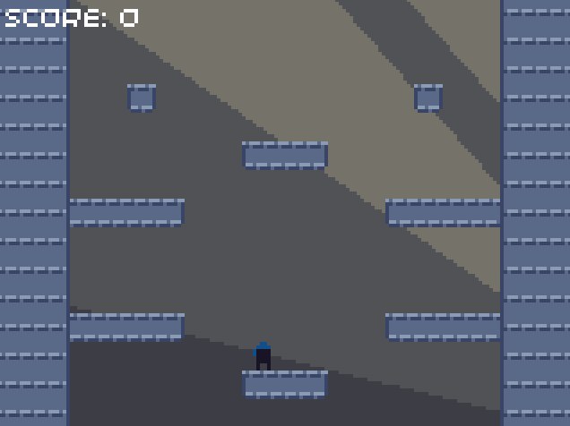
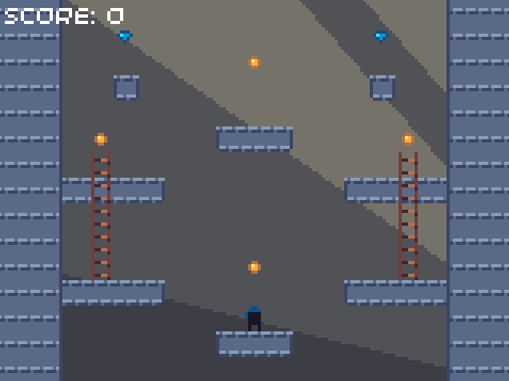
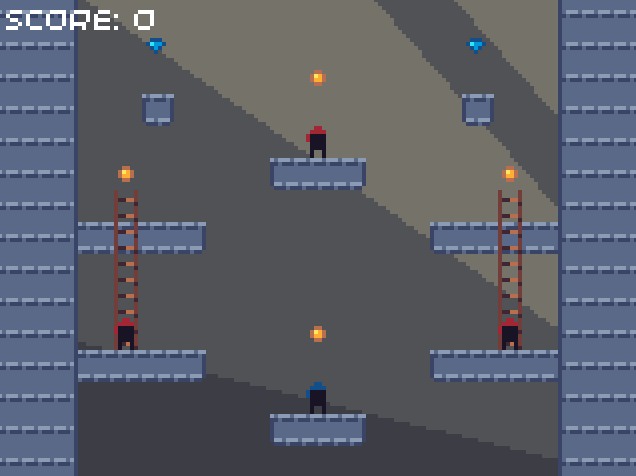

# Episode 4: Adding ladders and enemies

## Summary

In this episode, we will start off by improving the jumping mechanic, so that you can only jump while on platforms. We will then add ladders which the player can climb, and finally introduce enemies which patrol the platforms and can climb on the ladders.

## Improving the jumping

Currently, the player can jump at any time, even if they are not standing on a platform. In order to fix this, we will add a `can_jump` boolean to the `Ninja` class, which is set to true if the player is currently standing on a platform.

Firstly, we need to define this variable in the class:


```cpp
// ninja.hpp

class Ninja {
public:
    // ...

protected:
    // ...

    bool can_jump = false;
};
```


```cpp
// ninja.hpp

class Ninja {
public:
    // ...

protected:
    // ...

    bool can_jump = false;
};
```


```python
# ninja.py

class Ninja:
    # ...

    def __init__(self, x, y):
        # ...

        self.can_jump = False
```



We will set `can_jump` to false at the start of the `update` method, so that if a collision is detected with the top of a platform, it can then be set to true.


```cpp
// ninja.cpp

void Ninja::update(float dt, Constants::LevelData& level_data) {
    // This is set to true later in the update stage, but only if the ninja is on a platform
    can_jump = false;

    // ...
}
```


```cpp
// ninja.cpp

void Ninja::update(float dt, Constants::LevelData& level_data) {
    // This is set to true later in the update stage, but only if the ninja is on a platform
    can_jump = false;

    // ...
}
```


```python
# ninja.py

def update(self, dt, level_data):
    # This is set to true later in the update stage, but only if the ninja is on a platform
    self.can_jump = False

    # ...
```



It is in the collision resolution stage (in the `handle_platform` method) that we decide which edge of the tile we collided with, so we will need to set `can_jump` to true at this point.


```cpp
// ninja.cpp

void Ninja::handle_platform(Constants::LevelData& level_data, uint8_t x, uint8_t y) {
    // ...

    if (tile_id != Constants::Sprites::BLANK_TILE) {
        // ...
        
        if (check_colliding(tile_x, tile_y, Constants::SPRITE_SIZE)) {
            // ...

            // Collision resolution:
            switch (direction) {
            // ...

            case 1:
                // Landed on top of a platform
                position_y -= least_intersection;
                velocity_y = 0.0f;

                // Allow the ninja to jump again
                can_jump = true;

                break;

            // ...
            }
        }
    }
}
```


```cpp
// ninja.cpp

void Ninja::handle_platform(Constants::LevelData& level_data, uint8_t x, uint8_t y) {
    // ...

    if (tile_id != Constants::Sprites::BLANK_TILE) {
        // ...
        
        if (check_colliding(tile_x, tile_y, Constants::SPRITE_SIZE)) {
            // ...

            // Collision resolution:
            switch (direction) {
            // ...

            case 1:
                // Landed on top of a platform
                position_y -= least_intersection;
                velocity_y = 0.0f;

                // Allow the ninja to jump again
                can_jump = true;

                break;

            // ...
            }
        }
    }
}
```


```python
# ninja.py

def handle_platform(self, level_data, x, y):
    # ...
    
    if tile_id != Constants.Sprites.BLANK_TILE:
        # ...

        if self.check_object_colliding(tile_x, tile_y, Constants.SPRITE_SIZE):
            # ...

            # Collision resolution:
            if direction == 0:
                # ...

            elif direction == 1:
                # Landed on top of a platform
                self.position_y -= least_intersection
                self.velocity_y = 0

                # Allow the ninja to jump again
                self.can_jump = True

            # ...
```



We can now use this `can_jump` flag in our `update` function of the `PlayerNinja` class, when we check to see if the player can jump. We will also remove our temporary code which stopped the player from falling off the bottom of the screen.


```cpp
// player_ninja.cpp

void PlayerNinja::update(float dt, Constants::LevelData& level_data) {
    // ...

    // Handle jumping
    if (buttons.pressed & Button::A) {
        if (can_jump) {
            // Player is on platform so is allowed to jump
            jump(Constants::Player::JUMP_SPEED);
        }
    }

    // Call parent update method
    Ninja::update(dt, level_data);

    // Remove these lines:
    // if (position_y > Constants::GAME_HEIGHT - Constants::SPRITE_SIZE) {
    //     position_y = Constants::GAME_HEIGHT - Constants::SPRITE_SIZE;
    // }
}
```


```cpp
// player_ninja.cpp

void PlayerNinja::update(float dt, Constants::LevelData& level_data) {
    // ...

    // Handle jumping
    if (pressed(A)) {
        if (can_jump) {
            // Player is on platform so is allowed to jump
            jump(Constants::Player::JUMP_SPEED);
        }
    }

    // Call parent update method
    Ninja::update(dt, level_data);

    // Remove these lines:
    // if (position_y > Constants::GAME_HEIGHT - Constants::SPRITE_SIZE) {
    //     position_y = Constants::GAME_HEIGHT - Constants::SPRITE_SIZE;
    // }
}
```


```python
# player_ninja.py

def update(self, dt, level_data):
    # ...

    # Handle jumping
    if pressed(A):
        if self.can_jump:
            self.jump(Constants.Player.JUMP_SPEED)

    super().update(dt, level_data)

    # Remove these lines:
    # if self.position_y > Constants.GAME_HEIGHT - Constants.SPRITE_SIZE:
    #     self.position_y = Constants.GAME_HEIGHT - Constants.SPRITE_SIZE
```



If you now run the code, you will find that you can only jump if the player is on a platform - it is now impossible to reach the three upper platforms (once we add ladders, they will become accessible again). If you fall off a platform, you are no longer stopped at the bottom of the screen, but instead continue falling. Later on, we will reset the game when this happens.



> You may have noticed that if you press jump just as you reach the edge of a platform, the player doesn't always jump. This isn't because of a dodgy button, but instead what is actually happening is that the player runs off the edge of the platform before you press the button. Often, this feels unfair to the player, particularly if they were just one pixel too slow. To fix this, developers often add a feature called "coyote time": a tolerance is added to allow the player to jump for a very short time after leaving the platform.

## Adding ladders

### Adding the level data

In order to add ladders to our game, we need to add some information to our `LEVELS` array. Since it should be possible to have a ladder in front of a platform, we can't store the ladder data in the platforms array. Instead, we will need to create a new attribute for the `LevelData` data structure, called `extras`. This will be used to store the position of ladders, coins, and gems (we will make the coins and gems collectable in the next episode).

The `LevelData` data structure should now look like this:


```cpp
// constants.hpp, inside Constants namespace

// Level data
struct LevelData {
    // Platform data
    uint8_t platforms[GAME_WIDTH_TILES * GAME_HEIGHT_TILES];

    // Coin, gem, and ladder data
    uint8_t extras[GAME_WIDTH_TILES * GAME_HEIGHT_TILES];
};
```


```cpp
// constants.hpp, inside Constants namespace

// Level data
struct LevelData {
    // Platform data
    uint8_t platforms[GAME_WIDTH_TILES * GAME_HEIGHT_TILES];

    // Coin, gem, and ladder data
    uint8_t extras[GAME_WIDTH_TILES * GAME_HEIGHT_TILES];
};
```


```python
# constants.py

# Level data
class LevelData:
    def __init__(self, platforms, extras):
        # Platform data
        self.platforms = platforms

        # Coin, gem, and ladder data
        self.extras = extras

    def copy(self):
        return LevelData(self.platforms.copy(), self.extras.copy())
```



We can now add the additional data to our `LEVELS` array:


```cpp
// constants.hpp, inside Constants namespace

const LevelData LEVELS[LEVEL_COUNT] = {
    // Level 1
    {
        // Platform data
        {
            // ...
        },
        
        // Coin, gem and ladder data
        {
            0xff, 0xff, 0xff, 0xff, 0xff, 0xff, 0xff, 0xff, 0xff, 0xff, 0xff, 0xff, 0xff, 0xff, 0xff,
            0xff, 0xff, 0x12, 0xff, 0xff, 0xff, 0xff, 0xff, 0xff, 0xff, 0xff, 0xff, 0x12, 0xff, 0xff,
            0xff, 0xff, 0xff, 0xff, 0xff, 0xff, 0xff, 0x13, 0xff, 0xff, 0xff, 0xff, 0xff, 0xff, 0xff,
            0xff, 0xff, 0xff, 0xff, 0xff, 0xff, 0xff, 0xff, 0xff, 0xff, 0xff, 0xff, 0xff, 0xff, 0xff,
            0xff, 0xff, 0xff, 0xff, 0xff, 0xff, 0xff, 0xff, 0xff, 0xff, 0xff, 0xff, 0xff, 0xff, 0xff,
            0xff, 0x13, 0xff, 0xff, 0xff, 0xff, 0xff, 0xff, 0xff, 0xff, 0xff, 0xff, 0xff, 0x13, 0xff,
            0xff, 0x0b, 0xff, 0xff, 0xff, 0xff, 0xff, 0xff, 0xff, 0xff, 0xff, 0xff, 0xff, 0x0b, 0xff,
            0xff, 0x0b, 0xff, 0xff, 0xff, 0xff, 0xff, 0xff, 0xff, 0xff, 0xff, 0xff, 0xff, 0x0b, 0xff,
            0xff, 0x0b, 0xff, 0xff, 0xff, 0xff, 0xff, 0xff, 0xff, 0xff, 0xff, 0xff, 0xff, 0x0b, 0xff,
            0xff, 0x0b, 0xff, 0xff, 0xff, 0xff, 0xff, 0xff, 0xff, 0xff, 0xff, 0xff, 0xff, 0x0b, 0xff,
            0xff, 0x0b, 0xff, 0xff, 0xff, 0xff, 0xff, 0x13, 0xff, 0xff, 0xff, 0xff, 0xff, 0x0b, 0xff,
            0xff, 0xff, 0xff, 0xff, 0xff, 0xff, 0xff, 0xff, 0xff, 0xff, 0xff, 0xff, 0xff, 0xff, 0xff,
            0xff, 0xff, 0xff, 0xff, 0xff, 0xff, 0xff, 0xff, 0xff, 0xff, 0xff, 0xff, 0xff, 0xff, 0xff,
            0xff, 0xff, 0xff, 0xff, 0xff, 0xff, 0xff, 0xff, 0xff, 0xff, 0xff, 0xff, 0xff, 0xff, 0xff,
            0xff, 0xff, 0xff, 0xff, 0xff, 0xff, 0xff, 0xff, 0xff, 0xff, 0xff, 0xff, 0xff, 0xff, 0xff
        }
    }
};
```


```cpp
// constants.hpp, inside Constants namespace

const LevelData LEVELS[LEVEL_COUNT] = {
    // Level 1
    {
        // Platform data
        {
            // ...
        },
        
        // Coin, gem and ladder data
        {
            0xff, 0xff, 0xff, 0xff, 0xff, 0xff, 0xff, 0xff, 0xff, 0xff, 0xff, 0xff, 0xff, 0xff, 0xff,
            0xff, 0xff, 0x12, 0xff, 0xff, 0xff, 0xff, 0xff, 0xff, 0xff, 0xff, 0xff, 0x12, 0xff, 0xff,
            0xff, 0xff, 0xff, 0xff, 0xff, 0xff, 0xff, 0x13, 0xff, 0xff, 0xff, 0xff, 0xff, 0xff, 0xff,
            0xff, 0xff, 0xff, 0xff, 0xff, 0xff, 0xff, 0xff, 0xff, 0xff, 0xff, 0xff, 0xff, 0xff, 0xff,
            0xff, 0xff, 0xff, 0xff, 0xff, 0xff, 0xff, 0xff, 0xff, 0xff, 0xff, 0xff, 0xff, 0xff, 0xff,
            0xff, 0x13, 0xff, 0xff, 0xff, 0xff, 0xff, 0xff, 0xff, 0xff, 0xff, 0xff, 0xff, 0x13, 0xff,
            0xff, 0x0b, 0xff, 0xff, 0xff, 0xff, 0xff, 0xff, 0xff, 0xff, 0xff, 0xff, 0xff, 0x0b, 0xff,
            0xff, 0x0b, 0xff, 0xff, 0xff, 0xff, 0xff, 0xff, 0xff, 0xff, 0xff, 0xff, 0xff, 0x0b, 0xff,
            0xff, 0x0b, 0xff, 0xff, 0xff, 0xff, 0xff, 0xff, 0xff, 0xff, 0xff, 0xff, 0xff, 0x0b, 0xff,
            0xff, 0x0b, 0xff, 0xff, 0xff, 0xff, 0xff, 0xff, 0xff, 0xff, 0xff, 0xff, 0xff, 0x0b, 0xff,
            0xff, 0x0b, 0xff, 0xff, 0xff, 0xff, 0xff, 0x13, 0xff, 0xff, 0xff, 0xff, 0xff, 0x0b, 0xff,
            0xff, 0xff, 0xff, 0xff, 0xff, 0xff, 0xff, 0xff, 0xff, 0xff, 0xff, 0xff, 0xff, 0xff, 0xff,
            0xff, 0xff, 0xff, 0xff, 0xff, 0xff, 0xff, 0xff, 0xff, 0xff, 0xff, 0xff, 0xff, 0xff, 0xff,
            0xff, 0xff, 0xff, 0xff, 0xff, 0xff, 0xff, 0xff, 0xff, 0xff, 0xff, 0xff, 0xff, 0xff, 0xff,
            0xff, 0xff, 0xff, 0xff, 0xff, 0xff, 0xff, 0xff, 0xff, 0xff, 0xff, 0xff, 0xff, 0xff, 0xff
        }
    }
};
```


```python
# constants.py

LEVELS = [
    # Level 1
    LevelData(
        # Platform data
        [
            # ...
        ],
        
        # Coin, gem and ladder data
        [
            0xff, 0xff, 0xff, 0xff, 0xff, 0xff, 0xff, 0xff, 0xff, 0xff, 0xff, 0xff, 0xff, 0xff, 0xff,
            0xff, 0xff, 0x12, 0xff, 0xff, 0xff, 0xff, 0xff, 0xff, 0xff, 0xff, 0xff, 0x12, 0xff, 0xff,
            0xff, 0xff, 0xff, 0xff, 0xff, 0xff, 0xff, 0x13, 0xff, 0xff, 0xff, 0xff, 0xff, 0xff, 0xff,
            0xff, 0xff, 0xff, 0xff, 0xff, 0xff, 0xff, 0xff, 0xff, 0xff, 0xff, 0xff, 0xff, 0xff, 0xff,
            0xff, 0xff, 0xff, 0xff, 0xff, 0xff, 0xff, 0xff, 0xff, 0xff, 0xff, 0xff, 0xff, 0xff, 0xff,
            0xff, 0x13, 0xff, 0xff, 0xff, 0xff, 0xff, 0xff, 0xff, 0xff, 0xff, 0xff, 0xff, 0x13, 0xff,
            0xff, 0x0b, 0xff, 0xff, 0xff, 0xff, 0xff, 0xff, 0xff, 0xff, 0xff, 0xff, 0xff, 0x0b, 0xff,
            0xff, 0x0b, 0xff, 0xff, 0xff, 0xff, 0xff, 0xff, 0xff, 0xff, 0xff, 0xff, 0xff, 0x0b, 0xff,
            0xff, 0x0b, 0xff, 0xff, 0xff, 0xff, 0xff, 0xff, 0xff, 0xff, 0xff, 0xff, 0xff, 0x0b, 0xff,
            0xff, 0x0b, 0xff, 0xff, 0xff, 0xff, 0xff, 0xff, 0xff, 0xff, 0xff, 0xff, 0xff, 0x0b, 0xff,
            0xff, 0x0b, 0xff, 0xff, 0xff, 0xff, 0xff, 0x13, 0xff, 0xff, 0xff, 0xff, 0xff, 0x0b, 0xff,
            0xff, 0xff, 0xff, 0xff, 0xff, 0xff, 0xff, 0xff, 0xff, 0xff, 0xff, 0xff, 0xff, 0xff, 0xff,
            0xff, 0xff, 0xff, 0xff, 0xff, 0xff, 0xff, 0xff, 0xff, 0xff, 0xff, 0xff, 0xff, 0xff, 0xff,
            0xff, 0xff, 0xff, 0xff, 0xff, 0xff, 0xff, 0xff, 0xff, 0xff, 0xff, 0xff, 0xff, 0xff, 0xff,
            0xff, 0xff, 0xff, 0xff, 0xff, 0xff, 0xff, 0xff, 0xff, 0xff, 0xff, 0xff, 0xff, 0xff, 0xff
        ]
    )
]
```



### Rendering multiple tile arrays

Each of these arrays in the `LevelData` data structure needs to be rendered to the screen. We will be adding more layers later, so it makes sense to write a function which renders a specified layer for us, instead of copying and pasting our existing code for each new layer we add.

We will call this function `render_tiles`, and will add it to the `Level` class. It is very similar to the existing code to render the `platforms` array, except it renders any array which you pass into it.


```cpp
// level.hpp

class Level {
public:
    // ...

private:
    void render_tiles(const uint8_t* tile_ids);
    
    // ...
};

// level.cpp

void Level::render_tiles(const uint8_t* tile_ids) {
    // Iterate through array of tile ids and render using the correct index in the spritesheet
    for (uint8_t y = 0; y < Constants::GAME_HEIGHT_TILES; y++) {
        for (uint8_t x = 0; x < Constants::GAME_WIDTH_TILES; x++) {

            // Calculate tile index
            uint8_t tile_id = tile_ids[y * Constants::GAME_WIDTH_TILES + x];

            // Only render the tile if it isn't a blank tile
            if (tile_id != Constants::Sprites::BLANK_TILE) {
                // Offset the tiles since the 32blit version has borders on the screen
                screen.sprite(tile_id, Point(x * Constants::SPRITE_SIZE + Constants::GAME_OFFSET_X, y * Constants::SPRITE_SIZE + Constants::GAME_OFFSET_Y));
            }
        }
    }
}
```


```cpp
// level.hpp

class Level {
public:
    // ...

private:
    void render_tiles(const uint8_t* tile_ids);
    
    // ...
};

// level.cpp

void Level::render_tiles(const uint8_t* tile_ids) {
    // Iterate through array of tile ids and render using the correct index in the spritesheet
    for (uint8_t y = 0; y < Constants::GAME_HEIGHT_TILES; y++) {
        for (uint8_t x = 0; x < Constants::GAME_WIDTH_TILES; x++) {

            // Calculate tile index
            uint8_t tile_id = tile_ids[y * Constants::GAME_WIDTH_TILES + x];

            // Only render the tile if it isn't a blank tile
            if (tile_id != Constants::Sprites::BLANK_TILE) {
                sprite(tile_id, x * Constants::SPRITE_SIZE + Constants::GAME_OFFSET_X, y * Constants::SPRITE_SIZE + Constants::GAME_OFFSET_Y);
            }
        }
    }
}
```


```python
# level.py

class Level:
    # ...

    def render_tiles(self, tile_ids):
        # Iterate through array of tile ids and render using the correct index in the spritesheet
        for y in range(Constants.GAME_HEIGHT_TILES):
            for x in range(Constants.GAME_WIDTH_TILES):

                # Calculate tile index
                tile_id = tile_ids[y * Constants.GAME_WIDTH_TILES + x]

                # Only render the tile if it isn't a blank tile
                if tile_id != Constants.Sprites.BLANK_TILE:
                    sprite(tile_id, x * Constants.SPRITE_SIZE + Constants.GAME_OFFSET_X, y * Constants.SPRITE_SIZE + Constants.GAME_OFFSET_Y)
```



> For C++, we declare the parameter as a `const` array because we don't need to modify it. If we attempt to change or reassign a parameter which has been declared as `const`, the code will not compile.

Now that we have written our `render_tiles` function, we can use it in the `render` function of the `Level` class. Make sure to delete the old code which rendered the platforms array.


```cpp
// level.cpp

void Level::render() {
    // Remove the old code for rendering the level_data.platforms array
    // Replace with the following lines:

    // Render platforms
    render_tiles(level_data.platforms);

    // Render extras (coins, gems and ladders)
    render_tiles(level_data.extras);

    // ...
}
```


```cpp
// level.cpp

void Level::render() {
    // Remove the old code for rendering the level_data.platforms array
    // Replace with the following lines:

    // Render platforms
    render_tiles(level_data.platforms);

    // Render extras (coins, gems and ladders)
    render_tiles(level_data.extras);

    // ...
}
```


```python
# level.py

def render(self):
    # Remove the old code for rendering the self.level_data.platforms array
    # Replace with the following lines:

    # Render platforms
    self.render_tiles(self.level_data.platforms)

    # Render extras (coins, gems and ladders)
    self.render_tiles(self.level_data.extras)

    # ...
```



<!-- TODO: Could condense 32blit/PicoSystem C++ code in the above example, since they both appear to be identical? -->

If you run the code, you should see that the ladders, coins, and gems are now drawn to the screen along with the rest of the tiles: 


### Adding climbing

In order for the game to respond differently when a player is using a ladder, we will need to track the current state of the player. There will be four possible climbing states:

* `NONE` - the player is not on a ladder.
* `IDLE` - the player is stationary on a ladder.
* `UP` - the player is climbing up a ladder.
* `DOWN` - the player is climbing down a ladder.

We will also need to add another flag to determine if it is possible for the player to start climbing a ladder. We will call this variable `can_climb`.


```cpp
// ninja.hpp

class Ninja {
public:
    // ...

protected:
    // ...

    bool can_climb = false;
    
    enum class ClimbingState {
        NONE,
        IDLE,
        UP,
        DOWN
    };

    ClimbingState climbing_state = ClimbingState::NONE;
};
```


```cpp
// ninja.hpp

class Ninja {
public:
    // ...

protected:
    // ...

    bool can_climb = false;
    
    enum class ClimbingState {
        NONE,
        IDLE,
        UP,
        DOWN
    };

    ClimbingState climbing_state = ClimbingState::NONE;
};
```


```python
# ninja.py

class Ninja:

    # We're using classes as enums
    class ClimbingState:
        NONE = 0
        IDLE = 1
        UP = 2
        DOWN = 3

    # ...

    def __init__(self, colour, x, y):
        # ...

        self.can_climb = False

        self.climbing_state = Ninja.ClimbingState.NONE
```



> The C++ code uses an `enum class` type so that the enumerators aren't brought into the global namespace (unlike with normal `enum` types). Instead, every time you reference one of our enumerators, you must qualify it with the `ClimbingState::` prefix.

We need to know the speed with which to move the player when they are moving up or down a ladder, so we will add this information to the `Player` namespace (or class in Python) in our constants file:


```cpp
// constants.hpp, inside Constants namespace

namespace Player {
    // ...

    const float CLIMBING_SPEED = 40.0f;
}
```


```cpp
// constants.hpp, inside Constants namespace

namespace Player {
    // ...

    const float CLIMBING_SPEED = 40.0f;
}
```


```python
# constants.py

class Player:
    # ...

    CLIMBING_SPEED = 40
```



We will need to add a function similar to `handle_platform`, which checks for a collision between the player and a ladder tile, and then handles the climbing mechanic if necessary. We will call this function `handle_ladder`:


```cpp
// ninja.hpp

class Ninja {
public:
    // ...

protected:
    // ...

private:
    // ...

    void handle_ladder(Constants::LevelData& level_data, uint8_t x, uint8_t y);
};
```


```cpp
// ninja.hpp

class Ninja {
public:
    // ...

protected:
    // ...

private:
    // ...

    void handle_ladder(Constants::LevelData& level_data, uint8_t x, uint8_t y);
};
```


```python
# ninja.py

class Ninja:
    # ...

    def handle_ladder(self, level_data, x, y):
        pass
```



In order to determine if it is possible for a player to be climbing a ladder, the player must be colliding with a ladder tile, and within a sufficient distance of the centre of the ladder. This small tolerance allows the player to climb a ladder even when they are not pixel-perfectly in line with it.

If the player is climbing the ladder or is idle on it, their horizontal position is "locked" to the ladder's horizontal position, so that the player sprite visually lines up with the centre of the ladder.


```cpp
// ninja.cpp

void Ninja::handle_ladder(Constants::LevelData& level_data, uint8_t x, uint8_t y) {
    // Get tile's sprite index from level data
    uint8_t tile_id = level_data.extras[y * Constants::GAME_WIDTH_TILES + x];

    // Check if the tile is a ladder
    if (tile_id == Constants::Sprites::LADDER) {

        // Calculate the actual position of the tile from the grid position
        float tile_x = x * Constants::SPRITE_SIZE;
        float tile_y = y * Constants::SPRITE_SIZE;

        // Check if ninja is colliding with the tile
        if (check_colliding(tile_x, tile_y, Constants::SPRITE_SIZE)) {
            
            // Check that ninja is sufficiently close to ladder
            if (std::abs(tile_x - position_x) < Constants::Ninja::WIDTH / 2) {
                can_climb = true;

                // Check if ninja should be climbing or idling on ladder
                if (climbing_state != ClimbingState::NONE) {
                    // Lock position to ladder
                    position_x = tile_x;
                }
            }
        }
    }
}
```


```cpp
// ninja.cpp

void Ninja::handle_ladder(Constants::LevelData& level_data, uint8_t x, uint8_t y) {
    // Get tile's sprite index from level data
    uint8_t tile_id = level_data.extras[y * Constants::GAME_WIDTH_TILES + x];

    // Check if the tile is a ladder
    if (tile_id == Constants::Sprites::LADDER) {

        // Calculate the actual position of the tile from the grid position
        float tile_x = x * Constants::SPRITE_SIZE;
        float tile_y = y * Constants::SPRITE_SIZE;

        // Check if ninja is colliding with the tile
        if (check_colliding(tile_x, tile_y, Constants::SPRITE_SIZE)) {
            
            // Check that ninja is sufficiently close to ladder
            if (std::abs(tile_x - position_x) < Constants::Ninja::WIDTH / 2) {
                can_climb = true;

                // Check if ninja should be climbing or idling on ladder
                if (climbing_state != ClimbingState::NONE) {
                    // Lock position to ladder
                    position_x = tile_x;
                }
            }
        }
    }
}
```


```python
# ninja.py

def handle_ladder(self, level_data, x, y):
    # Get tile's sprite index from level data
    tile_id = level_data.extras[y * Constants.GAME_WIDTH_TILES + x]

    # Check if the tile is a ladder
    if tile_id == Constants.Sprites.LADDER:

        # Calculate the actual position of the tile from the grid position
        tile_x = x * Constants.SPRITE_SIZE
        tile_y = y * Constants.SPRITE_SIZE

        # Check if ninja is colliding with the tile
        if self.check_object_colliding(tile_x, tile_y, Constants.SPRITE_SIZE):
            
            # Check that ninja is sufficiently close to ladder
            if abs(tile_x - self.position_x) < Constants.Ninja.WIDTH / 2:
                self.can_climb = True

                # Check if ninja should be climbing or idling on ladder
                if self.climbing_state != Ninja.ClimbingState.NONE:
                    # Lock position to ladder
                    self.position_x = tile_x
```



Now that we have our `handle_ladder` function, we need to call it from within the `handle_collisions` function, just after the call to `handle_platform`. We will also reset the `can_climb` flag to false, ready for `handle_ladders` to update it as necessary.

At the end of the `handle_collisions` function, we will reset `climbing_state` to `NONE` if the player cannot climb. If the player is currently on a ladder, we will set `can_jump` to true (since jumping can be used to get off a ladder). If they are climbing, their vertical velocity is then set to their climbing speed, with the sign changed depending on whether they are travelling up and down the ladder.


```cpp
// ninja.cpp

void Ninja::handle_collisions(Constants::LevelData& level_data) {
    // Reset can_climb flag (which then gets set by handle_ladders if the ninja is near a ladder)
    can_climb = false;

    // ...

    if (x < Constants::GAME_WIDTH_TILES && y < Constants::GAME_HEIGHT_TILES && position_x >= -Constants::Ninja::BORDER && position_y >= 0) {
        for (uint8_t y_offset = 0; y_offset < (y == Constants::GAME_HEIGHT_TILES - 1 ? 1 : 2); y_offset++) {
            for (uint8_t x_offset = 0; x_offset < (x == Constants::GAME_WIDTH_TILES - 1 ? 1 : 2); x_offset++) {
                // ...

                // Handle ladders
                handle_ladder(level_data, new_x, new_y);
            }
        }
    }

    // If ninja can no longer climb, reset their climbing state
    if (!can_climb) {
        climbing_state = ClimbingState::NONE;
    }

    if (climbing_state != ClimbingState::NONE) {
        // If player is on a ladder, they can jump
        can_jump = true;

        // Set velocity to 0
        velocity_x = 0.0f;
        velocity_y = 0.0f;

        // Get climbing speed - later on this will vary depending on whether ninja is the player or an enemy
        float climbing_speed = Constants::Player::CLIMBING_SPEED;

        // If player is actually climbing the ladder, set vertical velocity to be in the right direction
        if (climbing_state == ClimbingState::UP) {
            velocity_y = -climbing_speed;
        }
        else if (climbing_state == ClimbingState::DOWN) {
            velocity_y = climbing_speed;
        }
    }
}
```


```cpp
// ninja.cpp

void Ninja::handle_collisions(Constants::LevelData& level_data) {
    // Reset can_climb flag (which then gets set by handle_ladders if the ninja is near a ladder)
    can_climb = false;

    // ...

    if (x < Constants::GAME_WIDTH_TILES && y < Constants::GAME_HEIGHT_TILES && position_x >= -Constants::Ninja::BORDER && position_y >= 0) {
        for (uint8_t y_offset = 0; y_offset < (y == Constants::GAME_HEIGHT_TILES - 1 ? 1 : 2); y_offset++) {
            for (uint8_t x_offset = 0; x_offset < (x == Constants::GAME_WIDTH_TILES - 1 ? 1 : 2); x_offset++) {
                // ...

                // Handle ladders
                handle_ladder(level_data, new_x, new_y);
            }
        }
    }

    // If ninja can no longer climb, reset their climbing state
    if (!can_climb) {
        climbing_state = ClimbingState::NONE;
    }

    if (climbing_state != ClimbingState::NONE) {
        // If player is on a ladder, they can jump
        can_jump = true;

        // Set velocity to 0
        velocity_x = 0.0f;
        velocity_y = 0.0f;

        // Get climbing speed - later on this will vary depending on whether ninja is the player or an enemy
        float climbing_speed = Constants::Player::CLIMBING_SPEED;

        // If player is actually climbing the ladder, set vertical velocity to be in the right direction
        if (climbing_state == ClimbingState::UP) {
            velocity_y = -climbing_speed;
        }
        else if (climbing_state == ClimbingState::DOWN) {
            velocity_y = climbing_speed;
        }
    }
}
```


```python
# ninja.py

def handle_collisions(self, level_data):
    # Reset can_climb flag (which then gets set by handle_ladders if the ninja is near a ladder)
    self.can_climb = False

    # ...

    if x < Constants.GAME_WIDTH_TILES and y < Constants.GAME_HEIGHT_TILES and self.position_x >= -Constants.Ninja.BORDER and self.position_y >= 0:
        for y_offset in range(1 if y == Constants.GAME_HEIGHT_TILES - 1 else 2):
            for x_offset in range(1 if x == Constants.GAME_WIDTH_TILES - 1 else 2):
                # ...

                # Handle ladders
                self.handle_ladder(level_data, new_x, new_y)

    # If ninja can no longer climb, reset their climbing state
    if not self.can_climb:
        self.climbing_state = Ninja.ClimbingState.NONE
    
    if self.climbing_state != Ninja.ClimbingState.NONE:
        # If player is on a ladder, they can jump
        self.can_jump = True

        # Set velocity to 0
        self.velocity_x = 0
        self.velocity_y = 0

        # Get climbing speed - later on this will vary depending on whether ninja is the player or an enemy
        climbing_speed = Constants.Player.CLIMBING_SPEED

        # If player is actually climbing the ladder, set vertical velocity to be in the right direction
        if self.climbing_state == Ninja.ClimbingState.UP:
            self.velocity_y = -climbing_speed

        elif self.climbing_state == Ninja.ClimbingState.DOWN:
            self.velocity_y = climbing_speed
```



To be able to test the ladders so far, we need to check if up or down have been pressed, and set the player's `climbing_state` accordingly (only if `can_climb` is true). The code will be added to the `update` function of the `Player` class:


```cpp
// player_ninja.cpp

void PlayerNinja::update(float dt, Constants::LevelData& level_data) {
    // ...

    // Handle moving left/right
    // ...

    // Handle climbing
    if (can_climb) {
        bool up = pressed(Button::DPAD_UP);
        bool down = pressed(Button::DPAD_DOWN);

        if (up != down) {
            // Only one of up and down are selected
            climbing_state = up ? ClimbingState::UP : ClimbingState::DOWN;
        }
        else if (climbing_state != ClimbingState::NONE) {
            // Player has already been climbing the ladder, and either none or both of up and down are pressed
            climbing_state = ClimbingState::IDLE;
        }
    }

    // Handle jumping
    // ...

    // Call parent update method
}
```


```cpp
// player_ninja.cpp

void PlayerNinja::update(float dt, Constants::LevelData& level_data) {
    // ...

    // Handle moving left/right
    // ...

    // Handle climbing
    if (can_climb) {
        bool up = button(UP);
        bool down = button(DOWN);

        if (up != down) {
            // Only one of up and down are selected
            climbing_state = up ? ClimbingState::UP : ClimbingState::DOWN;
        }
        else if (climbing_state != ClimbingState::NONE) {
            // Player has already been climbing the ladder, and either none or both of up and down are pressed
            climbing_state = ClimbingState::IDLE;
        }
    }

    // Handle jumping
    // ...

    // Call parent update method
}
```


```python
# player_ninja.py

def update(self, dt, level_data):
    # ...

    # Handle moving left/right
    # ...

    # Handle climbing
    if self.can_climb:
        up = button(UP)
        down = button(DOWN)

        if up != down:
            # Only one of up and down are selected
            self.climbing_state = Ninja.ClimbingState.UP if up else Ninja.ClimbingState.DOWN
        
        elif self.climbing_state != Ninja.ClimbingState.NONE:
            # Player has already been climbing the ladder, and either none or both of up and down are pressed
            self.climbing_state = Ninja.ClimbingState.IDLE


    # Handle jumping
    # ...

    # Call parent update method
```



### Fixing our ladders

A significant part of game development is testing your game - as you write the code, it's good to keep testing it at regular stages, to make sure that your game doesn't have any bugs or problems with gameplay. Now it's your turn to do some testing - run the code, and see if you can spot any issues when you try to use a ladder.

The main problems which you may have spotted are:

* Gravity still pulls you down while you are not moving up or down the ladder.
* If you jump while on a ladder, you remain horizontally locked to the ladder, rather than disengaging completely.
* If you go down to the bottom of a ladder, you cannot walk left or right.
* You cannot go up through a platform block with a ladder in front of it.

We will fix these one by one - make sure to test the code after we solve each problem!

First up - gravity continues to act on the player while they are climbing. This is because we always accelerate the player at the start of the `update` function in the `Ninja` class. When the player is moving up or down a ladder, this is not as noticable because the vertical velocity is reset to the climbing velocity every frame (but you may have noticed that climbing up was slightly slower than climbing down). Fixing this bug is very simple - don't apply gravity if the player is on a ladder.


```cpp
// ninja.cpp

void Ninja::update(float dt, Constants::LevelData& level_data) {
    // ...

    // Encase the gravity logic in an if-statement:

    // Apply gravity, but only if the ninja isn't climbing a ladder
    if (climbing_state == ClimbingState::NONE) {
        velocity_y += Constants::Environment::GRAVITY_ACCELERATION * dt;
    }

    // ...
}
```


```cpp
// ninja.cpp

void Ninja::update(float dt, Constants::LevelData& level_data) {
    // ...

    // Encase the gravity logic in an if-statement:

    // Apply gravity, but only if the ninja isn't climbing a ladder
    if (climbing_state == ClimbingState::NONE) {
        velocity_y += Constants::Environment::GRAVITY_ACCELERATION * dt;
    }

    // ...
}
```


```python
# ninja.py

def update(self, dt, level_data):
    # ...

    # Encase the gravity logic in an if-statement:

    # Apply gravity, only if ninja isn't climbing a ladder
    if self.climbing_state == Ninja.ClimbingState.NONE:
        self.velocity_y += Constants.Environment.GRAVITY_ACCELERATION * dt

    # ...
```



Next, we spotted that jumping while on a ladder does not properly disengage the player from the ladder. We made it possible to jump while on a ladder by setting `can_jump` to true, but we don't reset the `climbing_state` of the player when they jump. To fix this, we can add a single line to the `jump` function in the `Ninja` class. The function should now look like this:


```cpp
// ninja.cpp

void Ninja::jump(float jump_speed) {
    velocity_y = -jump_speed;

    // Reset climbing state when player jumps
    climbing_state = ClimbingState::NONE;
}
```


```cpp
// ninja.cpp

void Ninja::jump(float jump_speed) {
    velocity_y = -jump_speed;

    // Reset climbing state when player jumps
    climbing_state = ClimbingState::NONE;
}
```


```python
# ninja.py

def jump(self, jump_speed):
    self.velocity_y = -jump_speed

    # Reset climbing state when player jumps
    self.climbing_state = Ninja.ClimbingState.NONE
```



The next issue is that we can now *only* get off the ladder by jumping - instead, it would be nice if you could get off the ladder by climbing down to a solid platform (without a ladder in front of it). This requires modifying the `handle_platform` function, so that if we are standing on top of a platform, the `climbing_state` variable is set to `NONE`.


```cpp
// ninja.cpp

void Ninja::handle_platform(Constants::LevelData& level_data, uint8_t x, uint8_t y) {
    // ...

    if (tile_id != Constants::Sprites::BLANK_TILE) {
        // ...

        if (check_colliding(tile_x, tile_y, Constants::SPRITE_SIZE)) {
            // ...

            // Collision resolution:
            switch (direction) {
            // ...

            case 1:
                // Landed on top of a platform
                position_y -= least_intersection;
                velocity_y = 0.0f;

                // Allow the ninja to jump again
                can_jump = true;

                // Stop the ninja from climbing
                climbing_state = ClimbingState::NONE;

                break;

            // ...
            }
        }
    }
}
```


```cpp
// ninja.cpp

void Ninja::handle_platform(Constants::LevelData& level_data, uint8_t x, uint8_t y) {
    // ...

    if (tile_id != Constants::Sprites::BLANK_TILE) {
        // ...

        if (check_colliding(tile_x, tile_y, Constants::SPRITE_SIZE)) {
            // ...

            // Collision resolution:
            switch (direction) {
            // ...

            case 1:
                // Landed on top of a platform
                position_y -= least_intersection;
                velocity_y = 0.0f;

                // Allow the ninja to jump again
                can_jump = true;

                // Stop the ninja from climbing
                climbing_state = ClimbingState::NONE;

                break;

            // ...
            }
        }
    }
}
```


```python
# ninja.py

def handle_platform(self, level_data, x, y):
    # ...
    if tile_id != Constants.Sprites.BLANK_TILE:
        # ...

        if self.check_object_colliding(tile_x, tile_y, Constants.SPRITE_SIZE):
            # ...
                
            # Collision resolution:
            if direction == 0:
                # ...

            elif direction == 1:
                # Landed on top of a platform
                self.position_y -= least_intersection
                self.velocity_y = 0

                # Allow the ninja to jump again
                self.can_jump = True

                # Stop the ninja from climbing
                self.climbing_state = Ninja.ClimbingState.NONE

            # ...
```



The last issue we spotted was that you cannot go up through a platform tile which has a ladder in front of it. There are several approaches we can take to fix this, and careful consideration is needed, since each will result in slightly different gameplay:

* If the player is currently on a ladder, ignore collisions with platform tiles which have a ladder in front. This would mean that when the player jumps while on a ladder, they cannot pass through these tiles, which is slightly counter-intuitive. 
* Make platform tiles with a ladder in front act as a one-way platform: the player can jump up through it, but cannot fall down through it (if the player is climbing, ignore collisions with these tiles completely). This is an improvement on the previous option.
* Ignore all collisions with platform tiles which have a ladder in front. If the player walks across a platform with a ladder coming up through the floor, they will fall down the ladder, which would appear to the user as a mistake or unfair.

We want our design choices to be as self-explanatory and obvious to our users as possible - if a feature seems unfair, confusing, or the user might think it was a mistake, it almost certainly needs tweaking (even if it's actually fair and deliberate). With this in mind, we will choose the second option, because it appears the most logical to a generic user.

There are several ways that one-way platforms can be implemented. Ideally, the platform should only be treated as solid if the player's last position was above it, otherwise collisions with it are ignored. However, for simplicity, we will only treat the platform as solid if the player's vertical velocity is > 0 (i.e. they are travelling downwards). This approach produces very similar results to the first approach, but only if the platform is thin enough (which means that it is possible to tunnel through the platform if the framerate is too low).

In the `handle_platform` function, we will put the collision resolution code inside an if statement to check that it does not have a ladder in front of it. If a ladder does exist in front of the platform tile (and the player is not currently climbing a ladder), the platform is treated as a one-way platform.


```cpp
// ninja.cpp

void Ninja::handle_platform(Constants::LevelData& level_data, uint8_t x, uint8_t y) {
    // ...
    
    if (tile_id != Constants::Sprites::BLANK_TILE) {
        // ...

        if (check_colliding(tile_x, tile_y, Constants::SPRITE_SIZE)) {

            // Check if this platform have a ladder in front of it
            if (level_data.extras[y * Constants::GAME_WIDTH_TILES + x] == Constants::Sprites::LADDER) {

                // Check that the ninja is not on a ladder
                if (climbing_state == ClimbingState::NONE) {

                    // Check that the ninja is falling downwards
                    if (velocity_y > 0.0f) {

                        // Check that the ninja collided with the smaller platform hitbox
                        if (position_y + Constants::SPRITE_SIZE - tile_y < Constants::ONE_WAY_PLATFORM_TOLERANCE) {
                            // Set the ninja's position so that it rests on top of the platform, and reset its vertical velocity to zero
                            position_y = tile_y - Constants::SPRITE_SIZE;
                            velocity_y = 0.0f;

                            // Allow the ninja to jump again
                            can_jump = true;
                        }
                    }
                }
            }
            else {
                // Collision resolution code for normal platforms is now here

                // ...
            }
        }
    }
}
```


```cpp
// ninja.cpp

void Ninja::handle_platform(Constants::LevelData& level_data, uint8_t x, uint8_t y) {
    // ...
    
    if (tile_id != Constants::Sprites::BLANK_TILE) {
        // ...

        if (check_colliding(tile_x, tile_y, Constants::SPRITE_SIZE)) {

            // Check if this platform have a ladder in front of it
            if (level_data.extras[y * Constants::GAME_WIDTH_TILES + x] == Constants::Sprites::LADDER) {

                // Check that the ninja is not on a ladder
                if (climbing_state == ClimbingState::NONE) {

                    // Check that the ninja is falling downwards
                    if (velocity_y > 0.0f) {

                        // Check that the ninja collided with the smaller platform hitbox
                        if (position_y + Constants::SPRITE_SIZE - tile_y < Constants::ONE_WAY_PLATFORM_TOLERANCE) {
                            // Set the ninja's position so that it rests on top of the platform, and reset its vertical velocity to zero
                            position_y = tile_y - Constants::SPRITE_SIZE;
                            velocity_y = 0.0f;

                            // Allow the ninja to jump again
                            can_jump = true;
                        }
                    }
                }
            }
            else {
                // Collision resolution code for normal platforms is now here

                // ...
            }
        }
    }
}
```


```python
# ninja.py

def handle_platform(self, level_data, x, y):
    # ...
    
    if tile_id != Constants.Sprites.BLANK_TILE:
        # ...

        if self.check_object_colliding(tile_x, tile_y, Constants.SPRITE_SIZE):

            # Check if this platform have a ladder in front of it
            if level_data.extras[y * Constants.GAME_WIDTH_TILES + x] == Constants.Sprites.LADDER:

                # Check that the ninja is not on a ladder
                if self.climbing_state == Ninja.ClimbingState.NONE:

                    # Check that the ninja is falling downwards
                    if self.velocity_y > 0:

                        # Check that the ninja collided with the smaller platform hitbox
                        if self.position_y + Constants.SPRITE_SIZE - tile_y < Constants.ONE_WAY_PLATFORM_TOLERANCE:
                            # Set the ninja's position so that it rests on top of the platform, and reset it's vertical velocity to zero
                            self.position_y = tile_y - Constants.SPRITE_SIZE
                            self.velocity_y = 0

                            # Allow the ninja to jump again
                            self.can_jump = True
            
            else:
                # Collision resolution code for normal platforms is now here

                # ...
```



In the above code, we introduced a new constant called `ONE_WAY_PLATFORM_TOLERANCE`. This can be interpreted as the thickness of the platform when colliding from above. If the player travels more than this distance in one frame, they are likely to miss colliding with the platform entirely (this is most likely to occur on PicoSystem with MicroPython, as this combination often has the lowest framerates). We will define this value in our constants file:


```cpp
// constants.hpp, inside Constants namespace

// The number of pixels by which a ninja can intersect a one-way platform,
// while still being moved back to the top of the platform during collision resolution
const uint8_t ONE_WAY_PLATFORM_TOLERANCE = 2;
```


```cpp
// constants.hpp, inside Constants namespace

// The number of pixels by which a ninja can intersect a one-way platform,
// while still being moved back to the top of the platform during collision resolution
const uint8_t ONE_WAY_PLATFORM_TOLERANCE = 2;
```


```python
# constants.py

# The number of pixels by which a ninja can intersect a one-way platform,
# while still being moved back to the top of the platform during collision resolution
ONE_WAY_PLATFORM_TOLERANCE = 2
```



Now that we have fixed the issues with the ladders, you can run the code again to test that they are working. You should be able to climb up and down ladders, jump off them, travel on ladders through platform tiles, and get off a ladder when you reach the bottom of it.



## Adding enemies

The next feature we will add are enemies. To start off with, we will keep their behaviour simple and get them to patrol the platform they spawn on, moving in one direction until they reach the end of a platform, then facing the other direction and carrying on. Later on, we will add the ability to climb ladders.

### Adding different colours

Our enemy sprites will have red (instead of blue) markings, but will also inherit from the `Ninja` class - this means we need a way of identifying which colour sprite to render. We can use an `enum` type to store the colour to be used, which can be set in the constructor:


```cpp
// ninja.hpp

class Ninja {
public:
    enum class Colour {
        BLUE = 0,
        RED = 1
    };

    Ninja();
    Ninja(Colour _colour, float x, float y);

    // ...

protected:
    // ...

    Colour colour;
};
```


```cpp
// ninja.hpp

class Ninja {
public:
    enum class Colour {
        BLUE = 0,
        RED = 1
    };

    Ninja();
    Ninja(Colour _colour, float x, float y);

    // ...

protected:
    // ...

    Colour colour;
};
```


```python
# ninja.py

class Ninja:
    # ...

    class Colour:
        BLUE = 0
        RED = 1

    def __init__(self, colour, x, y):
        self.colour = colour

        # ...
```



The C++ constructor will now look like this:

```cpp
// ninja.cpp

Ninja::Ninja(Colour _colour, float x, float y) : colour(_colour), position_x(x), position_y(y) {

}
```

In the spritesheet, the red variant of each sprite is always 4 sprites after the blue variant. This offset is stored as the `RED_OFFSET` constant.

We can now modify the `render` method of the `Ninja` class to choose which colour sprite to render. If the `colour` attribute is set to `RED`, we can add `RED_OFFSET` to the spritesheet index.

While we are modifying this function, we can also change it to render a different sprite if the player is climbing (if `climbing_state` is not `NONE`).


```cpp
// ninja.cpp

void Ninja::render() {
    // If ninja is travelling left, flip the image horizontally
    SpriteTransform transform = facing_direction == HorizontalDirection::RIGHT ? SpriteTransform::NONE : SpriteTransform::HORIZONTAL;

    // Set sprite index (take into account sprite offset based on colour)
    uint8_t index = colour == Colour::RED ? Constants::Sprites::RED_OFFSET : 0;
    
    if (climbing_state == ClimbingState::NONE) {
        // Player isn't climbing
        index += Constants::Sprites::PLAYER_IDLE;
    }
    else {
        // Player is climbing
        index += Constants::Sprites::PLAYER_CLIMBING_IDLE;
    }

    screen.sprite(index, Point(std::round(position_x) + Constants::GAME_OFFSET_X, std::round(position_y) + Constants::GAME_OFFSET_Y), transform);
}
```


```cpp
// ninja.cpp

void Ninja::render() {
    // If ninja is travelling left, flip the image horizontally (set the transform flags)
    uint32_t transform_flags = facing_direction == HorizontalDirection::RIGHT ? 0 : HFLIP;

    // Set sprite index (take into account sprite offset based on colour)
    uint8_t index = colour == Colour::RED ? Constants::Sprites::RED_OFFSET : 0;
    
    if (climbing_state == ClimbingState::NONE) {
        // Player isn't climbing
        index += Constants::Sprites::PLAYER_IDLE;
    }
    else {
        // Player is climbing
        index += Constants::Sprites::PLAYER_CLIMBING_IDLE;
    }

    // Since we are specifying the transform flags, we need to include all the extra parameters for sprite():
    //  - number of sprites across (1)
    //  - number of sprites down (1)
    //  - width to stretch to (SPRITE_SIZE - i.e. don't stretch)
    //  - height to stretch to (SPRITE_SIZE - i.e. don't stretch)
    sprite(index, std::round(position_x) + Constants::GAME_OFFSET_X, std::round(position_y) + Constants::GAME_OFFSET_Y, 1, 1, Constants::SPRITE_SIZE, Constants::SPRITE_SIZE, transform_flags);
}
```


```python
def render(self):
    # If ninja is travelling left, flip the image horizontally (set the transform flags)
    transform_flags = 0 if self.facing_direction == Ninja.HorizontalDirection.RIGHT else HFLIP

    # Set sprite index (take into account sprite offset based on colour)
    index = Constants.Sprites.RED_OFFSET if self.colour == Ninja.Colour.RED else 0

    if self.climbing_state == Ninja.ClimbingState.NONE:
        # Player isn't climbing
        index += Constants.Sprites.PLAYER_IDLE
    
    else:
        # Player is climbing
        index += Constants.Sprites.PLAYER_CLIMBING_IDLE

    # Since we are specifying the transform flags, we need to include all the extra parameters for sprite():
    #  - number of sprites across (1)
    #  - number of sprites down (1)
    #  - width to stretch to (SPRITE_SIZE - i.e. don't stretch)
    #  - height to stretch to (SPRITE_SIZE - i.e. don't stretch)
    sprite(index, round(self.position_x) + Constants.GAME_OFFSET_X, round(self.position_y) + Constants.GAME_OFFSET_Y, 1, 1, Constants.SPRITE_SIZE, Constants.SPRITE_SIZE, transform_flags)
```



Finally, we need to update the `PlayerNinja` constructor to specify the colour of the player (blue):


```cpp
// player_ninja.cpp

PlayerNinja::PlayerNinja(float x, float y) : Ninja(Colour::BLUE, x, y) {

}
```


```cpp
// player_ninja.cpp

PlayerNinja::PlayerNinja(float x, float y) : Ninja(Colour::BLUE, x, y) {

}
```


```python
# player_ninja.py

def __init__(self, x, y):
    super().__init__(Ninja.Colour.BLUE, x, y)
```



When you run the code, you will notice that the ninja switches to a climbing image while on a ladder:


### The `EnemyNinja` class

We will create a new class called `EnemyNinja` which inherits from the `Ninja` class. This class will have two new attributes: `current_direction`, which determines the direction to walk in, and `ai_state` which is used to determine if the enemy is patrolling or climbing (we won't add the climbing ability just yet).

Our `current_direction` variable will be `1` if the enemy is travelling to the right, and `-1` if the enemy is travelling to the left. This means that we can multiply it with the speed which the enemy should travel at, in order to get the enemy's `x_velocity`.

We will also create an empty function called `platform_ahead`, which we will use to detect when the enemy reaches the end of a platform.

Create a new file called `enemy_ninja.hpp` (or `enemy_ninja.py`) and add the following code:


```cpp
// enemy_ninja.hpp

#pragma once

#include <cstdlib>

#include "ninja.hpp"
#include "constants.hpp"

class EnemyNinja : public Ninja {
public:
    EnemyNinja();
    EnemyNinja(float x, float y);

    void update(float dt, Constants::LevelData& level_data);

private:
    // Returns true if there is a platform tile which is one block below and just in front of the ninja
    // This is used to work out when the ninja reaches the end of a platform
    bool platform_ahead(Constants::LevelData& level_data);

    // Finds the tile which is at the position provided
    uint8_t tile_at_position(const uint8_t* tile_array, float x, float y);

    int8_t current_direction = 1;

    enum class AIState {
        PATROLLING,
        CLIMBING
    };

    AIState ai_state = AIState::PATROLLING;
};
```


```cpp
// enemy_ninja.hpp

#pragma once

#include <cstdlib>

#include "ninja.hpp"
#include "constants.hpp"

class EnemyNinja : public Ninja {
public:
    EnemyNinja();
    EnemyNinja(float x, float y);

    void update(float dt, Constants::LevelData& level_data);

private:
    // Returns true if there is a platform tile which is one block below and just in front of the ninja
    // This is used to work out when the ninja reaches the end of a platform
    bool platform_ahead(Constants::LevelData& level_data);

    // Finds the tile which is at the position provided
    uint8_t tile_at_position(const uint8_t* tile_array, float x, float y);

    int8_t current_direction = 1;

    enum class AIState {
        PATROLLING,
        CLIMBING
    };

    AIState ai_state = AIState::PATROLLING;
};
```


```python
# enemy_ninja.py

from random import random, choice

from ninja import Ninja
import constants as Constants

class EnemyNinja(Ninja):

    class AIState:
        PATROLLING = 0
        CLIMBING = 1

    def __init__(self, x, y):
        super().__init__(Ninja.Colour.RED, x, y)

        self.current_direction = 1

        self.ai_state = EnemyNinja.AIState.PATROLLING

    def update(self, dt, level_data):
        pass

    def platform_ahead(self, level_data):
        return True

    def tile_at_position(tile_array, x, y):
        return 0
```



> We could use the `HorizontalDirection` type for the `current_direction` variable, but this results in a lot of casting to and from integers (in C++), and makes the code slightly more complex.

If you are using C++, you will also need to create the source file (called `enemy_ninja.cpp`):

```cpp
// enemy_ninja.cpp

#include "enemy_ninja.hpp"

EnemyNinja::EnemyNinja() : Ninja() {

}

EnemyNinja::EnemyNinja(float x, float y) : Ninja(Colour::RED, x, y) {

}

void EnemyNinja::update(float dt, Constants::LevelData& level_data) {
    
}

bool EnemyNinja::platform_ahead(Constants::LevelData& level_data) {
    return true;
}

uint8_t EnemyNinja::tile_at_position(const uint8_t* tile_array, float x, float y) {
    return 0;
}
```

### Adding the level data

Since we will want to specify spawn points for each enemy in the game, we will need to create a new attribute in the `LevelData` data structure in our constants file. In this new array, we will store the starting positions of the player and all the enemies.

The `LevelData` data structure should now look like this:


```cpp
// constants.hpp, inside Constants namespace

// Level data
struct LevelData {
    // Platform data
    uint8_t platforms[GAME_WIDTH_TILES * GAME_HEIGHT_TILES];

    // Coin, gem, and ladder data
    uint8_t extras[GAME_WIDTH_TILES * GAME_HEIGHT_TILES];

    // Entity spawn data
    uint8_t entity_spawns[GAME_WIDTH_TILES * GAME_HEIGHT_TILES];
};
```


```cpp
// constants.hpp, inside Constants namespace

// Level data
struct LevelData {
    // Platform data
    uint8_t platforms[GAME_WIDTH_TILES * GAME_HEIGHT_TILES];

    // Coin, gem, and ladder data
    uint8_t extras[GAME_WIDTH_TILES * GAME_HEIGHT_TILES];

    // Entity spawn data
    uint8_t entity_spawns[GAME_WIDTH_TILES * GAME_HEIGHT_TILES];
};
```


```python
# constants.py

# Level data
class LevelData:
    def __init__(self, platforms, extras, entity_spawns):
        # Platform data
        self.platforms = platforms

        # Coin, gem, and ladder data
        self.extras = extras

        # Entity spawn data
        self.entity_spawns = entity_spawns

    def copy(self):
        return LevelData(self.platforms.copy(), self.extras.copy(), self.entity_spawns.copy())
```



We can now add the additional data to our `LEVELS` array:


```cpp
// constants.hpp, inside Constants namespace

const LevelData LEVELS[LEVEL_COUNT] = {
    // Level 1
    {
        // Platform data
        {
            // ...
        },
        
        // Coin, gem and ladder data
        {
            // ...
        },

        // Entity spawn data
        {
            0xff, 0xff, 0xff, 0xff, 0xff, 0xff, 0xff, 0xff, 0xff, 0xff, 0xff, 0xff, 0xff, 0xff, 0xff,
            0xff, 0xff, 0xff, 0xff, 0xff, 0xff, 0xff, 0xff, 0xff, 0xff, 0xff, 0xff, 0xff, 0xff, 0xff,
            0xff, 0xff, 0xff, 0xff, 0xff, 0xff, 0xff, 0xff, 0xff, 0xff, 0xff, 0xff, 0xff, 0xff, 0xff,
            0xff, 0xff, 0xff, 0xff, 0xff, 0xff, 0xff, 0xff, 0xff, 0xff, 0xff, 0xff, 0xff, 0xff, 0xff,
            0xff, 0xff, 0xff, 0xff, 0xff, 0xff, 0xff, 0x24, 0xff, 0xff, 0xff, 0xff, 0xff, 0xff, 0xff,
            0xff, 0xff, 0xff, 0xff, 0xff, 0xff, 0xff, 0xff, 0xff, 0xff, 0xff, 0xff, 0xff, 0xff, 0xff,
            0xff, 0xff, 0xff, 0xff, 0xff, 0xff, 0xff, 0xff, 0xff, 0xff, 0xff, 0xff, 0xff, 0xff, 0xff,
            0xff, 0xff, 0xff, 0xff, 0xff, 0xff, 0xff, 0xff, 0xff, 0xff, 0xff, 0xff, 0xff, 0xff, 0xff,
            0xff, 0xff, 0xff, 0xff, 0xff, 0xff, 0xff, 0xff, 0xff, 0xff, 0xff, 0xff, 0xff, 0xff, 0xff,
            0xff, 0xff, 0xff, 0xff, 0xff, 0xff, 0xff, 0xff, 0xff, 0xff, 0xff, 0xff, 0xff, 0xff, 0xff,
            0xff, 0x24, 0xff, 0xff, 0xff, 0xff, 0xff, 0xff, 0xff, 0xff, 0xff, 0xff, 0xff, 0x24, 0xff,
            0xff, 0xff, 0xff, 0xff, 0xff, 0xff, 0xff, 0xff, 0xff, 0xff, 0xff, 0xff, 0xff, 0xff, 0xff,
            0xff, 0xff, 0xff, 0xff, 0xff, 0xff, 0xff, 0x20, 0xff, 0xff, 0xff, 0xff, 0xff, 0xff, 0xff,
            0xff, 0xff, 0xff, 0xff, 0xff, 0xff, 0xff, 0xff, 0xff, 0xff, 0xff, 0xff, 0xff, 0xff, 0xff,
            0xff, 0xff, 0xff, 0xff, 0xff, 0xff, 0xff, 0xff, 0xff, 0xff, 0xff, 0xff, 0xff, 0xff, 0xff
        }
    }
}
```


```cpp
// constants.hpp, inside Constants namespace

const LevelData LEVELS[LEVEL_COUNT] = {
    // Level 1
    {
        // Platform data
        {
            // ...
        },
        
        // Coin, gem and ladder data
        {
            // ...
        },

        // Entity spawn data
        {
            0xff, 0xff, 0xff, 0xff, 0xff, 0xff, 0xff, 0xff, 0xff, 0xff, 0xff, 0xff, 0xff, 0xff, 0xff,
            0xff, 0xff, 0xff, 0xff, 0xff, 0xff, 0xff, 0xff, 0xff, 0xff, 0xff, 0xff, 0xff, 0xff, 0xff,
            0xff, 0xff, 0xff, 0xff, 0xff, 0xff, 0xff, 0xff, 0xff, 0xff, 0xff, 0xff, 0xff, 0xff, 0xff,
            0xff, 0xff, 0xff, 0xff, 0xff, 0xff, 0xff, 0xff, 0xff, 0xff, 0xff, 0xff, 0xff, 0xff, 0xff,
            0xff, 0xff, 0xff, 0xff, 0xff, 0xff, 0xff, 0x24, 0xff, 0xff, 0xff, 0xff, 0xff, 0xff, 0xff,
            0xff, 0xff, 0xff, 0xff, 0xff, 0xff, 0xff, 0xff, 0xff, 0xff, 0xff, 0xff, 0xff, 0xff, 0xff,
            0xff, 0xff, 0xff, 0xff, 0xff, 0xff, 0xff, 0xff, 0xff, 0xff, 0xff, 0xff, 0xff, 0xff, 0xff,
            0xff, 0xff, 0xff, 0xff, 0xff, 0xff, 0xff, 0xff, 0xff, 0xff, 0xff, 0xff, 0xff, 0xff, 0xff,
            0xff, 0xff, 0xff, 0xff, 0xff, 0xff, 0xff, 0xff, 0xff, 0xff, 0xff, 0xff, 0xff, 0xff, 0xff,
            0xff, 0xff, 0xff, 0xff, 0xff, 0xff, 0xff, 0xff, 0xff, 0xff, 0xff, 0xff, 0xff, 0xff, 0xff,
            0xff, 0x24, 0xff, 0xff, 0xff, 0xff, 0xff, 0xff, 0xff, 0xff, 0xff, 0xff, 0xff, 0x24, 0xff,
            0xff, 0xff, 0xff, 0xff, 0xff, 0xff, 0xff, 0xff, 0xff, 0xff, 0xff, 0xff, 0xff, 0xff, 0xff,
            0xff, 0xff, 0xff, 0xff, 0xff, 0xff, 0xff, 0x20, 0xff, 0xff, 0xff, 0xff, 0xff, 0xff, 0xff,
            0xff, 0xff, 0xff, 0xff, 0xff, 0xff, 0xff, 0xff, 0xff, 0xff, 0xff, 0xff, 0xff, 0xff, 0xff,
            0xff, 0xff, 0xff, 0xff, 0xff, 0xff, 0xff, 0xff, 0xff, 0xff, 0xff, 0xff, 0xff, 0xff, 0xff
        }
    }
}
```


```python
# constants.py

LEVELS = [
    # Level 1
    LevelData(
        # Platform data
        [
            # ...
        ],
        
        # Coin, gem and ladder data
        [
            # ...
        ],

        # Entity spawn data
        [
            0xff, 0xff, 0xff, 0xff, 0xff, 0xff, 0xff, 0xff, 0xff, 0xff, 0xff, 0xff, 0xff, 0xff, 0xff,
            0xff, 0xff, 0xff, 0xff, 0xff, 0xff, 0xff, 0xff, 0xff, 0xff, 0xff, 0xff, 0xff, 0xff, 0xff,
            0xff, 0xff, 0xff, 0xff, 0xff, 0xff, 0xff, 0xff, 0xff, 0xff, 0xff, 0xff, 0xff, 0xff, 0xff,
            0xff, 0xff, 0xff, 0xff, 0xff, 0xff, 0xff, 0xff, 0xff, 0xff, 0xff, 0xff, 0xff, 0xff, 0xff,
            0xff, 0xff, 0xff, 0xff, 0xff, 0xff, 0xff, 0x24, 0xff, 0xff, 0xff, 0xff, 0xff, 0xff, 0xff,
            0xff, 0xff, 0xff, 0xff, 0xff, 0xff, 0xff, 0xff, 0xff, 0xff, 0xff, 0xff, 0xff, 0xff, 0xff,
            0xff, 0xff, 0xff, 0xff, 0xff, 0xff, 0xff, 0xff, 0xff, 0xff, 0xff, 0xff, 0xff, 0xff, 0xff,
            0xff, 0xff, 0xff, 0xff, 0xff, 0xff, 0xff, 0xff, 0xff, 0xff, 0xff, 0xff, 0xff, 0xff, 0xff,
            0xff, 0xff, 0xff, 0xff, 0xff, 0xff, 0xff, 0xff, 0xff, 0xff, 0xff, 0xff, 0xff, 0xff, 0xff,
            0xff, 0xff, 0xff, 0xff, 0xff, 0xff, 0xff, 0xff, 0xff, 0xff, 0xff, 0xff, 0xff, 0xff, 0xff,
            0xff, 0x24, 0xff, 0xff, 0xff, 0xff, 0xff, 0xff, 0xff, 0xff, 0xff, 0xff, 0xff, 0x24, 0xff,
            0xff, 0xff, 0xff, 0xff, 0xff, 0xff, 0xff, 0xff, 0xff, 0xff, 0xff, 0xff, 0xff, 0xff, 0xff,
            0xff, 0xff, 0xff, 0xff, 0xff, 0xff, 0xff, 0x20, 0xff, 0xff, 0xff, 0xff, 0xff, 0xff, 0xff,
            0xff, 0xff, 0xff, 0xff, 0xff, 0xff, 0xff, 0xff, 0xff, 0xff, 0xff, 0xff, 0xff, 0xff, 0xff,
            0xff, 0xff, 0xff, 0xff, 0xff, 0xff, 0xff, 0xff, 0xff, 0xff, 0xff, 0xff, 0xff, 0xff, 0xff
        ]
    )
]
```



The enemies in the current level will be stored in an array in the `Level` class, so we need to define the empty array:


```cpp
// level.hpp

#pragma once

// Make sure to add these new includes
#include <vector>

#include "enemy_ninja.hpp"

// ...

class Level {
public:
    // ...

private:
    // ...

    PlayerNinja player;
    std::vector<EnemyNinja> enemies;
};
```


```cpp
// level.hpp

#pragma once

// Make sure to add these new includes
#include <vector>

#include "enemy_ninja.hpp"

// ...

class Level {
public:
    // ...

private:
    // ...

    PlayerNinja player;
    std::vector<EnemyNinja> enemies;
};
```


```python
# level.py

# Make sure to add this new import
from enemy_ninja import EnemyNinja

class Level:
    
    def __init__(self, level_number):
        # ...

        self.enemies = []
```



In order to use the new entity spawn data, we will need to modify the constructor of the `Level` class to iterate through the `entity_spawns` array and create instances of our `EnemyNinja` class as needed. We will also locate the spawn point for the player and then instantiate the `Player` class (don't forget to remove the old instantiation line which we added for testing).

Your constructor for the `Level` class should now look like this:


```cpp
// level.cpp

Level::Level(uint8_t _level_number) {
    level_number = _level_number;
    level_data = Constants::LEVELS[level_number];

    // Search for player spawn position and create PlayerNinja object
    // Search for enemy spawn positions and create EnemyNinja objects and add them to a vector

    for (uint8_t y = 0; y < Constants::GAME_HEIGHT_TILES; y++) {
        for (uint8_t x = 0; x < Constants::GAME_WIDTH_TILES; x++) {

            // Get spritesheet index at point (x,y)
            uint8_t spawn_id = level_data.entity_spawns[y * Constants::GAME_WIDTH_TILES + x];

            // Calculate actual position from grid position
            float position_x = x * Constants::SPRITE_SIZE;
            float position_y = y * Constants::SPRITE_SIZE;

            // Create the correct instance
            if (spawn_id == Constants::Sprites::PLAYER_IDLE) {
                // Blue ninja
                player = PlayerNinja(position_x, position_y);
            }
            else if (spawn_id == Constants::Sprites::PLAYER_IDLE + Constants::Sprites::RED_OFFSET) {
                // Red ninja
                enemies.push_back(EnemyNinja(position_x, position_y));
            }
        }
    }
}
```


```cpp
// level.cpp

Level::Level(uint8_t _level_number) {
    level_number = _level_number;
    level_data = Constants::LEVELS[level_number];

    // Search for player spawn position and create PlayerNinja object
    // Search for enemy spawn positions and create EnemyNinja objects and add them to a vector

    for (uint8_t y = 0; y < Constants::GAME_HEIGHT_TILES; y++) {
        for (uint8_t x = 0; x < Constants::GAME_WIDTH_TILES; x++) {

            // Get spritesheet index at point (x,y)
            uint8_t spawn_id = level_data.entity_spawns[y * Constants::GAME_WIDTH_TILES + x];

            // Calculate actual position from grid position
            float position_x = x * Constants::SPRITE_SIZE;
            float position_y = y * Constants::SPRITE_SIZE;

            // Create the correct instance
            if (spawn_id == Constants::Sprites::PLAYER_IDLE) {
                player = PlayerNinja(position_x, position_y);
            }
            else if (spawn_id == Constants::Sprites::PLAYER_IDLE + Constants::Sprites::RED_OFFSET) {
                enemies.push_back(EnemyNinja(position_x, position_y));
            }
        }
    }
}
```


```python
# level.py

def __init__(self, level_number):
    self.level_number = level_number
    self.level_data = Constants.LEVELS[level_number].copy()

    self.enemies = []

    # Search for player spawn position and create PlayerNinja object
    # Search for enemy spawn positions and create EnemyNinja objects and add them to a vector

    for y in range(Constants.GAME_HEIGHT_TILES):
        for x in range(Constants.GAME_WIDTH_TILES):

            # Get spritesheet index at point (x,y)
            spawn_id = self.level_data.entity_spawns[y * Constants.GAME_WIDTH_TILES + x]

            # Calculate actual position from grid position
            position_x = x * Constants.SPRITE_SIZE
            position_y = y * Constants.SPRITE_SIZE

            # Create the correct instance
            if spawn_id == Constants.Sprites.PLAYER_IDLE:
                self.player = PlayerNinja(position_x, position_y)

            elif spawn_id == Constants.Sprites.PLAYER_IDLE + Constants.Sprites.RED_OFFSET:
                self.enemies.append(EnemyNinja(position_x, position_y))
```



We now need to make sure that we update and render each of the enemies which we store in the `enemies` array. Your `update` and `render` functions in the `Level` class should now look like this:


```cpp
// level.cpp

void Level::update(float dt) {
    // Update player
    player.update(dt, level_data);

    // Update enemies
    for (EnemyNinja& enemy : enemies) {
        enemy.update(dt, level_data);
    }
}

void Level::render() {
    // Render border
    render_border();

    // Render platforms
    render_tiles(level_data.platforms);

    // Render extras (coins, gems and ladders)
    render_tiles(level_data.extras);

    // Render enemies
    for (EnemyNinja& enemy : enemies) {
        enemy.render();
    }
    
    // Render player
    player.render();

    // Set the text colour to white
    screen.pen = Pen(255, 255, 255);

    // Render the placeholder score text
    screen.text("Score: 0", minimal_font, Point(2, 2));
}
```


```cpp
// level.cpp

void Level::update(float dt) {
    // Update player
    player.update(dt, level_data);

    // Update enemies
    for (EnemyNinja& enemy : enemies) {
        enemy.update(dt, level_data);
    }
}

void Level::render() {
    // Render platforms
    render_tiles(level_data.platforms);

    // Render extras (coins, gems and ladders)
    render_tiles(level_data.extras);

    // Render enemies
    for (EnemyNinja& enemy : enemies) {
        enemy.render();
    }
    
    // Render player
    player.render();

    // Set the text colour to white
    pen(15, 15, 15);

    // Render the placeholder score text
    text("Score: 0", 2, 2);
}
```


```python
# level.py

def update(self, dt):
    # Update player
    self.player.update(dt, self.level_data)

    # Update enemies
    for enemy in self.enemies:
        enemy.update(dt, self.level_data)


def render(self):
    # Render platforms
    self.render_tiles(self.level_data.platforms)

    # Render extras (coins, gems and ladders)
    self.render_tiles(self.level_data.extras)

    # Render enemies
    for enemy in self.enemies:
        enemy.render()
    
    # Render player
    self.player.render()

    # Set the text colour to white
    pen(15, 15, 15)

    # Render the placeholder score text
    text("Score: 0", 2, 2)
```



If you run the code, you will see that enemy sprites are now drawn above several of the platforms:



### Making the enemies patrol

Before we can start coding the behaviour of the enemies, we need to add several constants which we will use during the rest of this episode. They will be created in a new namespace (or class for Python) called `Enemy`:


```cpp
// constants.hpp, inside Constants namespace

// Enemy constants
namespace Enemy {
    const float MAX_SPEED = 15.0f;

    const float CLIMBING_SPEED = 20.0f;

    // Hitbox width for detecting the edge of a platform
    const uint8_t PLATFORM_DETECTION_WIDTH = 6;

    // Chance of climbing next ladder
    const float CLIMB_NEXT_LADDER_CHANCE = 0.2f;
}
```


```cpp
// constants.hpp, inside Constants namespace

// Enemy constants
namespace Enemy {
    const float MAX_SPEED = 15.0f;

    const float CLIMBING_SPEED = 20.0f;

    // Hitbox width for detecting the edge of a platform
    const uint8_t PLATFORM_DETECTION_WIDTH = 6;

    // Chance of climbing next ladder
    const float CLIMB_NEXT_LADDER_CHANCE = 0.2f;
}
```


```python
# constants.py

# Enemy data
class Enemy:
    MAX_SPEED = 15

    CLIMBING_SPEED = 20

    # Hitbox width for detecting the edge of a platform
    PLATFORM_DETECTION_WIDTH = 6

    # Chance of climbing next ladder
    CLIMB_NEXT_LADDER_CHANCE = 0.2
```



Our patrol logic will be relatively simple: keep walking in one direction until you reach the edge, then turn around and carry on. We can convert this logic into code, and put it in the `update` function. At the end of this function, we need to call the `update` function in the parent `Ninja` class.


```cpp
// enemy_ninja.cpp

void EnemyNinja::update(float dt, Constants::LevelData& level_data) {
    if (ai_state == AIState::PATROLLING) {
        if (!platform_ahead(level_data)) {
            // No platform ahead, so turn around
            current_direction = -current_direction;
        }

        velocity_x = Constants::Enemy::MAX_SPEED * current_direction;
    }

    Ninja::update(dt, level_data);
}
```


```cpp
// enemy_ninja.cpp

void EnemyNinja::update(float dt, Constants::LevelData& level_data) {
    if (ai_state == AIState::PATROLLING) {
        if (!platform_ahead(level_data)) {
            // No platform ahead, so turn around
            current_direction = -current_direction;
        }

        velocity_x = Constants::Enemy::MAX_SPEED * current_direction;
    }

    Ninja::update(dt, level_data);
}
```


```python
# enemy_ninja.py

def update(self, dt, level_data):
    if self.ai_state == EnemyNinja.AIState.PATROLLING:
        if not self.platform_ahead(level_data):
            # No platform ahead, so turn around
            self.current_direction = -self.current_direction

        self.velocity_x = Constants.Enemy.MAX_SPEED * self.current_direction

    super().update(dt, level_data)
```



If you try out the code, the enemies walk to the edge of the platform and fall off. This is because we haven't written the implementation for our `platform_ahead` function - currently it always returns true, so the enemy always assumes there is a platform to walk onto.


Later on, we will need to test for ladder tiles too, so we will first create a function called `tile_at_position`, which finds the spritesheet index of the tile which overlaps the given position. Dividing the coordinates by `SPRITE_SIZE` and then truncating gives us the grid position of the tile, and then we can look up the spritesheet index from the provided tile array:


```cpp
// enemy_ninja.cpp

uint8_t EnemyNinja::tile_at_position(const uint8_t* tile_array, float x, float y) {
    // Check that the position is within the game bounds (if it isn't, return an empty tile)
    if (x < 0.0f || x > Constants::GAME_WIDTH ||
        y < 0.0f || y > Constants::GAME_HEIGHT) {
        return Constants::Sprites::BLANK_TILE;
    }

    // Get grid position of tile
    uint8_t grid_x = x / Constants::SPRITE_SIZE;
    uint8_t grid_y = y / Constants::SPRITE_SIZE;

    // If we've not returned yet, then it's safe to get the tile from the level data
    return tile_array[grid_y * Constants::GAME_WIDTH_TILES + grid_x];
}
```


```cpp
// enemy_ninja.cpp

uint8_t EnemyNinja::tile_at_position(const uint8_t* tile_array, float x, float y) {
    // Check that the position is within the game bounds (if it isn't, return an empty tile)
    if (x < 0.0f || x > Constants::GAME_WIDTH ||
        y < 0.0f || y > Constants::GAME_HEIGHT) {
        return Constants::Sprites::BLANK_TILE;
    }

    // Get grid position of tile
    uint8_t grid_x = x / Constants::SPRITE_SIZE;
    uint8_t grid_y = y / Constants::SPRITE_SIZE;

    // If we've not returned yet, then it's safe to get the tile from the level data
    return tile_array[grid_y * Constants::GAME_WIDTH_TILES + grid_x];
}
```


```python
# enemy_ninja.py

def tile_at_position(self, tile_array, x, y):
    # Check that the position is within the game bounds (if it isn't, return an empty tile)
    if x < 0 or x > Constants.GAME_WIDTH or y < 0 or y > Constants.GAME_HEIGHT:
        return Constants.Sprites.BLANK_TILE

    # Get grid position of tile
    grid_x = int(x // Constants.SPRITE_SIZE)
    grid_y = int(y // Constants.SPRITE_SIZE)

    # If we've not returned yet, then it's safe to get the tile from the level data
    return tile_array[grid_y * Constants.GAME_WIDTH_TILES + grid_x]
```



We are now ready to write the code for our `platform_ahead` function. The hitbox with which we will test for a platform tile will be exactly `PLATFORM_DETECTION_WIDTH` wide, and it will be centred on the enemy. This means that the location we need to check will be offset from the enemy's centre by half the hitbox width in the current direction. Since the `current_direction` variable is `1` or `-1`, we can multiply it by the offset and then add it to the position of the enemy's centre.


```cpp
// enemy_ninja.cpp

bool EnemyNinja::platform_ahead(Constants::LevelData& level_data) {
    // Get a position which would be just in front of the ninja (and one tile below them)
    float point_x = position_x + Constants::SPRITE_SIZE / 2 + current_direction * Constants::Enemy::PLATFORM_DETECTION_WIDTH / 2;
    float point_y = position_y + Constants::SPRITE_SIZE;

    // Get tile at that position
    uint8_t tile_id = tile_at_position(level_data.platforms, point_x, point_y);

    // Return true if the tile is a platform (i.e. isn't an empty tile)
    return tile_id != Constants::Sprites::BLANK_TILE;
}
```


```cpp
// enemy_ninja.cpp

bool EnemyNinja::platform_ahead(Constants::LevelData& level_data) {
    // Get a position which would be just in front of the ninja (and one tile below them)
    float point_x = position_x + Constants::SPRITE_SIZE / 2 + current_direction * Constants::Enemy::PLATFORM_DETECTION_WIDTH / 2;
    float point_y = position_y + Constants::SPRITE_SIZE;

    // Get tile at that position
    uint8_t tile_id = tile_at_position(level_data.platforms, point_x, point_y);

    // Return true if the tile is a platform (i.e. isn't an empty tile)
    return tile_id != Constants::Sprites::BLANK_TILE;
}
```


```python
# enemy_ninja.py

def platform_ahead(self, level_data):
    # Get a position which would be just in front of the ninja (and one tile below them)
    point_x = self.position_x + Constants.SPRITE_SIZE / 2 + self.current_direction * Constants.Enemy.PLATFORM_DETECTION_WIDTH / 2
    point_y = self.position_y + Constants.SPRITE_SIZE

    # Get tile at that position
    tile_id = tile_at_position(level_data.platforms, point_x, point_y)

    # Return true if the tile is a platform (i.e. isn't an empty tile)
    return tile_id != Constants.Sprites.BLANK_TILE
```



Now if you run the code, the enemies will patrol their platforms and change direction when they reach the edge:


## Improving the enemies

Now that our enemies can patrol their platforms, we are ready to add the ability for them to climb ladders. We can already detect if it possible to climb a ladder (using the `can_climb` flag), but the enemy would not know whether to climb up or down a ladder.

We will write a function which detects which way the enemy can climb, although we will make two assumptions:

* A ladder continues up to the platform above if there is a ladder one tile above the enemy.
* A ladder continues down to the platform below if there is a ladder one tile below the enemy.

With these assumptions in mind, we will create a new function called `ladder_above_or_below`. We will need to provide the direction to check for a ladder, which be of the `VerticalDirection` type. This function works in a similar way to `platform_ahead`.


```cpp
// enemy_ninja.hpp

class EnemyNinja : public Ninja {
public:
    // ...

private:
    // Returns true if there is a ladder tile above or below the ninjas's centre
    bool ladder_above_or_below(Constants::LevelData& level_data, VerticalDirection direction);

    // ...
};
```


```cpp
// enemy_ninja.hpp

class EnemyNinja : public Ninja {
public:
    // ...

private:
    // Returns true if there is a ladder tile above or below the ninjas's centre
    bool ladder_above_or_below(Constants::LevelData& level_data, VerticalDirection direction);

    // ...
};
```


```python
# enemy_ninja.py

class EnemyNinja(Ninja):
    # ...

    def ladder_above_or_below(self, level_data, direction):
        # Get a position which would be one tile above/below the ninja
        point_x = self.position_x
        point_y = self.position_y + Constants.SPRITE_SIZE * direction

        # Get tile at that position
        tile_id = tile_at_position(level_data.extras, point_x, point_y)

        # Return true if the tile is a ladder
        return tile_id == Constants.Sprites.LADDER
``` 



If you are using C++, you also need to add the function definition in the source file:

```cpp
// enemy_ninja.cpp

bool EnemyNinja::ladder_above_or_below(Constants::LevelData& level_data, VerticalDirection direction) {
    // Get a position which would be one tile above/below the ninja
    float point_x = position_x;
    float point_y = position_y + Constants::SPRITE_SIZE * static_cast<int8_t>(direction);

    // Get tile at that position
    uint8_t tile_id = tile_at_position(level_data.extras, point_x, point_y);

    // Return true if the tile is a ladder
    return tile_id == Constants::Sprites::LADDER;
}
```

### Using random numbers

To make the game more interesting and unpredictable, we will use random number generation to determine whether to climb a ladder or not. While an enemy is not able to climb a ladder, they will keep re-generating a boolean which tells them if they can climb the next ladder. For this tutorial, we will use the `rand` function in C++ (or the `random.random` function in Python).

In C++, `rand` returns an integer between 0 and `RAND_MAX` (which is defined in `cstdlib`). In order to use probabilities, we need to convert it to a float between 0 and 1. We can divide the value by `RAND_MAX` to produce a floating-point number between 0 (inclusive) and 1 (exclusive).

> Watch out! `RAND_MAX` must be cast to a floating-point number *before dividing* so that the division doesn't trucate the result to an integer.

We'll add a new function to our `EnemyNinja` class called `random_bool`, which returns true if a randomly generated number between 0 and 1 is less than the probability provided:


```cpp
// enemy_ninja.hpp

class EnemyNinja : public Ninja {
public:
    // ...

private:
    // Returns a boolean, with chance of being true equal to probability supplied
    bool random_bool(float probability);

    // ...
};
```


```cpp
// enemy_ninja.hpp

class EnemyNinja : public Ninja {
public:
    // ...

private:
    // Returns a boolean, with chance of being true equal to probability supplied
    bool random_bool(float probability);

    // ...
};
```


```python
# enemy_ninja.py

class EnemyNinja(Ninja):
    # ...

    def random_bool(self, probability):
        return random() < probability
```



If you are using C++, the definition needs to be added to the source file:

```cpp

bool EnemyNinja::random_bool(float probability) {
    return std::rand() / static_cast<float>(RAND_MAX) < probability;
}
```

C++ users also need to seed the random number generator using the current time. We will do this at the start of the `init` function in `ninja_thief.cpp`:

```cpp
// ninja_thief.cpp

void init() {
    // Seed the random number generator
    std::srand(std::time(0));

    // ...
}
```

We will also need to add several include statements to `ninja_thief.hpp`, in order to access the `srand` and `time` functions:

```cpp
// ninja_thief.hpp

#include <cstdlib>
#include <ctime>

// ...
```

### Adding climbing

We will need to add a new boolean to the `EnemyNinja` class, called `climb_next_ladder`. We will use this to determine if the enemy should climb the next ladder they come across:


```cpp
// enemy_ninja.hpp

class EnemyNinja : public Ninja {
public:
    // ...

private:
    // ...
    
    bool climb_next_ladder = false;
};
```


```cpp
// enemy_ninja.hpp

class EnemyNinja : public Ninja {
public:
    // ...

private:
    // ...
    
    bool climb_next_ladder = false;
};
```


```python
# enemy_ninja.py

class EnemyNinja(Ninja):

    def __init__(self, x, y):
        # ...
        
        self.climb_next_ladder = False
```



We are now ready to use our `random_bool` function to check whether the enemy should climb the next ladder, along with our `ladder_above_or_below` function to check which way the enemy should climb. If `can_climb` and `climb_next_ladder` are both true, we will pick a random direction to climb in (if only one direction has a ladder, we have to go that way). If `can_climb` is false, we will keep calling our `random_bool` function to re-generate the `climb_next_ladder` variable.

We also need to remember to update our `ai_state` variable to keep track of when we switch between patrolling and climbing.

The `update` function for our `EnemyNinja` class should now look like this.


```cpp
// enemy_ninja.cpp

void EnemyNinja::update(float dt, Constants::LevelData& level_data) {
    if (ai_state == AIState::PATROLLING) {
        if (!platform_ahead(level_data)) {
            // No platform ahead, so turn around
            current_direction = -current_direction;
        }

        velocity_x = Constants::Enemy::MAX_SPEED * current_direction;

        if (can_climb) {
            if (climb_next_ladder) {
                // We're allowed to climb - check both directions for a ladder tile
                bool can_go_up = ladder_above_or_below(level_data, VerticalDirection::UP);
                bool can_go_down = ladder_above_or_below(level_data, VerticalDirection::DOWN);

                if (can_go_up && can_go_down) {
                    // If we can go either way, pick one at random
                    climbing_state = std::rand() % 2 ? ClimbingState::UP : ClimbingState::DOWN;
                }
                else if (can_go_up) {
                    // Only way is up
                    climbing_state = ClimbingState::UP;
                }
                else if (can_go_down) {
                    // Only way is down
                    climbing_state = ClimbingState::DOWN;
                }

                if (climbing_state != ClimbingState::NONE) {
                    // We've now decided to climb
                    ai_state = AIState::CLIMBING;

                    climb_next_ladder = false;
                }
            }
        }
        else {
            // Keep "re-rolling" while we can't climb

            // Decide if we should climb the next ladder we find
            climb_next_ladder = random_bool(Constants::Enemy::CLIMB_NEXT_LADDER_CHANCE);
        }
    }

    Ninja::update(dt, level_data);

    // If we're no longer in a climbing state, switch back to patrolling
    // This will happen when the enemy reaches the bottom of a ladder, or if they fall of the ladder
    if (climbing_state == ClimbingState::NONE) {
        ai_state = AIState::PATROLLING;
    }
}
```


```cpp
// enemy_ninja.cpp

void EnemyNinja::update(float dt, Constants::LevelData& level_data) {
    if (ai_state == AIState::PATROLLING) {
        if (!platform_ahead(level_data)) {
            // No platform ahead, so turn around
            current_direction = -current_direction;
        }

        velocity_x = Constants::Enemy::MAX_SPEED * current_direction;

        if (can_climb) {
            if (climb_next_ladder) {
                // We're allowed to climb - check both directions for a ladder tile
                bool can_go_up = ladder_above_or_below(level_data, VerticalDirection::UP);
                bool can_go_down = ladder_above_or_below(level_data, VerticalDirection::DOWN);

                if (can_go_up && can_go_down) {
                    // If we can go either way, pick one at random
                    climbing_state = std::rand() % 2 ? ClimbingState::UP : ClimbingState::DOWN;
                }
                else if (can_go_up) {
                    // Only way is up
                    climbing_state = ClimbingState::UP;
                }
                else if (can_go_down) {
                    // Only way is down
                    climbing_state = ClimbingState::DOWN;
                }

                if (climbing_state != ClimbingState::NONE) {
                    // We've now decided to climb
                    ai_state = AIState::CLIMBING;

                    climb_next_ladder = false;
                }
            }
        }
        else {
            // Keep "re-rolling" while we can't climb

            // Decide if we should climb the next ladder we find
            climb_next_ladder = random_bool(Constants::Enemy::CLIMB_NEXT_LADDER_CHANCE);
        }
    }

    Ninja::update(dt, level_data);

    // If we're no longer in a climbing state, switch back to patrolling
    // This will happen when the enemy reaches the bottom of a ladder, or if they fall off the ladder
    if (climbing_state == ClimbingState::NONE) {
        ai_state = AIState::PATROLLING;
    }
}
```


```python
# enemy_ninja.py

def update(self, dt, level_data):
    if self.ai_state == EnemyNinja.AIState.PATROLLING:
        if not self.platform_ahead(level_data):
            # No platform ahead, so turn around
            self.current_direction = -self.current_direction

        self.velocity_x = Constants.Enemy.MAX_SPEED * self.current_direction

        if self.can_climb:
            if self.climb_next_ladder:
                # We're allowed to climb - check both directions for a ladder tile
                can_go_up = self.ladder_above_or_below(level_data, Ninja.VerticalDirection.UP)
                can_go_down = self.ladder_above_or_below(level_data, Ninja.VerticalDirection.DOWN)

                if can_go_up and can_go_down:
                    # If we can go either way, pick one at random
                    self.climbing_state = choice([Ninja.ClimbingState.UP, Ninja.ClimbingState.DOWN])
                
                elif can_go_up:
                    # Only way is up
                    self.climbing_state = Ninja.ClimbingState.UP
                
                elif can_go_down:
                    # Only way is down
                    self.climbing_state = Ninja.ClimbingState.DOWN
                

                if self.climbing_state != Ninja.ClimbingState.NONE:
                    # We've now decided to climb
                    self.ai_state = EnemyNinja.AIState.CLIMBING

                    self.climb_next_ladder = False
            
        
        else:
            # Keep "re-rolling" while we can't climb

            # Decide if we should climb the next ladder we find
            self.climb_next_ladder = random_bool(Constants.Enemy.CLIMB_NEXT_LADDER_CHANCE)


    super().update(dt, level_data)

    # If we're no longer in a climbing state, switch back to patrolling
    # This will happen when the enemy reaches the bottom of a ladder, or if they fall off the ladder
    if self.climbing_state == Ninja.ClimbingState.NONE:
        self.ai_state = EnemyNinja.AIState.PATROLLING
```



When you run the code, the enemies will patrol their platforms, and randomly decide to climb the ladders every so often:


### Fixing enemy climbing speeds

The enemies seem to climb very fast, so we will change their climbing speed to be slower. If the ninja's colour is red, it must be an enemy, so we can use the corresponding `CLIMBING_SPEED` constant. The line which needs to be modified is the `climbing_speed` assignment at the end of the `handle_collisions` function:


```cpp
// ninja.cpp

void Ninja::handle_collisions(Constants::LevelData& level_data) {
    // ...

    if (climbing_state != ClimbingState::NONE) {
        // ...

        // Get climbing speed, depending on whether ninja is the player or an enemy
        float climbing_speed = colour == Colour::BLUE ? Constants::Player::CLIMBING_SPEED : Constants::Enemy::CLIMBING_SPEED;

        // ...
    }
}
```


```cpp
// ninja.cpp

void Ninja::handle_collisions(Constants::LevelData& level_data) {
    // ...

    if (climbing_state != ClimbingState::NONE) {
        // ...

        // Get climbing speed, depending on whether ninja is the player or an enemy
        float climbing_speed = colour == Colour::BLUE ? Constants::Player::CLIMBING_SPEED : Constants::Enemy::CLIMBING_SPEED;

        // ...
    }
}
```


```python
# ninja.py

def handle_collisions(self, level_data):
    # ...

    if self.climbing_state != Ninja.ClimbingState::NONE:
        # ...

        # Get climbing speed, depending on whether ninja is the player or an enemy
        climbing_speed = Constants.Player.CLIMBING_SPEED if self.colour == Ninja.Colour.BLUE else Constants.Enemy.CLIMBING_SPEED

        # ...
```



If you now run the code, you can see that the enemies climb the ladders more slowly:


## Wrapping up

We've got a lot done this episode - ladders are now drawn to the screen, and the player and enemies can climb them. We've added enemies which patrol the platforms they spawn on, and even improved their behaviour to take advantage of the ladders. We also fixed the problem of the player being able to jump even when they weren't standing on a platform.

You can access the source code for the project so far here:

* [32blit (C++)](https://github.com/32blit/32blit-tutorials-contrib/tree/main/source-code/ninja-thief/episode-4/32blit-cpp/)
* [PicoSystem (C++)](https://github.com/32blit/32blit-tutorials-contrib/tree/main/source-code/ninja-thief/episode-4/picosystem-cpp/)
* [PicoSystem (MicroPython)](https://github.com/32blit/32blit-tutorials-contrib/tree/main/source-code/ninja-thief/episode-4/picosystem-micropython/)

In the final episode, we will make the player able to die (either by touching an enemy or falling off the screen). We add the ability for the player to collect the coins and gems (collecting all the coins will complete the level). We'll also add another level map, which starts once the player completes the previous one, along with some pipes in the background of each level. 

[Next episode: Final touches](episode-5.md)