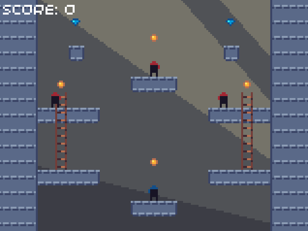
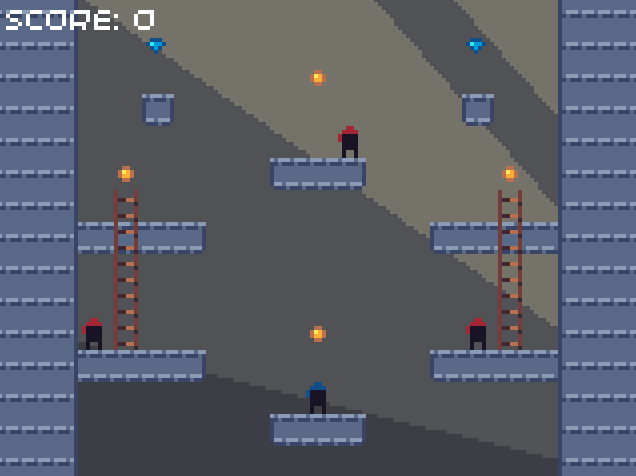
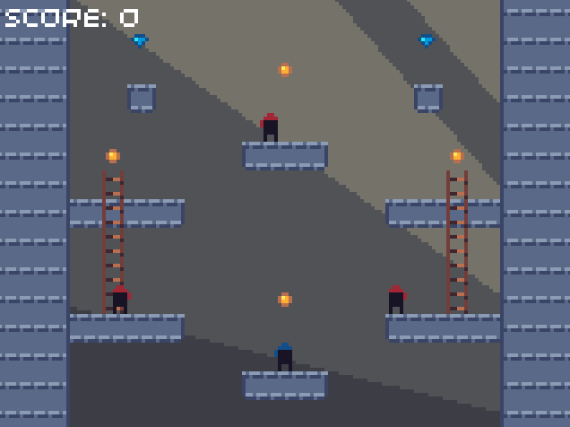
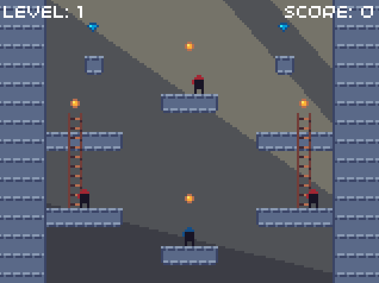
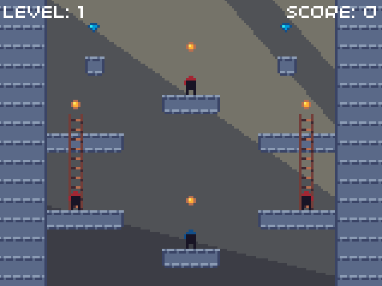
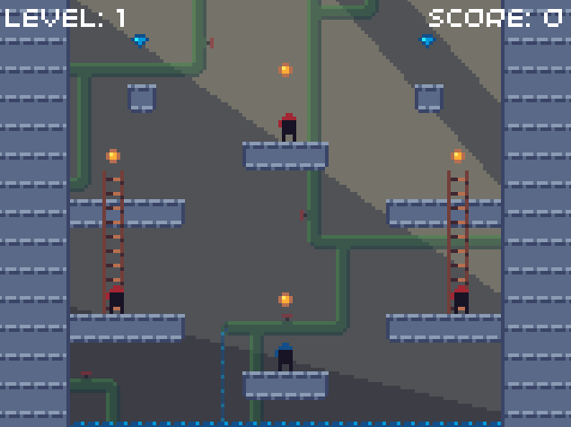

# Episode 5: Final touches

<!-- TODO: Should title be "Finishing up"? -->

Every game needs an objective, along with something which adds difficulty in completing the objective. With this in mind, in this episode we will allow the player to collect coins and gems, and once all the coins are collected, the next level can start. We will also add the ability for the player to die, either by touching an enemy or by falling off the bottom of the screen. Finally, we will add some polish to our game, in the form of visual feedback when the player dies or completes a level, along with adding more interest to the background.

## Adding coins and gems

### Collecting coins and gems

The first feature we will add is the ability for coins and gems to be collected if the player is touching them. In preparation for this, we will need to add some more values to our constants file.


```cpp
// constants.hpp, inside Constants namespace

// Data for "Collectables" (gems and coins), such as value of each
namespace Collectable {
    // The coin and gem sprites are smaller in size
    const uint8_t SIZE = 4;
    // Calculate the gap between the edge of the sprite and the edge of the actual coin/gem
    const uint8_t BORDER = (SPRITE_SIZE - SIZE) / 2;

    // Point value of each
    const uint8_t COIN_SCORE = 2;
    const uint8_t GEM_SCORE = 5;
}
```


```cpp
// constants.hpp, inside Constants namespace

// Data for "Collectables" (gems and coins), such as value of each
namespace Collectable {
    // The coin and gem sprites are smaller in size
    const uint8_t SIZE = 4;
    // Calculate the gap between the edge of the sprite and the edge of the actual coin/gem
    const uint8_t BORDER = (SPRITE_SIZE - SIZE) / 2;

    // Point value of each
    const uint8_t COIN_SCORE = 2;
    const uint8_t GEM_SCORE = 5;
}
```


```python
# constants.py

# Data for "Collectables" (gems and coins), such as value of each
class Collectable:
    # The coin and gem sprites are smaller in size
    SIZE = 4
    # Calculate the gap between the edge of the sprite and the edge of the actual coin/gem
    BORDER = (SPRITE_SIZE - SIZE) // 2

    # Point value of each
    COIN_SCORE = 2
    GEM_SCORE = 5
```



We will need to create a function for coin and gem collision detection, which we will add to the `Ninja` class. It will be similar to the `handle_platform` and `handle_ladder` functions, although it only needs to be implemented in the `PlayerNinja` class. For this reason, the C++ code will declare it as `virtual`.


```cpp
// ninja.hpp

class Ninja {
public:
    // ...

protected:
    // ...

private:
    // ...

    // Only implemented by PlayerNinja
    virtual void handle_scoring(Constants::LevelData& level_data, uint8_t x, uint8_t y);
}
```


```cpp
// ninja.hpp

class Ninja {
public:
    // ...

protected:
    // ...

private:
    // ...

    // Only implemented by PlayerNinja
    virtual void handle_scoring(Constants::LevelData& level_data, uint8_t x, uint8_t y);
}
```


```python
# ninja.py

import constants as Constants

class Ninja:
    # ...

    def handle_scoring(self, level_data, x, y):
        # Only implemented by PlayerNinja
        pass
```



For C++, the definition of the function in the `Ninja` class will be empty:

```cpp
// ninja.cpp

void Ninja::handle_scoring(Constants::LevelData& level_data, uint8_t x, uint8_t y) {
    // Only implemented by PlayerNinja
}
```

First of all, we will declare the overriding function in the `PlayerNinja` class. We will also add a new attribute to the class called `score`, which we will use to keep track of the points the player has collected in the current level.


```cpp
// player_ninja.hpp

class PlayerNinja : public Ninja {
public:
    // ...

private:
    void handle_scoring(Constants::LevelData& level_data, uint8_t x, uint8_t y);

    uint8_t score = 0;
};
```


```cpp
// player_ninja.hpp

class PlayerNinja : public Ninja {
public:
    // ...

private:
    void handle_scoring(Constants::LevelData& level_data, uint8_t x, uint8_t y);

    uint8_t score = 0;
};
```


```python
# player_ninja.py

from ninja import Ninja
import constants as Constants

class PlayerNinja(Ninja):

    def __init__(self, x, y):
        super().__init__(Ninja.Colour.BLUE, x, y)

        self.score = 0

    def handle_scoring(self, level_data, x, y):
        pass
```



The `handle_scoring` function will check if the player is colliding with a coin or gem, and remove it from the level array if so. It will then increase the current score by the point value of the item collected (these point values are declared in the constants file).


```cpp
// player_ninja.cpp

void PlayerNinja::handle_scoring(Constants::LevelData& level_data, uint8_t x, uint8_t y) {
    // Calculate the position of tile in array
    uint8_t array_position = y * Constants::GAME_WIDTH_TILES + x;

    // Get tile's sprite index from level data
    uint8_t tile_id = level_data.extras[array_position];

    // Check the tile is a coin or gem
    if (tile_id == Constants::Sprites::COIN || tile_id == Constants::Sprites::GEM) {

        // Calculate the actual position of the tile from the grid position
        float tile_x = x * Constants::SPRITE_SIZE;
        float tile_y = y * Constants::SPRITE_SIZE;

        // Check if the ninja is colliding with the tile
        // We use a smaller object_size since the coins and gems are smaller, which also means we have to offset the tile_position
        if (check_colliding(tile_x + Constants::Collectable::BORDER, tile_y + Constants::Collectable::BORDER, Constants::Collectable::SIZE)) {

            // Add the correct amount of score if it's a coin or gem tile
            if (tile_id == Constants::Sprites::COIN) {
                score += Constants::Collectable::COIN_SCORE;
            }
            else if (tile_id == Constants::Sprites::GEM) {
                score += Constants::Collectable::GEM_SCORE;
            }

            // Remove item from level data
            level_data.extras[array_position] = Constants::Sprites::BLANK_TILE;
        }
    }
}
```


```cpp
// player_ninja.cpp

void PlayerNinja::handle_scoring(Constants::LevelData& level_data, uint8_t x, uint8_t y) {
    // Calculate position of tile in array
    uint8_t array_position = y * Constants::GAME_WIDTH_TILES + x;

    // Get tile's sprite index from level data
    uint8_t tile_id = level_data.extras[array_position];

    // Check the tile is a coin or gem
    if (tile_id == Constants::Sprites::COIN || tile_id == Constants::Sprites::GEM) {

        // Calculate the actual position of the tile from the grid position
        float tile_x = x * Constants::SPRITE_SIZE;
        float tile_y = y * Constants::SPRITE_SIZE;

        // Check if the ninja is colliding with the tile
        // We use a smaller object_size since the coins and gems are smaller, which also means we have to offset the tile_position
        if (check_colliding(tile_x + Constants::Collectable::BORDER, tile_y + Constants::Collectable::BORDER, Constants::Collectable::SIZE)) {

            // Add the correct amount of score if it's a coin or gem tile
            if (tile_id == Constants::Sprites::COIN) {
                score += Constants::Collectable::COIN_SCORE;
            }
            else if (tile_id == Constants::Sprites::GEM) {
                score += Constants::Collectable::GEM_SCORE;
            }

            // Remove item from level data
            level_data.extras[array_position] = Constants::Sprites::BLANK_TILE;
        }
    }
}
```


```python
# player_ninja.py

def handle_scoring(self, level_data, x, y):
    # Calculate position of tile in array
    array_position = y * Constants.GAME_WIDTH_TILES + x

    # Get tile's sprite index from level data
    tile_id = level_data.extras[array_position]

    # Check the tile is a coin or gem
    if tile_id == Constants.Sprites.COIN or tile_id == Constants.Sprites.GEM:

        # Calculate the actual position of the tile from the grid position
        tile_x = x * Constants.SPRITE_SIZE
        tile_y = y * Constants.SPRITE_SIZE

        # Check if the ninja is colliding with the tile
        # We use a smaller object_size since the coins and gems are smaller, which also means we have to offset the tile_position
        if self.check_object_colliding(tile_x + Constants.Collectable.BORDER, tile_y + Constants.Collectable.BORDER, Constants.Collectable.SIZE):

            # Add the correct amount of score if it's a coin or gem tile
            if tile_id == Constants.Sprites.COIN:
                self.score += Constants.Collectable.COIN_SCORE
            
            elif tile_id == Constants.Sprites.GEM:
                self.score += Constants.Collectable.GEM_SCORE

            # Remove item from level data
            level_data.extras[array_position] = Constants.Sprites.BLANK_TILE
```



Finally, we need to make the `Ninja` class call our new method from within its `handle_collisions` method:


```cpp
// ninja.cpp

void Ninja::handle_collisions(Constants::LevelData& level_data) {
    // ...

    if (x < Constants::GAME_WIDTH_TILES && y < Constants::GAME_HEIGHT_TILES && position_x >= -Constants::Ninja::BORDER && position_y >= 0) {
        // ...

        for (uint8_t y_offset = 0; y_offset < (y == Constants::GAME_HEIGHT_TILES - 1 ? 1 : 2); y_offset++) {

            for (uint8_t x_offset = 0; x_offset < (x == Constants::GAME_WIDTH_TILES - 1 ? 1 : 2); x_offset++) {
                // ...
                
                // Handle scoring
                handle_scoring(level_data, new_x, new_y);
            }
        }
    }

    // ...
}
```


```cpp
// ninja.cpp

void Ninja::handle_collisions(Constants::LevelData& level_data) {
    // ...

    if (x < Constants::GAME_WIDTH_TILES && y < Constants::GAME_HEIGHT_TILES && position_x >= -Constants::Ninja::BORDER && position_y >= 0) {
        // ...

        for (uint8_t y_offset = 0; y_offset < (y == Constants::GAME_HEIGHT_TILES - 1 ? 1 : 2); y_offset++) {

            for (uint8_t x_offset = 0; x_offset < (x == Constants::GAME_WIDTH_TILES - 1 ? 1 : 2); x_offset++) {
                // ...
                
                // Handle scoring
                handle_scoring(level_data, new_x, new_y);
            }
        }
    }

    // ...
}
```


```python
# ninja.py

def handle_collisions(self, level_data):
    # ...

    if x < Constants.GAME_WIDTH_TILES and y < Constants.GAME_HEIGHT_TILES and self.position_x >= -Constants.Ninja.BORDER and self.position_y >= 0:
        # ...

        for y_offset in range(1 if y == Constants.GAME_HEIGHT_TILES - 1 else 2):

            for x_offset in range(1 if x == Constants.GAME_WIDTH_TILES - 1 else 2):
                # ...

                # Handle scoring
                self.handle_scoring(level_data, new_x, new_y)

    # ...
```



If you now run the code, you will see that the coins and gems disappear when the player comes into contact with them:


### Displaying the score

You many notice that the "Score: 0" text doesn't update - it's still our placeholder text! We will need to create a way for the `Level` class to access the `score` attribute of the `PlayerNinja` class. We will do this by creating a *getter* function called `get_score`.

> In Python, the `score` attribute isn't private, so you could do `player.score` (without needing an extra method). In order to keep the code as similar as possible between languages, we will still create the getter function.


```cpp
// player_ninja.hpp

class PlayerNinja : public Ninja {
public:
    // ...

    uint8_t get_score();

private:
    // ...
};

// player_ninja.cpp

uint8_t PlayerNinja::get_score() {
    return score;
}
```


```cpp
// player_ninja.hpp

class PlayerNinja : public Ninja {
public:
    // ...

    uint8_t get_score();

private:
    // ...
};

// player_ninja.cpp

uint8_t PlayerNinja::get_score() {
    return score;
}
```


```python
# player_ninja.py

class PlayerNinja(Ninja):
    # ...

    def get_score(self):
        return self.score
```



We can now use this function in the `render` method of the `Level` class in order to get the score, and with this prepare a string which can be rendered. Don't forget to remove the old placeholder text which displayed "Score: 0".


```cpp
// level.cpp

void Level::render() {
    // ...

    // Render the score text
    std::string score_string = "Score: " + std::to_string(player.get_score());
    screen.text(score_string, minimal_font, Point(2, 2));
}
```


```cpp
// level.cpp

void Level::render() {
    // ...

    // Render the score text
    std::string score_string = "Score: " + std::to_string(player.get_score());
    text(score_string, 2, 2);
}
```


```python
# level.py

def render(self):
    # ...

    # Render the score text
    score_string = "Score: " + str(self.player.get_score())
    text(score_string, 2, 2)
```



When you run the code, the game will run the same as before, but this time the score text now displays the points that the player has collected:



## Adding the ability to win and lose

If the player dies, we will reset the level by creating a new `Level` instance with the same level number. This will have the effect of resetting the position of the player and enemies, and will also reset the score along with all the coins and gems.

If the player collects all the coins in the level, the level is complete and the next level can be started by creating a new level instance with the level number incremented by one.

Since the new level instance must be created from outside the `Level` class, there must be a way for the current level instance to signal when it needs to be reset, or the next level needs to be started. We will create a function called `level_failed`, which will return true if the level needs to be reset. We will also add the `level_complete` function, which will return true if the next level can be started.

The current level can have multiple states:

* The player is in the middle of a level.
* The player has died.
* The player has completed the level.

We can represent these states with an `enum` (in Python, we can use a `class` instead). It will have the following possible states:

* `PLAYING` - the player is in the middle of a level.
* `PLAYER_DEAD` - the player has died, but the level is not ready to be reset (we will use this later on).
* `PLAYER_WON` - the player has won, but the level is not ready to be reset (we will use this later on).
* `FAILED` - the level is ready to be reset.
* `COMPLETE` - the next level can be started.

> The extra two states (`PLAYER_DEAD` and `PLAYER_WON`) will be used to add visual feedback that the level has been completed, or that the player touched an enemy.

We will add this to our `Level` class, along with the functions `level_failed` and `level_complete`:


```cpp
// level.hpp

class Level {
public:
    // ...

    bool level_failed();
    bool level_complete();

private:
    // ...

    enum class LevelState {
        PLAYING,
        PLAYER_DEAD,
        PLAYER_WON,
        FAILED,
        COMPLETE
    };

    LevelState level_state = LevelState::PLAYING;
};

// level.cpp

bool Level::level_failed() {
    return level_state == LevelState::FAILED;
}

bool Level::level_complete() {
    return level_state == LevelState::COMPLETE;
}
```


```cpp
// level.hpp

class Level {
public:
    // ...

    bool level_failed();
    bool level_complete();

private:
    // ...

    enum class LevelState {
        PLAYING,
        PLAYER_DEAD,
        PLAYER_WON,
        FAILED,
        COMPLETE
    };

    LevelState level_state = LevelState::PLAYING;
};

// level.cpp

bool Level::level_failed() {
    return level_state == LevelState::FAILED;
}

bool Level::level_complete() {
    return level_state == LevelState::COMPLETE;
}
```


```python
# level.py

class Level:
    class LevelState:
        PLAYING = 0
        PLAYER_DEAD = 1
        PLAYER_WON = 2
        FAILED = 3
        COMPLETE = 4

    def __init__(self, level_number):
        self.level_number = level_number
        self.level_data = Constants.LEVELS[level_number].copy()

        self.level_state = Level.LevelState.PLAYING

        # ...

    def level_failed(self):
        return self.level_state == Level.LevelState.FAILED

    def level_complete(self):
        return self.level_state == Level.LevelState.COMPLETE
```



### Detecting when the player has died

There are two ways the player can die: by falling off the bottom of the screen, and by touching an enemy. If either of these occur, then `level_state` must be updated to `FAILED`.

Before we can detect collisions between two ninja instances, we need to be able to access the position of each instance. To do this, we will add functions which return the x and y coordinates of the ninja:


```cpp
// ninja.cpp

float Ninja::get_x() {
    return position_x;
}

float Ninja::get_y() {
    return position_y;
}
```


```cpp
// ninja.cpp

float Ninja::get_x() {
    return position_x;
}

float Ninja::get_y() {
    return position_y;
}
```


```python
# ninja.py

class Ninja:
    # ...
    
    def get_x(self):
        return self.position_x

    def get_y(self):
        return self.position_y
```



The C++ function declarations also need to be added to the corresponding header file:

```cpp
// ninja.hpp

class Ninja {
public:
    // ...

    float get_x();
    float get_y();

protected:
    // ...

private:
    // ...
};
```

In order to detect collisions between the player and other enemy ninjas, we will add a `check_colliding` function to the `Ninja` class, which tests for an intersection between the two visible ninja images (in Python this function will be called `check_ninja_colliding`). This function will work in the same way as the `check_colliding` function (or `check_object_colliding` function for Python), but adapted for the shape of the visible ninja sprites.


```cpp
// ninja.cpp

bool Ninja::check_colliding(Ninja& ninja) {
    float ninja_x = ninja.get_x();
    float ninja_y = ninja.get_y();

    return (position_x + Constants::SPRITE_SIZE - Constants::Ninja::BORDER > ninja_x + Constants::Ninja::BORDER &&
            position_x + Constants::Ninja::BORDER < ninja_x + Constants::SPRITE_SIZE - Constants::Ninja::BORDER &&
            position_y + Constants::SPRITE_SIZE > ninja_y &&
            position_y < ninja_y + Constants::SPRITE_SIZE);
}
```


```cpp
// ninja.cpp

bool Ninja::check_colliding(Ninja& ninja) {
    float ninja_x = ninja.get_x();
    float ninja_y = ninja.get_y();

    return (position_x + Constants::SPRITE_SIZE - Constants::Ninja::BORDER > ninja_x + Constants::Ninja::BORDER &&
            position_x + Constants::Ninja::BORDER < ninja_x + Constants::SPRITE_SIZE - Constants::Ninja::BORDER &&
            position_y + Constants::SPRITE_SIZE > ninja_y &&
            position_y < ninja_y + Constants::SPRITE_SIZE);
}
```


```python
# ninja.py

class Ninja:
    # ...

    def check_ninja_colliding(self, ninja):
        ninja_x = ninja.get_x()
        ninja_y = ninja.get_y()

        return (self.position_x + Constants.SPRITE_SIZE - Constants.Ninja.BORDER > ninja_x + Constants.Ninja.BORDER and self.position_x + Constants.Ninja.BORDER < ninja_x + Constants.SPRITE_SIZE - Constants.Ninja.BORDER and
                self.position_y + Constants.SPRITE_SIZE > ninja_y and self.position_y < ninja_y + Constants.SPRITE_SIZE)
```



If you are using C++, you also need to add function declaration to the header file:

```cpp
// ninja.hpp

class Ninja {
public:
    // ...

    bool check_colliding(Ninja& ninja);

protected:
    // ...

private:
    // ...
};
```

We are ready to use our function to detect collisions with enemies. We need to check for collisions between the player and every enemy, which requires iterating through the `enemies` array. In order to avoid unnecessary repeated iteration, we can add the collision check after we call the `update` function for each enemy instance (since we are already iterating through the array here). We will then set the level state to `FAILED` if any of these collision tests returns true.

If the player's position is greater than the height of the game area, then they have fallen off the screen, so we will also set the level state to `FAILED`, so that the level can be reset.

At the same time as adding these checks, we will move the current update code into a `switch` statement to choose between the current level state (in Python, we use a series of `if...elif` blocks instead). For now, this simply results in our player and enemies only being updated if the level is currently playing.

The `update` function in the `Level` class should now look like this:


```cpp
// level.cpp

void Level::update(float dt) {
    switch (level_state) {
    case LevelState::PLAYING:

        // Update player
        player.update(dt, level_data);

        // Update enemies
        for (EnemyNinja& enemy : enemies) {
            enemy.update(dt, level_data);

            if (player.check_colliding(enemy)) {
                // Player touched an enemy, so they're dead
                level_state = LevelState::FAILED;
            }
        }

        if (player.get_y() > Constants::GAME_HEIGHT) {
            // Player has gone off the bottom of the screen, so they're dead
            level_state = LevelState::FAILED;
        }

        break;

    default:
        break;
    }
}
```


```cpp
// level.cpp

void Level::update(float dt) {
    switch (level_state) {
    case LevelState::PLAYING:

        // Update player
        player.update(dt, level_data);

        // Update enemies
        for (EnemyNinja& enemy : enemies) {
            enemy.update(dt, level_data);

            if (player.check_colliding(enemy)) {
                // Player touched an enemy, so they're dead
                level_state = LevelState::FAILED;
            }
        }

        if (player.get_y() > Constants::GAME_HEIGHT) {
            // Player has gone off the bottom of the screen, so they're dead
            level_state = LevelState::FAILED;
        }

        break;

    default:
        break;
    }
}
```


```python
# level.py

def update(self, dt):
    if self.level_state == Level.LevelState.PLAYING:
        # Update player
        self.player.update(dt, self.level_data)

        # Update enemies
        for enemy in self.enemies:
            enemy.update(dt, self.level_data)

            if self.player.check_ninja_colliding(enemy):
                # Player touched an enemy, so they're dead
                self.level_state = Level.LevelState.FAILED

        if self.player.get_y() > Constants.GAME_HEIGHT:
            # Player has gone off the bottom of the screen, so they're dead
            self.level_state = Level.LevelState.FAILED
```



### Detecting when a level is completed

A level is completed when there are no coins remaining. To signify this, we can then set `level_state` to `COMPLETE`.

In order to detect when a level is completed, we will need to create a function called `coins_left` which counts the number of coins remaining. We can iterate through the `level_data.extras` array and use a variable to track the number of coins we encounter:


```cpp
// level.hpp

class Level {
public:
    // ...

private:
    uint8_t coins_left();

    // ...
};

// level.cpp

uint8_t Level::coins_left() {
    uint8_t total = 0;

    for (uint8_t i = 0; i < Constants::GAME_WIDTH_TILES * Constants::GAME_HEIGHT_TILES; i++) {
        if (level_data.extras[i] == Constants::Sprites::COIN) {
            total++;
        }
    }

    return total;
}
```


```cpp
// level.hpp

class Level {
public:
    // ...

private:
    uint8_t coins_left();

    // ...
};

// level.cpp

uint8_t Level::coins_left() {
    uint8_t total = 0;

    for (uint8_t i = 0; i < Constants::GAME_WIDTH_TILES * Constants::GAME_HEIGHT_TILES; i++) {
        if (level_data.extras[i] == Constants::Sprites::COIN) {
            total++;
        }
    }

    return total;
}
```


```python
# level.py

class Level:
    # ...
    
    def coins_left(self):
        total = 0

        for i in range(Constants.GAME_WIDTH_TILES * Constants.GAME_HEIGHT_TILES):
            if self.level_data.extras[i] == Constants.Sprites.COIN:
                total += 1

        return total
```



We can now call this function each frame, and if there are no coins remaining, we can update the `level_state` variable accordingly:


```cpp
// level.cpp

void Level::update(float dt) {
    switch (level_state) {
    case LevelState::PLAYING:

        // Update player
        player.update(dt, level_data);

        if (coins_left() == 0) {
            // No more coins left, so the player has won!
            level_state = LevelState::COMPLETE;
        }

        // ...

        break;

    default:
        break;
    }
}
```


```cpp
// level.cpp

void Level::update(float dt) {
    switch (level_state) {
    case LevelState::PLAYING:

        // Update player
        player.update(dt, level_data);

        if (coins_left() == 0) {
            // No more coins left, so the player has won!
            level_state = LevelState::COMPLETE;
        }

        // ...

        break;

    default:
        break;
    }
}
```


```python
# level.py

def update(self, dt):
    if self.level_state == Level.LevelState.PLAYING:
        # Update player
        self.player.update(dt, self.level_data)

        if self.coins_left() == 0:
            # No more coins left, so the player has won!
            self.level_state = Level.LevelState.COMPLETE

        # ...
```



### Creating new `Level` instances

When we add multiple levels to our game, we will need to keep track of which level the player is currently on. This is necessary for us to be able to select the correct level when we need to restart a level or move on to the next one. The current level number is stored in the `Level` class, so we will add a getter function to access it:


```cpp
// level.hpp

class Level {
public:
    // ...

    uint8_t get_level_number();

private:
    // ...
};

// level.cpp

uint8_t Level::get_level_number() {
    return level_number;
}
```


```cpp
// level.hpp

class Level {
public:
    // ...

    uint8_t get_level_number();

private:
    // ...
};

// level.cpp

uint8_t Level::get_level_number() {
    return level_number;
}
```


```python
# level.py

class Level:
    # ...

    def get_level_number(self):
        return self.level_number
```



In the `update` function of our main game code, we need to check if the level is completed or failed, and handle the result accordingly. If the level was completed, the next level number can be calculated by adding one to the current level number. However, when the final level is completed, we would then attempt to load the next level, which doesn't exist. To avoid this, we will use the modulo operator (`%`) to wrap the level number around, so that it is always below the `LEVEL_COUNT` constant.

> To improve the game, instead of sending the player back to the first level once they have completed all the levels, a screen congratulating the player could be displayed, before allowing them to return to the main menu.


```cpp
// ninja_thief.cpp

void update(uint32_t time) {
    // ...

    level.update(dt);

    if (level.level_failed()) {
        // Restart the same level
        uint8_t level_number = level.get_level_number();

        level = Level(level_number);
    }
    else if (level.level_complete()) {
        // Start the next level
        uint8_t level_number = level.get_level_number() + 1;
        level_number %= Constants::LEVEL_COUNT;

        level = Level(level_number);
    }
}
```


```cpp
// ninja_thief.cpp

void update(uint32_t tick) {
    // ...

    level.update(dt);

    if (level.level_failed()) {
        // Restart the same level
        uint8_t level_number = level.get_level_number();

        level = Level(level_number);
    }
    else if (level.level_complete()) {
        // Start the next level
        uint8_t level_number = level.get_level_number() + 1;
        level_number %= Constants::LEVEL_COUNT;
        
        level = Level(level_number);
    }
}
```


```python
# ninja_thief.py

def update(tick):
    global last_time, level

    # ...

    level.update(dt)

    if level.level_failed():
        # Restart the same level
        level_number = level.get_level_number()

        level = Level(level_number)
    
    elif level.level_complete():
        # Start the next level
        level_number = level.get_level_number() + 1
        level_number %= Constants.LEVEL_COUNT

        level = Level(level_number)
```



> In the Python code, we need to declare `level` as a global variable because we are now re-assigning it when we create a new instance of the `Level` class.

When you run the code, you will notice that the level instantly resets if you die or collect all the coins. It would be good if we could provide some visual feedback to the user when they collect all the coins or touch an enemy, because it currently feels very abrupt.


### Adding visual feedback for dying

In order to make it more obvious when the player dies by touching an enemy, we will make the player jump and fall off the screen, similar to the death animation in Super Mario Bros. This will require adding a variable to the `Ninja` class called `dead`:


```cpp
// ninja.hpp

class Ninja {
public:
    // ...

protected:
    // ...

    // If a ninja is dead, they don't collide with any tiles, but are still affected by gravity
    bool dead = false;

private:
    // ...
};
```


```cpp
// ninja.hpp

class Ninja {
public:
    // ...

protected:
    // ...

    // If a ninja is dead, they don't collide with any tiles, but are still affected by gravity
    bool dead = false;

private:
    // ...
};
```


```python
# ninja.py

class Ninja:
    # ...

    def __init__(self, colour, x, y):
        # ...

        self.dead = False
```



The collision detection and resolution code should only be called if `dead` is false, so that the player can fall through platforms during the death animation. We can achieve this by encasing the call to `handle_collisions` in an if-statement:


```cpp
// ninja.cpp

void Ninja::update(float dt, Constants::LevelData& level_data) {
    // ...

    // Detect and resolve any collisions with platforms, ladders, coins etc, only if the ninja isn't dead
    if (!dead) {
        handle_collisions(level_data);
    }

    // ...
}
```


```cpp
// ninja.cpp

void Ninja::update(float dt, Constants::LevelData& level_data) {
    // ...

    // Detect and resolve any collisions with platforms, ladders, coins etc, only if the ninja isn't dead
    if (!dead) {
        handle_collisions(level_data);
    }

    // ...
}
```


```python
# ninja.py

def update(self, dt, level_data):
    # ...

    # Detect and resolve any collisions with platforms, ladders, coins etc, only if the ninja isn't dead
    if not self.dead:
        self.handle_collisions(level_data)

    # ...
```



Since the `dead` variable is private, we will also need to add a `set_dead` function which can be called when the ninja dies. It is only possible for the player to die, so we will add the function to the `PlayerNinja` class. In this function, we will call the `jump` function, so that the player jumps before falling through the platforms.


```cpp
// player_ninja.hpp

class PlayerNinja : public Ninja {
public:
    // ...

    void set_dead();

private:
    // ...
};

// player_ninja.cpp

void PlayerNinja::set_dead() {
    dead = true;
    jump(Constants::Player::DEATH_JUMP_SPEED);
}
```


```cpp
// player_ninja.hpp

class PlayerNinja : public Ninja {
public:
    // ...

    void set_dead();

private:
    // ...
};

// player_ninja.cpp

void PlayerNinja::set_dead() {
    dead = true;
    jump(Constants::Player::DEATH_JUMP_SPEED);
}
```


```python
# player_ninja.py

class PlayerNinja(Ninja):
    # ...

    def set_dead(self):
        self.dead = True
        self.jump(Constants.Player.DEATH_JUMP_SPEED)
```



We've introduced a new constant called `DEATH_JUMP_SPEED` because we want to separate the normal jump height of the player from the jump height when they die. We will make the death jump height slightly less than the normal jump height:


```cpp
// constants.hpp, inside Constants namespace

namespace Player {
    // ...

    const float DEATH_JUMP_SPEED = 100.0f;

    // ...
}
```


```cpp
// constants.hpp, inside Constants namespace

namespace Player {
    // ...

    const float DEATH_JUMP_SPEED = 100.0f;

    // ...
}
```


```python
# constants.py

class Player:
    # ...
    
    DEATH_JUMP_SPEED = 100

    # ...
```



While our death animation is running, we don't want the enemies to update or move, but we still need to move the player. For this reason, if the player touches an enemy, we will set the level state to `PLAYER_DEAD`, and only set it to `FAILED` when the player falls off the screen at the end of the animation. This will require us to add a new case to our `switch` statement:


```cpp
// level.cpp

void Level::update(float dt) {
    switch (level_state) {
    case LevelState::PLAYING:
        // ...

        // Update enemies
        for (EnemyNinja& enemy : enemies) {
            // ...

            if (player.check_colliding(enemy)) {
                // Player touched an enemy, so they're dead
                level_state = LevelState::PLAYER_DEAD;

                // Trigger "jump and fall" animation before restarting level
                player.set_dead();
            }
        }

        // ...

        break;

    case LevelState::PLAYER_DEAD:

        // Update player
        player.update(dt, level_data);

        if (player.get_y() > Constants::GAME_HEIGHT) {
            // Player has gone off the bottom of the screen, so we can reset the level
            level_state = LevelState::FAILED;
        }

        break;

    default:
        break;
    }
}
```


```cpp
// level.cpp

void Level::update(float dt) {
    switch (level_state) {
    case LevelState::PLAYING:
        // ...

        // Update enemies
        for (EnemyNinja& enemy : enemies) {
            // ...

            if (player.check_colliding(enemy)) {
                // Player touched an enemy, so they're dead
                level_state = LevelState::PLAYER_DEAD;

                // Trigger "jump and fall" animation before restarting level
                player.set_dead();
            }
        }

        // ...

        break;

    case LevelState::PLAYER_DEAD:

        // Update player
        player.update(dt, level_data);

        if (player.get_y() > Constants::GAME_HEIGHT) {
            // Player has gone off the bottom of the screen, so we can reset the level
            level_state = LevelState::FAILED;
        }

        break;

    default:
        break;
    }
}
```


```python
# level.py

def update(self, dt):
    if self.level_state == Level.LevelState.PLAYING:
        # ...

        # Update enemies
        for enemy in self.enemies:
            # ...

            if self.player.check_ninja_colliding(enemy):
                # Player touched an enemy, so they're dead
                self.level_state = Level.LevelState.PLAYER_DEAD

                # Trigger "jump and fall" animation before restarting level
                self.player.set_dead()
        
        # ...

    elif self.level_state == Level.LevelState.PLAYER_DEAD:
        # Update player
        self.player.update(dt, self.level_data)

        if self.player.get_y() > Constants.GAME_HEIGHT:
            # Player has gone off the bottom of the screen, so we can reset the level
            self.level_state = Level.LevelState.FAILED
```



Finally, we need to disable the controls while the death animation is being shown. This requires much of the `update` function in `PlayerNinja` to be encased in an if-statement. The function should now look like this:


```cpp
// player_ninja.cpp

void PlayerNinja::update(float dt, Constants::LevelData& level_data) {
    // If nothing is pressed, the player shouldn't move
    velocity_x = 0.0f;
    
    if (!dead) {
        // Handle any buttons the user has pressed

        // Note: "else if" isn't used, because otherwise the sprite will still move when both buttons are pressed
        // Instead, we add/subtract the velocity, so if both are pressed, nothing happens
        if (pressed(Button::DPAD_LEFT)) {
            velocity_x -= Constants::Player::MAX_SPEED;
        }
        if (pressed(Button::DPAD_RIGHT)) {
            velocity_x += Constants::Player::MAX_SPEED;
        }

        // Handle climbing
        if (can_climb) {
            bool up = pressed(Button::DPAD_UP);
            bool down = pressed(Button::DPAD_DOWN);

            if (up != down) {
                // Only one of up and down are selected
                climbing_state = up ? ClimbingState::UP : ClimbingState::DOWN;
            }
            else if (climbing_state != ClimbingState::NONE) {
                // Player has already been climbing the ladder, and either none or both of up and down are pressed
                climbing_state = ClimbingState::IDLE;
            }
        }

        // Handle jumping
        // Note that we use buttons.pressed, which only contains the buttons just pressed (since the last frame)
        if (buttons.pressed & Button::A) {
            if (can_jump) {
                jump(Constants::Player::JUMP_SPEED);
            }
        }
    }

    // Call parent update method
    Ninja::update(dt, level_data);
}
```


```cpp
// player_ninja.cpp

void PlayerNinja::update(float dt, Constants::LevelData& level_data) {
    // If nothing is pressed, the player shouldn't move
    velocity_x = 0.0f;
    
    if (!dead) {
        // Handle any buttons the user has pressed

        // Note: "else if" isn't used, because otherwise the sprite will still move when both buttons are pressed
        // Instead, we add/subtract the velocity, so if both are pressed, nothing happens
        if (button(LEFT)) {
            velocity_x -= Constants::Player::MAX_SPEED;
        }
        if (button(RIGHT)) {
            velocity_x += Constants::Player::MAX_SPEED;
        }

        // Handle climbing
        if (can_climb) {
            bool up = button(UP);
            bool down = button(DOWN);

            if (up != down) {
                // Only one of up and down are selected
                climbing_state = up ? ClimbingState::UP : ClimbingState::DOWN;
            }
            else if (climbing_state != ClimbingState::NONE) {
                // Player has already been climbing the ladder, and either none or both of up and down are pressed
                climbing_state = ClimbingState::IDLE;
            }
        }

        // Handle jumping
        // Note that we use the pressed function, which returns true if the button was just pressed (since the last frame)
        if (pressed(A)) {
            if (can_jump) {
                // Player is on platform so is allowed to jump
                jump(Constants::Player::JUMP_SPEED);
            }
        }
    }

    // Call parent update method
    Ninja::update(dt, level_data);
}
```


```python
# player_ninja.py

def update(self, dt, level_data):
    # If nothing is pressed, the player shouldn't move
    self.velocity_x = 0
    
    if not self.dead:
        # Handle any buttons the user has pressed
        
        # Note: "else if" isn't used, because otherwise the sprite will still move when both buttons are pressed
        # Instead, we add/subtract the velocity, so if both are pressed, nothing happens
        if button(LEFT):
            self.velocity_x -= Constants.Player.MAX_SPEED
        
        if button(RIGHT):
            self.velocity_x += Constants.Player.MAX_SPEED

        # Handle climbing
        if self.can_climb:
            up = button(UP)
            down = button(DOWN)

            if up != down:
                # Only one of up and down are selected
                self.climbing_state = Ninja.ClimbingState.UP if up else Ninja.ClimbingState.DOWN
            
            elif self.climbing_state != Ninja.ClimbingState.NONE:
                # Player has already been climbing the ladder, and either none or both of up and down are pressed
                self.climbing_state = Ninja.ClimbingState.IDLE

        # Handle jumping
        # Note that we use the pressed function, which returns true if the button was just pressed (since the last frame)
        if pressed(A):
            if self.can_jump:
                self.jump(Constants.Player.JUMP_SPEED)
    

    # Call parent update method
    super().update(dt, level_data)
```



If you now run the code, you will notice that whenever the player dies by touching an enemy, they jump and fall off the screen before the level resets:


### Adding visual feedback for winning

Currently, when the player collects all the coins, the level ends instantly. It would be good to provide an indication that the level has been completed, and we will do this in a similar manner to the previous section. Instead of one large jump, we will make the player perform several small jumps in way of celebration.

To do this, we will need to add a variable called `won` to the `PlayerNinja` class, along with a method to set this variable to true. In addition, we will need a variable to keep track of how many jumps we have remaining in the celebration animation, along with a function to detect when the animation has completed.


```cpp
// player_ninja.hpp

class PlayerNinja : public Ninja {
public:
    // ...

    void set_won();

    bool finished_celebrating();

private:
    // ...

    bool won = false;

    uint8_t celebration_jumps_remaining = Constants::Player::CELEBRATION_JUMP_COUNT;
};

// player_ninja.cpp

void PlayerNinja::set_won() {
    won = true;
}

bool PlayerNinja::finished_celebrating() {
    return can_jump && celebration_jumps_remaining == 0;
}
```


```cpp
// player_ninja.hpp

class PlayerNinja : public Ninja {
public:
    // ...

    void set_won();

    bool finished_celebrating();

private:
    // ...

    bool won = false;

    uint8_t celebration_jumps_remaining = Constants::Player::CELEBRATION_JUMP_COUNT;
};

// player_ninja.cpp

void PlayerNinja::set_won() {
    won = true;
}

bool PlayerNinja::finished_celebrating() {
    return can_jump && celebration_jumps_remaining == 0;
}
```


```python
# player_ninja.py

class PlayerNinja(Ninja):

    def __init__(self, x, y):
        # ...

        self.won = False

        self.celebration_jumps_remaining = Constants.Player.CELEBRATION_JUMP_COUNT

    def set_won(self):
        self.won = True

    def finished_celebrating(self):
        return self.can_jump and self.celebration_jumps_remaining == 0
```



In order to avoid using hard-coded values in our code, we will store the number of jumps to do for the celebration animation in our constants file, as the `CELEBRATION_JUMP_COUNT` constant. We will also add a `CELEBRATION_JUMP_SPEED` constant, so that the player does smaller jumps when the level is complete. 


```cpp
// constants.hpp, inside Constants namespace

namespace Player {
    // ...

    const float CELEBRATION_JUMP_SPEED = 75.0f;
    const uint8_t CELEBRATION_JUMP_COUNT = 3;
}
```


```cpp
// constants.hpp, inside Constants namespace

namespace Player {
    // ...

    const float CELEBRATION_JUMP_SPEED = 75.0f;
    const uint8_t CELEBRATION_JUMP_COUNT = 3;
}
```


```python
# constants.py

class Player:
    # ...

    CELEBRATION_JUMP_SPEED = 75
    CELEBRATION_JUMP_COUNT = 3

```



We will then modify the `update` function of the `PlayerNinja` class so that the player will jump (if it is on a platform) when the level is completed. Each time, it will decrement `celebration_jumps_remaining` until it reaches 0.


```cpp
// player_ninja.cpp

void PlayerNinja::update(float dt, Constants::LevelData& level_data) {
    // ...

    if (won) {
        // Jump in celebration!

        if (can_jump && celebration_jumps_remaining > 0) {
            jump(Constants::Player::CELEBRATION_JUMP_SPEED);
            celebration_jumps_remaining--;
        }
    }
    // Note that this is now an else-if statement:
    else if (!dead) {
        // ...
    }
    
    // ...
}
```


```cpp
// player_ninja.cpp

void PlayerNinja::update(float dt, Constants::LevelData& level_data) {
    // ...

    if (won) {
        // Jump in celebration!

        if (can_jump && celebration_jumps_remaining > 0) {
            jump(Constants::Player::CELEBRATION_JUMP_SPEED);
            celebration_jumps_remaining--;
        }
    }
    // Note that this is now an else-if statement:
    else if (!dead) {
        // ...
    }
    
    // ...
}
```


```python
# player_ninja.py

def update(self, dt, level_data):
    # ...

    if self.won:
        # Jump in celebration!

        if self.can_jump and self.celebration_jumps_remaining > 0:
            self.jump(Constants.Player.CELEBRATION_JUMP_SPEED)
            self.celebration_jumps_remaining -= 1
    
    # Note that this is now an elif statement:
    elif not self.dead:
        # ...

    # ...
```



Finally, we need to add a new case to our `switch` statement, so that only the player is updated, and the level state is set to `COMPLETE` once the animation is finished. We must also change the value assigned to `level_state` when there are no coins left. 


```cpp
// level.cpp

void Level::update(float dt) {
    switch (level_state) {
    case LevelState::PLAYING:
        // ...

        if (coins_left() == 0) {
            // No more coins left, so the player has won!
            level_state = LevelState::PLAYER_WON;

            player.set_won();
        }

        // ...

        break;

    case LevelState::PLAYER_DEAD:
        // ...

    case LevelState::PLAYER_WON:

        // Update player
        player.update(dt, level_data);

        if (player.finished_celebrating() || player.get_y() > Constants::GAME_HEIGHT) {
            // Player has finished doing victory jumps, or has fallen off the screen
            level_state = LevelState::COMPLETE;
        }

        break;

    default:
        break;
    }
}
```


```cpp
// level.cpp

void Level::update(float dt) {
    switch (level_state) {
    case LevelState::PLAYING:
        // ...

        if (coins_left() == 0) {
            // No more coins left, so the player has won!
            level_state = LevelState::PLAYER_WON;

            player.set_won();
        }

        // ...

        break;

    case LevelState::PLAYER_DEAD:
        // ...

    case LevelState::PLAYER_WON:

        // Update player
        player.update(dt, level_data);

        if (player.finished_celebrating() || player.get_y() > Constants::GAME_HEIGHT) {
            // Player has finished doing victory jumps, or has fallen off the screen
            level_state = LevelState::COMPLETE;
        }

        break;

    default:
        break;
    }
}
```


```python
# level.py

def update(self, dt):
    if self.level_state == Level.LevelState.PLAYING:
        # ...

        if self.coins_left() == 0:
            # No more coins left, so the player has won!
            self.level_state = Level.LevelState.PLAYER_WON

            self.player.set_won()

        # ...

    elif self.level_state == Level.LevelState.PLAYER_DEAD:
        # ...

    elif self.level_state == Level.LevelState.PLAYER_WON:
        # Update player
        self.player.update(dt, self.level_data)

        if self.player.finished_celebrating() or self.player.get_y() > Constants.GAME_HEIGHT:
            # Player has finished doing victory jumps, or has fallen off the screen
            self.level_state = Level.LevelState.COMPLETE
```



> If the last coin the player collects is over a gap in the platforms, they will fall down, so we need to complete the game even if they fall off the screen after collecting all the coins.

When you run the code and collect all the coins, the player bounces three times before the next level is started:



## Adding more levels

Currently, there is only one level, so even if you win, the level appears to restart. In the following section, we will add two more levels to the game by adding more data to the constants file. If you want to design your own levels, then you can add even more, by adding more elements to the `LEVELS` array.

> Don't forget to test your own levels, to make sure that they are actually completable, and aren't too difficult! Also, bear in mind that if you are repeatedly testing your game during development, you may end up being much better at playing the game than a new player. This can result in designing levels which are much too difficult for most players, but which seem an alright difficulty to you.

### Adding the level data

Whenever we add a new level to our game, we need to remember to update the `LEVEL_COUNT` constant to keep track of the total number of levels available:


```cpp
// constants.hpp, inside Constants namespace

// Update this line so that we can have 3 levels:
const uint8_t LEVEL_COUNT = 3;
```


```cpp
// constants.hpp, inside Constants namespace

// Update this line so that we can have 3 levels:
const uint8_t LEVEL_COUNT = 3;
```


```python
# constants.py

# Update this line so that we can have 3 levels:
LEVEL_COUNT = 3
```



Now we can add two more items to our `LEVELS` array, each corresponding to a new level in the game. Each of these levels is an instance of `LevelData`, and contains several arrays which determine the platform, ladder, coin, and gem positions, along with the spawn locations of the player and all the enemies.


```cpp
// constants.hpp, inside Constants namespace

const LevelData LEVELS[LEVEL_COUNT] = {
    // Level 1
    {
        // ...
    },
    // Level 2
    {
        // Platform data
        {
            0xff, 0xff, 0xff, 0xff, 0xff, 0xff, 0xff, 0xff, 0xff, 0xff, 0xff, 0xff, 0xff, 0xff, 0xff,
            0xff, 0xff, 0xff, 0xff, 0xff, 0xff, 0xff, 0xff, 0xff, 0xff, 0xff, 0xff, 0xff, 0xff, 0xff,
            0xff, 0xff, 0xff, 0xff, 0xff, 0xff, 0xff, 0xff, 0xff, 0xff, 0xff, 0xff, 0xff, 0xff, 0xff,
            0x01, 0x02, 0xff, 0xff, 0xff, 0xff, 0xff, 0xff, 0xff, 0xff, 0xff, 0xff, 0xff, 0x00, 0x01,
            0xff, 0xff, 0xff, 0xff, 0xff, 0xff, 0x00, 0x01, 0x02, 0xff, 0xff, 0xff, 0xff, 0xff, 0xff,
            0xff, 0xff, 0xff, 0xff, 0xff, 0xff, 0xff, 0xff, 0xff, 0xff, 0xff, 0xff, 0xff, 0xff, 0xff,
            0xff, 0xff, 0xff, 0xff, 0xff, 0xff, 0xff, 0xff, 0xff, 0xff, 0xff, 0xff, 0xff, 0xff, 0xff,
            0xff, 0xff, 0xff, 0xff, 0xff, 0xff, 0xff, 0xff, 0xff, 0xff, 0xff, 0xff, 0xff, 0xff, 0xff,
            0xff, 0xff, 0xff, 0x00, 0x01, 0x02, 0xff, 0xff, 0xff, 0x00, 0x01, 0x02, 0xff, 0xff, 0xff,
            0xff, 0xff, 0xff, 0xff, 0xff, 0xff, 0xff, 0xff, 0xff, 0xff, 0xff, 0xff, 0xff, 0xff, 0xff,
            0xff, 0xff, 0xff, 0xff, 0xff, 0xff, 0xff, 0xff, 0xff, 0xff, 0xff, 0xff, 0xff, 0xff, 0xff,
            0xff, 0xff, 0xff, 0xff, 0xff, 0xff, 0xff, 0xff, 0xff, 0xff, 0xff, 0xff, 0xff, 0xff, 0xff,
            0xff, 0xff, 0xff, 0xff, 0xff, 0xff, 0xff, 0xff, 0xff, 0xff, 0xff, 0xff, 0xff, 0xff, 0xff,
            0xff, 0xff, 0xff, 0xff, 0xff, 0xff, 0xff, 0xff, 0xff, 0xff, 0xff, 0xff, 0xff, 0xff, 0xff,
            0x01, 0x01, 0x02, 0xff, 0xff, 0xff, 0x00, 0x01, 0x02, 0xff, 0xff, 0xff, 0x00, 0x01, 0x01
        },

        // Coin, gem and ladder data
        {
            0xff, 0xff, 0xff, 0xff, 0xff, 0xff, 0xff, 0x13, 0xff, 0xff, 0xff, 0xff, 0xff, 0xff, 0xff,
            0x12, 0xff, 0xff, 0xff, 0xff, 0xff, 0xff, 0xff, 0xff, 0xff, 0xff, 0xff, 0xff, 0xff, 0x12,
            0x0b, 0xff, 0xff, 0xff, 0xff, 0xff, 0xff, 0xff, 0xff, 0xff, 0xff, 0xff, 0xff, 0xff, 0x0b,
            0x0b, 0xff, 0xff, 0xff, 0xff, 0xff, 0xff, 0x0b, 0xff, 0xff, 0xff, 0xff, 0xff, 0xff, 0x0b,
            0x0b, 0xff, 0xff, 0xff, 0xff, 0xff, 0xff, 0x0b, 0xff, 0xff, 0xff, 0xff, 0xff, 0xff, 0x0b,
            0x0b, 0xff, 0xff, 0xff, 0x13, 0xff, 0xff, 0x0b, 0xff, 0xff, 0x13, 0xff, 0xff, 0xff, 0x0b,
            0x0b, 0xff, 0xff, 0xff, 0xff, 0xff, 0xff, 0x0b, 0xff, 0xff, 0xff, 0xff, 0xff, 0xff, 0x0b,
            0xff, 0xff, 0xff, 0xff, 0xff, 0xff, 0xff, 0x0b, 0xff, 0xff, 0xff, 0xff, 0xff, 0xff, 0xff,
            0xff, 0xff, 0xff, 0xff, 0xff, 0xff, 0xff, 0x0b, 0xff, 0xff, 0xff, 0xff, 0xff, 0xff, 0xff,
            0xff, 0xff, 0xff, 0xff, 0xff, 0xff, 0xff, 0x0b, 0xff, 0xff, 0xff, 0xff, 0xff, 0xff, 0xff,
            0xff, 0xff, 0xff, 0xff, 0xff, 0xff, 0xff, 0x0b, 0xff, 0xff, 0xff, 0xff, 0xff, 0xff, 0xff,
            0xff, 0x13, 0xff, 0xff, 0xff, 0xff, 0xff, 0x0b, 0xff, 0xff, 0xff, 0xff, 0xff, 0x13, 0xff,
            0xff, 0xff, 0xff, 0xff, 0xff, 0xff, 0xff, 0x0b, 0xff, 0xff, 0xff, 0xff, 0xff, 0xff, 0xff,
            0xff, 0xff, 0xff, 0xff, 0xff, 0xff, 0xff, 0x0b, 0xff, 0xff, 0xff, 0xff, 0xff, 0xff, 0xff,
            0xff, 0xff, 0xff, 0xff, 0xff, 0xff, 0xff, 0xff, 0xff, 0xff, 0xff, 0xff, 0xff, 0xff, 0xff
        },

        // Entity spawn data
        {
            0xff, 0xff, 0xff, 0xff, 0xff, 0xff, 0xff, 0xff, 0xff, 0xff, 0xff, 0xff, 0xff, 0xff, 0xff,
            0xff, 0xff, 0xff, 0xff, 0xff, 0xff, 0xff, 0xff, 0xff, 0xff, 0xff, 0xff, 0xff, 0xff, 0xff,
            0xff, 0xff, 0xff, 0xff, 0xff, 0xff, 0xff, 0xff, 0xff, 0xff, 0xff, 0xff, 0xff, 0xff, 0xff,
            0xff, 0xff, 0xff, 0xff, 0xff, 0xff, 0xff, 0x24, 0xff, 0xff, 0xff, 0xff, 0xff, 0xff, 0xff,
            0xff, 0xff, 0xff, 0xff, 0xff, 0xff, 0xff, 0xff, 0xff, 0xff, 0xff, 0xff, 0xff, 0xff, 0xff,
            0xff, 0xff, 0xff, 0xff, 0xff, 0xff, 0xff, 0xff, 0xff, 0xff, 0xff, 0xff, 0xff, 0xff, 0xff,
            0xff, 0xff, 0xff, 0xff, 0xff, 0xff, 0xff, 0xff, 0xff, 0xff, 0xff, 0xff, 0xff, 0xff, 0xff,
            0xff, 0xff, 0xff, 0xff, 0x24, 0xff, 0xff, 0xff, 0xff, 0xff, 0x24, 0xff, 0xff, 0xff, 0xff,
            0xff, 0xff, 0xff, 0xff, 0xff, 0xff, 0xff, 0xff, 0xff, 0xff, 0xff, 0xff, 0xff, 0xff, 0xff,
            0xff, 0xff, 0xff, 0xff, 0xff, 0xff, 0xff, 0xff, 0xff, 0xff, 0xff, 0xff, 0xff, 0xff, 0xff,
            0xff, 0xff, 0xff, 0xff, 0xff, 0xff, 0xff, 0xff, 0xff, 0xff, 0xff, 0xff, 0xff, 0xff, 0xff,
            0xff, 0xff, 0xff, 0xff, 0xff, 0xff, 0xff, 0xff, 0xff, 0xff, 0xff, 0xff, 0xff, 0xff, 0xff,
            0xff, 0xff, 0xff, 0xff, 0xff, 0xff, 0xff, 0xff, 0xff, 0xff, 0xff, 0xff, 0xff, 0xff, 0xff,
            0xff, 0x24, 0xff, 0xff, 0xff, 0xff, 0xff, 0x20, 0xff, 0xff, 0xff, 0xff, 0xff, 0x24, 0xff,
            0xff, 0xff, 0xff, 0xff, 0xff, 0xff, 0xff, 0xff, 0xff, 0xff, 0xff, 0xff, 0xff, 0xff, 0xff
        }
    },

    // Level 3
    {
        // Platform data
        {
            0xff, 0xff, 0xff, 0xff, 0xff, 0xff, 0xff, 0xff, 0xff, 0xff, 0xff, 0xff, 0xff, 0xff, 0xff,
            0xff, 0xff, 0xff, 0xff, 0xff, 0xff, 0xff, 0xff, 0xff, 0xff, 0xff, 0xff, 0xff, 0xff, 0xff,
            0xff, 0xff, 0xff, 0xff, 0xff, 0xff, 0xff, 0xff, 0xff, 0xff, 0xff, 0xff, 0xff, 0xff, 0xff,
            0xff, 0xff, 0xff, 0x00, 0x01, 0x02, 0xff, 0xff, 0xff, 0x00, 0x01, 0x02, 0xff, 0xff, 0xff,
            0xff, 0xff, 0xff, 0xff, 0xff, 0xff, 0xff, 0xff, 0xff, 0xff, 0xff, 0xff, 0xff, 0xff, 0xff,
            0xff, 0xff, 0xff, 0xff, 0xff, 0xff, 0xff, 0xff, 0xff, 0xff, 0xff, 0xff, 0xff, 0xff, 0xff,
            0xff, 0xff, 0xff, 0xff, 0xff, 0xff, 0xff, 0xff, 0xff, 0xff, 0xff, 0xff, 0xff, 0xff, 0xff,
            0x02, 0xff, 0xff, 0xff, 0xff, 0xff, 0xff, 0xff, 0xff, 0xff, 0xff, 0xff, 0xff, 0xff, 0x00,
            0xff, 0xff, 0xff, 0xff, 0xff, 0x00, 0x01, 0x01, 0x01, 0x02, 0xff, 0xff, 0xff, 0xff, 0xff,
            0xff, 0xff, 0xff, 0xff, 0xff, 0xff, 0xff, 0xff, 0xff, 0xff, 0xff, 0xff, 0xff, 0xff, 0xff,
            0xff, 0xff, 0xff, 0xff, 0xff, 0xff, 0xff, 0xff, 0xff, 0xff, 0xff, 0xff, 0xff, 0xff, 0xff,
            0xff, 0xff, 0xff, 0xff, 0xff, 0xff, 0xff, 0xff, 0xff, 0xff, 0xff, 0xff, 0xff, 0xff, 0xff,
            0xff, 0xff, 0xff, 0xff, 0xff, 0xff, 0xff, 0xff, 0xff, 0xff, 0xff, 0xff, 0xff, 0xff, 0xff,
            0x01, 0x01, 0x02, 0xff, 0xff, 0xff, 0x00, 0x01, 0x02, 0xff, 0xff, 0xff, 0x00, 0x01, 0x01,
            0xff, 0xff, 0xff, 0xff, 0xff, 0xff, 0xff, 0xff, 0xff, 0xff, 0xff, 0xff, 0xff, 0xff, 0xff
        },

        // Coin, gem and ladder data
        {
            0xff, 0xff, 0xff, 0xff, 0x13, 0xff, 0xff, 0xff, 0xff, 0xff, 0x13, 0xff, 0xff, 0xff, 0xff,
            0xff, 0xff, 0xff, 0xff, 0xff, 0xff, 0xff, 0xff, 0xff, 0xff, 0xff, 0xff, 0xff, 0xff, 0xff,
            0xff, 0xff, 0xff, 0xff, 0xff, 0x0b, 0xff, 0xff, 0xff, 0x0b, 0xff, 0xff, 0xff, 0xff, 0xff,
            0xff, 0xff, 0xff, 0xff, 0xff, 0x0b, 0xff, 0xff, 0xff, 0x0b, 0xff, 0xff, 0xff, 0xff, 0xff,
            0xff, 0xff, 0xff, 0xff, 0xff, 0x0b, 0xff, 0x13, 0xff, 0x0b, 0xff, 0xff, 0xff, 0xff, 0xff,
            0x12, 0xff, 0xff, 0xff, 0xff, 0x0b, 0xff, 0xff, 0xff, 0x0b, 0xff, 0xff, 0xff, 0xff, 0x12,
            0xff, 0xff, 0xff, 0xff, 0xff, 0x0b, 0xff, 0xff, 0xff, 0x0b, 0xff, 0xff, 0xff, 0xff, 0xff,
            0xff, 0xff, 0xff, 0xff, 0xff, 0x0b, 0xff, 0x0b, 0xff, 0x0b, 0xff, 0xff, 0xff, 0xff, 0xff,
            0xff, 0xff, 0xff, 0xff, 0xff, 0xff, 0xff, 0x0b, 0xff, 0xff, 0xff, 0xff, 0xff, 0xff, 0xff,
            0xff, 0xff, 0xff, 0xff, 0xff, 0xff, 0xff, 0x0b, 0xff, 0xff, 0xff, 0xff, 0xff, 0xff, 0xff,
            0xff, 0x13, 0xff, 0xff, 0xff, 0xff, 0xff, 0xff, 0xff, 0xff, 0xff, 0xff, 0xff, 0x13, 0xff,
            0xff, 0xff, 0xff, 0xff, 0xff, 0xff, 0xff, 0xff, 0xff, 0xff, 0xff, 0xff, 0xff, 0xff, 0xff,
            0xff, 0xff, 0xff, 0xff, 0xff, 0xff, 0xff, 0xff, 0xff, 0xff, 0xff, 0xff, 0xff, 0xff, 0xff,
            0xff, 0xff, 0xff, 0xff, 0xff, 0xff, 0xff, 0xff, 0xff, 0xff, 0xff, 0xff, 0xff, 0xff, 0xff,
            0xff, 0xff, 0xff, 0xff, 0xff, 0xff, 0xff, 0xff, 0xff, 0xff, 0xff, 0xff, 0xff, 0xff, 0xff
        },

        // Entity spawn data
        {
            0xff, 0xff, 0xff, 0xff, 0xff, 0xff, 0xff, 0xff, 0xff, 0xff, 0xff, 0xff, 0xff, 0xff, 0xff,
            0xff, 0xff, 0xff, 0xff, 0xff, 0xff, 0xff, 0xff, 0xff, 0xff, 0xff, 0xff, 0xff, 0xff, 0xff,
            0xff, 0xff, 0xff, 0xff, 0x24, 0xff, 0xff, 0xff, 0xff, 0xff, 0x24, 0xff, 0xff, 0xff, 0xff,
            0xff, 0xff, 0xff, 0xff, 0xff, 0xff, 0xff, 0xff, 0xff, 0xff, 0xff, 0xff, 0xff, 0xff, 0xff,
            0xff, 0xff, 0xff, 0xff, 0xff, 0xff, 0xff, 0xff, 0xff, 0xff, 0xff, 0xff, 0xff, 0xff, 0xff,
            0xff, 0xff, 0xff, 0xff, 0xff, 0xff, 0xff, 0xff, 0xff, 0xff, 0xff, 0xff, 0xff, 0xff, 0xff,
            0xff, 0xff, 0xff, 0xff, 0xff, 0xff, 0xff, 0xff, 0xff, 0xff, 0xff, 0xff, 0xff, 0xff, 0xff,
            0xff, 0xff, 0xff, 0xff, 0xff, 0xff, 0xff, 0x24, 0xff, 0xff, 0xff, 0xff, 0xff, 0xff, 0xff,
            0xff, 0xff, 0xff, 0xff, 0xff, 0xff, 0xff, 0xff, 0xff, 0xff, 0xff, 0xff, 0xff, 0xff, 0xff,
            0xff, 0xff, 0xff, 0xff, 0xff, 0xff, 0xff, 0xff, 0xff, 0xff, 0xff, 0xff, 0xff, 0xff, 0xff,
            0xff, 0xff, 0xff, 0xff, 0xff, 0xff, 0xff, 0xff, 0xff, 0xff, 0xff, 0xff, 0xff, 0xff, 0xff,
            0xff, 0xff, 0xff, 0xff, 0xff, 0xff, 0xff, 0xff, 0xff, 0xff, 0xff, 0xff, 0xff, 0xff, 0xff,
            0xff, 0x24, 0xff, 0xff, 0xff, 0xff, 0xff, 0x20, 0xff, 0xff, 0xff, 0xff, 0xff, 0x24, 0xff,
            0xff, 0xff, 0xff, 0xff, 0xff, 0xff, 0xff, 0xff, 0xff, 0xff, 0xff, 0xff, 0xff, 0xff, 0xff,
            0xff, 0xff, 0xff, 0xff, 0xff, 0xff, 0xff, 0xff, 0xff, 0xff, 0xff, 0xff, 0xff, 0xff, 0xff
        }
    }
};
```


```cpp
// constants.hpp, inside Constants namespace

const LevelData LEVELS[LEVEL_COUNT] = {
    // Level 1
    {
        // ...
    },
    // Level 2
    {
        // Platform data
        {
            0xff, 0xff, 0xff, 0xff, 0xff, 0xff, 0xff, 0xff, 0xff, 0xff, 0xff, 0xff, 0xff, 0xff, 0xff,
            0xff, 0xff, 0xff, 0xff, 0xff, 0xff, 0xff, 0xff, 0xff, 0xff, 0xff, 0xff, 0xff, 0xff, 0xff,
            0xff, 0xff, 0xff, 0xff, 0xff, 0xff, 0xff, 0xff, 0xff, 0xff, 0xff, 0xff, 0xff, 0xff, 0xff,
            0x01, 0x02, 0xff, 0xff, 0xff, 0xff, 0xff, 0xff, 0xff, 0xff, 0xff, 0xff, 0xff, 0x00, 0x01,
            0xff, 0xff, 0xff, 0xff, 0xff, 0xff, 0x00, 0x01, 0x02, 0xff, 0xff, 0xff, 0xff, 0xff, 0xff,
            0xff, 0xff, 0xff, 0xff, 0xff, 0xff, 0xff, 0xff, 0xff, 0xff, 0xff, 0xff, 0xff, 0xff, 0xff,
            0xff, 0xff, 0xff, 0xff, 0xff, 0xff, 0xff, 0xff, 0xff, 0xff, 0xff, 0xff, 0xff, 0xff, 0xff,
            0xff, 0xff, 0xff, 0xff, 0xff, 0xff, 0xff, 0xff, 0xff, 0xff, 0xff, 0xff, 0xff, 0xff, 0xff,
            0xff, 0xff, 0xff, 0x00, 0x01, 0x02, 0xff, 0xff, 0xff, 0x00, 0x01, 0x02, 0xff, 0xff, 0xff,
            0xff, 0xff, 0xff, 0xff, 0xff, 0xff, 0xff, 0xff, 0xff, 0xff, 0xff, 0xff, 0xff, 0xff, 0xff,
            0xff, 0xff, 0xff, 0xff, 0xff, 0xff, 0xff, 0xff, 0xff, 0xff, 0xff, 0xff, 0xff, 0xff, 0xff,
            0xff, 0xff, 0xff, 0xff, 0xff, 0xff, 0xff, 0xff, 0xff, 0xff, 0xff, 0xff, 0xff, 0xff, 0xff,
            0xff, 0xff, 0xff, 0xff, 0xff, 0xff, 0xff, 0xff, 0xff, 0xff, 0xff, 0xff, 0xff, 0xff, 0xff,
            0xff, 0xff, 0xff, 0xff, 0xff, 0xff, 0xff, 0xff, 0xff, 0xff, 0xff, 0xff, 0xff, 0xff, 0xff,
            0x01, 0x01, 0x02, 0xff, 0xff, 0xff, 0x00, 0x01, 0x02, 0xff, 0xff, 0xff, 0x00, 0x01, 0x01
        },

        // Coin, gem and ladder data
        {
            0xff, 0xff, 0xff, 0xff, 0xff, 0xff, 0xff, 0x13, 0xff, 0xff, 0xff, 0xff, 0xff, 0xff, 0xff,
            0x12, 0xff, 0xff, 0xff, 0xff, 0xff, 0xff, 0xff, 0xff, 0xff, 0xff, 0xff, 0xff, 0xff, 0x12,
            0x0b, 0xff, 0xff, 0xff, 0xff, 0xff, 0xff, 0xff, 0xff, 0xff, 0xff, 0xff, 0xff, 0xff, 0x0b,
            0x0b, 0xff, 0xff, 0xff, 0xff, 0xff, 0xff, 0x0b, 0xff, 0xff, 0xff, 0xff, 0xff, 0xff, 0x0b,
            0x0b, 0xff, 0xff, 0xff, 0xff, 0xff, 0xff, 0x0b, 0xff, 0xff, 0xff, 0xff, 0xff, 0xff, 0x0b,
            0x0b, 0xff, 0xff, 0xff, 0x13, 0xff, 0xff, 0x0b, 0xff, 0xff, 0x13, 0xff, 0xff, 0xff, 0x0b,
            0x0b, 0xff, 0xff, 0xff, 0xff, 0xff, 0xff, 0x0b, 0xff, 0xff, 0xff, 0xff, 0xff, 0xff, 0x0b,
            0xff, 0xff, 0xff, 0xff, 0xff, 0xff, 0xff, 0x0b, 0xff, 0xff, 0xff, 0xff, 0xff, 0xff, 0xff,
            0xff, 0xff, 0xff, 0xff, 0xff, 0xff, 0xff, 0x0b, 0xff, 0xff, 0xff, 0xff, 0xff, 0xff, 0xff,
            0xff, 0xff, 0xff, 0xff, 0xff, 0xff, 0xff, 0x0b, 0xff, 0xff, 0xff, 0xff, 0xff, 0xff, 0xff,
            0xff, 0xff, 0xff, 0xff, 0xff, 0xff, 0xff, 0x0b, 0xff, 0xff, 0xff, 0xff, 0xff, 0xff, 0xff,
            0xff, 0x13, 0xff, 0xff, 0xff, 0xff, 0xff, 0x0b, 0xff, 0xff, 0xff, 0xff, 0xff, 0x13, 0xff,
            0xff, 0xff, 0xff, 0xff, 0xff, 0xff, 0xff, 0x0b, 0xff, 0xff, 0xff, 0xff, 0xff, 0xff, 0xff,
            0xff, 0xff, 0xff, 0xff, 0xff, 0xff, 0xff, 0x0b, 0xff, 0xff, 0xff, 0xff, 0xff, 0xff, 0xff,
            0xff, 0xff, 0xff, 0xff, 0xff, 0xff, 0xff, 0xff, 0xff, 0xff, 0xff, 0xff, 0xff, 0xff, 0xff
        },

        // Entity spawn data
        {
            0xff, 0xff, 0xff, 0xff, 0xff, 0xff, 0xff, 0xff, 0xff, 0xff, 0xff, 0xff, 0xff, 0xff, 0xff,
            0xff, 0xff, 0xff, 0xff, 0xff, 0xff, 0xff, 0xff, 0xff, 0xff, 0xff, 0xff, 0xff, 0xff, 0xff,
            0xff, 0xff, 0xff, 0xff, 0xff, 0xff, 0xff, 0xff, 0xff, 0xff, 0xff, 0xff, 0xff, 0xff, 0xff,
            0xff, 0xff, 0xff, 0xff, 0xff, 0xff, 0xff, 0x24, 0xff, 0xff, 0xff, 0xff, 0xff, 0xff, 0xff,
            0xff, 0xff, 0xff, 0xff, 0xff, 0xff, 0xff, 0xff, 0xff, 0xff, 0xff, 0xff, 0xff, 0xff, 0xff,
            0xff, 0xff, 0xff, 0xff, 0xff, 0xff, 0xff, 0xff, 0xff, 0xff, 0xff, 0xff, 0xff, 0xff, 0xff,
            0xff, 0xff, 0xff, 0xff, 0xff, 0xff, 0xff, 0xff, 0xff, 0xff, 0xff, 0xff, 0xff, 0xff, 0xff,
            0xff, 0xff, 0xff, 0xff, 0x24, 0xff, 0xff, 0xff, 0xff, 0xff, 0x24, 0xff, 0xff, 0xff, 0xff,
            0xff, 0xff, 0xff, 0xff, 0xff, 0xff, 0xff, 0xff, 0xff, 0xff, 0xff, 0xff, 0xff, 0xff, 0xff,
            0xff, 0xff, 0xff, 0xff, 0xff, 0xff, 0xff, 0xff, 0xff, 0xff, 0xff, 0xff, 0xff, 0xff, 0xff,
            0xff, 0xff, 0xff, 0xff, 0xff, 0xff, 0xff, 0xff, 0xff, 0xff, 0xff, 0xff, 0xff, 0xff, 0xff,
            0xff, 0xff, 0xff, 0xff, 0xff, 0xff, 0xff, 0xff, 0xff, 0xff, 0xff, 0xff, 0xff, 0xff, 0xff,
            0xff, 0xff, 0xff, 0xff, 0xff, 0xff, 0xff, 0xff, 0xff, 0xff, 0xff, 0xff, 0xff, 0xff, 0xff,
            0xff, 0x24, 0xff, 0xff, 0xff, 0xff, 0xff, 0x20, 0xff, 0xff, 0xff, 0xff, 0xff, 0x24, 0xff,
            0xff, 0xff, 0xff, 0xff, 0xff, 0xff, 0xff, 0xff, 0xff, 0xff, 0xff, 0xff, 0xff, 0xff, 0xff
        }
    },

    // Level 3
    {
        // Platform data
        {
            0xff, 0xff, 0xff, 0xff, 0xff, 0xff, 0xff, 0xff, 0xff, 0xff, 0xff, 0xff, 0xff, 0xff, 0xff,
            0xff, 0xff, 0xff, 0xff, 0xff, 0xff, 0xff, 0xff, 0xff, 0xff, 0xff, 0xff, 0xff, 0xff, 0xff,
            0xff, 0xff, 0xff, 0xff, 0xff, 0xff, 0xff, 0xff, 0xff, 0xff, 0xff, 0xff, 0xff, 0xff, 0xff,
            0xff, 0xff, 0xff, 0x00, 0x01, 0x02, 0xff, 0xff, 0xff, 0x00, 0x01, 0x02, 0xff, 0xff, 0xff,
            0xff, 0xff, 0xff, 0xff, 0xff, 0xff, 0xff, 0xff, 0xff, 0xff, 0xff, 0xff, 0xff, 0xff, 0xff,
            0xff, 0xff, 0xff, 0xff, 0xff, 0xff, 0xff, 0xff, 0xff, 0xff, 0xff, 0xff, 0xff, 0xff, 0xff,
            0xff, 0xff, 0xff, 0xff, 0xff, 0xff, 0xff, 0xff, 0xff, 0xff, 0xff, 0xff, 0xff, 0xff, 0xff,
            0x02, 0xff, 0xff, 0xff, 0xff, 0xff, 0xff, 0xff, 0xff, 0xff, 0xff, 0xff, 0xff, 0xff, 0x00,
            0xff, 0xff, 0xff, 0xff, 0xff, 0x00, 0x01, 0x01, 0x01, 0x02, 0xff, 0xff, 0xff, 0xff, 0xff,
            0xff, 0xff, 0xff, 0xff, 0xff, 0xff, 0xff, 0xff, 0xff, 0xff, 0xff, 0xff, 0xff, 0xff, 0xff,
            0xff, 0xff, 0xff, 0xff, 0xff, 0xff, 0xff, 0xff, 0xff, 0xff, 0xff, 0xff, 0xff, 0xff, 0xff,
            0xff, 0xff, 0xff, 0xff, 0xff, 0xff, 0xff, 0xff, 0xff, 0xff, 0xff, 0xff, 0xff, 0xff, 0xff,
            0xff, 0xff, 0xff, 0xff, 0xff, 0xff, 0xff, 0xff, 0xff, 0xff, 0xff, 0xff, 0xff, 0xff, 0xff,
            0x01, 0x01, 0x02, 0xff, 0xff, 0xff, 0x00, 0x01, 0x02, 0xff, 0xff, 0xff, 0x00, 0x01, 0x01,
            0xff, 0xff, 0xff, 0xff, 0xff, 0xff, 0xff, 0xff, 0xff, 0xff, 0xff, 0xff, 0xff, 0xff, 0xff
        },

        // Coin, gem and ladder data
        {
            0xff, 0xff, 0xff, 0xff, 0x13, 0xff, 0xff, 0xff, 0xff, 0xff, 0x13, 0xff, 0xff, 0xff, 0xff,
            0xff, 0xff, 0xff, 0xff, 0xff, 0xff, 0xff, 0xff, 0xff, 0xff, 0xff, 0xff, 0xff, 0xff, 0xff,
            0xff, 0xff, 0xff, 0xff, 0xff, 0x0b, 0xff, 0xff, 0xff, 0x0b, 0xff, 0xff, 0xff, 0xff, 0xff,
            0xff, 0xff, 0xff, 0xff, 0xff, 0x0b, 0xff, 0xff, 0xff, 0x0b, 0xff, 0xff, 0xff, 0xff, 0xff,
            0xff, 0xff, 0xff, 0xff, 0xff, 0x0b, 0xff, 0x13, 0xff, 0x0b, 0xff, 0xff, 0xff, 0xff, 0xff,
            0x12, 0xff, 0xff, 0xff, 0xff, 0x0b, 0xff, 0xff, 0xff, 0x0b, 0xff, 0xff, 0xff, 0xff, 0x12,
            0xff, 0xff, 0xff, 0xff, 0xff, 0x0b, 0xff, 0xff, 0xff, 0x0b, 0xff, 0xff, 0xff, 0xff, 0xff,
            0xff, 0xff, 0xff, 0xff, 0xff, 0x0b, 0xff, 0x0b, 0xff, 0x0b, 0xff, 0xff, 0xff, 0xff, 0xff,
            0xff, 0xff, 0xff, 0xff, 0xff, 0xff, 0xff, 0x0b, 0xff, 0xff, 0xff, 0xff, 0xff, 0xff, 0xff,
            0xff, 0xff, 0xff, 0xff, 0xff, 0xff, 0xff, 0x0b, 0xff, 0xff, 0xff, 0xff, 0xff, 0xff, 0xff,
            0xff, 0x13, 0xff, 0xff, 0xff, 0xff, 0xff, 0xff, 0xff, 0xff, 0xff, 0xff, 0xff, 0x13, 0xff,
            0xff, 0xff, 0xff, 0xff, 0xff, 0xff, 0xff, 0xff, 0xff, 0xff, 0xff, 0xff, 0xff, 0xff, 0xff,
            0xff, 0xff, 0xff, 0xff, 0xff, 0xff, 0xff, 0xff, 0xff, 0xff, 0xff, 0xff, 0xff, 0xff, 0xff,
            0xff, 0xff, 0xff, 0xff, 0xff, 0xff, 0xff, 0xff, 0xff, 0xff, 0xff, 0xff, 0xff, 0xff, 0xff,
            0xff, 0xff, 0xff, 0xff, 0xff, 0xff, 0xff, 0xff, 0xff, 0xff, 0xff, 0xff, 0xff, 0xff, 0xff
        },

        // Entity spawn data
        {
            0xff, 0xff, 0xff, 0xff, 0xff, 0xff, 0xff, 0xff, 0xff, 0xff, 0xff, 0xff, 0xff, 0xff, 0xff,
            0xff, 0xff, 0xff, 0xff, 0xff, 0xff, 0xff, 0xff, 0xff, 0xff, 0xff, 0xff, 0xff, 0xff, 0xff,
            0xff, 0xff, 0xff, 0xff, 0x24, 0xff, 0xff, 0xff, 0xff, 0xff, 0x24, 0xff, 0xff, 0xff, 0xff,
            0xff, 0xff, 0xff, 0xff, 0xff, 0xff, 0xff, 0xff, 0xff, 0xff, 0xff, 0xff, 0xff, 0xff, 0xff,
            0xff, 0xff, 0xff, 0xff, 0xff, 0xff, 0xff, 0xff, 0xff, 0xff, 0xff, 0xff, 0xff, 0xff, 0xff,
            0xff, 0xff, 0xff, 0xff, 0xff, 0xff, 0xff, 0xff, 0xff, 0xff, 0xff, 0xff, 0xff, 0xff, 0xff,
            0xff, 0xff, 0xff, 0xff, 0xff, 0xff, 0xff, 0xff, 0xff, 0xff, 0xff, 0xff, 0xff, 0xff, 0xff,
            0xff, 0xff, 0xff, 0xff, 0xff, 0xff, 0xff, 0x24, 0xff, 0xff, 0xff, 0xff, 0xff, 0xff, 0xff,
            0xff, 0xff, 0xff, 0xff, 0xff, 0xff, 0xff, 0xff, 0xff, 0xff, 0xff, 0xff, 0xff, 0xff, 0xff,
            0xff, 0xff, 0xff, 0xff, 0xff, 0xff, 0xff, 0xff, 0xff, 0xff, 0xff, 0xff, 0xff, 0xff, 0xff,
            0xff, 0xff, 0xff, 0xff, 0xff, 0xff, 0xff, 0xff, 0xff, 0xff, 0xff, 0xff, 0xff, 0xff, 0xff,
            0xff, 0xff, 0xff, 0xff, 0xff, 0xff, 0xff, 0xff, 0xff, 0xff, 0xff, 0xff, 0xff, 0xff, 0xff,
            0xff, 0x24, 0xff, 0xff, 0xff, 0xff, 0xff, 0x20, 0xff, 0xff, 0xff, 0xff, 0xff, 0x24, 0xff,
            0xff, 0xff, 0xff, 0xff, 0xff, 0xff, 0xff, 0xff, 0xff, 0xff, 0xff, 0xff, 0xff, 0xff, 0xff,
            0xff, 0xff, 0xff, 0xff, 0xff, 0xff, 0xff, 0xff, 0xff, 0xff, 0xff, 0xff, 0xff, 0xff, 0xff
        }
    }
};
```


```python
# constants.py

LEVELS = [
    # Level 1
    LevelData(
        # ...
    ),

    # Level 2
    LevelData(
        # Platform data
        [
            0xff, 0xff, 0xff, 0xff, 0xff, 0xff, 0xff, 0xff, 0xff, 0xff, 0xff, 0xff, 0xff, 0xff, 0xff,
            0xff, 0xff, 0xff, 0xff, 0xff, 0xff, 0xff, 0xff, 0xff, 0xff, 0xff, 0xff, 0xff, 0xff, 0xff,
            0xff, 0xff, 0xff, 0xff, 0xff, 0xff, 0xff, 0xff, 0xff, 0xff, 0xff, 0xff, 0xff, 0xff, 0xff,
            0x01, 0x02, 0xff, 0xff, 0xff, 0xff, 0xff, 0xff, 0xff, 0xff, 0xff, 0xff, 0xff, 0x00, 0x01,
            0xff, 0xff, 0xff, 0xff, 0xff, 0xff, 0x00, 0x01, 0x02, 0xff, 0xff, 0xff, 0xff, 0xff, 0xff,
            0xff, 0xff, 0xff, 0xff, 0xff, 0xff, 0xff, 0xff, 0xff, 0xff, 0xff, 0xff, 0xff, 0xff, 0xff,
            0xff, 0xff, 0xff, 0xff, 0xff, 0xff, 0xff, 0xff, 0xff, 0xff, 0xff, 0xff, 0xff, 0xff, 0xff,
            0xff, 0xff, 0xff, 0xff, 0xff, 0xff, 0xff, 0xff, 0xff, 0xff, 0xff, 0xff, 0xff, 0xff, 0xff,
            0xff, 0xff, 0xff, 0x00, 0x01, 0x02, 0xff, 0xff, 0xff, 0x00, 0x01, 0x02, 0xff, 0xff, 0xff,
            0xff, 0xff, 0xff, 0xff, 0xff, 0xff, 0xff, 0xff, 0xff, 0xff, 0xff, 0xff, 0xff, 0xff, 0xff,
            0xff, 0xff, 0xff, 0xff, 0xff, 0xff, 0xff, 0xff, 0xff, 0xff, 0xff, 0xff, 0xff, 0xff, 0xff,
            0xff, 0xff, 0xff, 0xff, 0xff, 0xff, 0xff, 0xff, 0xff, 0xff, 0xff, 0xff, 0xff, 0xff, 0xff,
            0xff, 0xff, 0xff, 0xff, 0xff, 0xff, 0xff, 0xff, 0xff, 0xff, 0xff, 0xff, 0xff, 0xff, 0xff,
            0xff, 0xff, 0xff, 0xff, 0xff, 0xff, 0xff, 0xff, 0xff, 0xff, 0xff, 0xff, 0xff, 0xff, 0xff,
            0x01, 0x01, 0x02, 0xff, 0xff, 0xff, 0x00, 0x01, 0x02, 0xff, 0xff, 0xff, 0x00, 0x01, 0x01
        ],

        # Coin, gem and ladder data
        [
            0xff, 0xff, 0xff, 0xff, 0xff, 0xff, 0xff, 0x13, 0xff, 0xff, 0xff, 0xff, 0xff, 0xff, 0xff,
            0x12, 0xff, 0xff, 0xff, 0xff, 0xff, 0xff, 0xff, 0xff, 0xff, 0xff, 0xff, 0xff, 0xff, 0x12,
            0x0b, 0xff, 0xff, 0xff, 0xff, 0xff, 0xff, 0xff, 0xff, 0xff, 0xff, 0xff, 0xff, 0xff, 0x0b,
            0x0b, 0xff, 0xff, 0xff, 0xff, 0xff, 0xff, 0x0b, 0xff, 0xff, 0xff, 0xff, 0xff, 0xff, 0x0b,
            0x0b, 0xff, 0xff, 0xff, 0xff, 0xff, 0xff, 0x0b, 0xff, 0xff, 0xff, 0xff, 0xff, 0xff, 0x0b,
            0x0b, 0xff, 0xff, 0xff, 0x13, 0xff, 0xff, 0x0b, 0xff, 0xff, 0x13, 0xff, 0xff, 0xff, 0x0b,
            0x0b, 0xff, 0xff, 0xff, 0xff, 0xff, 0xff, 0x0b, 0xff, 0xff, 0xff, 0xff, 0xff, 0xff, 0x0b,
            0xff, 0xff, 0xff, 0xff, 0xff, 0xff, 0xff, 0x0b, 0xff, 0xff, 0xff, 0xff, 0xff, 0xff, 0xff,
            0xff, 0xff, 0xff, 0xff, 0xff, 0xff, 0xff, 0x0b, 0xff, 0xff, 0xff, 0xff, 0xff, 0xff, 0xff,
            0xff, 0xff, 0xff, 0xff, 0xff, 0xff, 0xff, 0x0b, 0xff, 0xff, 0xff, 0xff, 0xff, 0xff, 0xff,
            0xff, 0xff, 0xff, 0xff, 0xff, 0xff, 0xff, 0x0b, 0xff, 0xff, 0xff, 0xff, 0xff, 0xff, 0xff,
            0xff, 0x13, 0xff, 0xff, 0xff, 0xff, 0xff, 0x0b, 0xff, 0xff, 0xff, 0xff, 0xff, 0x13, 0xff,
            0xff, 0xff, 0xff, 0xff, 0xff, 0xff, 0xff, 0x0b, 0xff, 0xff, 0xff, 0xff, 0xff, 0xff, 0xff,
            0xff, 0xff, 0xff, 0xff, 0xff, 0xff, 0xff, 0x0b, 0xff, 0xff, 0xff, 0xff, 0xff, 0xff, 0xff,
            0xff, 0xff, 0xff, 0xff, 0xff, 0xff, 0xff, 0xff, 0xff, 0xff, 0xff, 0xff, 0xff, 0xff, 0xff
        ],

        # Entity spawn data
        [
            0xff, 0xff, 0xff, 0xff, 0xff, 0xff, 0xff, 0xff, 0xff, 0xff, 0xff, 0xff, 0xff, 0xff, 0xff,
            0xff, 0xff, 0xff, 0xff, 0xff, 0xff, 0xff, 0xff, 0xff, 0xff, 0xff, 0xff, 0xff, 0xff, 0xff,
            0xff, 0xff, 0xff, 0xff, 0xff, 0xff, 0xff, 0xff, 0xff, 0xff, 0xff, 0xff, 0xff, 0xff, 0xff,
            0xff, 0xff, 0xff, 0xff, 0xff, 0xff, 0xff, 0x24, 0xff, 0xff, 0xff, 0xff, 0xff, 0xff, 0xff,
            0xff, 0xff, 0xff, 0xff, 0xff, 0xff, 0xff, 0xff, 0xff, 0xff, 0xff, 0xff, 0xff, 0xff, 0xff,
            0xff, 0xff, 0xff, 0xff, 0xff, 0xff, 0xff, 0xff, 0xff, 0xff, 0xff, 0xff, 0xff, 0xff, 0xff,
            0xff, 0xff, 0xff, 0xff, 0xff, 0xff, 0xff, 0xff, 0xff, 0xff, 0xff, 0xff, 0xff, 0xff, 0xff,
            0xff, 0xff, 0xff, 0xff, 0x24, 0xff, 0xff, 0xff, 0xff, 0xff, 0x24, 0xff, 0xff, 0xff, 0xff,
            0xff, 0xff, 0xff, 0xff, 0xff, 0xff, 0xff, 0xff, 0xff, 0xff, 0xff, 0xff, 0xff, 0xff, 0xff,
            0xff, 0xff, 0xff, 0xff, 0xff, 0xff, 0xff, 0xff, 0xff, 0xff, 0xff, 0xff, 0xff, 0xff, 0xff,
            0xff, 0xff, 0xff, 0xff, 0xff, 0xff, 0xff, 0xff, 0xff, 0xff, 0xff, 0xff, 0xff, 0xff, 0xff,
            0xff, 0xff, 0xff, 0xff, 0xff, 0xff, 0xff, 0xff, 0xff, 0xff, 0xff, 0xff, 0xff, 0xff, 0xff,
            0xff, 0xff, 0xff, 0xff, 0xff, 0xff, 0xff, 0xff, 0xff, 0xff, 0xff, 0xff, 0xff, 0xff, 0xff,
            0xff, 0x24, 0xff, 0xff, 0xff, 0xff, 0xff, 0x20, 0xff, 0xff, 0xff, 0xff, 0xff, 0x24, 0xff,
            0xff, 0xff, 0xff, 0xff, 0xff, 0xff, 0xff, 0xff, 0xff, 0xff, 0xff, 0xff, 0xff, 0xff, 0xff
        ]
    ),
    
    # Level 3
    LevelData(
        # Platform data
        [
            0xff, 0xff, 0xff, 0xff, 0xff, 0xff, 0xff, 0xff, 0xff, 0xff, 0xff, 0xff, 0xff, 0xff, 0xff,
            0xff, 0xff, 0xff, 0xff, 0xff, 0xff, 0xff, 0xff, 0xff, 0xff, 0xff, 0xff, 0xff, 0xff, 0xff,
            0xff, 0xff, 0xff, 0xff, 0xff, 0xff, 0xff, 0xff, 0xff, 0xff, 0xff, 0xff, 0xff, 0xff, 0xff,
            0xff, 0xff, 0xff, 0x00, 0x01, 0x02, 0xff, 0xff, 0xff, 0x00, 0x01, 0x02, 0xff, 0xff, 0xff,
            0xff, 0xff, 0xff, 0xff, 0xff, 0xff, 0xff, 0xff, 0xff, 0xff, 0xff, 0xff, 0xff, 0xff, 0xff,
            0xff, 0xff, 0xff, 0xff, 0xff, 0xff, 0xff, 0xff, 0xff, 0xff, 0xff, 0xff, 0xff, 0xff, 0xff,
            0xff, 0xff, 0xff, 0xff, 0xff, 0xff, 0xff, 0xff, 0xff, 0xff, 0xff, 0xff, 0xff, 0xff, 0xff,
            0x02, 0xff, 0xff, 0xff, 0xff, 0xff, 0xff, 0xff, 0xff, 0xff, 0xff, 0xff, 0xff, 0xff, 0x00,
            0xff, 0xff, 0xff, 0xff, 0xff, 0x00, 0x01, 0x01, 0x01, 0x02, 0xff, 0xff, 0xff, 0xff, 0xff,
            0xff, 0xff, 0xff, 0xff, 0xff, 0xff, 0xff, 0xff, 0xff, 0xff, 0xff, 0xff, 0xff, 0xff, 0xff,
            0xff, 0xff, 0xff, 0xff, 0xff, 0xff, 0xff, 0xff, 0xff, 0xff, 0xff, 0xff, 0xff, 0xff, 0xff,
            0xff, 0xff, 0xff, 0xff, 0xff, 0xff, 0xff, 0xff, 0xff, 0xff, 0xff, 0xff, 0xff, 0xff, 0xff,
            0xff, 0xff, 0xff, 0xff, 0xff, 0xff, 0xff, 0xff, 0xff, 0xff, 0xff, 0xff, 0xff, 0xff, 0xff,
            0x01, 0x01, 0x02, 0xff, 0xff, 0xff, 0x00, 0x01, 0x02, 0xff, 0xff, 0xff, 0x00, 0x01, 0x01,
            0xff, 0xff, 0xff, 0xff, 0xff, 0xff, 0xff, 0xff, 0xff, 0xff, 0xff, 0xff, 0xff, 0xff, 0xff
        ],

        # Coin, gem and ladder data
        [
            0xff, 0xff, 0xff, 0xff, 0x13, 0xff, 0xff, 0xff, 0xff, 0xff, 0x13, 0xff, 0xff, 0xff, 0xff,
            0xff, 0xff, 0xff, 0xff, 0xff, 0xff, 0xff, 0xff, 0xff, 0xff, 0xff, 0xff, 0xff, 0xff, 0xff,
            0xff, 0xff, 0xff, 0xff, 0xff, 0x0b, 0xff, 0xff, 0xff, 0x0b, 0xff, 0xff, 0xff, 0xff, 0xff,
            0xff, 0xff, 0xff, 0xff, 0xff, 0x0b, 0xff, 0xff, 0xff, 0x0b, 0xff, 0xff, 0xff, 0xff, 0xff,
            0xff, 0xff, 0xff, 0xff, 0xff, 0x0b, 0xff, 0x13, 0xff, 0x0b, 0xff, 0xff, 0xff, 0xff, 0xff,
            0x12, 0xff, 0xff, 0xff, 0xff, 0x0b, 0xff, 0xff, 0xff, 0x0b, 0xff, 0xff, 0xff, 0xff, 0x12,
            0xff, 0xff, 0xff, 0xff, 0xff, 0x0b, 0xff, 0xff, 0xff, 0x0b, 0xff, 0xff, 0xff, 0xff, 0xff,
            0xff, 0xff, 0xff, 0xff, 0xff, 0x0b, 0xff, 0x0b, 0xff, 0x0b, 0xff, 0xff, 0xff, 0xff, 0xff,
            0xff, 0xff, 0xff, 0xff, 0xff, 0xff, 0xff, 0x0b, 0xff, 0xff, 0xff, 0xff, 0xff, 0xff, 0xff,
            0xff, 0xff, 0xff, 0xff, 0xff, 0xff, 0xff, 0x0b, 0xff, 0xff, 0xff, 0xff, 0xff, 0xff, 0xff,
            0xff, 0x13, 0xff, 0xff, 0xff, 0xff, 0xff, 0xff, 0xff, 0xff, 0xff, 0xff, 0xff, 0x13, 0xff,
            0xff, 0xff, 0xff, 0xff, 0xff, 0xff, 0xff, 0xff, 0xff, 0xff, 0xff, 0xff, 0xff, 0xff, 0xff,
            0xff, 0xff, 0xff, 0xff, 0xff, 0xff, 0xff, 0xff, 0xff, 0xff, 0xff, 0xff, 0xff, 0xff, 0xff,
            0xff, 0xff, 0xff, 0xff, 0xff, 0xff, 0xff, 0xff, 0xff, 0xff, 0xff, 0xff, 0xff, 0xff, 0xff,
            0xff, 0xff, 0xff, 0xff, 0xff, 0xff, 0xff, 0xff, 0xff, 0xff, 0xff, 0xff, 0xff, 0xff, 0xff
        ],

        # Entity spawn data
        [
            0xff, 0xff, 0xff, 0xff, 0xff, 0xff, 0xff, 0xff, 0xff, 0xff, 0xff, 0xff, 0xff, 0xff, 0xff,
            0xff, 0xff, 0xff, 0xff, 0xff, 0xff, 0xff, 0xff, 0xff, 0xff, 0xff, 0xff, 0xff, 0xff, 0xff,
            0xff, 0xff, 0xff, 0xff, 0x24, 0xff, 0xff, 0xff, 0xff, 0xff, 0x24, 0xff, 0xff, 0xff, 0xff,
            0xff, 0xff, 0xff, 0xff, 0xff, 0xff, 0xff, 0xff, 0xff, 0xff, 0xff, 0xff, 0xff, 0xff, 0xff,
            0xff, 0xff, 0xff, 0xff, 0xff, 0xff, 0xff, 0xff, 0xff, 0xff, 0xff, 0xff, 0xff, 0xff, 0xff,
            0xff, 0xff, 0xff, 0xff, 0xff, 0xff, 0xff, 0xff, 0xff, 0xff, 0xff, 0xff, 0xff, 0xff, 0xff,
            0xff, 0xff, 0xff, 0xff, 0xff, 0xff, 0xff, 0xff, 0xff, 0xff, 0xff, 0xff, 0xff, 0xff, 0xff,
            0xff, 0xff, 0xff, 0xff, 0xff, 0xff, 0xff, 0x24, 0xff, 0xff, 0xff, 0xff, 0xff, 0xff, 0xff,
            0xff, 0xff, 0xff, 0xff, 0xff, 0xff, 0xff, 0xff, 0xff, 0xff, 0xff, 0xff, 0xff, 0xff, 0xff,
            0xff, 0xff, 0xff, 0xff, 0xff, 0xff, 0xff, 0xff, 0xff, 0xff, 0xff, 0xff, 0xff, 0xff, 0xff,
            0xff, 0xff, 0xff, 0xff, 0xff, 0xff, 0xff, 0xff, 0xff, 0xff, 0xff, 0xff, 0xff, 0xff, 0xff,
            0xff, 0xff, 0xff, 0xff, 0xff, 0xff, 0xff, 0xff, 0xff, 0xff, 0xff, 0xff, 0xff, 0xff, 0xff,
            0xff, 0x24, 0xff, 0xff, 0xff, 0xff, 0xff, 0x20, 0xff, 0xff, 0xff, 0xff, 0xff, 0x24, 0xff,
            0xff, 0xff, 0xff, 0xff, 0xff, 0xff, 0xff, 0xff, 0xff, 0xff, 0xff, 0xff, 0xff, 0xff, 0xff,
            0xff, 0xff, 0xff, 0xff, 0xff, 0xff, 0xff, 0xff, 0xff, 0xff, 0xff, 0xff, 0xff, 0xff, 0xff
        ]
    )
]
```



Now that we have added the level data and updated the total number of levels, the game will automatically add the new levels in. After you complete the first level, you will notice that the next (new) level starts, rather than the same one being repeated. Since there are only three levels (unless you added some of your own), once you complete the third level then the first level will start again.

> To extend this game, you could add text displaying the overall score, after all the levels have been completed (rather than restarting at level 1 immediately).



### Displaying the current level

Now that we have multiple levels which the player can complete, it would be useful to display the current level that the player is on. We will draw the level number text in the same way as the score text, but we will need to move the score text over to the right side of the screen. This will require us to align it by the top right corner, instead of the top left (so that the distance from the text to the edges of the screen remains the same).

The method of aligning our text varies depending on whether you are using  the 32blit or the PicoSystem. The 32blit SDK provides us with flags which we can pass to the `screen.text` function to specify the "anchor point" of the text. For the PicoSystem SDK, we have to use the `measure` function to calculate the height and width of the text which we will render, and then we can manually offset the text position by this amount.


```cpp
// level.cpp

void Level::render() {
    // ...

    // Render UI text
    
    // Set the text colour to white
    screen.pen = Pen(255, 255, 255);

    // Render level number in top left corner
    std::string level_string = "Level: " + std::to_string(level_number + 1);
    screen.text(level_string, minimal_font, Point(2, 2));

    // Render score in top right corner
    std::string score_string = "Score: " + std::to_string(player.get_score());
    screen.text(score_string, minimal_font, Point(Constants::SCREEN_WIDTH - 2, 2), true, TextAlign::top_right);
}
```


```cpp
// level.cpp

void Level::render() {
    // ...
    
    // Render UI text
    
    // Set the text colour to white
    pen(15, 15, 15);

    // Render level number in top left corner
    std::string level_string = "Level: " + std::to_string(level_number + 1);
    text(level_string, 2, 2);

    // Render score
    std::string score_string = "Score: " + std::to_string(player.get_score());

    // Get size of score text
    int32_t w, h;
    measure(score_string, w, h);

    // Render score in top right corner
    text(score_string, Constants::SCREEN_WIDTH - 2 - w, 2);
}
```


```python
# level.py

def render(self):
    # ...

    # Render UI text
    
    # Set the text colour to white
    pen(15, 15, 15)

    # Render level number in top left corner
    level_string = "Level: " + str(self.level_number + 1)
    text(level_string, 2, 2)

    # Render score
    score_string = "Score: " + str(self.player.get_score())

    # Get size of score text
    w, h = measure(score_string)

    # Render score in top right corner
    text(score_string, Constants.SCREEN_WIDTH - 2 - w, 2)
```



> We need to add one to the level number when creating the string to render, because internally, the game numbers the levels starting at zero, and "Level 0" wouldn't make much sense to an uninformed user.

> For the 32blit code, the order of the optional parameters in the `screen.text` function means that if we want to specify the alignment, then we also need to specify whether to use variable-width spacing, because it comes before the alignment parameter in the function definition.

When you run the code, the current level and score will now both be displayed on the screen:



## Final touches

To add more variety to our game, we will randomly generate the initial direction and speed of the enemies. We will also add some semi-transparent pipes in the background, with some water at the bottom of the screen.

### Randomising enemy direction

In order to select the initial direction the enemy should be facing, we can use the `rand` function (or `choice` in Python) in the `EnemyNinja` constructor:


```cpp
// enemy_ninja.cpp

EnemyNinja::EnemyNinja(float x, float y) : Ninja(Colour::RED, x, y) {
    current_direction = std::rand() % 2 ? 1 : -1;
}
```


```cpp
// enemy_ninja.cpp

EnemyNinja::EnemyNinja(float x, float y) : Ninja(Colour::RED, x, y) {
    current_direction = std::rand() % 2 ? 1 : -1;
}
```


```python
# enemy_ninja.py

class EnemyNinja(Ninja):

    def __init__(self, x, y):
        super().__init__(Ninja.Colour.RED, x, y)

        self.current_direction = choice([-1, 1])

        # ...
```



### Randomising enemy speed

For even more variation, we can randomise the speed of the enemies (within a certain range). We will need to add a `MIN_SPEED` constant to our constants file, which will be used to determine the lower limit for the randomly generated speed. We will also change the `MAX_SPEED` value, so that the average speed remains 15 pixels per second.


```cpp
// constants.hpp, inside Constants namespace

namespace Enemy {
    const float MAX_SPEED = 20.0f;
    const float MIN_SPEED = 10.0f;

    // ...
}
```


```cpp
// constants.hpp, inside Constants namespace

namespace Enemy {
    const float MAX_SPEED = 20.0f;
    const float MIN_SPEED = 10.0f;

    // ...
}
```


```python
# constants.py

class Enemy:
    MAX_SPEED = 20
    MIN_SPEED = 10

    # ...
```



We will also need to add a new private `speed` attribute to the `EnemyNinja` class. This is because each enemy will travel at a different speed, so they each need to store their own speed. We will initialise this speed using code similar to what we used in `random_bool`: we will generate a random value between 0 and 1, scale it up by the difference between `MAX_SPEED` and `MIN_SPEED`, and then add on `MIN_SPEED` to the resulting value:


```cpp
// enemy_ninja.cpp

EnemyNinja::EnemyNinja(float x, float y) : Ninja(Colour::RED, x, y) {
    // ...

    speed = Constants::Enemy::MIN_SPEED + (Constants::Enemy::MAX_SPEED - Constants::Enemy::MIN_SPEED) * std::rand() / static_cast<float>(RAND_MAX);
}
```


```cpp
// enemy_ninja.cpp

EnemyNinja::EnemyNinja(float x, float y) : Ninja(Colour::RED, x, y) {
    // ...

    speed = Constants::Enemy::MIN_SPEED + (Constants::Enemy::MAX_SPEED - Constants::Enemy::MIN_SPEED) * std::rand() / static_cast<float>(RAND_MAX);
}
```


```python
# enemy_ninja.py

class EnemyNinja(Ninja):

    def __init__(self, x, y):
        # ...

        self.speed = Constants.Enemy.MIN_SPEED + (Constants.Enemy.MAX_SPEED - Constants.Enemy.MIN_SPEED) * random()
```



If you are using C++, you will also need to declare the new variable in the header file:

```cpp
// enemy_ninja.hpp

class EnemyNinja : public Ninja {
public:
    // ...

private:
    // ...

    float speed = 0.0f;
};
```

In the `update` function of the `EnemyNinja` class, we now need to use our `speed` variable instead of the `MAX_SPEED` constant:


```cpp
// enemy_ninja.cpp

void EnemyNinja::update(float dt, Constants::LevelData& level_data) {
    if (ai_state == AIState::PATROLLING) {
        // ...

        // Change this line:
        // velocity_x = Constants::Enemy::MAX_SPEED * current_direction;
        // To this:
        velocity_x = speed * current_direction;

        // ...
    }

    // ...
}
```


```cpp
// enemy_ninja.cpp

void EnemyNinja::update(float dt, Constants::LevelData& level_data) {
    if (ai_state == AIState::PATROLLING) {
        // ...

        // Change this line:
        // velocity_x = Constants::Enemy::MAX_SPEED * current_direction;
        // To this:
        velocity_x = speed * current_direction;

        // ...
    }

    // ...
}
```


```python
# enemy_ninja.py

def update(self, dt, level_data):
    if self.ai_state == EnemyNinja.AIState.PATROLLING:
        # ...

        # Change this line:
        # self.velocity_x = Constants.Enemy.MAX_SPEED * self.current_direction
        # To this:
        self.velocity_x = self.speed * self.current_direction

        # ...

    # ...
```



If you run the code, you will see that each enemy now faces a random direction and all of them have a slightly different speed:



### Adding pipes in the background

Next, we will add semi-transparent pipes in the background, which are unique to each level. This isn't necessary, but it helps make the background look more interesting.

> On the PicoSystem, MicroPython is significantly slower than C++, and drawing sprites is particularly time-consuming. Adding these pipes results in a significant performance drop when using MicroPython, so it's probably a good idea to skip this section if you're using MicroPython. Alternatively, you may want to try it out and then remove it afterwards.

We will need to add a new array to our `LevelData` data structure, which we will use to store the new tile data:


```cpp
// constants.hpp, inside Constants namespace

struct LevelData {
    // ...

    // Background pipe data
    uint8_t pipes[GAME_WIDTH_TILES * GAME_HEIGHT_TILES];
};
```


```cpp
// constants.hpp, inside Constants namespace

struct LevelData {
    // ...

    // Background pipe data
    uint8_t pipes[GAME_WIDTH_TILES * GAME_HEIGHT_TILES];
};
```


```python
# constants.py

class LevelData:
    def __init__(self, platforms, extras, entity_spawns, pipes):
        # ...

        # Background pipe data
        self.pipes = pipes

    def copy(self):
        return LevelData(self.platforms.copy(), self.extras.copy(), self.entity_spawns.copy(), self.pipes.copy())
```



Now we can add the new information to the `LEVELS` array:


```cpp
// constants.hpp, inside Constants namespace

const LevelData LEVELS[LEVEL_COUNT] = {
    // Level 1
    {
        // Platform data
        {
            // ...
        },
        
        // Coin, gem and ladder data
        {
            // ...
        },

        // Entity spawn data
        {
            // ...
        },

        // Background pipe data
        {
            0xff, 0xff, 0xff, 0xff, 0x0c, 0xff, 0xff, 0xff, 0x1c, 0x16, 0x17, 0xff, 0xff, 0xff, 0xff,
            0xff, 0xff, 0xff, 0xff, 0x0d, 0xff, 0xff, 0xff, 0x0c, 0xff, 0xff, 0xff, 0xff, 0xff, 0xff,
            0x05, 0x16, 0x16, 0x16, 0x17, 0xff, 0xff, 0xff, 0x0c, 0xff, 0xff, 0xff, 0xff, 0xff, 0xff,
            0x0c, 0xff, 0xff, 0xff, 0xff, 0xff, 0xff, 0xff, 0x0c, 0xff, 0xff, 0xff, 0xff, 0xff, 0xff,
            0x0c, 0xff, 0xff, 0xff, 0xff, 0xff, 0xff, 0xff, 0x0c, 0xff, 0xff, 0xff, 0xff, 0xff, 0xff,
            0x0c, 0xff, 0xff, 0xff, 0xff, 0xff, 0xff, 0xff, 0x0c, 0xff, 0xff, 0xff, 0xff, 0xff, 0xff,
            0x17, 0xff, 0xff, 0xff, 0xff, 0xff, 0xff, 0xff, 0x0c, 0xff, 0xff, 0xff, 0xff, 0xff, 0xff,
            0xff, 0xff, 0xff, 0xff, 0xff, 0xff, 0xff, 0xff, 0x0f, 0xff, 0xff, 0xff, 0xff, 0xff, 0xff,
            0xff, 0xff, 0xff, 0xff, 0xff, 0xff, 0xff, 0xff, 0x14, 0x05, 0x16, 0x16, 0x16, 0x16, 0x16,
            0xff, 0xff, 0xff, 0xff, 0xff, 0xff, 0xff, 0xff, 0xff, 0x0c, 0xff, 0xff, 0xff, 0xff, 0xff,
            0xff, 0xff, 0xff, 0xff, 0xff, 0xff, 0xff, 0xff, 0xff, 0x0c, 0xff, 0xff, 0xff, 0xff, 0xff,
            0xff, 0xff, 0xff, 0xff, 0xff, 0x11, 0x05, 0x06, 0x16, 0x17, 0xff, 0xff, 0xff, 0xff, 0xff,
            0xff, 0xff, 0xff, 0xff, 0xff, 0x19, 0x0c, 0xff, 0xff, 0xff, 0xff, 0xff, 0xff, 0xff, 0xff,
            0x06, 0x07, 0xff, 0xff, 0xff, 0x19, 0x0c, 0xff, 0xff, 0xff, 0xff, 0xff, 0xff, 0xff, 0xff,
            0xff, 0x0c, 0xff, 0xff, 0xff, 0x19, 0x0c, 0xff, 0xff, 0xff, 0xff, 0xff, 0xff, 0xff, 0xff
        }
    },
    // Level 2
    {
        // Platform data
        {
            // ...
        },

        // Coin, gem and ladder data
        {
            // ...
        },

        // Entity spawn data
        {
            // ...
        },

        // Background pipe data
        {
            0xff, 0xff, 0xff, 0xff, 0x0c, 0xff, 0xff, 0xff, 0x14, 0x16, 0x1d, 0xff, 0xff, 0x0c, 0xff,
            0xff, 0xff, 0xff, 0xff, 0x0c, 0xff, 0xff, 0xff, 0xff, 0xff, 0x0c, 0xff, 0xff, 0x0c, 0xff,
            0xff, 0xff, 0xff, 0xff, 0x0c, 0xff, 0xff, 0xff, 0xff, 0xff, 0x14, 0x06, 0x16, 0x1d, 0xff,
            0xff, 0xff, 0xff, 0xff, 0x0f, 0xff, 0xff, 0xff, 0xff, 0xff, 0xff, 0xff, 0xff, 0x0c, 0xff,
            0x16, 0x16, 0x16, 0x05, 0x17, 0xff, 0xff, 0xff, 0xff, 0xff, 0xff, 0xff, 0xff, 0x0f, 0xff,
            0xff, 0xff, 0xff, 0x0c, 0xff, 0xff, 0xff, 0xff, 0xff, 0xff, 0xff, 0xff, 0xff, 0x14, 0x16,
            0xff, 0xff, 0xff, 0x0c, 0xff, 0xff, 0xff, 0xff, 0xff, 0xff, 0xff, 0xff, 0xff, 0xff, 0xff,
            0xff, 0xff, 0xff, 0x0c, 0xff, 0xff, 0xff, 0xff, 0xff, 0xff, 0xff, 0xff, 0xff, 0xff, 0xff,
            0xff, 0xff, 0xff, 0x0c, 0xff, 0xff, 0xff, 0xff, 0xff, 0xff, 0xff, 0xff, 0xff, 0xff, 0xff,
            0xff, 0xff, 0xff, 0x0d, 0xff, 0xff, 0xff, 0xff, 0xff, 0xff, 0xff, 0xff, 0xff, 0xff, 0xff,
            0x04, 0x16, 0x16, 0x15, 0x10, 0xff, 0xff, 0xff, 0xff, 0xff, 0xff, 0xff, 0xff, 0xff, 0xff,
            0x0c, 0xff, 0xff, 0xff, 0x18, 0xff, 0xff, 0xff, 0xff, 0xff, 0xff, 0xff, 0xff, 0xff, 0xff,
            0x0c, 0xff, 0xff, 0xff, 0x18, 0xff, 0xff, 0xff, 0xff, 0xff, 0xff, 0x11, 0x06, 0x07, 0xff,
            0x1c, 0x16, 0x06, 0x07, 0x18, 0xff, 0xff, 0xff, 0xff, 0xff, 0xff, 0x19, 0xff, 0x1c, 0x16,
            0x0c, 0xff, 0xff, 0x0c, 0x18, 0xff, 0xff, 0xff, 0xff, 0xff, 0xff, 0x19, 0xff, 0x0c, 0xff
        }
    },

    // Level 3
    {
        // Platform data
        {
            // ...
        },

        // Coin, gem and ladder data
        {
            // ...
        },

        // Entity spawn data
        {
            // ...
        },

        // Background pipe data
        {
            0xff, 0x0c, 0xff, 0xff, 0xff, 0xff, 0x0c, 0xff, 0xff, 0xff, 0xff, 0x0c, 0xff, 0x0c, 0xff,
            0xff, 0x0c, 0xff, 0xff, 0xff, 0xff, 0x0f, 0xff, 0xff, 0xff, 0xff, 0x14, 0x06, 0x1d, 0xff,
            0xff, 0x14, 0x07, 0xff, 0xff, 0xff, 0x0c, 0xff, 0xff, 0xff, 0xff, 0xff, 0xff, 0x14, 0x16,
            0xff, 0xff, 0x1c, 0x16, 0x16, 0x16, 0x17, 0xff, 0xff, 0xff, 0xff, 0xff, 0xff, 0xff, 0xff,
            0xff, 0xff, 0x0c, 0xff, 0xff, 0xff, 0xff, 0xff, 0xff, 0xff, 0xff, 0xff, 0xff, 0xff, 0xff,
            0xff, 0xff, 0x0c, 0xff, 0xff, 0xff, 0xff, 0xff, 0xff, 0xff, 0xff, 0xff, 0xff, 0xff, 0xff,
            0x05, 0x16, 0x0e, 0x06, 0x10, 0xff, 0xff, 0xff, 0xff, 0xff, 0xff, 0xff, 0xff, 0xff, 0xff,
            0x0c, 0xff, 0x0c, 0xff, 0x18, 0xff, 0xff, 0xff, 0xff, 0xff, 0xff, 0xff, 0x04, 0x16, 0x16,
            0x14, 0x16, 0x1d, 0xff, 0x18, 0xff, 0xff, 0xff, 0xff, 0xff, 0xff, 0xff, 0x0f, 0xff, 0xff,
            0xff, 0xff, 0x0c, 0xff, 0x18, 0xff, 0xff, 0xff, 0xff, 0xff, 0x04, 0x16, 0x15, 0x16, 0x16,
            0xff, 0xff, 0x0c, 0xff, 0x18, 0xff, 0xff, 0xff, 0xff, 0xff, 0x0c, 0xff, 0xff, 0xff, 0xff,
            0xff, 0xff, 0x0c, 0xff, 0x18, 0xff, 0xff, 0xff, 0x11, 0x06, 0x1d, 0xff, 0xff, 0xff, 0xff,
            0xff, 0xff, 0x0f, 0xff, 0x18, 0xff, 0xff, 0xff, 0x19, 0xff, 0x0c, 0xff, 0xff, 0xff, 0xff,
            0x16, 0x16, 0x15, 0x07, 0x18, 0xff, 0xff, 0xff, 0x19, 0xff, 0x0c, 0xff, 0xff, 0xff, 0xff,
            0xff, 0xff, 0xff, 0x0c, 0x18, 0xff, 0xff, 0xff, 0x19, 0xff, 0x0c, 0xff, 0xff, 0xff, 0xff
        }
    }
};
```


```cpp
// constants.hpp, inside Constants namespace

const LevelData LEVELS[LEVEL_COUNT] = {
    // Level 1
    {
        // Platform data
        {
            // ...
        },
        
        // Coin, gem and ladder data
        {
            // ...
        },

        // Entity spawn data
        {
            // ...
        },

        // Background pipe data
        {
            0xff, 0xff, 0xff, 0xff, 0x0c, 0xff, 0xff, 0xff, 0x1c, 0x16, 0x17, 0xff, 0xff, 0xff, 0xff,
            0xff, 0xff, 0xff, 0xff, 0x0d, 0xff, 0xff, 0xff, 0x0c, 0xff, 0xff, 0xff, 0xff, 0xff, 0xff,
            0x05, 0x16, 0x16, 0x16, 0x17, 0xff, 0xff, 0xff, 0x0c, 0xff, 0xff, 0xff, 0xff, 0xff, 0xff,
            0x0c, 0xff, 0xff, 0xff, 0xff, 0xff, 0xff, 0xff, 0x0c, 0xff, 0xff, 0xff, 0xff, 0xff, 0xff,
            0x0c, 0xff, 0xff, 0xff, 0xff, 0xff, 0xff, 0xff, 0x0c, 0xff, 0xff, 0xff, 0xff, 0xff, 0xff,
            0x0c, 0xff, 0xff, 0xff, 0xff, 0xff, 0xff, 0xff, 0x0c, 0xff, 0xff, 0xff, 0xff, 0xff, 0xff,
            0x17, 0xff, 0xff, 0xff, 0xff, 0xff, 0xff, 0xff, 0x0c, 0xff, 0xff, 0xff, 0xff, 0xff, 0xff,
            0xff, 0xff, 0xff, 0xff, 0xff, 0xff, 0xff, 0xff, 0x0f, 0xff, 0xff, 0xff, 0xff, 0xff, 0xff,
            0xff, 0xff, 0xff, 0xff, 0xff, 0xff, 0xff, 0xff, 0x14, 0x05, 0x16, 0x16, 0x16, 0x16, 0x16,
            0xff, 0xff, 0xff, 0xff, 0xff, 0xff, 0xff, 0xff, 0xff, 0x0c, 0xff, 0xff, 0xff, 0xff, 0xff,
            0xff, 0xff, 0xff, 0xff, 0xff, 0xff, 0xff, 0xff, 0xff, 0x0c, 0xff, 0xff, 0xff, 0xff, 0xff,
            0xff, 0xff, 0xff, 0xff, 0xff, 0x11, 0x05, 0x06, 0x16, 0x17, 0xff, 0xff, 0xff, 0xff, 0xff,
            0xff, 0xff, 0xff, 0xff, 0xff, 0x19, 0x0c, 0xff, 0xff, 0xff, 0xff, 0xff, 0xff, 0xff, 0xff,
            0x06, 0x07, 0xff, 0xff, 0xff, 0x19, 0x0c, 0xff, 0xff, 0xff, 0xff, 0xff, 0xff, 0xff, 0xff,
            0xff, 0x0c, 0xff, 0xff, 0xff, 0x19, 0x0c, 0xff, 0xff, 0xff, 0xff, 0xff, 0xff, 0xff, 0xff
        }
    },
    // Level 2
    {
        // Platform data
        {
            // ...
        },

        // Coin, gem and ladder data
        {
            // ...
        },

        // Entity spawn data
        {
            // ...
        },

        // Background pipe data
        {
            0xff, 0xff, 0xff, 0xff, 0x0c, 0xff, 0xff, 0xff, 0x14, 0x16, 0x1d, 0xff, 0xff, 0x0c, 0xff,
            0xff, 0xff, 0xff, 0xff, 0x0c, 0xff, 0xff, 0xff, 0xff, 0xff, 0x0c, 0xff, 0xff, 0x0c, 0xff,
            0xff, 0xff, 0xff, 0xff, 0x0c, 0xff, 0xff, 0xff, 0xff, 0xff, 0x14, 0x06, 0x16, 0x1d, 0xff,
            0xff, 0xff, 0xff, 0xff, 0x0f, 0xff, 0xff, 0xff, 0xff, 0xff, 0xff, 0xff, 0xff, 0x0c, 0xff,
            0x16, 0x16, 0x16, 0x05, 0x17, 0xff, 0xff, 0xff, 0xff, 0xff, 0xff, 0xff, 0xff, 0x0f, 0xff,
            0xff, 0xff, 0xff, 0x0c, 0xff, 0xff, 0xff, 0xff, 0xff, 0xff, 0xff, 0xff, 0xff, 0x14, 0x16,
            0xff, 0xff, 0xff, 0x0c, 0xff, 0xff, 0xff, 0xff, 0xff, 0xff, 0xff, 0xff, 0xff, 0xff, 0xff,
            0xff, 0xff, 0xff, 0x0c, 0xff, 0xff, 0xff, 0xff, 0xff, 0xff, 0xff, 0xff, 0xff, 0xff, 0xff,
            0xff, 0xff, 0xff, 0x0c, 0xff, 0xff, 0xff, 0xff, 0xff, 0xff, 0xff, 0xff, 0xff, 0xff, 0xff,
            0xff, 0xff, 0xff, 0x0d, 0xff, 0xff, 0xff, 0xff, 0xff, 0xff, 0xff, 0xff, 0xff, 0xff, 0xff,
            0x04, 0x16, 0x16, 0x15, 0x10, 0xff, 0xff, 0xff, 0xff, 0xff, 0xff, 0xff, 0xff, 0xff, 0xff,
            0x0c, 0xff, 0xff, 0xff, 0x18, 0xff, 0xff, 0xff, 0xff, 0xff, 0xff, 0xff, 0xff, 0xff, 0xff,
            0x0c, 0xff, 0xff, 0xff, 0x18, 0xff, 0xff, 0xff, 0xff, 0xff, 0xff, 0x11, 0x06, 0x07, 0xff,
            0x1c, 0x16, 0x06, 0x07, 0x18, 0xff, 0xff, 0xff, 0xff, 0xff, 0xff, 0x19, 0xff, 0x1c, 0x16,
            0x0c, 0xff, 0xff, 0x0c, 0x18, 0xff, 0xff, 0xff, 0xff, 0xff, 0xff, 0x19, 0xff, 0x0c, 0xff
        }
    },

    // Level 3
    {
        // Platform data
        {
            // ...
        },

        // Coin, gem and ladder data
        {
            // ...
        },

        // Entity spawn data
        {
            // ...
        },

        // Background pipe data
        {
            0xff, 0x0c, 0xff, 0xff, 0xff, 0xff, 0x0c, 0xff, 0xff, 0xff, 0xff, 0x0c, 0xff, 0x0c, 0xff,
            0xff, 0x0c, 0xff, 0xff, 0xff, 0xff, 0x0f, 0xff, 0xff, 0xff, 0xff, 0x14, 0x06, 0x1d, 0xff,
            0xff, 0x14, 0x07, 0xff, 0xff, 0xff, 0x0c, 0xff, 0xff, 0xff, 0xff, 0xff, 0xff, 0x14, 0x16,
            0xff, 0xff, 0x1c, 0x16, 0x16, 0x16, 0x17, 0xff, 0xff, 0xff, 0xff, 0xff, 0xff, 0xff, 0xff,
            0xff, 0xff, 0x0c, 0xff, 0xff, 0xff, 0xff, 0xff, 0xff, 0xff, 0xff, 0xff, 0xff, 0xff, 0xff,
            0xff, 0xff, 0x0c, 0xff, 0xff, 0xff, 0xff, 0xff, 0xff, 0xff, 0xff, 0xff, 0xff, 0xff, 0xff,
            0x05, 0x16, 0x0e, 0x06, 0x10, 0xff, 0xff, 0xff, 0xff, 0xff, 0xff, 0xff, 0xff, 0xff, 0xff,
            0x0c, 0xff, 0x0c, 0xff, 0x18, 0xff, 0xff, 0xff, 0xff, 0xff, 0xff, 0xff, 0x04, 0x16, 0x16,
            0x14, 0x16, 0x1d, 0xff, 0x18, 0xff, 0xff, 0xff, 0xff, 0xff, 0xff, 0xff, 0x0f, 0xff, 0xff,
            0xff, 0xff, 0x0c, 0xff, 0x18, 0xff, 0xff, 0xff, 0xff, 0xff, 0x04, 0x16, 0x15, 0x16, 0x16,
            0xff, 0xff, 0x0c, 0xff, 0x18, 0xff, 0xff, 0xff, 0xff, 0xff, 0x0c, 0xff, 0xff, 0xff, 0xff,
            0xff, 0xff, 0x0c, 0xff, 0x18, 0xff, 0xff, 0xff, 0x11, 0x06, 0x1d, 0xff, 0xff, 0xff, 0xff,
            0xff, 0xff, 0x0f, 0xff, 0x18, 0xff, 0xff, 0xff, 0x19, 0xff, 0x0c, 0xff, 0xff, 0xff, 0xff,
            0x16, 0x16, 0x15, 0x07, 0x18, 0xff, 0xff, 0xff, 0x19, 0xff, 0x0c, 0xff, 0xff, 0xff, 0xff,
            0xff, 0xff, 0xff, 0x0c, 0x18, 0xff, 0xff, 0xff, 0x19, 0xff, 0x0c, 0xff, 0xff, 0xff, 0xff
        }
    }
};
```


```python
# constants.py

LEVELS = [
    # Level 1
    LevelData(
        # Platform data
        [
            # ...
        ],
        
        # Coin, gem and ladder data
        [
            # ...
        ],

        # Entity spawn data
        [
            # ...
        ],

        # Background pipe data
        [
            0xff, 0xff, 0xff, 0xff, 0x0c, 0xff, 0xff, 0xff, 0x1c, 0x16, 0x17, 0xff, 0xff, 0xff, 0xff,
            0xff, 0xff, 0xff, 0xff, 0x0d, 0xff, 0xff, 0xff, 0x0c, 0xff, 0xff, 0xff, 0xff, 0xff, 0xff,
            0x05, 0x16, 0x16, 0x16, 0x17, 0xff, 0xff, 0xff, 0x0c, 0xff, 0xff, 0xff, 0xff, 0xff, 0xff,
            0x0c, 0xff, 0xff, 0xff, 0xff, 0xff, 0xff, 0xff, 0x0c, 0xff, 0xff, 0xff, 0xff, 0xff, 0xff,
            0x0c, 0xff, 0xff, 0xff, 0xff, 0xff, 0xff, 0xff, 0x0c, 0xff, 0xff, 0xff, 0xff, 0xff, 0xff,
            0x0c, 0xff, 0xff, 0xff, 0xff, 0xff, 0xff, 0xff, 0x0c, 0xff, 0xff, 0xff, 0xff, 0xff, 0xff,
            0x17, 0xff, 0xff, 0xff, 0xff, 0xff, 0xff, 0xff, 0x0c, 0xff, 0xff, 0xff, 0xff, 0xff, 0xff,
            0xff, 0xff, 0xff, 0xff, 0xff, 0xff, 0xff, 0xff, 0x0f, 0xff, 0xff, 0xff, 0xff, 0xff, 0xff,
            0xff, 0xff, 0xff, 0xff, 0xff, 0xff, 0xff, 0xff, 0x14, 0x05, 0x16, 0x16, 0x16, 0x16, 0x16,
            0xff, 0xff, 0xff, 0xff, 0xff, 0xff, 0xff, 0xff, 0xff, 0x0c, 0xff, 0xff, 0xff, 0xff, 0xff,
            0xff, 0xff, 0xff, 0xff, 0xff, 0xff, 0xff, 0xff, 0xff, 0x0c, 0xff, 0xff, 0xff, 0xff, 0xff,
            0xff, 0xff, 0xff, 0xff, 0xff, 0x11, 0x05, 0x06, 0x16, 0x17, 0xff, 0xff, 0xff, 0xff, 0xff,
            0xff, 0xff, 0xff, 0xff, 0xff, 0x19, 0x0c, 0xff, 0xff, 0xff, 0xff, 0xff, 0xff, 0xff, 0xff,
            0x06, 0x07, 0xff, 0xff, 0xff, 0x19, 0x0c, 0xff, 0xff, 0xff, 0xff, 0xff, 0xff, 0xff, 0xff,
            0xff, 0x0c, 0xff, 0xff, 0xff, 0x19, 0x0c, 0xff, 0xff, 0xff, 0xff, 0xff, 0xff, 0xff, 0xff
        ]
    ),

    # Level 2
    LevelData(
        # Platform data
        [
            # ...
        ],

        # Coin, gem and ladder data
        [
            # ...
        ],

        # Entity spawn data
        [
            # ...
        ],

        # Background pipe data
        [
            0xff, 0xff, 0xff, 0xff, 0x0c, 0xff, 0xff, 0xff, 0x14, 0x16, 0x1d, 0xff, 0xff, 0x0c, 0xff,
            0xff, 0xff, 0xff, 0xff, 0x0c, 0xff, 0xff, 0xff, 0xff, 0xff, 0x0c, 0xff, 0xff, 0x0c, 0xff,
            0xff, 0xff, 0xff, 0xff, 0x0c, 0xff, 0xff, 0xff, 0xff, 0xff, 0x14, 0x06, 0x16, 0x1d, 0xff,
            0xff, 0xff, 0xff, 0xff, 0x0f, 0xff, 0xff, 0xff, 0xff, 0xff, 0xff, 0xff, 0xff, 0x0c, 0xff,
            0x16, 0x16, 0x16, 0x05, 0x17, 0xff, 0xff, 0xff, 0xff, 0xff, 0xff, 0xff, 0xff, 0x0f, 0xff,
            0xff, 0xff, 0xff, 0x0c, 0xff, 0xff, 0xff, 0xff, 0xff, 0xff, 0xff, 0xff, 0xff, 0x14, 0x16,
            0xff, 0xff, 0xff, 0x0c, 0xff, 0xff, 0xff, 0xff, 0xff, 0xff, 0xff, 0xff, 0xff, 0xff, 0xff,
            0xff, 0xff, 0xff, 0x0c, 0xff, 0xff, 0xff, 0xff, 0xff, 0xff, 0xff, 0xff, 0xff, 0xff, 0xff,
            0xff, 0xff, 0xff, 0x0c, 0xff, 0xff, 0xff, 0xff, 0xff, 0xff, 0xff, 0xff, 0xff, 0xff, 0xff,
            0xff, 0xff, 0xff, 0x0d, 0xff, 0xff, 0xff, 0xff, 0xff, 0xff, 0xff, 0xff, 0xff, 0xff, 0xff,
            0x04, 0x16, 0x16, 0x15, 0x10, 0xff, 0xff, 0xff, 0xff, 0xff, 0xff, 0xff, 0xff, 0xff, 0xff,
            0x0c, 0xff, 0xff, 0xff, 0x18, 0xff, 0xff, 0xff, 0xff, 0xff, 0xff, 0xff, 0xff, 0xff, 0xff,
            0x0c, 0xff, 0xff, 0xff, 0x18, 0xff, 0xff, 0xff, 0xff, 0xff, 0xff, 0x11, 0x06, 0x07, 0xff,
            0x1c, 0x16, 0x06, 0x07, 0x18, 0xff, 0xff, 0xff, 0xff, 0xff, 0xff, 0x19, 0xff, 0x1c, 0x16,
            0x0c, 0xff, 0xff, 0x0c, 0x18, 0xff, 0xff, 0xff, 0xff, 0xff, 0xff, 0x19, 0xff, 0x0c, 0xff
        ]
    ),

    # Level 3
    LevelData(
        # Platform data
        [
            # ...
        ],

        # Coin, gem and ladder data
        [
            # ...
        ],

        # Entity spawn data
        [
            # ...
        ],

        # Background pipe data
        [
            0xff, 0x0c, 0xff, 0xff, 0xff, 0xff, 0x0c, 0xff, 0xff, 0xff, 0xff, 0x0c, 0xff, 0x0c, 0xff,
            0xff, 0x0c, 0xff, 0xff, 0xff, 0xff, 0x0f, 0xff, 0xff, 0xff, 0xff, 0x14, 0x06, 0x1d, 0xff,
            0xff, 0x14, 0x07, 0xff, 0xff, 0xff, 0x0c, 0xff, 0xff, 0xff, 0xff, 0xff, 0xff, 0x14, 0x16,
            0xff, 0xff, 0x1c, 0x16, 0x16, 0x16, 0x17, 0xff, 0xff, 0xff, 0xff, 0xff, 0xff, 0xff, 0xff,
            0xff, 0xff, 0x0c, 0xff, 0xff, 0xff, 0xff, 0xff, 0xff, 0xff, 0xff, 0xff, 0xff, 0xff, 0xff,
            0xff, 0xff, 0x0c, 0xff, 0xff, 0xff, 0xff, 0xff, 0xff, 0xff, 0xff, 0xff, 0xff, 0xff, 0xff,
            0x05, 0x16, 0x0e, 0x06, 0x10, 0xff, 0xff, 0xff, 0xff, 0xff, 0xff, 0xff, 0xff, 0xff, 0xff,
            0x0c, 0xff, 0x0c, 0xff, 0x18, 0xff, 0xff, 0xff, 0xff, 0xff, 0xff, 0xff, 0x04, 0x16, 0x16,
            0x14, 0x16, 0x1d, 0xff, 0x18, 0xff, 0xff, 0xff, 0xff, 0xff, 0xff, 0xff, 0x0f, 0xff, 0xff,
            0xff, 0xff, 0x0c, 0xff, 0x18, 0xff, 0xff, 0xff, 0xff, 0xff, 0x04, 0x16, 0x15, 0x16, 0x16,
            0xff, 0xff, 0x0c, 0xff, 0x18, 0xff, 0xff, 0xff, 0xff, 0xff, 0x0c, 0xff, 0xff, 0xff, 0xff,
            0xff, 0xff, 0x0c, 0xff, 0x18, 0xff, 0xff, 0xff, 0x11, 0x06, 0x1d, 0xff, 0xff, 0xff, 0xff,
            0xff, 0xff, 0x0f, 0xff, 0x18, 0xff, 0xff, 0xff, 0x19, 0xff, 0x0c, 0xff, 0xff, 0xff, 0xff,
            0x16, 0x16, 0x15, 0x07, 0x18, 0xff, 0xff, 0xff, 0x19, 0xff, 0x0c, 0xff, 0xff, 0xff, 0xff,
            0xff, 0xff, 0xff, 0x0c, 0x18, 0xff, 0xff, 0xff, 0x19, 0xff, 0x0c, 0xff, 0xff, 0xff, 0xff
        ]
    )
]
```



Finally, we can render the new tiles using our `render_tiles` function in the `Level` class:


```cpp
// level.cpp

void Level::render() {
    // Render border
    render_border();

    // Render background pipes
    screen.alpha = 0x80;
    render_tiles(level_data.pipes);
    screen.alpha = 0xff;

    // ...
}
```


```cpp
// level.cpp

void Level::render() {
    // Render background pipes
    alpha(0x8);
    render_tiles(level_data.pipes);
    alpha();

    // ...
}
```


```python
# level.py

def render(self):
    # Render background pipes
    self.render_tiles(self.level_data.pipes)

    # ...
```



> In order to get semi-transparent tiles, we temporarily change the alpha transparency, but then we need to change it back for the rest of the render function. We can do this with MicroPython, but it would require us using the `blend(ALPHA)` mode instead of `blend(MASK)`, which would make the game run even slower.

### Adding water in the background

Finally, we will add some water tiles along the bottom of the screen, to give a reason for why the player dies when they fall off the bottom of the screen. We will create a new function for this called `render_water`, which draws the same tile repeatedly along the bottom of the screen:


```cpp
// level.hpp

class Level {
public:
    // ...

private:
    // ...

    void render_water();

    // ...
};

// level.cpp

void Level::render_water() {
    for (uint8_t i = 0; i < Constants::GAME_WIDTH_TILES; i++) {
        screen.sprite(Constants::Sprites::WATER, Point(Constants::GAME_OFFSET_X + i * Constants::SPRITE_SIZE, Constants::GAME_OFFSET_Y + Constants::GAME_HEIGHT - Constants::SPRITE_SIZE));
    }
}
```


```cpp
// level.hpp

class Level {
public:
    // ...

private:
    // ...

    void render_water();

    // ...
};

// level.cpp

void Level::render_water() {
    for (uint8_t i = 0; i < Constants::GAME_WIDTH_TILES; i++) {
        sprite(Constants::Sprites::WATER, Constants::GAME_OFFSET_X + i * Constants::SPRITE_SIZE, Constants::GAME_OFFSET_Y + Constants::GAME_HEIGHT - Constants::SPRITE_SIZE);
    }
}
```


```python
# level.py

class Level:
    # ...

    def render_water(self):
        for i in range(Constants.GAME_WIDTH_TILES):
            sprite(Constants.Sprites.WATER, Constants.GAME_OFFSET_X + i * Constants.SPRITE_SIZE, Constants.GAME_OFFSET_Y + Constants.GAME_HEIGHT - Constants.SPRITE_SIZE)
```



Our `render_water` function references the `WATER` constant, which doesn't exist yet. Before we can use our function, we need to add the new constant to our constants file:


```cpp
// constants.hpp, inside Constants namespace

namespace Sprites {
    // ...

    const uint8_t WATER = 30;
}
```


```cpp
// constants.hpp, inside Constants namespace

namespace Sprites {
    // ...

    const uint8_t WATER = 30;
}
```


```python
# constants.py

class Sprites:
    # ...

    WATER = 30
```



We are now ready to call this function from within the `render` method of the `Level` class:


```cpp
// level.cpp

void Level::render() {
    // Render border
    render_border();

    // Render background pipes
    screen.alpha = 0x80;
    render_tiles(level_data.pipes);
    screen.alpha = 0xff;

    // Render water
    render_water();

    // ...
}
```


```cpp
// level.cpp

void Level::render() {
    // Render background pipes
    alpha(0x8);
    render_tiles(level_data.pipes);
    alpha();

    // Render water
    render_water();

    // ...
}
```


```python
# level.py

def render(self):
    # Render background pipes
    self.render_tiles(self.level_data.pipes)
    
    self.render_water()

    # ...
```



When you now run the code, it will look something like this:



## Wrapping up

In this episode, we've finally made our game completely playable. You can now complete levels by collecting all the coins, and can die if you fall off the screen or touch an enemy. We also added some small improvements such as death and completion animations, along with more randomness for the enemies and some additional background graphics.

You can access the source code for the project here:

* [32blit (C++)](https://github.com/32blit/32blit-tutorials-contrib/tree/main/source-code/ninja-thief/episode-5/32blit-cpp/)
* [PicoSystem (C++)](https://github.com/32blit/32blit-tutorials-contrib/tree/main/source-code/ninja-thief/episode-5/picosystem-cpp/)
* [PicoSystem (MicroPython)](https://github.com/32blit/32blit-tutorials-contrib/tree/main/source-code/ninja-thief/episode-5/picosystem-micropython/)

## What's next?

There is almost always something else that you can improve or add to a game. "Ninja Thief" has deliberately been kept simple, but it provides a base with which you can experiment and add your own improvements and features. For example, you might want to add:

* More levels.
* A menu system.
* Sound effects and music.
* A maximum number of lives and a win/lose screen, which show the time taken and total score.
* Animations for walking, jumping and climbing (the extra sprites are already in the spritesheet).
* Animations for the water (the extra sprites are already in the spritesheet).
* Saving of highscores and time taken.
* Another type of enemy, with different behaviour.

Alternatively, you may be inspired to create your own game, possibly using some of the techniques we have covered. Often, a feature you want to add to your game can seem extremely complex to code, but decomposing the problem into smaller components and then solving each small problem individually can help a lot.

You can also check out the [other tutorials](../contents.md) if you need help or just want some ideas of features which you can add to your game (either Ninja Thief, or your own creation).