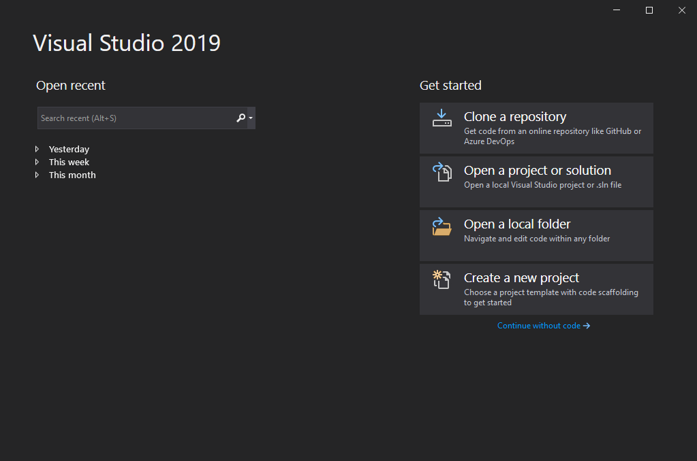
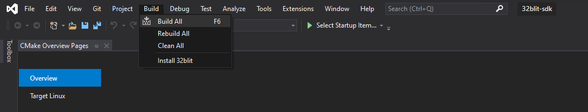
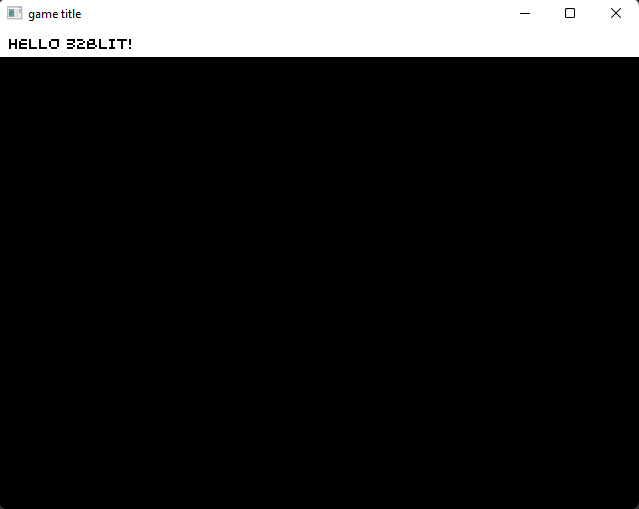
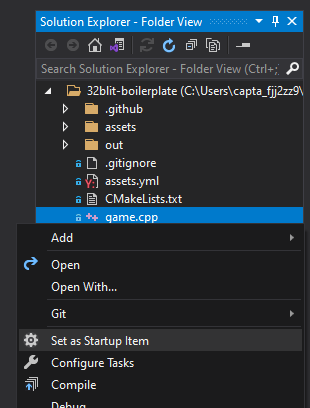
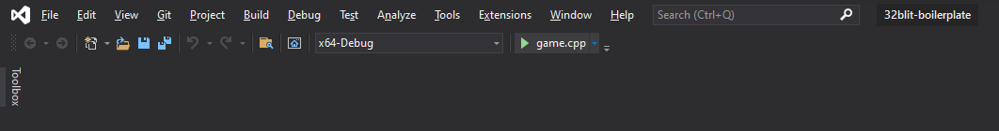
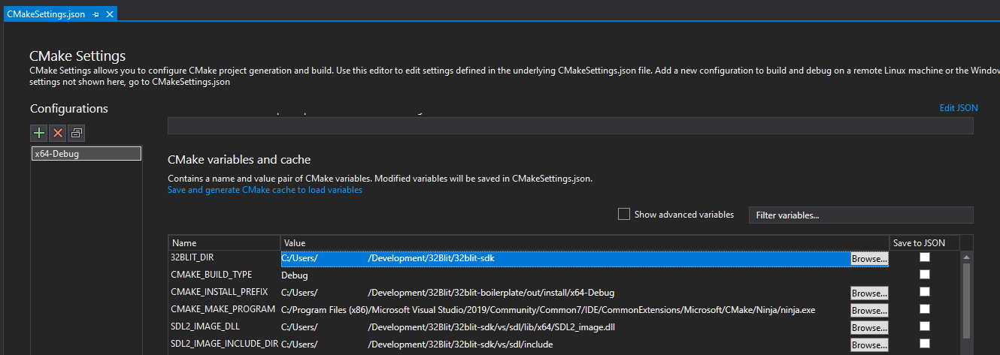

# 32blit Quick Start - C++

For a more in-depth guide, see the [32blit repository README](https://github.com/32blit/32blit-sdk/blob/master/README.md).

## Software you need (but may already have)

* [Git](https://git-scm.com/)
* [CMake](https://cmake.org/)
* A C++ compiler
* [Python 3](https://www.python.org/)
* The Python package manager, pip (should come installed with Python 3.4 or later)

## Repositories and software you need (and probably don't have)

### [32blit SDK](https://github.com/32blit/32blit-sdk)

In the command line, navigate to the directory you want to store your projects in, and run:

```
git clone https://github.com/32blit/32blit-sdk.git
```

### [32blit Boilerplate](https://github.com/32blit/32blit-boilerplate)

The boilerplate repository contains the basic code which you'll need in every project. To fetch the repository, run:

```
git clone https://github.com/32blit/32blit-boilerplate.git
```

<!-- > GitHub also allows you to create a new repository from a template, which is particularly helpful if you want to store your code on GitHub. To do this, navigate to the repository webpage and click the "Use this template" button. -->

### 32blit Python library

The 32blit library is primarily used to package the game assets into a format which can be used with the 32blit SDK. To install it using the Python package manager, run:

```
python3 -m pip install 32blit
```

> If this doesn't work, try using `python` instead of `python3` (and make sure that you have Python 3 installed!)

## Things you might not know

### Mass storage mode

Mass storage mode allows you to copy files onto your 32blit as if it is a standard USB storage device.

Make sure you've plugged it in (and that a microSD card is in the slot), then open the system menu on the 32blit (the home button), select "Connectivity", and then "Storage mode". It should then appear as "USB Drive" on your computer, where you can copy your `.blit` files across, and even modify the save data for games (stored in the `.blit/` directory).

If this doesn't work, make sure that your USB cable is one which supports data transfer (some very cheap cables only support power).

## Building the SDK repository and examples

### Windows (Visual Studio)

1. Open Visual Studio, select "Open a local folder" and then navigate to the `32blit-sdk` folder and select it.



2. Wait for the project to load, and for CMake to finish generating the cache (you can see the output from CMake by going to `View->Output`, and selecting "Show output from: CMake").

3. Select `Build->Build All` and wait for this to complete (it may take a while, depending on the processing power you have available).



4. In File Explorer, navigate to the 32blit-sdk repository folder, and then `out/x64-Debug/examples/`. You can then select the folder of the example you want to run, and in it there will be an executable with the same name as the folder. For example, the `particle` folder contains `particle.exe`.

   Alternatively, you can click the drop-down next to the "Select Startup Item..." button (as seen in the previous image), and select a filename with a `.exe` suffix to run that example.

### Linux/macOS (command line)

1. Navigate to the 32blit-sdk directory and create the build directory:

   ```
   mkdir build
   cd build
   ```

2. Now run the CMake generation:

   ```
   cmake ..
   ```

3. Build the whole repository by simply running:

   ```
   make
   ```

   Or build an individual example, for example:

   ```
   make particle
   ```

4. Each example will be generated in a subdirectory called `examples/<example-name>/`. For example, to run the particle demo:

   ```
   ./examples/particle/particle
   ```

### 32blit (on Linux/WSL)

1. Navigate to the `32blit-sdk` directory and create the build directory:

   ```
   mkdir build.stm32
   cd build.stm32
   ```

2. Now run the CMake generation:

   ```
   cmake .. -DCMAKE_TOOLCHAIN_FILE=../32blit.toolchain
   ```

3. Build the whole repository by simply running:

   ```
   make
   ```

   Or build an individual example, for example:

   ```
   make particle
   ```

4. Each example will be generated in a subdirectory called `examples/<example-name>/`. For example, the particle demo will be called `examples/particle/particle.blit`. You can then copy this game to your 32blit either via mass storage mode, or by using a microSD card.

## Building the boilerplate repository

Please note that although these instructions are similar to the above instructions for building the SDK repository, they are also slightly different, as CMake needs to be told the location of the 32blit SDK.

Once the boilerplate code is built and run, the window should look similar to this:



### Windows (Visual Studio)

1. Open Visual Studio, select "Open a local folder" and then navigate to the `32blit-boilerplate` folder and select it.

2. Wait for the project to load, and for CMake to finish generating the cache (you can see the output from CMake by going to `View->Output`, and selecting "Show output from: CMake").

3. In the Solution Explorer, right click on `game.cpp` and select "Set as Startup Item". The filename should change to a bold font.



4. Select the build/run button which will have changed from "Select Startup Item..." to "game.cpp". The project will be compiled and then run.



5. If the project fails to build, open the drop-down currently displaying "x64-Debug" and select "Manage Configurations...". Scroll to the bottom and locate the table titled "CMake variables and cache", and locate the row with the name "32BLIT_DIR". Make sure that the value is set to the location of the 32blit SDK repository directory that you cloned earlier.



### Linux/macOS (command line)

1. Navigate to the `32blit-boilerplate` directory and create the build directory:

   ```
   mkdir build
   cd build
   ```

2. Now run the CMake generation (this time, we need to specify the location of the `32blit-sdk` directory):

   ```
   cmake .. -D32BLIT_DIR=/full/path/to/32blit-sdk
   ```

   If you get any errors, ensure that the path to the SDK is absolute, not relative.

3. Build the repository by simply running:

   ```
   make
   ```

4. The executable will be generated in the `build` directory (which you are currently in), and will be called `game`. To run it, type:

   ```
   ./game
   ```

### 32blit (on Linux/WSL)

1. Navigate to the `32blit-boilerplate` directory and create the build directory:

   ```
   mkdir build.stm32
   cd build.stm32
   ```

2. Now run the CMake generation (this time, we need to specify the location of the `32blit-sdk` directory):

   ```
   cmake .. -DCMAKE_TOOLCHAIN_FILE=/full/path/to/32blit-sdk/32blit.toolchain -D32BLIT_DIR=/full/path/to/32blit-sdk
   ```
   
   If you get any errors, ensure that the filepaths are absolute, not relative.

3. Build the repository by simply running:

   ```
   make
   ```

4. The `.blit` file will be generated in the directory you are currently in, and will be called `game.blit`. You can then copy this game to your 32blit either via mass storage mode, or by using a microSD card.