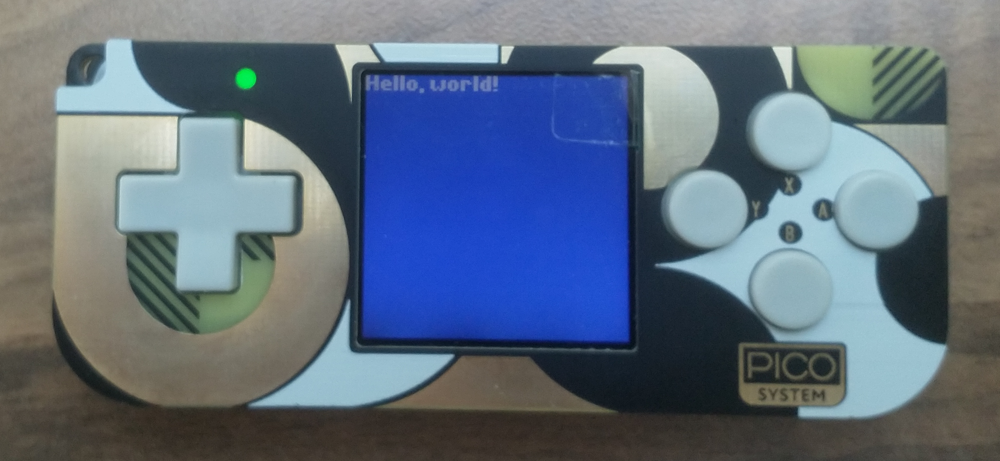

# PicoSystem Quick Start - C++

For more details, see [the PicoSystem repository README](https://github.com/pimoroni/picosystem/blob/main/README.md) and [this article on pimoroni.com](https://learn.pimoroni.com/article/getting-started-with-picosystem-and-c++).

## Software you need (but may already have)

* [Git](https://git-scm.com/)
* [CMake](https://cmake.org/)
* A C++ compiler

## Repositories you need (and probably don't have)

### [Pico SDK](https://github.com/raspberrypi/pico-sdk)

For more information, check out the start of [this guide](https://github.com/pimoroni/pimoroni-pico/blob/main/setting-up-the-pico-sdk.md) for setting this SDK up (only up to step 4). You may also find sections of the [official documentation](https://datasheets.raspberrypi.com/pico/getting-started-with-pico.pdf) for getting started with the Pico SDK helpful (although you won't need to use the Pico SDK directly).

In the command line, navigate to the directory you want to store your projects in, and run:

```
git clone https://github.com/raspberrypi/pico-sdk.git
cd pico-sdk
git submodule update --init
```

> Optionally, you can also create an environment variable called `PICO_SDK_PATH` with the absolute filepath of the `pico-sdk` directory. For example, on Linux you can do this with:
>
> ```
> export PICO_SDK_PATH=/full/path/to/pico-sdk
> ```
> 
> If you do choose to set this variable, you don't need the `-DPICO_SDK_PATH=/full/path/to/pico-sdk` flag for CMake which you'll see used later on.

### [PicoSystem SDK](https://github.com/pimoroni/picosystem)

In the command line, navigate to the directory containing the Pico SDK and run:

```
git clone https://github.com/pimoroni/picosystem.git
```

### [PicoSystem Boilerplate](https://github.com/pimoroni/picosystem-boilerplate)

The boilerplate repository contains the basic code which you'll need in every project. To fetch the repository, run:

```
git clone https://github.com/pimoroni/picosystem-boilerplate.git
```

## Things you might not know

### Bootloader mode

Bootloader mode allows you to copy .uf2 files onto your PicoSystem as if it is a standard USB storage device.

Make sure it's powered off, plug it into your computer and then press the X button and power button at the same time. It will then appear as a drive, usually named "RPI-RP2", and you can copy a `.uf2` file across to it.

If this doesn't work, make sure that your USB cable is one which supports data transfer (some very cheap cables only support power).

<!-- TODO: Add instructions for Linux/MacOS, since this is probably slightly different. This is particularly important since the rest of the instructions are only for Linux/WSL/MacOS. -->

## Build the repository and examples

### PicoSystem (on Linux/WSL)

1. Navigate to the `picosystem` repository directory and create the build directory:

   ```
   mkdir build
   cd build
   ```

2. Now run the CMake generation:

   ```
   cmake .. -DPICO_SDK_PATH/full/path/to/pico-sdk
   ```

3. Build the whole repository (including examples) by simply running:

   ```
   make
   ```

4. Each example will be generated in a subdirectory called `examples/<example-name>/`. For example, the "shapes" demo will be called `examples/shapes/shapes.uf2`. You can then copy a game to your PicoSystem via bootloader mode.

## Build the boilerplate repository

Please note that although these instructions are similar to the above instructions for building the SDK repository, they are also slightly different, as CMake needs to be told the location of the PicoSystem SDK.

### PicoSystem (on Linux/WSL)

1. The boilerplate code currently doesn't display anything when you run it on the PicoSystem, so we need to add something simple in the `draw` function, so that we can check everything is working correctly. Open the `picosystem-boilerplate/main.cpp` file in your favourite text editor, and modify the code so that it now reads:

   ```cpp
   #include "picosystem.hpp"

   using namespace picosystem;

   void init() {
   }

   void update(uint32_t tick) {
   }

   void draw(uint32_t tick) {
       // Fill the background with a nice blue
       pen(5, 10, 15);
       clear();

       // Draw some white text in the top-left corner
       pen(15, 15, 15);
       text("Hello, world!", 0, 0);
   }
   ```

2. In the command line, navigate to the `picosystem-boilerplate` directory and create the build directory:

   ```
   mkdir build
   cd build
   ```

3. Now run the CMake generation (this time, we need to specify the location of the PicoSystem SDK):

   ```
   cmake .. -DPICO_SDK_PATH/full/path/to/pico-sdk -DPICOSYSTEM_DIR=/full/path/to/picosystem
   ```
   
   If you get any errors, ensure that the filepaths in the build flags are absolute, not relative.

4. Build the repository by simply running:

   ```
   make
   ```

5. The `.uf2` file will be generated in the directory you are currently in, and will be called `my_project.uf2`. You can then copy this game to your PicoSystem via bootloader mode.

### Final result

Once the boilerplate code is built and run, your PicoSystem should look similar to this:

