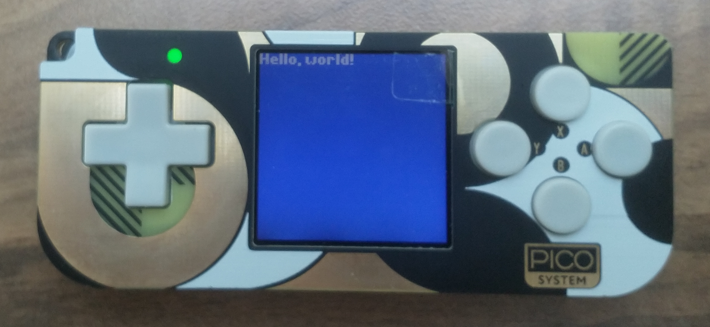

# PicoSystem Quick Start - MicroPython

For more details, see [the PicoSystem MicroPython README](https://github.com/pimoroni/picosystem/blob/main/micropython/README.md).

## Software you need (but may already have)

* [Python 3](https://www.python.org/)
* The Python package manager, pip (should come installed with Python 3.4 or later)

## Software you need (and probably don't have)

### MicroPython for PicoSystem

You can get the latest MicroPython build for PicoSystem on the [releases page](https://github.com/pimoroni/picosystem/releases/latest) of the PicoSystem SDK repository.

The file is located under the "Assets" section of the release, and will be named something similar to `picosystem-v0.1.3-micropython-v1.19.uf2`.

You can load this onto the PicoSystem (to make it ready to run your MicroPython games) by entering [bootloader mode](#bootloader-mode) and copying it across to the drive which appears on your computer.

### ampy

`ampy` is a Python library which provides a command-line interface which allows files to be easily transferred over a serial connection to a device running MicroPython.

It can be installed by running:

```
python3 -m pip install adafruit-ampy
```

## Things you might not know

### Bootloader mode

bootloader mode allows you to copy .uf2 files onto your PicoSystem as if it is a standard USB storage device.

Make sure it's powered off, plug it into your computer and then press the X button and power button at the same time. It will appear as a drive named "RPI-RP2", and you can copy a `.uf2` file across to it.

If this doesn't work, make sure that your USB cable is one which supports data transfer (some very cheap cables only support power, although this is rare).

### Running files with ampy

To copy files to your PicoSystem, you'll need to plug it into your computer, turn it on (the green light should be on), and find what serial port it is connected on (with Windows, you can check this in the device manager). Once you have established the port, you can navigate to the file you want to copy, and run:

```
ampy -p <port> put <filename>
```

Make sure to replace `<port>` and `<filename>` with your serial port and filename. To tell the PicoSystem to execute the file you've copied, you can run:

```
ampy -p <port> run <filename>
```

Several other useful options are provided by `ampy`. To view the help page (with all the possible commands), you can use:

```
ampy --help
```

### Debugging your programs

When running files with `ampy`, any errors or messages which occur will be displayed in the command line. If the error messages are not clear (for example, `OSError: [Errno 2] ENOENT`), try using a serial program to connect to the MicroPython device (you may also need to turn it off and on again in order to connect from a different program). This will allow you to access the REPL prompt, where you can test individual commands. You may also find that any error messages are more detailed.

Some examples of terminal programs which support serial are:

* Windows: `PuTTY` (download from [putty.org](https://www.putty.org/) or from the [Windows Store](https://apps.microsoft.com/store/detail/putty/XPFNZKSKLBP7RJ))
* Linux/macOS: `screen` (built-in)

## Run the examples

Once the MicroPython firmware is copied to your PicoSystem, you can try out the examples by holding the `A` button as your turn it on. The PicoSystem logo should appear, before displaying a menu with the example programs.

You can then use the arrows to navigate through the different files, and the `A` button to select the file that you want to run.

## Run a simple file

To test that everything is working, we will create a simple Python file, copy it to the PicoSystem, and then run it.

1. Create an empty Python file on your computer named "hello_world.py". Open it in a text editor and add the following code:

   ```py
   def update(tick):
       pass


   def draw(tick):
       # Fill the background with a nice blue
       pen(5, 10, 15)
       clear()

       # Draw some white text in the top-left corner
       pen(15, 15, 15)
       text("Hello, world!", 0, 0)


   start()
   ```

2. In the command line, navigate to the location of the file you just created, and copy it to your PicoSystem (make sure it is plugged in and turned on) by running:

   ```
   ampy -p <port> put hello_world.py
   ```

3. Execute the file you've copied to the PicoSystem by running:

   ```
   ampy -p <port> run hello_world.py
   ```

   You should see white text displaying "Hello, world!" on top of a blue background:

   